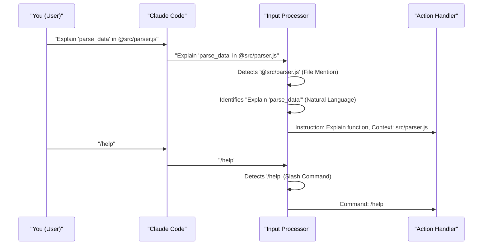

# Chapter 1: User Interaction & Commands

Welcome to the world of `claude-code`! Think of `claude-code` as your friendly, super-smart coding assistant that lives right in your terminal. But how do you "talk" to it? How do you give it instructions or ask it questions? That's exactly what this chapter is all about!

Imagine you're starting a new project and you want `claude-code` to help you create a new Python file, say `utils.py`, and then add a simple function to it that prints a welcome message. You'd also like to know if there have been any recent updates to `claude-code` itself. This chapter will show you how to do just that!

We'll explore the different ways you can communicate with `claude-code`, making your coding tasks smoother and faster.

## Talking to Claude Code: It's (Mostly) Natural!

The primary way you'll interact with `claude-code` is by using **natural language**. This means you can type out your requests pretty much like you're talking to another person.

Let's say you want `claude-code` to create that Python function we talked about. You could type something like this:

```
> Please create a function named 'greet' in a new file called 'utils.py'. This function should print the message "Hello from Claude Code!".
```

`claude-code` is designed to understand these kinds of instructions. It will then try to perform the action you've requested. You don't need to learn a complex new programming language just to tell it what to do!

## Pointing to Specific Files: The `@-mention`

Sometimes, you'll want `claude-code` to work with a specific file or folder that already exists in your project. Instead of typing out the full path or hoping `claude-code` guesses correctly, you can use an **@-mention** (pronounced "at-mention"). It's like tagging a file in your conversation.

If you already had a file named `core/app_logic.py` and wanted `claude-code` to explain a function within it, you could say:

```
> Can you explain the 'process_data' function in @core/app_logic.py?
```

By typing `@` followed by the file or folder path, you're giving `claude-code` a direct pointer. This is super helpful for clarity and precision. `claude-code` even supports auto-completing file and folder names when you press the `Tab` key after typing `@` and the beginning of a name!

So, for our earlier example, if `utils.py` already existed, you could say:

```
> Add a function named 'greet' to @utils.py that prints "Hello from Claude Code!".
```

This makes your instructions clear and tells `claude-code` exactly which `utils.py` you mean, especially if you have files with similar names in different folders.

## Quick Shortcuts: Slash Commands (`/`)

While natural language is great for detailed requests, sometimes you want to perform common actions quickly. For this, `claude-code` offers **slash commands**. These are special keywords that start with a forward slash (`/`) and tell `claude-code` to do a specific, predefined task. Think of them like keyboard shortcuts in your favorite software.

Here are a few common slash commands:

*   `/help`: Feeling lost or want to see what commands are available? This is your go-to.
    ```
    > /help
    ```
    This will display a list of available commands and other useful information.

*   `/bug`: If you encounter an issue or unexpected behavior while using `claude-code` itself, you can report it directly.
    ```
    > /bug The color of the text changed unexpectedly after I ran the last command.
    ```
    This helps the `claude-code` team make improvements!

*   `/config`: Need to change some settings for how `claude-code` works? This command is your entry point. (We'll dive deeper into this in the [Configuration System](05_configuration_system_.md) chapter.)
    ```
    > /config
    ```

*   `/release-notes`: Want to see what's new in your version of `claude-code`?
    ```
    > /release-notes
    ```
    This command will show you recent updates and features, solving part of our initial example scenario!

Don't worry if you misspell a command slightly; `claude-code` has fuzzy matching, so it can often understand what you meant. You can even create your own custom slash commands by placing Markdown files in a special `.claude/commands/` directory in your project – a powerful way to automate your personal, repetitive instructions!

## How Claude Code Understands You: A Quick Peek

You might be wondering how `claude-code` figures out what you mean when you type something. While the full details are quite advanced (and covered more in [Chapter 2: Claude Code Agent](02_claude_code_agent_.md)), here's a simplified idea:

1.  **You type a message:** This could be a natural language sentence, an `@-mention`, a slash command, or a mix.
2.  **`claude-code` reads it:** It first looks for special characters like `/` at the beginning of your message or `@` within your message.
3.  **It categorizes your input:**
    *   If it sees a `/command`, it knows you're trying to use a quick action.
    *   If it sees `@some/file.py`, it notes down that you're referring to that specific file.
    *   The rest is usually treated as your main instruction in natural language.
4.  **Action Time!** Based on what it understood, `claude-code` then tries to perform the task.

Here’s a little diagram to visualize it:



This way, `claude-code` offers a flexible system: detailed conversational requests when you need them, and quick, precise commands for common operations.

## Conclusion

Great job! You've just learned the basics of how to communicate with `claude-code`. You now know how to:

*   Give instructions using everyday **natural language**.
*   Specify files and folders precisely using **@-mentions**.
*   Use handy **slash commands** for quick actions like getting help or reporting bugs.

This flexible communication interface is key to making `claude-code` a powerful and intuitive coding partner.

Now that you know how to "talk" to `claude-code`, you might be wondering what this "assistant" actually *is*. In the next chapter, we'll explore the heart of the system: the [Chapter 2: Claude Code Agent](02_claude_code_agent_.md).

---

Generated by [AI Codebase Knowledge Builder](https://github.com/The-Pocket/Tutorial-Codebase-Knowledge)