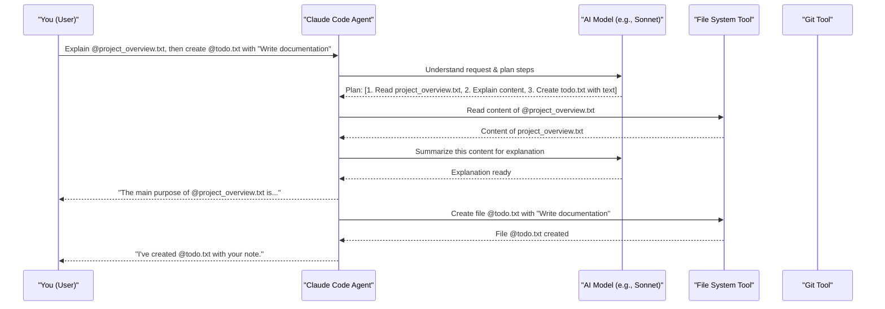

# Chapter 2: Claude Code Agent

In [Chapter 1: User Interaction & Commands](01_user_interaction___commands_.md), we learned how to "talk" to `claude-code` using natural language, `@-mentions` for files, and quick `slash commands`. But who, or what, is actually listening and carrying out your requests? Meet the star of the show: the Claude Code Agent!

Imagine you're working on a new project. You have a Python file, say `helper_scripts.py`. You want to understand what one of its functions does, then add a new simple function to it, and finally, save your work with a descriptive message. You could do all this manually, but what if you had an assistant to help? That's where the Claude Code Agent comes in.

## What is the Claude Code Agent?

The **Claude Code Agent** is the heart and brain of `claude-code`. Think of it as your personal AI-powered assistant, living right inside your terminal, specifically designed to help you with coding tasks. It's like having an incredibly smart and helpful pair programmer available 24/7.

This Agent is responsible for:

*   **Understanding your instructions**: Whether you type a simple "hello" or a complex request to refactor code.
*   **Knowing your codebase**: It can "read" and understand the files in your project to provide relevant help.
*   **Executing commands**: It can run terminal commands, like tests or build scripts.
*   **Editing files**: It can make changes to your code based on your instructions.
*   **Answering questions**: It can explain how parts of your code work or help you find information.
*   **Managing Git**: It can help you with common version control tasks like committing changes or creating branches.

Essentially, the Claude Code Agent is the intelligent entity that takes your natural language requests (which you learned about in [Chapter 1: User Interaction & Commands](01_user_interaction___commands_.md)) and turns them into actions. Its main goal is to make your development process faster, smoother, and less tedious.

## How Does the Agent Understand and Act?

When you type a command into `claude-code`, it's the Agent that gets to work. It's more than just a simple program; it uses advanced [AI Models (e.g., Sonnet, Opus)](04_ai_models__e_g___sonnet__opus__.md) to interpret your requests.

Let's break down its process with our example: you want to add a `greet()` function to `@helper_scripts.py`.

1.  **You type your request:**
    ```
    > Add a function named 'greet' to @helper_scripts.py. It should print "Hello from helper!".
    ```

2.  **The Agent receives the message:** It sees your natural language instruction and the `@-mention` pointing to `helper_scripts.py`.

3.  **The Agent "Thinks" (Understands the Goal):**
    *   It identifies the main task: "add a function."
    *   It notes the specifics: function name (`greet`), target file (`helper_scripts.py`), and what the function should do (print a message).

4.  **The Agent "Acts" (Uses its Capabilities):**
    *   To add the function, it might first use an internal capability to read `@helper_scripts.py` to understand its current structure (if it exists, or create it if it doesn't).
    *   Then, leveraging powerful [AI Models (e.g., Sonnet, Opus)](04_ai_models__e_g___sonnet__opus__.md), it figures out *how* to write this Python function and where to place it in the file.
    *   It then uses another capability to make the actual edits to `@helper_scripts.py`.
    *   Finally, it would confirm back to you, perhaps showing the change:
        ```
        Okay, I've added the `greet` function to `helper_scripts.py`:

        ```python
        # helper_scripts.py
        # ... (other existing code) ...

        def greet():
            print("Hello from helper!")
        ```
        ```

This whole process – understanding, planning, and acting – is managed by the Claude Code Agent. It's like a skilled chef who takes your order (the request), figures out the recipe (the plan), and then uses various kitchen tools (its capabilities) to prepare your meal (the result).

## The Agent's "Senses" and "Hands"

To do its job effectively, the Claude Code Agent needs to interact with your development environment.

*   **Context is Key (Its "Senses"):** The Agent works best when it understands the context of your project. It "sees" the files and folders in your current directory. When you use `@-mentions` like `@helper_scripts.py`, you're helping the Agent focus its "attention" on the right things. This context awareness is crucial for it to provide accurate and relevant assistance.

*   **Using Tools (Its "Hands"):** The Agent doesn't magically perform all actions by itself. It has a set of [Tools & Capabilities](03_tools___capabilities_.md) it can use. For example:
    *   To read a file, it uses a "file reading" tool.
    *   To edit code, it uses a "file editing" tool.
    *   To run a command like `git commit`, it uses a "shell command" tool.
    We'll dive much deeper into these [Tools & Capabilities](03_tools___capabilities_.md) in the next chapter. For now, just know that the Agent is like a skilled worker who knows which tool to pick for which job.

## A Peek Under the Hood: How the Agent Orchestrates Tasks

Let's visualize how the Agent might handle a slightly more complex request. Imagine you ask:

`> Explain the main purpose of @project_overview.txt and then create a new file @todo.txt with "Write documentation" in it.`

Here's a simplified flow of what happens inside `claude-code`, orchestrated by the Agent:



In this diagram:
1.  You give a multi-step command.
2.  The **Claude Code Agent** receives it.
3.  It consults an [AI Models (e.g., Sonnet, Opus)](04_ai_models__e_g___sonnet__opus__.md) to break down your request into a plan of specific actions.
4.  The Agent then calls upon its various [Tools & Capabilities](03_tools___capabilities_.md) (like `FileTool`) one by one to execute these actions.
5.  It communicates the results or asks for clarification along the way.

This ability to understand, plan, and use tools is what makes the Claude Code Agent so powerful and versatile. It's not just running pre-defined scripts; it's dynamically responding to your needs. The agent's behavior can also be customized further via the [Configuration System](05_configuration_system_.md), and it operates within a strong [Data Privacy & Security Framework](07_data_privacy___security_framework_.md) to protect your code and data.

## Conclusion

You've now met the Claude Code Agent – the intelligent core of `claude-code`. It's your AI pair programmer, always ready in your terminal to understand your coding needs, interact with your codebase, and help you get things done more efficiently. It works by understanding your natural language commands, using powerful AI models for reasoning and planning, and then employing a set of tools to perform actions.

Now that you know *who* is doing the work (the Agent), you're probably curious about *what exactly* it can do. What are these "tools" it uses? In the next chapter, we'll explore the exciting range of [Tools & Capabilities](03_tools___capabilities_.md) that the Claude Code Agent has at its disposal.

---

Generated by [AI Codebase Knowledge Builder](https://github.com/The-Pocket/Tutorial-Codebase-Knowledge)