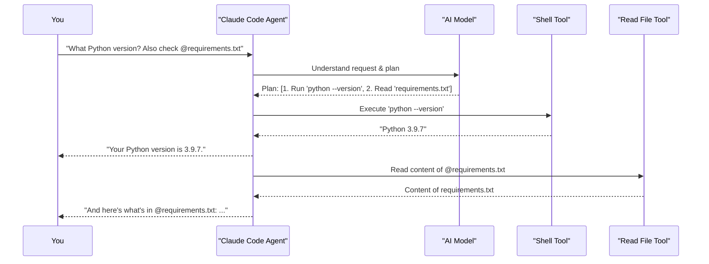

# Chapter 3: Tools & Capabilities

In [Chapter 2: Claude Code Agent](02_claude_code_agent_.md), you met the Claude Code Agent, the intelligent assistant that understands your requests and helps you with your coding tasks. But how does the Agent actually *do* things like read your files, run commands, or even organize a to-do list for you? It uses its "Tools & Capabilities"!

Imagine you've just cloned a new project from the internet. You're not sure what files are in it, what a specific configuration file contains, or even if you have the right version of Python installed to run it. You could open your file explorer, then a text editor, then your terminal, but wouldn't it be easier if your assistant could do these things for you, right from one place? That's where Tools & Capabilities shine.

## What are Tools & Capabilities?

Think of the Claude Code Agent as a very skilled craftsperson. To do its job, this craftsperson needs a toolbox filled with different tools. **Tools & Capabilities** are exactly that: the specific actions and functionalities that the Claude Code Agent can perform to assist you.

It's like having a versatile digital multi-tool. Each function of this multi-tool is a specific "tool" Claude can employ:
*   Want to see what files are in your current folder? The Agent uses its "List Files" (often called `LS`) tool.
*   Need to look inside a file named `config.txt`? The Agent uses its "Read File" (`Read`) tool.
*   Want to run a command like `python --version` to check your Python version? The Agent uses its "Run Terminal Command" (often a `Shell` or `Bash`) tool.
*   Need to find some information online to solve a coding problem? The Agent might use a "Web Search" tool.
*   Trying to keep track of coding tasks? The Agent can use a "To-Do List" tool.

These tools are what allow the Agent to interact with your project, your system, and even the internet, all based on the instructions you give it (which you learned about in [Chapter 1: User Interaction & Commands](01_user_interaction___commands_.md)).

## How You Experience Tools (Through the Agent)

You generally don't tell the Claude Code Agent, "Use your LS tool now!" Instead, you make a request in natural language, and the Agent intelligently chooses the right tool for the job.

Let's revisit our scenario of exploring a new project:

1.  **You want to see the files:**
    You might type:
    ```
    > What files are in this project?
    ```
    The [Claude Code Agent](02_claude_code_agent_.md) understands you want to list files. It then internally picks its `LS` tool and runs it. It might show you something like:
    ```
    Okay, here's a list of files and folders in the current directory:
    - main.py
    - utils/
    - README.md
    - requirements.txt
    - .git/
    ```

2.  **You want to read a specific file:**
    Next, you might ask about `requirements.txt`:
    ```
    > Show me what's inside requirements.txt
    ```
    Or, using an @-mention for clarity:
    ```
    > Show me what's inside @requirements.txt
    ```
    The Agent recognizes this needs the `Read` tool. It uses the tool to fetch the content of `requirements.txt` and displays it:
    ```
    Sure, here's the content of @requirements.txt:

    flask==2.0.1
    requests>=2.25.0
    python-dotenv
    ```

3.  **You want to run a terminal command:**
    Now, you want to check your Python version:
    ```
    > Can you run 'python --version' for me?
    ```
    The Agent identifies this as a request to execute a command. It uses its `Shell` tool:
    ```
    Alright, I ran 'python --version'. Here's the output:
    Python 3.9.7
    ```

In each case, you didn't need to know the exact tool name. You spoke naturally, and the Agent, using its intelligence (powered by [AI Models (e.g., Sonnet, Opus)](04_ai_models__e_g___sonnet__opus__.md)), selected and used the appropriate tool from its toolkit.

## Common Tools at the Agent's Disposal

`claude-code` comes equipped with a variety of tools. While the exact list can evolve, here are some common types of tools you'll see the Agent use:

*   **File System Tools:**
    *   `LS` (List): Lists files and directories.
    *   `Read`: Reads the content of a specified file.
    *   `Write`/`Edit`: Modifies or creates files (always with your confirmation, of course!).
*   **Execution Tools:**
    *   `Shell`/`Bash`: Runs terminal commands (e.g., `git status`, `npm install`, linters, tests).
*   **Information Retrieval Tools:**
    *   `Web Search`: Allows the Agent to search the internet for information.
    *   `Git Log`/`Git Blame`: Lets the Agent inspect version control history.
*   **Organizational Tools:**
    *   `Todo List`: Helps the Agent (and you!) keep track of tasks or steps in a larger request.

These tools are designed to be safe and operate within the permissions you grant, aligning with the [Data Privacy & Security Framework](07_data_privacy___security_framework_.md) of `claude-code`. For instance, when the Agent wants to change a file, it will usually show you the proposed change and ask for your approval.

## Under the Hood: How the Agent Chooses and Uses Tools

When you give a command, the [Claude Code Agent](02_claude_code_agent_.md) doesn't just randomly pick a tool. There's a sophisticated process involved:

1.  **Understanding Your Goal:** The Agent first uses its language understanding capabilities, often powered by advanced [AI Models (e.g., Sonnet, Opus)](04_ai_models__e_g___sonnet__opus__.md), to figure out what you're trying to achieve.
2.  **Planning (If Necessary):** For complex requests, the Agent might break down the task into smaller steps.
3.  **Tool Selection:** For each step, the Agent decides if a specific tool is needed. It considers the action required (e.g., "read a file," "run a command") and the available tools.
4.  **Tool Execution:** The Agent then "calls" the selected tool, providing it with any necessary information (like a filename for the `Read` tool, or the command string for the `Shell` tool).
5.  **Processing Results:** The tool performs its action and returns the result (e.g., file content, command output) to the Agent.
6.  **Responding to You:** The Agent then presents this result to you in a helpful way, or uses it to inform its next action.

Let's visualize this with a simple sequence diagram. Imagine you ask: `> What version of Python am I using? Please check requirements.txt too.`



In this flow:
*   The **Agent** is the central orchestrator.
*   The **AI Model** helps the Agent understand and plan.
*   The **Shell Tool** and **Read Tool** are specialized functions the Agent calls upon to interact with your system.

This ability to select and combine tools is what makes the [Claude Code Agent](02_claude_code_agent_.md) so flexible and powerful. It can adapt to a wide range of requests by using the right tool, or combination of tools, for the job.

## Conclusion

You've now learned about the Tools & Capabilities that the Claude Code Agent uses to perform actions on your behalf. These are like the individual instruments in an orchestra, each playing a specific part, all conducted by the Agent to create a helpful response to your requests. From listing files with `LS` and reading them with `Read`, to running commands with `Shell` and searching the web, these tools are the "hands" of your AI coding assistant.

You don't need to memorize every tool, but understanding that they exist helps you appreciate how `claude-code` can interact with your environment and carry out complex tasks.

So, the Agent understands you, and it has tools to act. But what gives the Agent its intelligence to understand complex requests and decide which tools to use? That's where the underlying AI models come in. In the next chapter, we'll delve into [AI Models (e.g., Sonnet, Opus)](04_ai_models__e_g___sonnet__opus__.md).

---

Generated by [AI Codebase Knowledge Builder](https://github.com/The-Pocket/Tutorial-Codebase-Knowledge)