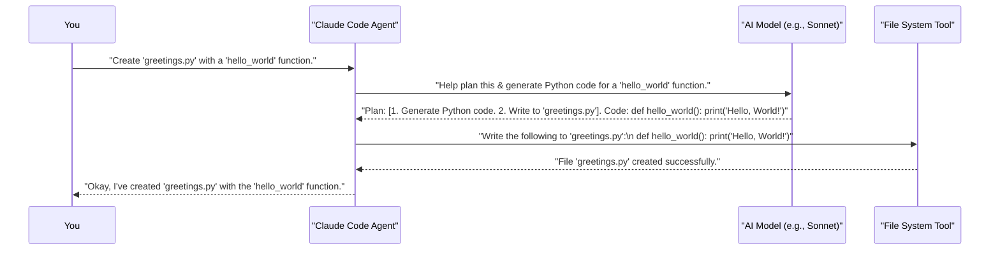

# Chapter 4: AI Models (e.g., Sonnet, Opus)

Welcome to Chapter 4! In [Chapter 3: Tools & Capabilities](03_tools___capabilities_.md), we saw how the Claude Code Agent uses various tools like `LS` (to list files) or `Shell` (to run commands) to interact with your project. But how does the Agent know *which* tool to use, or how to understand your complex requests, or even how to write code or explain concepts? That's where the "brains" of the operation come in: AI Models!

Imagine you're building a sophisticated robot. You've given it arms (tools to interact with the world) and legs (ways to move). But without a powerful central processing unit (a brain), it wouldn't know what to do with them. AI Models are like those advanced brains for `claude-code`.

Let's say you want `claude-code` to not just create a file, but to write a brand new Python function that calculates the factorial of a number, and then explain *how* that function works. This requires more than just file system tools; it requires understanding programming logic and the ability to generate human-like explanations.

## What are AI Models?

**AI Models** are the advanced artificial intelligence "brains" that power `claude-code`. They are what enable `claude-code` to:

*   **Understand your language:** When you type "create a function" or "explain this piece of code," the AI model helps `claude-code` grasp your meaning.
*   **Reason about code:** They can look at existing code and understand its purpose, or figure out how to write new code to meet your requirements.
*   **Generate responses:** This includes generating code, writing explanations, summarizing information, or even helping to plan complex tasks.

Think of different types of specialized engines for a vehicle. Some engines are built for raw power, others for speed and efficiency on everyday routes. AI models are similar:
*   Models like **Sonnet** might be optimized for speed and efficiency on common tasks, providing quick and intelligent responses.
*   Models like **Opus** might offer deeper understanding and more powerful reasoning capabilities, making them suitable for more complex problems or creative generation.

`claude-code` leverages these different kinds of models to provide its wide range of intelligent assistance. You might see references to these models in `claude-code`'s updates or documentation, like "Introducing Sonnet 4 and Opus 4 models" from the `CHANGELOG.md`. This shows that `claude-code` is constantly being updated with the latest AI advancements.

## How AI Models Help `claude-code` Understand and Create

Let's go back to our example: you want `claude-code` to write a Python function to calculate the factorial of a number (e.g., 5! = 5 * 4 * 3 * 2 * 1 = 120) and then explain it.

You might type something like:

```
> Please write a Python function called 'calculate_factorial' that takes a number and returns its factorial. Then, explain the logic behind the function.
```

Here's how an AI model helps the [Claude Code Agent](02_claude_code_agent_.md) handle this:

1.  **Understanding Your Request:**
    *   The Agent sends your text to an AI model.
    *   The AI model processes the natural language. It identifies the key tasks: "write a Python function," "named 'calculate_factorial'," "takes a number," "returns its factorial," and "explain the logic."

2.  **Generating the Code:**
    *   The AI model "knows" Python (because it's been trained on vast amounts of code and text).
    *   It figures out how to write a factorial function. It might consider edge cases (like factorial of 0 or negative numbers).
    *   It generates the Python code. For example:
        ```python
        def calculate_factorial(n):
            if n < 0:
                return "Factorial is not defined for negative numbers"
            elif n == 0:
                return 1
            else:
                result = 1
                for i in range(1, n + 1):
                    result *= i
                return result
        ```

3.  **Generating the Explanation:**
    *   The Agent might then (or simultaneously) ask the AI model to explain the code it just generated.
    *   The AI model analyzes the function's logic (the `if/elif/else` conditions, the loop) and formulates a human-readable explanation.
    *   It might say something like:
        "This function first checks if the number is negative, returning an error message since factorial isn't for negative numbers. If the number is 0, it returns 1, as 0! is 1. Otherwise, it initializes a 'result' to 1 and then multiplies it by each number from 1 up to 'n' using a loop. Finally, it returns the calculated factorial."

You, as the user, don't directly tell `claude-code` "use the Opus model now!" Instead, you interact with the [Claude Code Agent](02_claude_code_agent_.md), and the Agent, often in conjunction with the overall system design and potentially your [Configuration System](05_configuration_system_.md) settings, decides which underlying AI model is best suited for the current task.

## Different Models for Different Tasks

Just like you wouldn't use a sledgehammer to tap in a small nail, `claude-code` might use different AI models depending on the job.

*   **For quick, common tasks:** If you ask, `> What are the Python files in my current directory?`, the Agent might use a tool like `LS`. The AI model's role here is simpler: understand "list Python files." A faster, efficient model like **Sonnet** would be great for this.

*   **For complex reasoning or generation:** If you ask, `> Refactor this 100-line complex algorithm to be more readable and efficient, and explain the trade-offs of your changes.`, this requires deep understanding of code, algorithms, and the ability to explain nuances. A more powerful model like **Opus** would be better suited for such a demanding task.

`claude-code` is designed to make smart choices about model usage. Sometimes, this is automatic. Other times, as you get more advanced, you might find options in the [Configuration System](05_configuration_system_.md) that give you some influence over these choices. For example, the `CHANGELOG.md` mentions that `claude-code` has improved model references to show "provider-specific names (Sonnet 3.7 for Bedrock, Sonnet 4 for Console)", indicating that the system is aware of and manages different model versions and sources.

## A Glimpse Under the Hood

You don't need to be an AI expert to use `claude-code`, but a little insight can be helpful!

AI models like Sonnet and Opus are types of Large Language Models (LLMs). They are "trained" on massive amounts of text and code from the internet, books, and other sources. This training process allows them to learn patterns, grammar, programming languages, reasoning structures, and much more.

When the [Claude Code Agent](02_claude_code_agent_.md) needs help from an AI model:

1.  **Input (Prompt):** The Agent prepares an input for the model. This input (often called a "prompt") includes your request, relevant context from your files (if you used `@-mentions`), and perhaps some instructions on how the Agent wants the model to behave.
2.  **Processing:** The AI model takes this input and, based on its training, "thinks" about how to respond. It's a very complex process of predicting the best sequence of words or code.
3.  **Output (Response):** The model generates a response. This could be generated code, an explanation, a plan of action, or a clarification question.
4.  **Agent Action:** The Agent takes this output and uses it to continue its work – perhaps by showing the response to you, using one of its [Tools & Capabilities](03_tools___capabilities_.md), or asking you for more information.

Let's visualize this with an example. You ask: `> Create a Python file 'greetings.py' with a function that prints 'Hello, World!'`



In this flow:
*   The **User** makes a request.
*   The **Claude Code Agent** consults the **AI Model** to understand the request, generate the necessary code, and make a plan.
*   The Agent then uses a **File System Tool** (one of its [Tools & Capabilities](03_tools___capabilities_.md)) to perform the file operation based on the AI Model's output.
*   Finally, the Agent confirms completion to the User.

The AI model is crucial for the "understanding," "planning," and "generation" parts of this process.

## Conclusion

You've now learned about the AI Models like Sonnet and Opus – the intelligent "brains" behind `claude-code`. These models are what give `claude-code` its remarkable ability to understand your natural language, reason about complex coding problems, generate code, and provide helpful explanations.

*   AI Models are the core intelligence.
*   Different models (like Sonnet for speed and Opus for depth) can be used for different types of tasks.
*   They work by processing your requests (and relevant context) and generating useful responses that the [Claude Code Agent](02_claude_code_agent_.md) then acts upon.

While `claude-code` handles the complexities of interacting with these models for you, understanding their role helps you appreciate the power at your fingertips.

Now that we know about the user interface, the agent, its tools, and the AI models powering it, you might be wondering how you can customize `claude-code`'s behavior or set preferences. That's exactly what we'll cover in the next chapter on the [Configuration System](05_configuration_system_.md).

---

Generated by [AI Codebase Knowledge Builder](https://github.com/The-Pocket/Tutorial-Codebase-Knowledge)