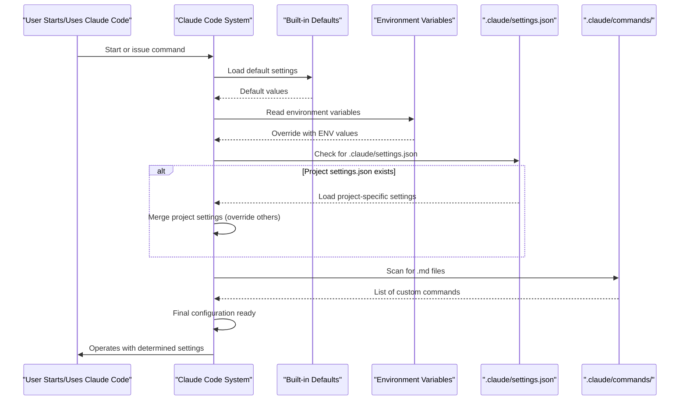

# Chapter 5: Configuration System

Welcome to Chapter 5! In [Chapter 4: AI Models (e.g., Sonnet, Opus)](04_ai_models__e_g___sonnet__opus__.md), we explored the powerful AI "brains" that enable `claude-code` to understand your requests, generate code, and provide explanations. Now, you might be wondering, "Can I tweak how `claude-code` behaves? Can I customize it to fit my specific needs and preferences?" The answer is a resounding YES, and that's what the Configuration System is all about!

Imagine you're setting up a new piece of software, like a music player. You'd want to adjust the volume, perhaps choose a visual theme, or tell it where your music library is located. The Configuration System in `claude-code` is similar – it's like the "settings panel" that lets you tailor `claude-code` to your workflow.

Let's say you often ask `claude-code` to help you start new Python files, and you *always* want a specific comment at the top. Or perhaps you want to be careful about which system commands `claude-code` can run for safety. The Configuration System helps you manage these preferences.

## What is the Configuration System?

The **Configuration System** in `claude-code` provides a way for you to customize its behavior and settings. This isn't just one single file or command, but a collection of ways you can influence how `claude-code` works. You can think of it as the control center for `claude-code`'s personality and operational parameters.

You can use it to:
*   **Manage tool permissions:** Decide which [Tools & Capabilities](03_tools___capabilities_.md) `claude-code` is allowed to use.
*   **Set environment variables:** Control global settings like how long certain temporary keys are valid (their Time To Live or TTL) or default timeouts for commands.
*   **Customize behavior with settings files:** Fine-tune options like how often `claude-code` cleans up old data.
*   **Add custom slash commands:** Create your own shortcuts for frequently used prompts or instructions.

This system helps you make `claude-code` a more personal and efficient assistant.

## Ways to Configure `claude-code`

Let's look at the main ways you can interact with `claude-code`'s configuration.

### 1. The `/config` Command

The simplest way to start exploring settings is with the `/config` slash command, which you learned about in [Chapter 1: User Interaction & Commands](01_user_interaction___commands_.md).

If you type:
```
> /config
```
`claude-code` will often display a list of current settings or options you can change. This is a great starting point to see what's configurable. (The exact output might vary, but it's your window into current settings).

The `CHANGELOG.md` also mentions commands like `claude config add/remove`, suggesting more direct ways to manipulate configuration values through the command line.

### 2. Environment Variables: Global Settings

Environment variables are settings that you define in your computer's terminal *before* you even run `claude-code`. They act like system-wide instructions for `claude-code` (and other programs too!).

For example, the `CHANGELOG.md` mentions:
*   `CLAUDE_CODE_API_KEY_HELPER_TTL_MS`: This variable likely controls the "Time To Live" (TTL) in milliseconds for a temporary API key. A TTL is like an expiry date – how long something is valid. If you set this, you're telling `claude-code` how long to consider a dynamically generated API key as fresh.
*   `BASH_DEFAULT_TIMEOUT_MS`: This probably sets a default timeout in milliseconds for how long `claude-code` will wait for a shell (bash) command to complete before giving up.

**How to set an environment variable (example for Linux/macOS bash):**
```bash
export BASH_DEFAULT_TIMEOUT_MS=10000 # Sets timeout to 10 seconds
claude-code # Now run claude-code, it will pick up this setting
```
You'd type this in your terminal *before* starting `claude-code`. This tells `claude-code` that any shell commands it runs should timeout after 10 seconds by default.

### 3. Project-Specific Settings: `.claude/settings.json`

Sometimes, you want settings that only apply to a specific project you're working on, not globally. `claude-code` allows this using a special file, typically `.claude/settings.json`, located in your project's root directory.

The `CHANGELOG.md` mentions:
*   `settings.cleanupPeriodDays`: This could be a setting in `settings.json` that determines how many days of old data `claude-code` keeps before cleaning it up.
*   Shared project permission rules can be saved in `.claude/settings.json`. This implies you can define what `claude-code` is allowed or not allowed to do within that specific project. For example, you might disallow certain tools using the `disallowedTools` setting.

**Example `.claude/settings.json`:**
```json
{
  "cleanupPeriodDays": 30,
  "disallowedTools": ["ShellTool_HighlyRestrictedCommand"],
  "anthropic_model": "claude-3-sonnet-20240229"
}
```
This simple JSON file tells `claude-code`:
1.  Clean up data older than 30 days.
2.  Do not use a (hypothetical) tool named `ShellTool_HighlyRestrictedCommand`.
3.  Prefer using a specific [AI Model](04_ai_models__e_g___sonnet__opus__.md) for its operations in this project.

If `claude-code` finds this file in your project, it will use these settings for that project.

### 4. Custom Slash Commands: Your Personal Shortcuts!

This is a really cool feature! Remember slash commands like `/help` from [Chapter 1: User Interaction & Commands](01_user_interaction___commands_.md)? You can create your *own*!

`claude-code` lets you define custom slash commands by placing Markdown files in a special directory, usually `.claude/commands/` within your project. Each Markdown file in this directory becomes a new slash command.

**Let's solve our earlier use case:** You want a quick way to generate a Python file with a starting comment.

1.  **Create the directory:** In your project, create a folder named `.claude` and inside it, another folder named `commands`.
    ```
    my-project/
    ├── .claude/
    │   └── commands/
    └── ... (your other project files)
    ```

2.  **Create a Markdown file for your command:** Inside `.claude/commands/`, create a file named, for example, `newpython.md`.
    ```markdown
    # .claude/commands/newpython.md
    Create a new Python file named '{{args}}.py'.
    Add the following comment at the very top of the file:
    # This Python file was generated by claude-code for my awesome project!
    # Filename: {{args}}.py

    Then, add a basic print statement: print("Hello from {{args}}.py!")
    ```
    *   The filename `newpython` (without `.md`) becomes your command: `/newpython`.
    *   `{{args}}` is a special placeholder. Whatever you type after `/newpython ` will replace `{{args}}`.

3.  **Use your new command:**
    Now, in `claude-code`, when you're in that project, you can type:
    ```
    > /newpython my_utility_script
    ```
    `claude-code` will understand this as a request to:
    *   Create `my_utility_script.py`.
    *   Add your custom comment and the print statement to it.

This is incredibly powerful for automating repetitive instructions you give to `claude-code`!

## Solving a More Complex Use Case

Let's say you want to:
1.  Set the API key TTL to 1 hour (3,600,000 milliseconds) globally.
2.  For your current "web-app" project, you want to disallow the `Shell` tool from running `rm -rf` (a dangerous command) and ensure old data is only kept for 7 days.
3.  You also want a custom command `/setup-route <routeName>` for your "web-app" project to quickly scaffold a new web route file with some boilerplate.

Here's how you could approach this:

1.  **Global API Key TTL (Environment Variable):**
    In your terminal, before starting `claude-code`:
    ```bash
    export CLAUDE_CODE_API_KEY_HELPER_TTL_MS=3600000
    ```

2.  **Project-Specific Settings (`.claude/settings.json` for "web-app"):**
    Create/edit `.claude/settings.json` in your "web-app" project:
    ```json
    {
      "cleanupPeriodDays": 7,
      "approvedTools": {
        "Shell": {
          "allowedCommands": ["git status", "npm install"],
          "disallowedPatterns": ["rm -rf"]
        }
      }
    }
    ```
    *Note: The exact structure for `approvedTools` or `disallowedTools` might vary. This is a conceptual example based on the idea of tool permissions mentioned in the `CHANGELOG.md` (`/approved-tools` command and "shared project permission rules"). Always refer to the official `claude-code` documentation for the precise syntax.*

3.  **Custom Slash Command (`.claude/commands/setup-route.md` for "web-app"):**
    Create `.claude/commands/setup-route.md` in your "web-app" project:
    ```markdown
    Create a new file named 'routes/{{args}}.js'.
    Add the following boilerplate JavaScript code to it for an Express.js route:

    const express = require('express');
    const router = express.Router();

    router.get('/{{args}}', (req, res) => {
      res.send('Response from {{args}} route');
    });

    module.exports = router;

    // End of boilerplate for {{args}}
    ```
    Now you can use `/setup-route user` to quickly create `routes/user.js`.

## Under the Hood: How Configuration is Loaded

You might wonder how `claude-code` figures out which settings to use. It typically follows a hierarchy:

1.  **Built-in Defaults:** `claude-code` has some default settings coded into it.
2.  **User-Global Settings:** Some settings might be stored in a global user configuration directory (e.g., `~/.claude/config.json`).
3.  **Environment Variables:** These often override defaults and user-global settings.
4.  **Project-Specific Settings (`.claude/settings.json`):** These usually override global settings *for that project only*.
5.  **Command-line Arguments:** Sometimes, options you pass directly when running `claude-code` (like `--debug`) can override other settings for that specific session.

Here's a simplified diagram of how `claude-code` might load its configuration:



When `claude-code` needs a setting (e.g., `cleanupPeriodDays`):
1.  It checks if it was set via a command-line flag.
2.  If not, it checks the project's `.claude/settings.json`.
3.  If not there, it checks relevant environment variables.
4.  If not found, it might check a user-global configuration file.
5.  Finally, it falls back to its built-in default value.

This "cascade" ensures that you have multiple levels of control, from broad defaults to very specific project overrides. For custom slash commands, it typically just scans the `.claude/commands/` directory in the current project and makes those available.

## Conclusion

Great work! You've now learned about the `claude-code` Configuration System. This system is your key to making `claude-code` truly your own, adapting its behavior to match your personal preferences and project requirements.

You know how to:
*   Use the `/config` command to get started.
*   Set global behaviors using **Environment Variables**.
*   Define project-specific rules and settings in **`.claude/settings.json`**.
*   Create powerful, personalized shortcuts using **Custom Slash Commands** in Markdown files.

By understanding these configuration methods, you can significantly enhance your productivity and make `claude-code` an even more valuable coding partner.

Next up, we'll explore a more advanced topic: the [Chapter 6: MCP (Multi-Claude Protocol/Platform)](06_mcp__multi_claude_protocol_platform__.md), which deals with how `claude-code` can interact with multiple AI model providers or instances.

---

Generated by [AI Codebase Knowledge Builder](https://github.com/The-Pocket/Tutorial-Codebase-Knowledge)