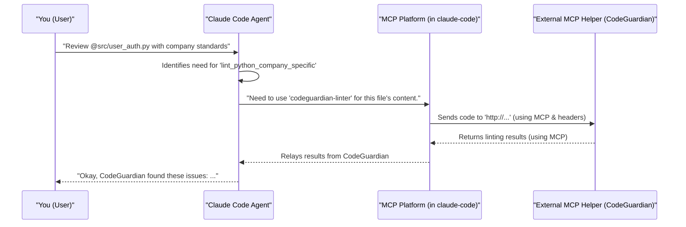

# Chapter 6: MCP (Multi-Claude Protocol/Platform)

Welcome to Chapter 6! In [Chapter 5: Configuration System](05_configuration_system_.md), we learned how to customize `claude-code` to fit our preferences and project needs. Now, let's explore a fascinating concept that takes `claude-code`'s capabilities even further: **MCP (Multi-Claude Protocol/Platform)**.

Imagine `claude-code` as a super-talented chef. It can cook many amazing dishes (perform many coding tasks) using its own skills ([AI Models](04_ai_models__e_g___sonnet__opus_.md)) and kitchen tools ([Tools & Capabilities](03_tools___capabilities_.md)). But what if you have a special, secret family recipe (a unique internal tool) or a very specific appliance (a specialized external service) that you want this chef to use? That's where MCP comes into play!

**Our Central Use Case:** Let's say your company has developed an internal AI tool called "CodeGuardian." CodeGuardian is an expert at checking if Python code meets your company's very specific, proprietary coding standards. It's not something `claude-code` would know about by default. Wouldn't it be great if `claude-code` could ask CodeGuardian for help when you're working on company projects? MCP is designed to make this possible.

## What is MCP (Multi-Claude Protocol/Platform)?

**MCP (Multi-Claude Protocol/Platform)** is a system or protocol that allows `claude-code` to connect with and use external services or tools, essentially expanding its "brainpower" and skills.

Think of it like a **universal plugin architecture** for an application like `claude-code`.
*   **Plugins:** These are the external services or "helper" modules (like our "CodeGuardian" AI).
*   **Architecture:** MCP provides the framework and rules for how `claude-code` can find, communicate with, and use these plugins.

So, MCP allows `claude-code` to:
1.  **Discover** that an external service (like CodeGuardian) exists and what it can do.
2.  **Communicate** with that service using a common language or set of rules (the "Protocol").
3.  **Integrate** the results from that service into its own workflow and responses to you.

This means `claude-code` isn't limited to just its built-in features. It can leverage a whole ecosystem of other "Claudes" or Claude-like AI assistants, specialized tools, or custom extensions. The frequent updates and configuration options related to MCP mentioned in the `CHANGELOG.md` (like `claude mcp add` commands or settings for MCP servers) show that this is an important and evolving part of `claude-code`.

## Key Ideas Behind MCP

Let's break down what makes MCP work in a beginner-friendly way:

1.  **External Helper Services/Servers:** These are the "plugins" we talked about. They are separate programs or services running somewhere else (maybe on your company's network, like "CodeGuardian," or a public third-party service). Each helper might be good at a very specific task:
    *   Our "CodeGuardian" is good at checking company-specific Python standards.
    *   Another service might be excellent at translating code comments into different languages.
    *   Yet another might be a private AI model trained on your company's secret codebase.

2.  **The Protocol ("How They Talk"):** For `claude-code` to use these external helpers, they need a shared way to communicate. This is the "Protocol" part of MCP. It's like agreeing on a language and a set of conversational rules.
    *   `claude-code` knows how to ask: "Hey CodeGuardian, can you check this Python code for me?" (in a structured, MCP way).
    *   CodeGuardian knows how to understand that request and reply: "Sure, here are the issues I found..." (also in the structured, MCP way).
    *   The `CHANGELOG.md` mentions "MCP SSE transport," which refers to Server-Sent Events – one technical way this communication might happen, allowing real-time updates from the helper service.

3.  **The Platform ("Making it Happen"):** `claude-code` itself acts as the "Platform." It provides the underlying system that manages these connections, sends out requests to helpers, and receives their responses. It's the central hub that orchestrates these interactions.

## Using MCP: Connecting `claude-code` to "CodeGuardian"

Let's see how we might tell `claude-code` about our "CodeGuardian" AI and then use it.

### Step 1: Configuring the MCP Helper Service

First, `claude-code` needs to know that CodeGuardian exists and how to reach it. This is done through the [Configuration System](05_configuration_system_.md). One way could be by creating a special JSON file in your project, perhaps named `.claude/mcp.json`.

The `CHANGELOG.md` mentions that "MCP 'project' scope now allows you to add MCP servers to .mcp.json files and commit them to your repository." This is perfect for our company project!

Let's imagine our `.claude/mcp.json` file looks like this:

```json
// my-company-project/.claude/mcp.json
{
  "servers": [
    {
      "id": "codeguardian-linter",
      "name": "Company CodeGuardian AI Linter",
      "url": "http://codeguardian.internal.mycompany.com/api/check",
      "capabilities": ["lint_python_company_specific"],
      "requestHeaders": { "X-Auth-Token": "secret-company-token" }
    }
  ]
}
```

Let's break this down:
*   `"servers"`: This is a list, meaning you could potentially configure multiple MCP helpers.
*   `"id"`: A unique identifier for this helper service (e.g., `codeguardian-linter`).
*   `"name"`: A friendly name for display purposes.
*   `"url"`: The web address where CodeGuardian is listening for requests.
*   `"capabilities"`: A list of special skills this helper has. Here, `lint_python_company_specific` tells `claude-code` that this helper is good for our specific Python linting task.
*   `"requestHeaders"`: The `CHANGELOG.md` mentions "MCP SSE server configs can now specify custom headers." This is important for security or passing specific information, like an authentication token, to the CodeGuardian service.

When `claude-code` starts in your "my-company-project," it will read this `.claude/mcp.json` file and learn about the "Company CodeGuardian AI Linter."

### Step 2: Asking `claude-code` to Use CodeGuardian

Now that `claude-code` knows about CodeGuardian, you can make requests that might use it. The [Claude Code Agent](02_claude_code_agent_.md) is smart enough to figure out when to call upon such an external helper based on your prompt and the helper's advertised capabilities.

You might type into `claude-code`:

```
> Please review @src/user_auth.py against our company's Python coding standards.
```

Here's what might happen:
1.  The [Claude Code Agent](02_claude_code_agent_.md) analyzes your request.
2.  It sees "company's Python coding standards" and remembers that the "codeguardian-linter" (from your `.claude/mcp.json`) has the `lint_python_company_specific` capability.
3.  The Agent decides this is a job for CodeGuardian!
4.  `claude-code` (acting as the MCP platform) sends the content of `@src/user_auth.py` to the URL `http://codeguardian.internal.mycompany.com/api/check`, using the defined MCP protocol and including the `X-Auth-Token` header.
5.  CodeGuardian receives the code, checks it against company standards, and sends back a list of issues (or a success message).
6.  `claude-code` receives this response and presents it to you:

    ```
    Okay, I've consulted the Company CodeGuardian AI Linter for @src/user_auth.py.
    Here's what it found:
    - Line 15: Variable 'tempUser' does not follow company naming convention 'tu_...'.
    - Line 28: Missing required audit log entry for authentication attempts.
    Please review these points.
    ```

See? `claude-code` didn't do the company-specific linting itself. It acted as a smart intermediary, using MCP to leverage the specialized CodeGuardian tool!

## What Happens Under the Hood? A Peek Inside MCP

Let's visualize the process with a simple diagram:



1.  **You** make a request.
2.  The **Claude Code Agent** figures out that an external MCP helper might be best for this task, based on its configured capabilities.
3.  The **MCP Platform** component within `claude-code` takes over:
    *   It looks up the details of the "codeguardian-linter" (URL, headers, etc.) from the configuration (e.g., `.claude/mcp.json`).
    *   It formats a request according to the "Multi-Claude Protocol" (this might involve creating a specific JSON message, for example).
    *   It sends this request over the network to CodeGuardian's URL. The `CHANGELOG.md` mentions `MCP_TIMEOUT` environment variable, which suggests `claude-code` has settings for how long to wait for these external services to respond.
4.  The **External MCP Helper (CodeGuardian)** processes the request and sends a response back, also following the MCP protocol.
5.  The **MCP Platform** receives this response, perhaps does some basic processing, and passes it to the **Claude Code Agent**.
6.  The **Agent** then presents the information to you in a helpful way.

`claude-code` might also have security measures, like the "MCP permission prompt" mentioned in the `CHANGELOG.md`, to ensure you're aware when it's about to use an external service.

Here's a tiny piece of pseudo-code (not real `claude-code` code, just for illustration) to imagine what the MCP Platform part might be doing:

```
// Highly simplified pseudo-code for an MCP interaction
function useMCPService(serviceConfig, fileContent) {
  // Prepare the data to send, according to MCP rules
  let requestData = {
    task: serviceConfig.capabilities[0], // e.g., "lint_python_company_specific"
    content: fileContent
  };

  // Send the data to the service's URL with configured headers
  // This would use claude-code's internal networking tools
  let response = network.sendRequest(
    serviceConfig.url,
    requestData,
    serviceConfig.requestHeaders // e.g., { "X-Auth-Token": "..." }
  );

  // Return the result from the external service
  return response.body;
}
```
This simplified snippet shows the core idea: `claude-code` packages your data, sends it to the configured URL with necessary headers, and gets a response back.

## Why is MCP So Useful?

The MCP concept offers several cool advantages:

*   **Extensibility:** `claude-code` can gain new abilities without its core code needing to be rewritten for every new tool. Developers can create new "MCP helper services" independently.
*   **Specialization:** You can connect `claude-code` to highly specialized tools that are experts in one particular area (like our CodeGuardian, or a super-advanced math solving AI).
*   **Flexibility:** It allows `claude-code` to work with different AI model providers or custom, private AI systems your company might build.
*   **Customization:** Tailor `claude-code` to very specific workflows by integrating it with your existing internal tools and services.
*   **Future-Proofing:** As new AI services and tools emerge, MCP provides a potential pathway for `claude-code` to integrate with them.

## Conclusion

You've now explored MCP (Multi-Claude Protocol/Platform), a powerful system that allows `claude-code` to act like a conductor for an orchestra of AI tools! It enables `claude-code` to connect with external helper services, like our imaginary "CodeGuardian," to extend its capabilities far beyond its built-in features.

By understanding that `claude-code` can be configured (often via files like `.claude/mcp.json` or specific `claude mcp` commands) to talk to these external helpers using a defined protocol, you can see how it becomes an even more versatile and adaptable coding assistant. This allows for specialized tasks, custom extensions, and integration with potentially many different AI services.

Connecting to external services, however, brings up important questions about data handling. How does `claude-code` ensure your code and information are treated safely, especially when interacting with these third-party helpers? That's exactly what we'll dive into in our next chapter: [Chapter 7: Data Privacy & Security Framework](07_data_privacy___security_framework_.md).

---

Generated by [AI Codebase Knowledge Builder](https://github.com/The-Pocket/Tutorial-Codebase-Knowledge)