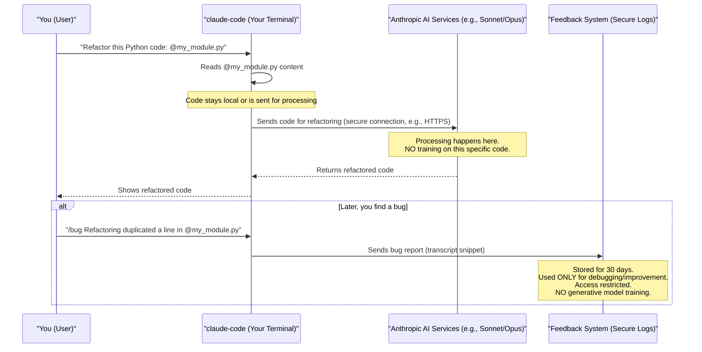

# Chapter 7: Data Privacy & Security Framework

Welcome to the final chapter of our `claude-code` journey! In [Chapter 6: MCP (Multi-Claude Protocol/Platform)](06_mcp__multi_claude_protocol_platform_.md), we saw how `claude-code` can connect with external helper services to expand its abilities. This is incredibly powerful, but it naturally brings up an important question: "How does `claude-code` handle my data, especially my code, safely and responsibly?" That's precisely what this chapter is all about!

**Our Central Use Case:**
Imagine you're working on a top-secret project for your company using `claude-code`. You're writing sensitive code, and perhaps you've even configured `claude-code` to use an internal company tool via MCP. You absolutely need to be sure that:
1.  The code snippets you're working on aren't being stored forever somewhere insecurely.
2.  If you give feedback on `claude-code` (maybe using the `/bug` command), that feedback (which might include bits of your code) isn't used to teach other AI models that could then accidentally reveal your company's secrets.
3.  If you, or someone else, discover a security weakness in `claude-code` itself, there's a clear, safe way to report it so it can be fixed.

Feeling secure and trusting your tools is essential, especially when those tools are helping you with valuable and potentially confidential code. `claude-code` addresses these concerns through its **Data Privacy & Security Framework**.

## What is the Data Privacy & Security Framework?

The **Data Privacy & Security Framework** is the set of rules (policies) and protective measures (technical safeguards) that `claude-code` and its creators at Anthropic use to handle your data responsibly.

Think of it like a high-tech digital safety deposit box for your information.
*   **The Box (Technical Safeguards):** This is the strong, secure technology used to store and process your data, like encryption and access controls.
*   **The Rules (Policies):** These are clear guidelines about who can access the box, what can be done with its contents, and how long things are kept.

This framework is designed to give you peace of mind, knowing that your code, your interactions, and your feedback are treated with respect and care. As stated in the `README.md`:
> ### Privacy safeguards
> We have implemented several safeguards to protect your data, including limited retention periods for sensitive information, restricted access to user session data, and clear policies against using feedback for model training.

Let's explore the key parts of this framework.

## Key Aspects of the Framework

These are the pillars that support `claude-code`'s commitment to your data's safety.

### 1. Defined Data Retention Limits

**What it means:** "Data retention" simply refers to how long your information is kept. Shorter retention periods for sensitive data mean less risk.

**How `claude-code` does it:**
The `README.md` clearly states:
```text
Given their potentially sensitive nature, we store user feedback transcripts for only 30 days.
```
This is a practical example. If you submit a bug report using the `/bug` command we learned about in [Chapter 1: User Interaction & Commands](01_user_interaction___commands_.md), and it includes snippets of your session, that information isn't kept indefinitely. After 30 days, it's gone.

**Why it's good for you:**
This limits the amount of time your potentially sensitive feedback data exists, reducing the window of opportunity for unauthorized access or accidental exposure.

### 2. Commitment Not to Use Feedback for Training Generative Models

**What it means:** "Generative models" are AI like the ones discussed in [Chapter 4: AI Models (e.g., Sonnet, Opus)](04_ai_models__e_g___sonnet__opus__.md) that can create new content (code, text, images). "Training" is how these models learn. If your code was used for training, the AI might learn patterns from your proprietary work and inadvertently use similar patterns for other users.

**How `claude-code` does it:**
The `README.md` makes a strong commitment:
```text
We may use feedback to improve our products and services, but we will not train generative models using your feedback from Claude Code.
```

**Why it's good for you:**
This is a crucial protection for your intellectual property. It means your unique code, algorithms, or any confidential information shared in feedback won't become part of the general knowledge base of Anthropic's large AI models that serve other users. Your secrets stay yours.

### 3. Secure Channels for Reporting Vulnerabilities

**What it means:** A "vulnerability" is a weakness in software that could be exploited by an attacker to cause harm (e.g., steal data, disrupt service). It's important to have a safe way to report these so they can be fixed.

**How `claude-code` does it:**
`claude-code` provides two main channels:
1.  **The `/bug` command:** For general issues and feedback directly within `claude-code`.
2.  **Formal Security Reporting:** The `SECURITY.md` file points to a dedicated, professional program:
    ```text
    Our security program is managed on HackerOne and we ask that any validated vulnerability in this functionality be reported through their [submission form](https://hackerone.com/anthropic-vdp/reports/new?type=team&report_type=vulnerability).
    ```
    HackerOne is a platform trusted by many companies for responsibly handling vulnerability reports.

**Why it's good for you (and everyone):**
This encourages responsible disclosure. Security researchers and users can report issues privately to Anthropic, giving them a chance to fix the problem before it becomes widely known or exploited. This helps keep `claude-code` secure for all users.

### 4. Limited Access and Purposeful Use of Your Data

**What it means:** Even when you do provide data (like feedback), it's not a free-for-all for anyone at Anthropic to look at or use however they want.

**How `claude-code` does it:**
The `README.md` explains:
```text
If you choose to send us feedback about Claude Code, such as transcripts of your usage, Anthropic may use that feedback to debug related issues and improve Claude Code's functionality (e.g., to reduce the risk of similar bugs occurring in the future).
```
And it mentions "restricted access to user session data."

**Why it's good for you:**
This ensures that when your data *is* used, it's for specific, beneficial purposes like making `claude-code` better and fixing problems you might encounter. It’s not used for unrelated activities.

### 5. Transparency Through Official Policies

**What it means:** Beyond the highlights, detailed legal terms and privacy commitments are available for you to review.

**How `claude-code` does it:**
The `README.md` provides direct links:
```text
For full details, please review our [Commercial Terms of Service](https://www.anthropic.com/legal/commercial-terms) and [Privacy Policy](https://www.anthropic.com/legal/privacy).
```

**Why it's good for you:**
This transparency allows you (or your company's legal team) to understand the full scope of the commitments Anthropic makes regarding your data.

## How This Framework Solves Our Use Case

Let's revisit our top-secret project scenario:

1.  **Sensitive code snippets:**
    *   If they appear in feedback (e.g., via `/bug`), that feedback transcript is deleted after 30 days.
    *   Crucially, your code (whether in feedback or just processed by `claude-code` for a task) is **not** used to train Anthropic's general-purpose generative models.

2.  **Feedback (e.g., `/bug` reports):**
    *   Used specifically to debug and improve `claude-code`.
    *   Again, **not** used for training generative models.

3.  **Reporting security weaknesses:**
    *   You have clear, secure channels (`/bug` or HackerOne) to report any concerns, helping protect your project and others.

This framework provides multiple layers of protection and assurance.

## What Happens "Under the Hood"? (A Conceptual View)

While we can't see the exact server-side code, we can understand the principles of how data is handled based on the framework.

Imagine you're using `claude-code` to refactor a piece of Python code:



1.  **Your Interaction:** You provide code or commands to `claude-code` running on your machine.
2.  **Processing:**
    *   To perform tasks (like refactoring, explaining, or using [AI Models (e.g., Sonnet, Opus)](04_ai_models__e_g___sonnet__opus__.md)), `claude-code` might send your code/query to Anthropic's backend services. This communication is expected to be over secure channels (like HTTPS).
    *   The backend services process your request. **Crucially, as per policy, this interaction is not used to train the general generative models.**
3.  **Feedback Handling:**
    *   If you submit feedback (e.g., via `/bug`), this data is sent to a separate system for logging.
    *   This log is subject to:
        *   **30-day retention:** Old logs are deleted.
        *   **Purpose limitation:** Used only for debugging `claude-code` and improving its functionality.
        *   **No generative model training:** This feedback isn't fed into the training pipeline for models like Sonnet or Opus.
        *   **Restricted access:** Only authorized Anthropic personnel can access these logs for the stated purposes.
4.  **Technical Measures:** Behind the scenes, Anthropic employs various technical safeguards like encryption for data in transit and at rest, access controls, and regular security audits, common practices for protecting user data.

## Your Role in Staying Secure

While `claude-code` provides a strong framework, you also play a part:

*   **Be Mindful:** When submitting `/bug` reports, only include sensitive code snippets if absolutely necessary for diagnosing the issue.
*   **Secure Your Account:** Use strong, unique credentials for your Anthropic account if it's linked for features or billing.
*   **Keep Updated:** Install updates for `claude-code` as they are released. Updates often include security patches.
*   **Review MCP Configurations:** If you use [Chapter 6: MCP (Multi-Claude Protocol/Platform)](06_mcp__multi_claude_protocol_platform_.md) to connect to external services, understand that data shared with those services is subject to *their* privacy policies. Only connect to trusted MCP services.
*   **Understand Project Settings:** Be aware of configurations like those in `.claude/settings.json` from [Chapter 5: Configuration System](05_configuration_system_.md), as they might influence how `claude-code` interacts with your files and potentially with MCP services.

## Conclusion

You've now reached the end of our `claude-code` tutorial and learned about its Data Privacy & Security Framework. This framework is Anthropic's commitment to handling your data with care, respecting your intellectual property, and providing a secure environment for your coding tasks.

Key takeaways:
*   **Limited Data Retention:** Feedback transcripts are kept for only 30 days.
*   **No Training on Your Feedback:** Your feedback won't be used to train generative AI models.
*   **Secure Vulnerability Reporting:** Clear channels exist to report security issues.
*   **Purposeful Data Use:** Feedback is used to improve `claude-code`, not for other reasons.
*   **Transparency:** Full policies are available for review.

By understanding these principles, you can use `claude-code` with greater confidence, knowing that safeguards are in place to protect your valuable work.

Throughout this tutorial series, we've journeyed from basic [User Interaction & Commands](01_user_interaction___commands_.md), met the intelligent [Claude Code Agent](02_claude_code_agent_.md), explored its [Tools & Capabilities](03_tools___capabilities_.md), understood the power of [AI Models (e.g., Sonnet, Opus)](04_ai_models__e_g___sonnet__opus__.md), learned to customize it via the [Configuration System](05_configuration_system_.md), and even peeked into advanced features like [MCP (Multi-Claude Protocol/Platform)](06_mcp__multi_claude_protocol_platform_.md).

We hope this journey has equipped you with the knowledge to make `claude-code` a productive and trusted partner in your software development endeavors. Happy coding!

---

Generated by [AI Codebase Knowledge Builder](https://github.com/The-Pocket/Tutorial-Codebase-Knowledge)