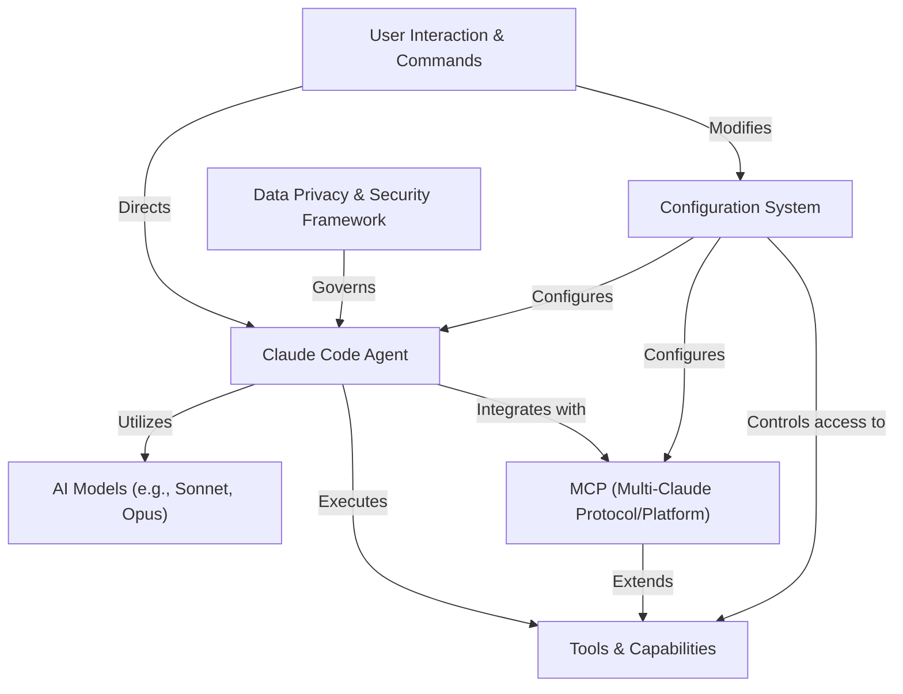

# Tutorial: claude-code

`claude-code` is an **AI-powered assistant** that lives *in your terminal*. It acts like a smart pair programmer, helping you with coding tasks by understanding your code, running commands, editing files, and managing git, all through *natural language instructions*. Its goal is to make your development work *faster and smoother*.

**Source Repository:** [https://github.com/anthropics/claude-code.git](https://github.com/anthropics/claude-code.git)

## Chapters

1. [User Interaction & Commands
](01_user_interaction___commands_.md)
2. [Claude Code Agent
](02_claude_code_agent_.md)
3. [Tools & Capabilities
](03_tools___capabilities_.md)
4. [AI Models (e.g., Sonnet, Opus)
](04_ai_models__e_g___sonnet__opus__.md)
5. [Configuration System
](05_configuration_system_.md)
6. [MCP (Multi-Claude Protocol/Platform)
](06_mcp__multi_claude_protocol_platform__.md)
7. [Data Privacy & Security Framework
](07_data_privacy___security_framework_.md)

---

Generated by [AI Codebase Knowledge Builder](https://github.com/The-Pocket/Tutorial-Codebase-Knowledge)