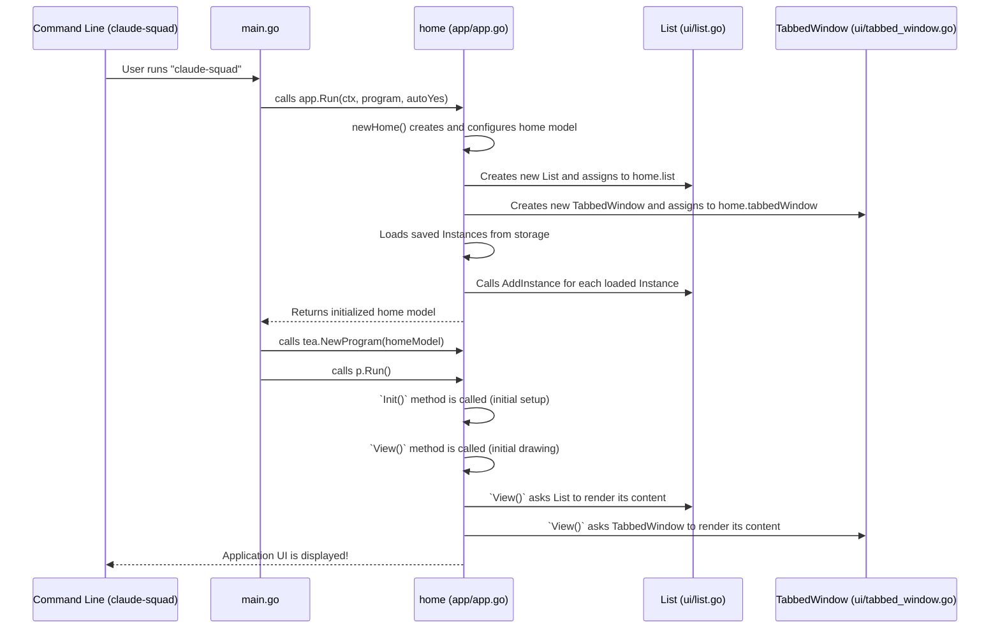

# Chapter 1: Main Application (`home` model)

Welcome to the **Claude Squad** tutorial! In this first chapter, we're going to peek behind the curtain of how this application works. Think of Claude Squad as a helpful tool that lets you manage different AI agents (like Claude Code or Aider) right from your terminal.

## The Brain of the Operation: The `home` Model

Imagine Claude Squad as a living organism. Just like your brain controls your body, sending signals to your hands, eyes, and ears, Claude Squad has a central "brain" that manages everything. In our code, this brain is called the `home` model, represented by the `home` struct in the `app/app.go` file.

**What problem does `home` solve?**

Claude Squad's job is to let you:
1. See a list of your AI agent "instances" (like different projects or AI conversations you have open).
2. Choose one of these instances.
3. See what's happening with that instance (like its output or code changes).
4. Interact with it (start new ones, send commands, etc.).

All these different parts (the list, the preview, the menu at the bottom) need to talk to each other and work together smoothly. The `home` model is the conductor of this orchestra, making sure every instrument plays its part at the right time.

## A Central Use Case: Starting the Application

Let's imagine you've just installed Claude Squad. How does it even start up and show you everything? This is where the `home` model comes into play.

When you run `claude-squad` in your terminal, the program needs to:
1. Initialize itself.
2. Load any existing AI instances you had from last time.
3. Display the main user interface (UI).
4. Get ready to listen for your keyboard presses.

The `home` model is responsible for orchestrating all these initial steps and then keeping track of everything as you use the application.

## Breaking Down the `home` Model

The `home` model is like a central hub. It brings together several smaller pieces (think of them as specialized team members) to get the job done. Let's look at some key components the `home` model manages:

*   **`list`**: This component (`ui/list.go`) is responsible for displaying the list of your AI agent instances. It knows which one is currently selected.
*   **`menu`**: The `ui/menu.go` component displays the menu at the bottom of the screen, showing you what actions you can take (like "New," "Quit," "Help").
*   **`tabbedWindow`**: This part (`ui/tabbed_window.go`) handles the larger pane on the right. It can switch between showing you a "Preview" of your selected instance's output or a "Diff" of changes in your code.
*   **`errBox`**: If something goes wrong, the `ui/err.go` component displays a small error message at the very bottom.

These are just a few examples, but they give you a good idea of how `home` uses other parts of the application to build the full UI.

## How it All Starts: `Run` and `newHome`

Let's look at a simplified version of the code that kicks everything off.

First, when you type `claude-squad` in your terminal, the command processing (from files like `main.go`) eventually calls a function named `Run` in `app/app.go`.

```go
// --- File: main.go --- (Simplified)
package main

import (
	"claude-squad/app" // This is where our 'home' model lives!
	// ... other imports ...
)

var rootCmd = &cobra.Command{
	// ... command setup ...
	RunE: func(cmd *cobra.Command, args []string) error {
		// ... some initial setup ...
		return app.Run(ctx, program, autoYes) // Calls the Run function in 'app/app.go'
	}
}

// ... rest of main.go ...
```

This `main.go` file is like the very first gatekeeper. It sets up how `claude-squad` commands are handled and then delegates the main UI work to the `app.Run` function.

Now, let's look inside `app/app.go` at the `Run` function:

```go
// --- File: app/app.go --- (Simplified)
package app

import (
	tea "github.com/charmbracelet/bubbletea" // Bubble Tea is the UI framework
	// ... other imports ...
)

// Run is the main entrypoint into the application.
func Run(ctx context.Context, program string, autoYes bool) error {
	p := tea.NewProgram(
		newHome(ctx, program, autoYes), // Here's where our 'home' model is created!
		tea.WithAltScreen(),
		tea.WithMouseCellMotion(),
	)
	_, err := p.Run() // Starts the UI!
	return err
}
```

The `Run` function is crucial! It uses a library called `bubbletea` (think of it as a special toolkit for building terminal UIs). The most important line here is `newHome(ctx, program, autoYes)`. This line actually **creates** our `home` model.

When `newHome` is called, it does a lot of important setup:

```go
// --- File: app/app.go --- (Simplified)
func newHome(ctx context.Context, program string, autoYes bool) *home {
	// 1. Load configuration for the app
	appConfig := config.LoadConfig()

	// 2. Load saved application state (like info about old instances)
	appState := config.LoadState()

	// 3. Initialize storage (where instance data is saved)
	storage, err := session.NewStorage(appState)
	// ... error handling ...

	// 4. Create the 'home' struct, setting up its internal components
	h := &home{
		ctx:          ctx,
		// ... initializes spinner, menu, tabbedWindow, errBox, etc. ...
		storage:      storage,
		appConfig:    appConfig,
		program:      program,
		autoYes:      autoYes,
		state:        stateDefault, // The initial state is 'default'
		appState:     appState,
	}
	h.list = ui.NewList(&h.spinner, autoYes) // The list needs the spinner

	// 5. Load any previously saved instances
	instances, err := storage.LoadInstances()
	// ... error handling ...

	// 6. Add loaded instances to the list
	for _, instance := range instances {
		h.list.AddInstance(instance)()
		// ... potentially set autoYes on instances ...
	}

	return h // Returns our fully set up 'home' model!
}
```

This `newHome` function is like the setup crew before a big show. It makes sure all the necessary pieces are ready, like loading your past AI sessions (called [Instances](02_instance_.md)), setting up the UI components, and configuring how the app should behave. Then, `Run` takes this prepared `home` model and tells the `bubbletea` framework to start displaying it and listening for your input.

## How it Works Under the Hood

Let's simplify the interaction between `main.go`, `app.go` (`home` model), and UI components when the application starts.



1.  **You run `claude-squad`**: This is like pressing the "on" button.
2.  **`main.go` takes the lead**: It's the very first part of the program to run. Its main job in this context is to prepare the ground and then hand over control to the `app.Run` function.
3.  **`app.Run` creates the `home` model**: Inside `app.Run`, the `newHome` function is called. This is the constructor for our `home` struct. It's where all the main pieces of the UI are initialized (like the `list`, `menu`, `tabbedWindow`, etc.). It also loads any saved AI instances from your previous sessions using the [Storage](07_storage_.md) concept.
4.  **`bubbletea` takes over**: `app.Run` then passes the fully prepared `home` model to the `bubbletea` framework (`tea.NewProgram`). This framework is designed to manage terminal UIs.
5.  **Initial Display**: `bubbletea` asks the `home` model to `Init()` itself (do any initial setup) and then to `View()` itself (draw what it looks like). The `View()` method of `home` is very important because it combines the output of all its child UI components (like the `list` and `tabbedWindow`) into one final picture that you see on your screen.

So, the `home` model (`app/app.go`) acts as the central coordinator, bringing together all the visual elements from the `ui/` directory and the data management from other parts like [Storage](07_storage_.md) and [Instances](02_instance_.md) to present you with the full Claude Squad experience.

## Conclusion

In this chapter, we learned that the `home` model (a `struct` in `app/app.go`) is the central control panel of the Claude Squad application. It's responsible for orchestrating the entire user interface, from displaying lists of [Instances](02_instance_.md) to managing different view panes and handling initial setup. It uses other specialized components like `ui/list.go` and `ui/tabbed_window.go` to present a cohesive experience.

Next, we'll dive deeper into the core concept of an "Instance" – what it is, and how it represents your individual AI agent sessions.

[Next Chapter: Instance](02_instance_.md)

---

Generated by [AI Codebase Knowledge Builder](https://github.com/The-Pocket/Tutorial-Codebase-Knowledge)