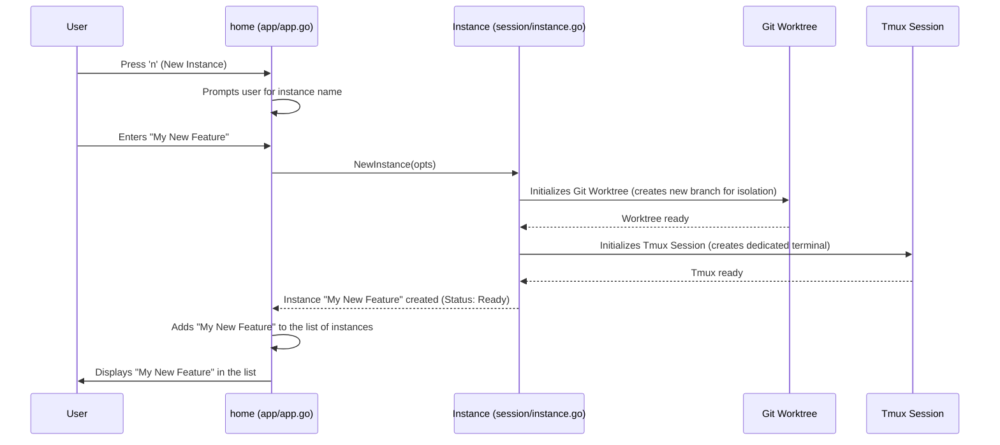

# Chapter 2: Instance

Welcome back! In [Chapter 1: Main Application (`home` model)](01_main_application___home__model__.md), we learned that the `home` model is the central "brain" of Claude Squad, orchestrating how everything looks and behaves. Now, let's zoom in on one of the most important things the `home` model manages: an **Instance**.

## What Problem Does `Instance` Solve?

Imagine you're a busy programmer, working on many different coding projects. For each project, you might want a separate AI assistant (like Claude Code or Aider) to help you. You wouldn't want all your AI assistants working on the same files or getting their conversations mixed up, right?

This is exactly the problem `Instance` solves!

A central use case for Claude Squad is to **manage multiple, separate AI coding assistants**, each working on its own task in its own dedicated space. Each of these separate AI assistants and their workspaces is what we call an **Instance**.

Think of an `Instance` like a single, personalized "desk" for one of your AI assistants.

*   Each desk has its own `project` (a [Git Worktree](03_git_worktree_.md)) where the AI can read and write code without affecting your other projects.
*   Each desk has its own `screen` (a [Tmux Session](04_tmux_session_.md)) where you can see what the AI is doing and talk to it.

## Breaking Down the `Instance` Concept

So, an `Instance` means:

1.  **A single, isolated AI agent:** This is your Claude Code or Aider assistant.
2.  **Its associated workspace:** This is where the AI does its work.

An `Instance` keeps track of important information about this "desk" and the AI working on it:

*   **Status:** Is the AI currently `Running`, just `Ready` for your input, `Loading`, or `Paused`?
*   **Unique Name (Title):** A friendly name you give it, like "Fix Login Bug" or "Write New Feature."
*   **Workspace Location (Path, Branch):** Where on your computer its project files are stored and which specific version of the code (`Branch`) it's working on.
*   **Tools (`Program`):** Which AI tool (e.g., `claude` or `aider`) this desk is set up for.

## How to Create and Manage an `Instance` (The Basics)

Let's imagine you want a new AI assistant to help with a specific task. You'd typically tell Claude Squad to "create a new instance."

Here's a simplified look at how `Instance` objects come to life and what happens to them:



1.  **You (the User) press 'n':** This tells the `home` model you want to create a new `Instance`.
2.  **`home` asks for a name:** The `home` model, through its `textInputOverlay`, will prompt you to type a name for your new AI desk. Let's say you type "My New Feature".
3.  **`home` creates a new `Instance`:** The `home` model then calls a function like `session.NewInstance` (which is in `session/instance.go`) with your chosen name and other details.
4.  **`Instance` sets up its workspace:** Inside `NewInstance`, the `Instance` object doesn't just store the name. It immediately starts setting up its dedicated "desk":
    *   It prepares a [Git Worktree](03_git_worktree_.md) to keep your project code isolated. This means it creates a new temporary branch just for this AI.
    *   It prepares a [Tmux Session](04_tmux_session_.md) to give the AI its own "screen" in your terminal where you can see its output and interact.
5.  **`Instance` is ready for work:** Once an `Instance` is created, its `Status` might be `Ready` or `Running`, depending on if the AI started automatically. It's now listed in your Claude Squad interface, ready for you to interact with.

### Example: Creating a New `Instance`

Let's look at the simplified code that creates a new `Instance`. This is what happens when you press 'n' and enter a name.

```go
// --- File: app/app.go (simplified) ---
// This code runs when the user types a new instance name and presses Enter.
func (m *home) handleNewInstanceInput(title string, withPrompt bool) tea.Cmd {
    // 1. Prepare options for the new instance
    opts := session.InstanceOptions{
        Title: title,
        Path:  m.appConfig.RepoPath, // Path to your code repository
        Program: m.appConfig.Program, // e.g., "claude-code"
    }

    // 2. Create the new Instance object
    newInstance, err := session.NewInstance(opts)
    if err != nil {
        return m.handleError(fmt.Errorf("could not create instance: %w", err))
    }

    // 3. Start the instance (this sets up Tmux, Git Worktree)
    if err := newInstance.Start(true); err != nil { // 'true' means it's a brand new setup
        return m.handleError(fmt.Errorf("could not start instance: %w", err))
    }

    // 4. Add the new instance to the list component for display
    m.newInstanceFinalizer = m.list.AddInstance(newInstance)
    m.newInstanceFinalizer() // Mark instance as ready and add to list

    // 5. Select the new instance and update UI
    m.list.SetSelectedInstance(m.list.NumInstances() - 1)
    return m.instanceChanged() // Refresh preview, menu, etc.
}
```
**Explanation:**

*   `handleNewInstanceInput`: This function in the `home` model is called once you've typed a name for your new instance.
*   `session.InstanceOptions`: We gather all the necessary information, like the `Title` you entered, and the default `RepoPath` (where your code is) and `Program` (which AI `claude-squad` should launch) from the application's configuration.
*   `session.NewInstance(opts)`: This is the core call that creates a new `Instance` object in memory. At this point, the `Instance` exists, but its "desk" (worktree and tmux session) isn't fully set up yet.
*   `newInstance.Start(true)`: This crucial step tells the `Instance` to actually begin its setup process. It's inside `Start` where the [Git Worktree](03_git_worktree_.md) and [Tmux Session](04_tmux_session_.md) are initialized.
*   `m.list.AddInstance(newInstance)`: Once the `Instance` is ready, the `home` model tells its `list` component (which displays all instances on the left side of the screen) to add this new `Instance`.
*   `m.instanceChanged()`: Finally, the UI is updated to show the new instance selected and its preview.

## `Instance` Internal Implementation: `session/instance.go`

Let's dive a bit deeper into the `Instance` itself. It's defined as a `struct` in `session/instance.go`. This `struct` holds all the data and behavior related to a single AI agent instance.

```go
// --- File: session/instance.go (simplified) ---
package session

import (
    "claude-squad/session/git" // Handles Git Worktrees
    "claude-squad/session/tmux" // Handles Tmux Sessions
    "time"
)

// Status represents the current state of an Instance.
type Status int
const (
    Running Status = iota // AI is actively working
    Ready                 // AI is waiting for input
    Loading               // AI is starting up
    Paused                // AI is paused, worktree removed
)

// Instance is a running instance of claude code.
type Instance struct {
    Title    string    // e.g., "Fix Auth Bug"
    Path     string    // Absolute path to the repository
    Branch   string    // Git branch name for this instance
    Status   Status    // Current status (Running, Ready, Paused, etc.)
    Program  string    // The AI program to run (e.g., "claude")
    CreatedAt time.Time // When it was created

    // The below fields are initialized upon calling Start().
    started bool            // Internal flag: has Start() been called?
    tmuxSession *tmux.TmuxSession // Manages the dedicated terminal session
    gitWorktree *git.GitWorktree  // Manages the isolated code workspace
}

// NewInstance creates a new Instance object in memory.
func NewInstance(opts InstanceOptions) (*Instance, error) {
    // ... validation and path conversion ...
    return &Instance{
        Title:     opts.Title,
        Status:    Ready, // Starts as ready
        Path:      absPath,
        Program:   opts.Program,
        CreatedAt: time.Now(),
    }, nil
}

// Start sets up the Git Worktree and Tmux Session for the Instance.
func (i *Instance) Start(firstTimeSetup bool) error {
    if i.started {
        return fmt.Errorf("instance already started")
    }

    // 1. Initialize Tmux Session
    i.tmuxSession = tmux.NewTmuxSession(i.Title, i.Program)

    // 2. Initialize Git Worktree
    // if firstTimeSetup, create a new branch. otherwise it's loaded from storage.
    var err error
    if firstTimeSetup {
        i.gitWorktree, err = git.NewGitWorktree(i.Path, i.Title)
    } else {
        // If not first time, load existing worktree details
        // (details like branch name, base commit, are already in 'i' from storage)
        i.gitWorktree = git.NewGitWorktreeFromStorage(
            i.gitWorktree.GetRepoPath(), i.gitWorktree.GetWorktreePath(),
            i.Title, i.Branch, i.gitWorktree.GetBaseCommitSHA(),
        )
    }
    if err != nil {
        return fmt.Errorf("failed to create/load git worktree: %w", err)
    }

    // 3. Set the instance's branch name
    i.Branch = i.gitWorktree.GetBranchName()

    // 4. Start the Tmux session in the worktree path
    if err := i.tmuxSession.Start(i.gitWorktree.GetWorktreePath()); err != nil {
        return fmt.Errorf("failed to start tmux session: %w", err)
    }

    i.started = true // Mark as started
    i.Status = Running // Now it's running
    return nil
}
```

**Explanation:**

*   **`Instance` structure:** It holds basic information like `Title`, `Path`, `Branch`, `Status`, `Program`, and `CreatedAt`.
*   **Child Components:** Crucially, it contains `tmuxSession` (`*tmux.TmuxSession`) and `gitWorktree` (`*git.GitWorktree`). These are not just pieces of data; they are *other objects* that handle the complex low-level operations.
    *   The `tmux.TmuxSession` (from [Tmux Session](04_tmux_session_.md) chapter) handles starting, stopping, and interacting with the terminal window where the AI runs.
    *   The `git.GitWorktree` (from [Git Worktree](03_git_worktree_.md) chapter) handles creating and managing the isolated copy of your code.
*   **`NewInstance`:** This function primarily creates the `Instance` object itself and sets up its initial properties like `Title` and `Program`. It also sets its initial `Status` to `Ready`. At this point, the `tmuxSession` and `gitWorktree` are not yet fully configured.
*   **`Start` method:** This is where the real *magic* of setting up the AI's environment happens.
    1.  It creates a `tmux.TmuxSession` object.
    2.  It creates/loads a `git.GitWorktree` object. If it's a new instance (`firstTimeSetup` is true), it creates a *new* git branch and worktree. If it's an instance loaded from storage (Chapter 7), it re-attaches to an existing one.
    3.  It then tells the `tmuxSession` to `Start()` itself, pointing it to the newly created `gitWorktree`'s path. This launches the AI program within its dedicated terminal.
    4.  Finally, it updates the `Instance`'s `Status` to `Running`.

By delegating these responsibilities to `git.GitWorktree` and `tmux.TmuxSession` objects, the `Instance` stays neat and focused on managing the overall state of a single AI assistant.

## Conclusion

In this chapter, we unpacked the concept of an `Instance` in Claude Squad. We learned that an `Instance` represents a single, isolated AI agent and its dedicated workspace, solving the problem of managing multiple AI assistants for different tasks. We saw how the `home` model creates and manages these `Instance` objects, and how each `Instance` relies on lower-level components like [Git Worktree](03_git_worktree_.md) and [Tmux Session](04_tmux_session_.md) to provide its isolated environment.

Next, we'll dive into the fascinating world of [Git Worktree](03_git_worktree_.md), which is key to how Claude Squad keeps your AI's code changes separate and tidy.

[Next Chapter: Git Worktree](03_git_worktree_.md)

---

Generated by [AI Codebase Knowledge Builder](https://github.com/The-Pocket/Tutorial-Codebase-Knowledge)