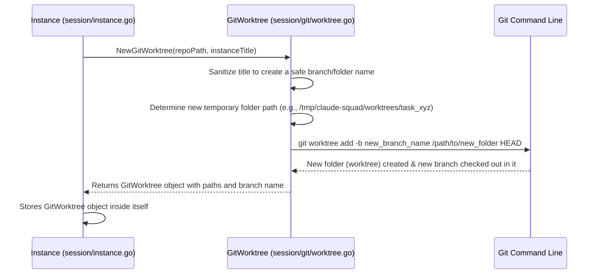

# Chapter 3: Git Worktree

Welcome back! In [Chapter 2: Instance](02_instance_.md), we learned that an `Instance` is like a dedicated "desk" for your AI assistant, and how the `home` model manages many of these desks. A key part of each "desk" is its own isolated workspace. This is where **Git Worktree** comes in!

## What Problem Does `Git Worktree` Solve?

Imagine you're a painter, and you have one main canvas you're working on (your main codebase). Now, you want to try out a new idea for a small part of the painting, but you don't want to mess up your main canvas. What do you do? You grab a *new, smaller canvas* to experiment on. If the experiment works, you can carefully transfer it to your main canvas. If not, you can just throw away the small canvas without any damage to your main work.

This is exactly what `Git Worktree` solves for your code!

When you're working on a codebase (a Git repository), you might want to:
*   Have multiple AI assistants working on different features or bug fixes, all at the same time.
*   Make sure that an AI agent's experimental changes don't mess up your main project.
*   Easily switch between different AI tasks without complicated Git commands.

A `Git Worktree` provides an isolated copy of your Git repository for each `Instance`. Think of it as creating a separate "folder" on your computer that acts like a *mini-copy* of your main project. Your AI can make changes in this mini-copy without interfering with other AI agents' work or your main project. All these mini-copies are still linked to the *same main project* in the background, making it easy to share or discard changes.

## A Central Use Case: Isolated Code for Each AI

The core use case for `Git Worktree` in Claude Squad is to ensure that when you create a new [Instance](02_instance_.md) for an AI agent, you get a clean, isolated copy of your code for that agent to work in.

This means:
1.  **AI A** works in `my_project/worktrees/AI_A_task`.
2.  **AI B** works in `my_project/worktrees/AI_B_task`.
3.  Your **main project** remains untouched in `my_project`.

This keeps everything neat and prevents accidental interference.

## How `Git Worktree` Works (The Basics)

Let's imagine you're creating a new [Instance](02_instance_.md) in Claude Squad. Here's a simplified look at what happens behind the scenes for the `Git Worktree` part:



1.  **Request for a Worktree:** When an [Instance](02_instance_.md) needs its own workspace, it asks the `GitWorktree` component to set it up.
2.  **Naming Convention:** The `GitWorktree` takes the instance's title (e.g., "Fix Login Bug") and playfully converts it into a Git-friendly branch name and folder name (e.g., "claudesquad-fix-login-bug"). This helps keep things organized.
3.  **Find Project Root:** It figures out where your *main* Git project lives.
4.  **Create Temporary Folder:** It decides on a unique temporary folder where this isolated copy of your project will live. (e.g., `/tmp/claude-squad/worktrees/fix-login-bug_12345`).
5.  **Git Command:** The `GitWorktree` then uses a special Git command (`git worktree add`) to create this isolated folder. This command also creates a new Git branch *inside* that folder, starting from your main project's current state. This new branch is unique to this specific `Instance`.
6.  **Ready for AI:** Now, the `GitWorktree` object is fully set up and ready for the AI inside the [Instance](02_instance_.md) to use it.

### Simplified Code: Creating a `GitWorktree`

Let's look at the very simplified code snippet from `session/git/worktree.go` that initializes a `GitWorktree`. This happens inside `session.NewInstance` and then `instance.Start()` functions as seen in the previous chapter.

```go
// --- File: session/git/worktree.go (Simplified) ---
package git

import (
	"fmt"
	"path/filepath"
	"time"
)

// NewGitWorktree creates a new GitWorktree instance
func NewGitWorktree(repoPath string, sessionName string) (*GitWorktree, string, error) {
	// 1. Sanitize the session name for a safe branch/folder name
	sanitizedName := sanitizeBranchName(sessionName)
	// Example: "claudesquad-fix-login-bug" (from config.BranchPrefix)
	branchName := fmt.Sprintf("claudesquad-%s", sanitizedName)

	// 2. Find the actual root of your Git repository
	// Example: /Users/youruser/dev/my_awesome_project
	actualRepoPath, _ := findGitRepoRoot(repoPath)

	// 3. Create a unique path for the new worktree folder
	// Example: /tmp/claude-squad/worktrees/fix-login-bug_123456789
	worktreeDir := filepath.Join(os.TempDir(), "claude-squad", "worktrees")
	worktreePath := filepath.Join(worktreeDir, sanitizedName) + "_" + fmt.Sprintf("%x", time.Now().UnixNano())

	// Return a new GitWorktree object, but it's not actually created on disk yet.
	return &GitWorktree{
		repoPath:     actualRepoPath,
		sessionName:  sessionName,
		branchName:   branchName,
		worktreePath: worktreePath,
	}, branchName, nil
}
```
**Explanation:**
*   `NewGitWorktree`: This function is called when a new [Instance](02_instance_.md) is being initialized.
*   `sanitizeBranchName`: Takes a user-friendly name (like "My New Feature") and turns it into something Git likes (like "my-new-feature").
*   `branchName`: Creates the full branch name, usually prefixed with "claudesquad-" to make it clear these are managed by the application.
*   `findGitRepoRoot`: This ensures we're working from the true root of your Git project, even if you started Claude Squad from a subfolder.
*   `worktreePath`: Generates a unique temporary directory path for the worktree. This path will be where the AI's isolated code copy lives.
*   **Important:** This `NewGitWorktree` function *only* sets up the `GitWorktree` object in memory. It doesn't actually create the folder or run Git commands yet. That happens in the `Setup()` method!

### Simplified Code: Setting up the `GitWorktree` on Disk

The actual creation of the worktree on your disk happens when `instance.Start()` is called, which in turn calls the `Setup()` method of the `GitWorktree` object.

```go
// --- File: session/git/worktree_ops.go (Simplified) ---
package git

import (
	"fmt"
	"os"
	"os/exec" // Used for running Git commands
)

// Setup creates a new worktree for the session on disk
func (g *GitWorktree) Setup() error {
	// 1. Ensure the directory for worktrees exists
	// (e.g., /tmp/claude-squad/worktrees)
	worktreesDir := filepath.Join(g.repoPath, "worktrees") // Simpler path for demo
	if err := os.MkdirAll(worktreesDir, 0755); err != nil {
		return fmt.Errorf("failed to create worktrees directory: %w", err)
	}

	// 2. Determine the base commit (usually your project's current HEAD)
	// Example: runs 'git rev-parse HEAD' in main repo
	headCommit, err := g.runGitCommand(g.repoPath, "rev-parse", "HEAD")
	if err != nil {
		return fmt.Errorf("failed to get HEAD commit: %w", err)
	}
	g.baseCommitSHA = headCommit // Store this to track changes later

	// 3. Create the new worktree and branch using Git command
	// This creates the /path/to/new_folder and checks out 'claudesquad-new-feature' branch there.
	_, err = g.runGitCommand(g.repoPath, "worktree", "add", "-b",
                             g.branchName, g.worktreePath, g.baseCommitSHA)
	if err != nil {
		return fmt.Errorf("failed to create worktree: %w", err)
	}

	return nil
}

// runGitCommand is a helper to execute git commands
func (g *GitWorktree) runGitCommand(path string, args ...string) (string, error) {
    // This function actually runs "git -C /path/to/repo worktree add ..."
	cmd := exec.Command("git", append([]string{"-C", path}, args...)...)
	output, err := cmd.CombinedOutput()
	if err != nil {
		return "", fmt.Errorf("git command failed: %s (%w)", output, err)
	}
	return string(output), nil
}
```
**Explanation:**
*   `Setup()`: This method of the `GitWorktree` struct performs the actual operations on your file system and Git repository.
*   `os.MkdirAll`: Ensures the parent directory for all worktrees exists.
*   `g.runGitCommand(g.repoPath, "rev-parse", "HEAD")`: This command finds the current commit hash (a unique ID for a version of your code) of your *main* project. The new AI's worktree will start from this point.
*   `g.runGitCommand(g.repoPath, "worktree", "add", ...)`: This is the critical command!
    *   `g.repoPath`: Tells Git to perform the operation from your main repository's location.
    *   `worktree add`: The Git command to create a new worktree.
    *   `-b g.branchName`: Creates a new branch with the name we generated earlier (e.g., "claudesquad-fix-login-bug") and immediately checks out that branch *inside the new worktree folder*.
    *   `g.worktreePath`: This specifies the new unique folder path where Git should create the worktree.
    *   `g.baseCommitSHA`: Tells Git to create the worktree starting from this specific version of your code.
*   After `Setup()` successfully runs, you'll have a new folder (your `worktreePath`) containing your project code, with its own dedicated Git branch checked out. Your AI is now ready to make changes here!

## Internal Implementation Details

The `session/git/` directory contains all the code related to Git operations:
*   `session/git/worktree.go`: Defines the `GitWorktree` struct and functions to create/load it.
*   `session/git/worktree_ops.go`: Contains the methods for `Setup()`, `Cleanup()`, `Remove()`, `Prune()`, etc. These are the functions that actually interact with Git on your system.
*   `session/git/worktree_git.go`: Helper functions for running `git` commands and checking repository status.
*   `session/git/diff.go`: Logic to calculate changes (diffs) within a worktree.
*   `session/git/util.go`: Utility functions like `sanitizeBranchName` or checking if GitHub CLI is installed.

By separating the responsibilities this way, `GitWorktree` makes sure it only focuses on managing the isolated Git codebases, keeping the [Instance](02_instance_.md) and [home](01_main_application___home__model__.md) models cleaner.

## Visualizing Isolated Workspaces

Here's how your project structure might look after creating a few instances:

```
my_awesome_project/  (Your main Git repository)
├── .git/            (Main Git metadata)
├── src/
├── go.mod
│
└── .claude-squad/     (Hidden directory managed by Claude Squad)
    └── worktrees/
        ├── claudesquad-fix-login-bug_12345/   (First Instance's isolated workspace)
        │   ├── .git/                         (Minimal Git info pointing to main .git)
        │   ├── src/                          (Code files)
        │   └── go.mod
        │
        ├── claudesquad-add-new-feature_67890/ (Second Instance's isolated workspace)
        │   ├── .git/
        │   ├── src/
        │   └── go.mod
        │
        └── ...
```

Each folder under `.claude-squad/worktrees/` is a `Git Worktree`. It contains a copy of your project files. Notice that its `.git/` folder is very small; it doesn't contain the full history but instead points back to the `.git/` folder in your `my_awesome_project/` directory.

## Conclusion

In this chapter, we explored `Git Worktree`, a powerful Git feature that Claude Squad uses to create isolated copies of your codebase for each AI [Instance](02_instance_.md). This solves the critical problem of managing multiple concurrent AI tasks without them interfering with each other or your main project. We saw how `NewGitWorktree` and `Setup()` work together to prepare these isolated environments.

Next, we'll look at [Tmux Session](04_tmux_session_.md), which gives each AI its own "screen" or terminal window within your main terminal, allowing you to see its output and interact with it.

[Next Chapter: Tmux Session](04_tmux_session_.md)

---

Generated by [AI Codebase Knowledge Builder](https://github.com/The-Pocket/Tutorial-Codebase-Knowledge)