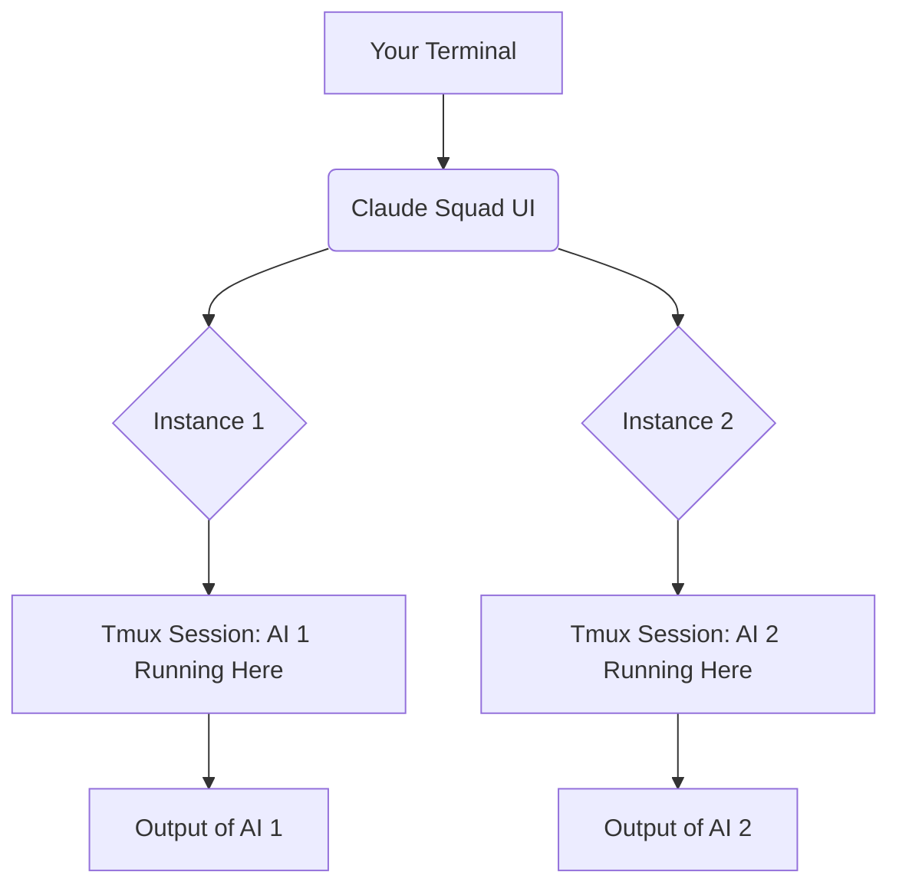
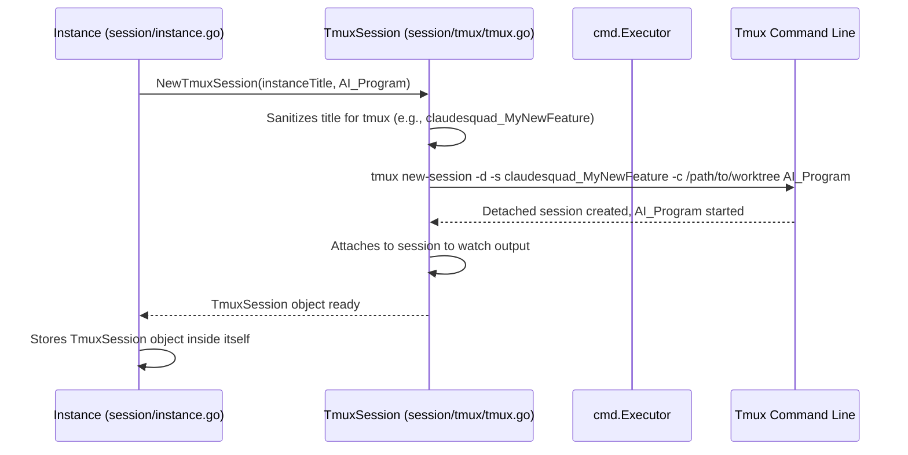
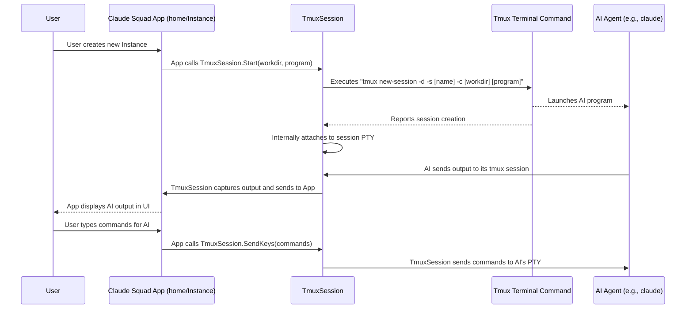

# Chapter 4: Tmux Session

Welcome back! In [Chapter 3: Git Worktree](03_git_worktree_.md), we explored how Claude Squad gives each AI agent its own isolated copy of your code. Now, let's look at the "screen" or terminal window where your AI actually runs programs and where you see its output: the **Tmux Session**.

## What Problem Does `Tmux Session` Solve?

Imagine you're at a busy office. You have multiple computer screens, each showing a different program or task. You can quickly switch between them, see what's happening on each, and type commands into any of them. But what if you only have one physical screen?

This is what `Tmux Session` solves for your terminal!

When an AI agent (like Claude Code) runs, it needs a place to:
*   Show you what it's doing (its "thoughts," its code changes).
*   Receive commands from you (like "continue" or "exit").
*   Keep running in the background, even if you close your Claude Squad application or disconnect from your server.

A `Tmux Session` provides a virtual terminal environment for each [Instance](02_instance_.md). It's like having multiple computer screens within one terminal window, each running a different program. This allows Claude Squad to run multiple AI agents in the background, capture their output, and allow you to send commands to them, all without cluttering your main terminal.

## A Central Use Case: A Dedicated "Screen" for Each AI

The core use case for `Tmux Session` in Claude Squad is to give each [Instance](02_instance_.md) its own, dedicated terminal environment.



This means:
1.  **AI A** runs in its own `Tmux Session`, showing its specific output.
2.  **AI B** runs in *another* `Tmux Session`, showing its specific output.
3.  You can switch between watching AI A and AI B within Claude Squad, or even directly attach to their individual Tmux sessions if you prefer.
4.  The AI programs keep running even if you close Claude Squad, because the Tmux sessions detach and continue in the background.

## How `Tmux Session` Works (The Basics)

Let's imagine you're creating a new [Instance](02_instance_.md) in Claude Squad. Here's a simplified look at what happens behind the scenes for the `Tmux Session` part:



1.  **Request for a Tmux Session:** When an [Instance](02_instance_.md) needs its own terminal, it asks the `TmuxSession` component to set it up.
2.  **Naming Convention:** The `TmuxSession` takes the instance's title (e.g., "My New Feature") and converts it into a `tmux` friendly session name (e.g., `claudesquad_MyNewFeature`).
3.  **Create Detached Session:** `TmuxSession` runs a `tmux` command to create a *new, detached* session. "Detached" means it runs in the background without immediately showing up on your screen. Inside this session, it automatically starts the AI program (`claude` or `aider`).
4.  **Attach (Internally):** While the session is created as "detached," Claude Squad immediately attaches to it *internally* to read its output and capture it for display in the UI.
5.  **Ready for AI:** Now, the `TmuxSession` object is fully set up, and the AI within the [Instance](02_instance_.md) has its dedicated terminal where it can run and communicate.

### Simplified Code: Creating a `TmuxSession`

Let's look at the very simplified code snippet from `session/tmux/tmux.go` that initializes a `TmuxSession`. This happens inside `session.NewInstance` and then `instance.Start()` functions as seen in the [Instance](02_instance_.md) chapter.

```go
// --- File: session/tmux/tmux.go (Simplified) ---
package tmux

import (
	"fmt"
	"os/exec" // Used for running external commands like `tmux`
)

const TmuxPrefix = "claudesquad_"

// NewTmuxSession creates a new TmuxSession
func NewTmuxSession(name string, program string) *TmuxSession {
	sanitizedName := toClaudeSquadTmuxName(name) // Converts "My Feature" to "claudesquad_MyFeature"
	return &TmuxSession{
		sanitizedName: sanitizedName,
		program:       program,
		// ... other internal components are set up here ...
	}
}

// Start creates and starts a new tmux session, then attaches to it.
func (t *TmuxSession) Start(workDir string) error {
	// 1. Command to create a new detached tmux session
	cmd := exec.Command("tmux", "new-session", "-d", "-s", t.sanitizedName, "-c", workDir, t.program)

	// 2. Execute the command (e.g., `tmux new-session -d -s claudesquad_MyFeature -c /tmp/... claude`)
	if err := cmd.Run(); err != nil { // cmd.Run() waits for the command to finish
		return fmt.Errorf("error starting tmux session: %w", err)
	}

	// 3. (Internal) Attach to the PTY for reading output and sending input
	return t.Restore() // This opens a pseudo-terminal for Claude Squad to interact with it
}
```
**Explanation:**
*   `NewTmuxSession`: This function is called when a new [Instance](02_instance_.md) is being initialized. It creates a `TmuxSession` object in memory, prepares the name, and notes the program (like `claude`).
*   `Start(workDir string)`: This is the crucial method that actually brings the `tmux` session to life.
    *   `exec.Command(...)`: This line constructs the actual command that will be run on your system.
        *   `tmux new-session`: The command to create a new `tmux` session.
        *   `-d`: Makes the session "detached" (runs in the background).
        *   `-s [name]`: Specifies the session name (e.g., `claudesquad_MyFeature`).
        *   `-c [workdir]`: Tells `tmux` to start the session in the specified working directory (this will be the [Git Worktree](03_git_worktree_.md) path).
        *   `[program]`: The AI program to automatically run inside the `tmux` session (e.g., `claude` or `aider`).
    *   `cmd.Run()`: Executes this command. If successful, your AI program is now running inside a `tmux` session in the background!
    *   `t.Restore()`: After the detached session is created, `Restore()` is called. This is an internal function that connects Claude Squad's UI to this `tmux` session, allowing it to capture the output and send input without you seeing the raw `tmux` interface.

## Internal Implementation Details

The `session/tmux/` directory contains all the code related to `tmux` operations:
*   `session/tmux/tmux.go`: Defines the `TmuxSession` struct and core functions like `NewTmuxSession`, `Start`, `Close`, `Attach`, `Detach`, `CapturePaneContent`, etc. This is the main hub.
*   `session/tmux/pty.go`: Handles the pseudo-terminal (PTY) connections, which are like virtual cables connecting one program's input/output to another.
*   `session/tmux/tmux_unix.go` and `session/tmux/tmux_windows.go`: Platform-specific code, mainly for handling terminal resizing events differently on Unix-like systems vs. Windows.

By specializing in `tmux` interactions, the `TmuxSession` ensures that the [Instance](02_instance_.md) can simply tell it "start an AI with this program in this directory" without worrying about the low-level `tmux` commands.

## How it All Connects (Simplified)



1.  **User Action:** You want a new AI.
2.  **App Orchestrates:** The Claude Squad application ([home](01_main_application___home__model__.md) and [Instance](02_instance_.md) models) decide to create a new `TmuxSession`.
3.  **Tmux Session Setup:** The `TmuxSession` object runs `tmux` commands to create a new session, starts the AI program inside it, and establishes an internal connection (using a PTY) to read the AI's output and send it input.
4.  **AI Runs:** The AI program now thinks it's running in a regular terminal.
5.  **Output Stream:** Any output the AI produces (like its thinking process, code suggestions, or questions) is captured by the `TmuxSession`.
6.  **UI Display:** The `TmuxSession` sends this captured output back to the Claude Squad application, which then displays it neatly in the UI (specifically, the `tabbedWindow` component mentioned in [Chapter 1](01_main_application___home__model__.md)).
7.  **User Input:** When you type a command (e.g., "continue", "exit"), the Claude Squad application hands it to the `TmuxSession`.
8.  **Input Delivery:** The `TmuxSession` then "taps" these keys into the AI's virtual terminal using its PTY connection. The AI receives the input as if you typed it directly into its terminal.

This seamless connection allows you to interact with multiple AI agents through a single, organized interface, while the `Tmux Sessions` quietly manage their persistent terminal environments in the background.

## Conclusion

In this chapter, we unpacked the `Tmux Session` concept. We learned that it provides dedicated, isolated virtual terminal environments for each AI [Instance](02_instance_.md) within Claude Squad. This is crucial for keeping AI agents running in the background, capturing their output, and allowing you to send them commands, all without cluttering your main terminal. We saw how the `TmuxSession` object uses `tmux` commands to set up and manage these persistent "screens" for your AIs.

Next, we'll explore how Claude Squad draws all these outputs and inputs beautifully in your terminal using **UI Components (Lipgloss)**.

[Next Chapter: UI Components (Lipgloss)](05_ui_components__lipgloss__.md)

---

Generated by [AI Codebase Knowledge Builder](https://github.com/The-Pocket/Tutorial-Codebase-Knowledge)