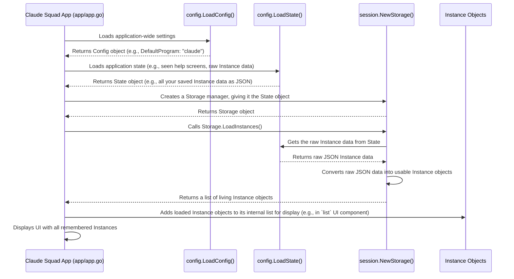

# Chapter 6: Configuration and State

Welcome back! In [Chapter 5: UI Components (Lipgloss)](05_ui_components__lipgloss__.md), we learned how Claude Squad uses fancy visual elements to make the terminal experience beautiful. But what about the information that *isn't* visual? What about remembering your settings, or keeping track of all those [Instances](02_instance_.md) you created even after you close the app?

This is where **Configuration and State** come in!

## What Problem Does Configuration and State Solve?

Imagine Claude Squad is your personal assistant. When you hire an assistant, you'd tell them:
*   "Always use my favorite AI model, Claude-3." (This is a **setting** or **preference**).
*   "Keep a list of all current tasks, and remind me which ones I've already started." (This is about remembering **ongoing work** or **dynamic information**).

If your assistant forgets your preferences or loses track of your tasks every time they go home for the day, they wouldn't be very helpful, right?

The problem **Configuration** and **State** solve is ensuring that the app **remembers things** between sessions. It's like the application's long-term and short-term memory.

*   **Config (Configuration):** Stores persistent settings that rarely change, like your default AI program (`claude` or `aider`) or how often the app "checks in" on background processes. Think of it as `claude-squad`'s "preferences."
*   **State:** Tracks dynamic information that changes often, such as which helpful hints you've already seen, or, most importantly, the details of all your active [Instances](02_instance_.md). Think of it as `claude-squad`'s "scratchpad" for ongoing work.

A central use case is to **load and save your AI sessions (Instances)** so you can pick up where you left off. When you reopen Claude Squad, you expect to see the list of all your previously created AI tasks. `Config` tells the app *how* to start (e.g., with `claude`), and `State` tells it *what* to start (e.g., all the instances you had open last time).

## Breaking Down the Concepts

Let's look at the two main components: `Config` and `State`. Both are managed by files in the `.claude-squad` directory inside your home folder.

### 1. `Config` (`config/config.go`)

This handles global preferences. It lives in a file usually named `config.json` (e.g., `~/.claude-squad/config.json`).

**What `Config` remembers (examples):**
*   `DefaultProgram`: Which AI program (e.g., "claude", "aider") should be used when you create a new [Instance](02_instance_.md).
*   `AutoYes`: Whether instances should automatically accept prompts (an experimental feature).
*   `BranchPrefix`: A small detail for how [Git Worktree](03_git_worktree_.md) branches are named.

**Simplified Structure of `config.json`:**

```json
{
  "default_program": "claude",
  "auto_yes": false,
  "daemon_poll_interval": 1000,
  "branch_prefix": "yourusername/"
}
```

### 2. `State` (`config/state.go`)

This handles more dynamic, runtime information. It lives in a file usually named `state.json` (e.g., `~/.claude-squad/state.json`).

**What `State` remembers (examples):**
*   `HelpScreensSeen`: A clever way to remember which introductory help messages you've already viewed, so they don't keep popping up (it's a bitmask, essentially a collection of "on/off" switches).
*   `InstancesData`: This is the most crucial part! It stores all the serialized information about your currently active [Instances](02_instance_.md) – their titles, paths, branches, sizes, and more. This is how Claude Squad "sees" your previously opened AI sessions.

**Simplified Structure of `state.json`:**

```json
{
  "help_screens_seen": 0,
  "instances": [
    // This is where all your Instance data (as JSON) would be stored
    // For example, a simplified instance:
    {
      "title": "Fix Login Bug",
      "path": "/Users/user/code/my_project",
      "branch": "claudesquad-fix-login-bug",
      "status": 0, // 0 for Running (from Status enum)
      // ... more instance data ...
    },
    {
      "title": "Add Feature X",
      "path": "/Users/user/code/my_project",
      "branch": "claudesquad-add-feature-x",
      "status": 1, // 1 for Ready
      // ... more instance data ...
    }
  ]
}
```

## How Claude Squad Uses Configuration and State

The core `home` model (from [Chapter 1: Main Application (`home` model)](01_main_application___home__model__.md)) is responsible for loading and saving `Config` and `State`.

### Central Use Case: Loading Instances on Startup

When you run `claude-squad`, the first thing it does is re-create the user interface and populate it with your remembered [Instances](02_instance_.md).

Here's the simplified flow:



Let's look at the code snippets that do this, starting from `app/app.go`:

```go
// --- File: app/app.go (inside newHome function) ---
func newHome(ctx context.Context, program string, autoYes bool) *home {
	// 1. Load application config
	appConfig := config.LoadConfig() // This reads config.json

	// 2. Load application state
	appState := config.LoadState() // This reads state.json

	// 3. Initialize storage (the bridge between app and state.json)
	storage, err := session.NewStorage(appState)
	if err != nil {
		fmt.Printf("Failed to initialize storage: %v\n", err)
		os.Exit(1)
	}

	h := &home{
		// ... other initializations ...
		storage:      storage,      // Store the storage manager
		appConfig:    appConfig,    // Store the loaded config
		appState:     appState,     // Store the loaded state
	}

	// 4. Load saved instances using the storage manager
	instances, err := storage.LoadInstances()
	if err != nil {
		fmt.Printf("Failed to load instances: %v\n", err)
		os.Exit(1)
	}

	// 5. Add loaded instances to the UI list
	for _, instance := range instances {
		h.list.AddInstance(instance)() // Add to the UI's list component
	}

	return h
}
```

**Explanation:**
*   `config.LoadConfig()`: This function (from `config/config.go`) reads the `config.json` file. If the file doesn't exist, it creates a default one. It returns a `*config.Config` object filled with your preferences.
*   `config.LoadState()`: Similar to `LoadConfig()`, this function (from `config/state.go`) reads `state.json`, creates a default if needed, and returns a `*config.State` object containing the `HelpScreensSeen` and `InstancesData` (which is raw JSON).
*   `session.NewStorage(appState)`: This creates a `Storage` manager (from `session/storage.go`). Notice it's given the `appState`. The `Storage` manager knows how to convert the raw JSON `InstancesData` into living [Instance](02_instance_.md) objects, and vice-versa. It acts as a middleman.
*   `storage.LoadInstances()`: This is the key call. The `Storage` manager uses the `appState` to get the raw instance JSON, then "unmarshals" (converts) it back into a list of `*session.Instance` objects. These are the same objects discussed in [Chapter 2: Instance](02_instance_.md).
*   `h.list.AddInstance(instance)()`: Finally, the `home` model takes these live [Instance](02_instance_.md) objects and tells its UI `list` component to display them.

### Internal Implementation: Reading and Writing Files

Let's briefly look at how `config/config.go` and `config/state.go` handle the actual file operations. They both use `GetConfigDir()` to find the correct folder, then `os.ReadFile()` and `os.WriteFile()` to interact with `config.json` and `state.json`.

**Finding the Configuration Directory:**

```go
// --- File: config/config.go (and config/state.go) ---
import "os" // For file system operations
import "path/filepath" // For joining file paths

// GetConfigDir returns the path to the application's configuration directory
func GetConfigDir() (string, error) {
	homeDir, err := os.UserHomeDir() // Gets your home directory (e.g., /Users/yourname)
	if err != nil {
		return "", fmt.Errorf("failed to get config home directory: %w", err)
	}
	// Joins the home directory with ".claude-squad"
	return filepath.Join(homeDir, ".claude-squad"), nil
}
```
**Explanation:**
*   `os.UserHomeDir()`: This standard Go function gets the path to the current user's home directory.
*   `filepath.Join(homeDir, ".claude-squad")`: This constructs the full path to the hidden directory where all Claude Squad's configuration and state files will live (e.g., `/Users/yourusername/.claude-squad/`).

**Loading a Configuration File:**

```go
// --- File: config/config.go (simplified LoadConfig) ---
func LoadConfig() *Config {
	configDir, err := GetConfigDir()
	// ... error handling ...

	configPath := filepath.Join(configDir, ConfigFileName) // ConfigFileName is "config.json"
	data, err := os.ReadFile(configPath) // Reads the whole file into 'data' (a byte slice)

	if err != nil {
		if os.IsNotExist(err) {
			// If file doesn't exist, create a default and save it
			defaultCfg := DefaultConfig()
			saveConfig(defaultCfg) // Saves the default config
			return defaultCfg
		}
		// ... handle other errors ...
		return DefaultConfig() // Fallback to default
	}

	var config Config // Create an empty Config struct
	// Unmarshal converts JSON 'data' into the 'config' struct
	if err := json.Unmarshal(data, &config); err != nil {
		// ... error handling ...
		return DefaultConfig() // Fallback to default
	}
	return &config
}
```
**Explanation:**
*   `filepath.Join(configDir, ConfigFileName)`: Creates the full path to `config.json`.
*   `os.ReadFile(configPath)`: Reads the entire content of the file.
*   `json.Unmarshal(data, &config)`: This is where the magic of converting text from the JSON file into a Go `struct` happens. It takes the raw `data` (which is JSON in text form) and fills the fields of the `config` struct with the corresponding values.

**Saving State (and Instances):**

When an [Instance](02_instance_.md) is created, deleted, or its status changes, its data needs to be saved back to `state.json`. This usually happens when `home.SaveInstances()` is called.

```go
// --- File: session/storage.go (simplified SaveInstances) ---
func (s *Storage) SaveInstances(instances []*Instance) error {
	// 1. Convert live Instance objects into serializable InstanceData structs
	data := make([]InstanceData, 0)
	for _, instance := range instances {
		// Each instance has a ToInstanceData() method to convert itself
		data = append(data, instance.ToInstanceData())
	}

	// 2. Marshal the list of InstanceData structs into raw JSON bytes
	jsonData, err := json.Marshal(data)
	if err != nil {
		return fmt.Errorf("failed to marshal instances: %w", err)
	}

	// 3. Hand the raw JSON to the AppState (which is our config.State object)
	// The AppState then saves it to state.json
	return s.state.SaveInstances(jsonData)
}

// --- File: config/state.go (simplified SaveState and SaveInstances method for State) ---
// SaveInstances method of the *State object (implements config.InstanceStorage)
func (s *State) SaveInstances(instancesJSON json.RawMessage) error {
	s.InstancesData = instancesJSON // Store the raw JSON directly in the State struct
	return SaveState(s) // Call the helper to write the whole State to disk
}

// SaveState (helper function in config/state.go) saves the entire State object
func SaveState(state *State) error {
	configDir, err := GetConfigDir()
	// ... error handling ...

	if err := os.MkdirAll(configDir, 0755); err != nil { // Ensure .claude-squad dir exists
		return fmt.Errorf("failed to create config directory: %w", err)
	}

	statePath := filepath.Join(configDir, StateFileName) // StateFileName is "state.json"
	// Marshal the entire 'state' struct into JSON bytes
	data, err := json.MarshalIndent(state, "", "  ") // Indent makes it human-readable
	if err != nil {
		return fmt.Errorf("failed to marshal state: %w", err)
	}

	return os.WriteFile(statePath, data, 0644) // Writes the JSON data to state.json
}
```
**Explanation:**
*   **`session.Storage.SaveInstances()`:** This function first iterates through all the active (running) `*Instance` objects in memory. For each one, it calls a method (like `instance.ToInstanceData()`) that converts the live `Instance` object into a simpler `InstanceData` struct. This `InstanceData` struct contains only the information that needs to be permanently saved.
*   `json.Marshal(data)`: This converts the list of `InstanceData` structs into raw JSON `bytes`.
*   `s.state.SaveInstances(jsonData)`: The `Storage` manager then passes this raw JSON data to the `state` manager (which is the `*config.State` object that *implements* the `InstanceStorage` interface).
*   **`config.State.SaveInstances()`:** The `State` object itself simply assigns this raw JSON `instancesJSON` to its `InstancesData` field.
*   **`config.SaveState()`:** This helper function takes the entire `State` struct, converts it into JSON using `json.MarshalIndent()` (which also makes it nicely formatted for humans to read), and then writes it to the `state.json` file on disk.

This multi-step process ensures that `Instance` objects (which are complex with active network connections, [Git Worktree](03_git_worktree_.md) objects, and [Tmux Session](04_tmux_session_.md) objects) are cleanly serialized into simple data structures before being saved. When loaded, they are brought back to life and re-initialize their necessary components.

## Conclusion

In this chapter, we explored how Claude Squad uses **Configuration** and **State** to remember settings and ongoing work. We learned that `Config` handles persistent global preferences (like default AI programs), while `State` manages dynamic information such as seen help screens and, crucially, the serialized data of all your active [Instances](02_instance_.md). This memory ensures a seamless experience, allowing you to close and reopen the application without losing your progress or settings.

Next, we'll dive deeper into the low-level details of how this data is stored and managed on your system in [Chapter 7: Storage](07_storage_.md).

[Next Chapter: Storage](07_storage_.md)

---

Generated by [AI Codebase Knowledge Builder](https://github.com/The-Pocket/Tutorial-Codebase-Knowledge)