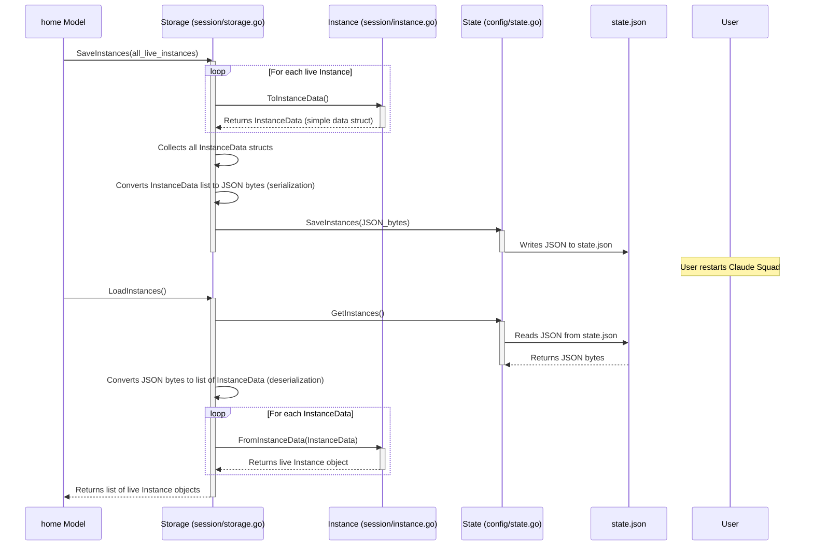

# Chapter 7: Storage

Welcome back! In [Chapter 6: Configuration and State](06_configuration_and_state_.md), we explored how Claude Squad uses `Config` to remember your application-wide preferences and `State` to keep track of dynamic information like which help screens you've seen. Most importantly, `State` is where the raw data about your [Instances](02_instance_.md) lives.

Now, let's zoom in on the **`Storage`** system. It's the dedicated librarian, responsible for carefully packaging your live [Instance](02_instance_.md) objects so they can be saved into the `state.json` file, and then unpackaging them back into live objects when you restart the application.

## What Problem Does `Storage` Solve?

Imagine you have a stack of beautifully crafted, intricate models on your desk. These are your active [Instances](02_instance_.md) in Claude Squad – they're alive, running, and doing complex things like managing [Git Worktrees](03_git_worktree_.md) and [Tmux Sessions](04_tmux_session_.md).

Now, what happens if you need to go home, or your computer shuts down? You can't just leave these delicate models out in the rain! You need a special way to:
1.  **Carefully preserve them:** Take all the important details of each model and write them down in a way that can be saved.
2.  **Restore them later:** Read those notes and rebuild the exact same models when you return.

This is exactly what the **`Storage`** system solves!

Your `Instance` objects (from [Chapter 2: Instance](02_instance_.md)) are complex. They aren't just simple pieces of text; they have connections to running `tmux` processes and local Git folders. You can't directly save these "live" objects to a file.

The `Storage` component acts as a translator and organizer. It knows how to:
*   **Convert** complex, "live" [Instance](02_instance_.md) objects into a simple format (like structured text, specifically JSON) that can be easily saved to disk. This is called **serialization**.
*   **Reconstruct** those simple saved formats back into fully functional, "live" [Instance](02_instance_.md) objects when the application starts up again. This is called **deserialization**.

A central use case for `Storage` is to **save and load the complete state of all your `Instances`**, ensuring that they persist even after you close Claude Squad. It's like a filing cabinet that remembers all the details of each AI assistant's "desk" so you can pick up exactly where you left off.

## How `Storage` Works (The Basics)

Let's trace the journey of an [Instance](02_instance_.md) as it's saved and then loaded.


**Explanation:**

*   **Saving (Top Part of Diagram):**
    1.  The `home` model (our application's brain) tells `Storage` to `SaveInstances()`, providing it with all the `Instance` objects currently running in memory.
    2.  `Storage` goes to each `Instance` and asks it to provide its `InstanceData`. This `InstanceData` is a simplified Go `struct` that only contains basic types (strings, numbers, booleans) that can be easily converted to JSON.
    3.  `Storage` collects all these `InstanceData` structs and uses Go's `json.Marshal()` to turn them into one big piece of JSON text (serialization).
    4.  `Storage` then hands this JSON text to the `State` manager (from [Chapter 6](06_configuration_and_state_.md)), which is responsible for actually writing it to the `state.json` file on your disk.

*   **Loading (Bottom Part of Diagram):**
    1.  When Claude Squad starts, the `home` model tells `Storage` to `LoadInstances()`.
    2.  `Storage` asks the `State` manager to `GetInstances()`.
    3.  `State` reads the JSON text from `state.json` and gives it back to `Storage`.
    4.  `Storage` `json.Unmarshal()`s this JSON text back into a list of `InstanceData` structs (deserialization).
    5.  For each `InstanceData`, `Storage` creates a new, empty [Instance](02_instance_.md) object and populates its fields using the `InstanceData`. This is where the magic happens – the `Instance` then uses its internal logic to re-connect to its [Git Worktree](03_git_worktree_.md) and [Tmux Session](04_tmux_session_.md).
    6.  Finally, `Storage` returns a list of these fully re-created, "live" `Instance` objects back to the `home` model, ready for display and interaction.

## Internal Implementation: `session/storage.go`

Let's dive into the actual code for `Storage` in `session/storage.go` and how it interacts with the `config.State` (which implements the `config.InstanceStorage` interface).

First, the `Storage` struct itself:

```go
// --- File: session/storage.go (simplified) ---
package session

import (
	"claude-squad/config" // Imports the config package for State
	"encoding/json"       // For JSON serialization/deserialization
	// ... other imports
)

// InstanceData represents the serializable data of an Instance
type InstanceData struct {
	Title     string `json:"title"`
	Path      string `json:"path"`
	Branch    string `json:"branch"`
	Status    Status `json:"status"` // Status is an integer type
	// ... other simple fields like Height, Width, CreatedAt, UpdatedAt, AutoYes
	Program string `json:"program"`
	// GitWorktreeData and DiffStatsData are also simple structs
	Worktree GitWorktreeData `json:"worktree"`
	DiffStats DiffStatsData `json:"diff_stats"`
}

// Storage handles saving and loading instances using the state interface
type Storage struct {
	// 'state' holds an object that can manage instance data (which is 'config.State')
	state config.InstanceStorage
}

// NewStorage creates a new storage instance
func NewStorage(state config.InstanceStorage) (*Storage, error) {
	// Simple constructor: just saves the provided state manager
	return &Storage{
		state: state,
	}, nil
}
```
**Explanation:**
*   `InstanceData`: This struct is designed to be a "plain data" snapshot of an [Instance](02_instance_.md). Notice how all its fields are simple types, or other simple data structs (`GitWorktreeData`, `DiffStatsData`) – no complex pointers to `tmux` sessions or Git objects here! The `json:"..."` tags tell Go how to name these fields when converting to/from JSON.
*   `Storage` struct: It contains only one field, `state`, which is of type `config.InstanceStorage`. This means the `Storage` doesn't directly know about files; it relies on something that *can* handle instances (which, in our case, is `config.State`). This is a good design choice, as it separates concerns.
*   `NewStorage`: A simple function to create a `Storage` object.

### The `SaveInstances` Method

This method is called by the `home` model to save all current instances.

```go
// --- File: session/storage.go (simplified SaveInstances) ---
func (s *Storage) SaveInstances(instances []*Instance) error {
	// 1. Convert live Instance objects to their simple InstanceData forms
	data := make([]InstanceData, 0)
	for _, instance := range instances {
		// Calling instance.ToInstanceData() which lives on the Instance object itself
		data = append(data, instance.ToInstanceData())
	}

	// 2. Marshal (serialize) the list of InstanceData into JSON bytes
	jsonData, err := json.Marshal(data)
	if err != nil {
		return fmt.Errorf("failed to marshal instances: %w", err)
	}

	// 3. Hand the JSON bytes to the underlying state manager to save it to disk
	return s.state.SaveInstances(jsonData)
}

// --- File: session/instance.go (simplified ToInstanceData method on Instance) ---
func (i *Instance) ToInstanceData() InstanceData {
	// This method collects data from the Instace's fields
	// and creates a new InstanceData struct to hold it.
	return InstanceData{
		Title:   i.Title,
		Path:    i.Path,
		Branch:  i.Branch,
		Status:  i.Status, // Status is an enum, saved as int
		Program: i.Program,
		// ... collect other simple fields ...
		Worktree: i.gitWorktree.ToGitWorktreeData(), // Calls a similar method on GitWorktree
		DiffStats: i.diffStats.ToDiffStatsData(),   // Calls a similar method on DiffStats
	}
}
```
**Explanation:**
*   `SaveInstances` iterates through a list of `*Instance` objects (`instances []*Instance`).
*   For each `instance`, it calls `instance.ToInstanceData()`. This method (part of the `Instance` struct itself) knows how to extract all the necessary information from the complex `Instance` object and put it into a flat, savable `InstanceData` struct.
*   `json.Marshal(data)`: This is Go's built-in function to convert a Go data structure (our `[]InstanceData` slice) into its JSON byte representation.
*   `s.state.SaveInstances(jsonData)`: The `Storage` then uses its `state` field (which is our `config.State` object) to save these JSON bytes. As seen in [Chapter 6](06_configuration_and_state_.md), `config.State` then writes this to `state.json`.

### The `LoadInstances` Method

This method is called by the `home` model to load all previously saved instances.

```go
// --- File: session/storage.go (simplified LoadInstances) ---
func (s *Storage) LoadInstances() ([]*Instance, error) {
	// 1. Get raw JSON data from the underlying state manager
	jsonData := s.state.GetInstances()

	// 2. Unmarshal (deserialize) JSON bytes back into a list of InstanceData structs
	var instancesData []InstanceData
	if err := json.Unmarshal(jsonData, &instancesData); err != nil {
		return nil, fmt.Errorf("failed to unmarshal instances: %w", err)
	}

	// 3. Convert each InstanceData struct back into a live Instance object
	instances := make([]*Instance, len(instancesData))
	for i, data := range instancesData {
		// Calling FromInstanceData() which is a constructor function for Instance
		instance, err := FromInstanceData(data)
		if err != nil {
			return nil, fmt.Errorf("failed to create instance %s: %w", data.Title, err)
		}
		instances[i] = instance
	}

	return instances, nil
}

// --- File: session/instance.go (simplified FromInstanceData function) ---
// FromInstanceData creates a new Instance object from its InstanceData
func FromInstanceData(data InstanceData) (*Instance, error) {
    // This is like a special constructor that rebuilds the Instance
    // from the saved data.
    instance := &Instance{
        Title: data.Title,
        Path:  data.Path,
        Branch: data.Branch,
        Status: data.Status,
        Program: data.Program,
        // ... fill other simple fields ...
    }

    // Now, critically, re-create the GitWorktree and TmuxSession objects
    // from their saved data, or re-establish connections.
    // This is conceptual; the real code would handle more details.
    instance.gitWorktree = git.NewGitWorktreeFromStorage(
        data.Worktree.RepoPath, data.Worktree.WorktreePath,
        data.Worktree.SessionName, data.Worktree.BranchName,
        data.Worktree.BaseCommitSHA)

    instance.tmuxSession = tmux.NewTmuxSessionFromSaved(data.Title, data.Program)

    return instance, nil
}
```
**Explanation:**
*   `jsonData := s.state.GetInstances()`: `Storage` asks `config.State` for the raw JSON representing the saved instances.
*   `json.Unmarshal(jsonData, &instancesData)`: This is the reverse of `json.Marshal()`. It takes the JSON bytes and converts them back into a slice of `InstanceData` structs.
*   `FromInstanceData(data)`: For each `InstanceData` struct, this function (a part of the `session` package, acting as a constructor) is called. This is extremely important: `FromInstanceData` doesn't just copy the data; it also **re-initializes** the `gitWorktree` and `tmuxSession` fields of the `Instance` object. For example, it might tell the `gitWorktree` to `Restore()` its connection to an existing Git worktree on disk, or tell `tmuxSession` to re-attach to a previously running `tmux` session.

By using these `ToInstanceData()` and `FromInstanceData()` methods, coupled with a generic `InstanceStorage` interface, the `Storage` system provides a clean, robust way to save and load the complex state of Claude Squad's `Instances`.

## Conclusion

In this chapter, we unpacked the concept of **`Storage`** in Claude Squad. We learned that `Storage` acts as the vital bridge between complex, "live" [Instance](02_instance_.md) objects in memory and their simplified, savable JSON representation on disk (`state.json`). Through processes like serialization (`ToInstanceData` + `json.Marshal`) and deserialization (`json.Unmarshal` + `FromInstanceData`), `Storage` ensures that your AI assistant sessions can be completely preserved and restored, allowing you to pick up exactly where you left off.

Next, we'll look at the **`Daemon`**, a background process that can supervise your instances even when the main Claude Squad UI isn't running.

[Next Chapter: Daemon](08_daemon_.md)

---

Generated by [AI Codebase Knowledge Builder](https://github.com/The-Pocket/Tutorial-Codebase-Knowledge)