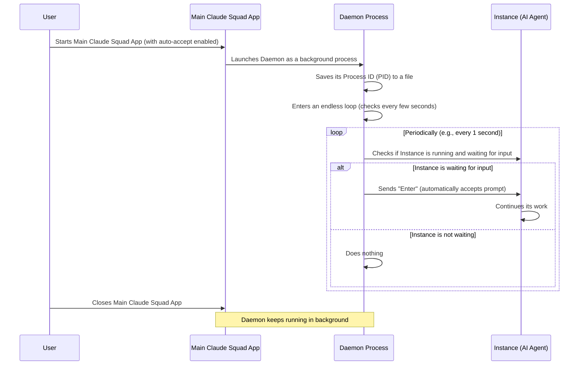

# Chapter 8: Daemon

Welcome back! In [Chapter 7: Storage](07_storage_.md), we learned how Claude Squad carefully saves the state of your AI assistant sessions so you can pick up exactly where you left off. But what if you want your AI agents to keep working even when you're not actively watching them or interacting with the main Claude Squad application?

This is where the **`Daemon`** comes in!

## What Problem Does `Daemon` Solve?

Imagine you're supervising a team of very focused AI assistants. They're diligently working on coding tasks. Sometimes, they finish a step and politely wait for your input (like pressing "Enter" to continue, or "y" to confirm a change). If you're away from your computer, they'll just sit there, waiting.

This is the problem the `Daemon` solves!

The `Daemon` is like a tireless, invisible helper that runs in the background. Its job is to quietly check on your active AI instances and, if they're waiting for your input, it automatically "taps Enter" for them. This means your AIs can keep working even if you close the main Claude Squad UI or step away from your terminal.

A central use case for the `Daemon` is to enable an **"auto-accept" mode** for your AI agents. This is super useful for long-running tasks or when you trust the AI to proceed without constant human intervention.

## How `Daemon` Works (The Basics)

The `Daemon` is actually a separate, small program that Claude Squad can launch. It sits in your computer's background and periodically checks the status of your AI instances.

Here's a simplified look at what the `Daemon` does:



1.  **Launch `Daemon`:** When you start the main Claude Squad application (and have the `auto-accept` feature turned on), the application "tells" a separate `Daemon` program to start running in the background.
2.  **Detached Process:** This `Daemon` process is "detached" from the main application. This means even if you close the main Claude Squad window, the `Daemon` keeps running on its own.
3.  **PID File:** The `Daemon` saves its own unique ID (called a "Process ID" or PID) into a small file. This PID file acts like a little note, so Claude Squad can find and stop the `Daemon` later if needed.
4.  **Polling Loop:** The `Daemon` then enters a continuous loop. Every short while (e.g., every 1 second), it "polls" (checks) all your active AI instances.
5.  **Auto-Accept:** If an instance is running and has prompted for input (like showing a "Press Enter to continue" message), the `Daemon` automatically sends an "Enter" keypress to that instance. This frees the AI to continue its work.
6.  **Persistence:** Your AIs continue working in the background, supervised by the `Daemon`, even if the main UI is closed.

### Simplified Code: Launching the `Daemon`

This happens in `main.go` when you start Claude Squad with `auto-accept` enabled `--autoyes`.

```go
// --- File: main.go (simplified) ---
// ... inside main `RunE` function ...

if autoYes { // Check if auto-accept is enabled
    defer func() { // This runs *after* the main app finishes
        if err := daemon.LaunchDaemon(); err != nil {
            log.ErrorLog.Printf("failed to launch daemon: %v", err)
        }
    }()
}

// Kill any daemon that's running (ensures only one is active)
if err := daemon.StopDaemon(); err != nil {
    log.ErrorLog.Printf("failed to stop daemon: %v", err)
}

return app.Run(ctx, program, autoYes) // Start the main UI
```
**Explanation:**

*   `if autoYes`: This checks if the `auto-accept` feature is turned on (either in your [Config](06_configuration_and_state_.md) or by using the `--autoyes` flag).
*   `defer func() { ... }()`: A `defer` statement means this code will run *just before* the `RunE` function exits. So, the `Daemon` is launched only after the main Claude Squad UI is completely set up and ready.
*   `daemon.LaunchDaemon()`: This is the important call that starts the `Daemon` as a separate background process.
*   `daemon.StopDaemon()`: This is called first to ensure that if a `Daemon` was already running from a previous session, it gets stopped. We only ever want one `Daemon` running at a time.

## Internal Implementation: `daemon/daemon.go`

The `daemon` package is specifically designed for handling this background process.

### 1. `LaunchDaemon()`: Starting the Background Process

Let's look at how `LaunchDaemon` actually starts the `Daemon` as a completely separate process.

```go
// --- File: daemon/daemon.go (simplified) ---
import (
	"os"
	"os/exec" // Used for running external programs
	"path/filepath"
)

// LaunchDaemon launches the daemon process.
func LaunchDaemon() error {
	// Find the location of the Claude Squad program itself
	execPath, err := os.Executable()
	if err != nil {
		return fmt.Errorf("failed to get executable path: %w", err)
	}

	// Prepare the command to run: "claude-squad --daemon"
	cmd := exec.Command(execPath, "--daemon")

	// Crucial: Detach the process.
	// This means the new daemon process won't try to inherit the old app's terminal.
	cmd.Stdin = nil  // No input from the old app
	cmd.Stdout = nil // No output to the old app's screen
	cmd.Stderr = nil // No error messages to the old app's screen

	// Platform-specific settings for proper detachment
	cmd.SysProcAttr = getSysProcAttr() // This is different for Windows/Unix

	// Start the command!
	if err := cmd.Start(); err != nil {
		return fmt.Errorf("failed to start child process: %w", err)
	}

	// Save PID to a file for later management (like stopping it)
	pidDir, err := config.GetConfigDir() // Get the special config folder
	pidFile := filepath.Join(pidDir, "daemon.pid") // Path to the PID file
	os.WriteFile(pidFile, []byte(fmt.Sprintf("%d", cmd.Process.Pid)), 0644) // Write PID to file

	return nil
}
```
**Explanation:**

*   `os.Executable()`: This finds the path to the `claude-squad` program itself.
*   `exec.Command(execPath, "--daemon")`: It creates a new command that runs `claude-squad` again, but this time with a special `--daemon` flag. This flag tells the *new* `claude-squad` process that it should run in daemon mode, not as the main UI.
*   `cmd.Stdin = nil`, `cmd.Stdout = nil`, `cmd.Stderr = nil`: These lines prevent the daemon from sharing its input/output with the main Claude Squad UI. It makes it truly independent.
*   `cmd.SysProcAttr = getSysProcAttr()`: This part handles the tricky business of completely detaching a process, which behaves differently on Windows (`daemon_windows.go`) and Unix-like systems (`daemon_unix.go`). For example, on Unix, it creates a new "session" (not a [Tmux Session](04_tmux_session_.md), but an operating system session) so that the daemon is not tied to the original terminal.
*   `cmd.Start()`: This is what actually launches the new `claude-squad` process in the background.
*   `os.WriteFile(pidFile, ...)`: After successfully starting, the `Daemon` writes its Process ID (`cmd.Process.Pid`) to a file called `daemon.pid` inside the `.claude-squad` configuration directory. This allows `StopDaemon()` to find and kill it later.

### 2. `RunDaemon()`: The Daemon's Main Loop

This function is what the `Daemon` process (the one launched with `--daemon`) actually executes.

```go
// --- File: daemon/daemon.go (simplified) ---
import (
	"claude-squad/config"
	"claude-squad/session"
	"time"
)

// RunDaemon runs the daemon process which periodically checks sessions.
func RunDaemon(cfg *config.Config) error {
	// First, load all instances that were saved to disk
	state := config.LoadState()
	storage, err := session.NewStorage(state)
	instances, err := storage.LoadInstances() // Get all live Instance objects

	// Enable AutoYes for all these instances (because we're in daemon mode)
	for _, instance := range instances {
		instance.AutoYes = true // Force auto-accept for all
	}

	// How often to check for prompts (from config.json)
	pollInterval := time.Duration(cfg.DaemonPollInterval) * time.Millisecond

	// This is the infinite loop where the daemon does its work
	ticker := time.NewTicker(pollInterval) // Timer that "ticks" every `pollInterval`
	for range ticker.C { // Loop forever, triggered by the ticker
		for _, instance := range instances {
			// Check if the instance is running and not paused
			if instance.Started() && !instance.Paused() {
				// HasUpdated() checks if the AI is waiting for input
				if _, hasPrompt := instance.HasUpdated(); hasPrompt {
					instance.TapEnter() // Automatically send "Enter"
					// Also update diff stats (changes in code) for display
					instance.UpdateDiffStats()
				}
			}
		}
		// Code here to handle stopping the daemon (not shown for simplicity)
	}
	return nil
}
```
**Explanation:**

*   `storage.LoadInstances()`: The `Daemon` needs to know about all your AI sessions. It uses the [Storage](07_storage_.md) system to load all `*Instance` objects that were previously saved.
*   `instance.AutoYes = true`: Even if an instance was not "auto-yes" before, the `Daemon` forces it to be in `AutoYes` mode so it always taps Enter.
*   `pollInterval`: This value (e.g., 1000 milliseconds = 1 second) comes from your [Config](06_configuration_and_state_.md). It controls how often the `Daemon` checks on instances.
*   `for range ticker.C { ... }`: This is the heart of the daemon. It's an infinite loop. `ticker.C` provides a signal every `pollInterval`, causing the code inside the loop to run.
*   `instance.Started() && !instance.Paused()`: The `Daemon` only interacts with instances that are currently active and not deliberately paused by you.
*   `instance.HasUpdated()`: This method of the `Instance` (which internally checks the [Tmux Session](04_tmux_session_.md) for certain patterns in the AI's output) determines if the AI is waiting for input.
*   `instance.TapEnter()`: If a prompt is detected, this method (again, part of the `Instance` object) sends an "Enter" keypress to the AI's [Tmux Session](04_tmux_session_.md), allowing it to continue.
*   `instance.UpdateDiffStats()`: After the AI advances, the `Daemon` also asks the instance to update its code changes (diff stats).

### 3. `StopDaemon()`: Ending the Background Process

You saw `StopDaemon()` being called in `main.go`. This is how Claude Squad cleans up the `Daemon` process.

```go
// --- File: daemon/daemon.go (simplified) ---
import (
	"os"
	"path/filepath"
	"syscall" // For sending signals to processes
)

// StopDaemon attempts to stop a running daemon process.
func StopDaemon() error {
	// Find the PID file
	pidDir, err := config.GetConfigDir()
	pidFile := filepath.Join(pidDir, "daemon.pid")

	// Read the PID from the file
	data, err := os.ReadFile(pidFile)
	if err != nil {
		if os.IsNotExist(err) {
			return nil // No PID file, so no daemon is running, no error
		}
		return fmt.Errorf("failed to read PID file: %w", err)
	}

	var pid int
	fmt.Sscanf(string(data), "%d", &pid) // Parse PID from file

	// Find the process by its PID
	proc, err := os.FindProcess(pid)
	if err != nil {
		return fmt.Errorf("failed to find daemon process with PID %d: %w", pid, err)
	}

	// Send a termination signal to the process (cleaner than force-kill)
	if err := proc.Signal(syscall.SIGTERM); err != nil { // SIGTERM is a polite request to stop
		return fmt.Errorf("failed to send SIGTERM to daemon process %d: %w", pid, err)
	}

	// Clean up the PID file
	os.Remove(pidFile)

	return nil
}
```
**Explanation:**

*   `os.ReadFile(pidFile)`: Reads the PID from the `daemon.pid` file.
*   `os.FindProcess(pid)`: Finds the running process associated with that PID.
*   `proc.Signal(syscall.SIGTERM)`: This is the preferred way to stop a background process. `SIGTERM` is like a polite request to the process to shut down gracefully. The `RunDaemon` function has code (not shown in simplified version) that listens for this signal and cleans up before exiting. If the daemon doesn't respond to `SIGTERM` within a certain timeout, a more forceful `SIGKILL` might be used (though not implemented in this simplified code).
*   `os.Remove(pidFile)`: Once the `Daemon` is stopped, its PID file is removed to indicate it's no longer running.

## Conclusion

In this chapter, we explored the concept of the **`Daemon`** in Claude Squad. We learned that it's a critical background process that enables an "auto-accept" mode, allowing your AI agents to continue working without constant manual intervention, even when the main UI is closed. We saw how the `Daemon` is launched as a detached process, polls instances for prompts, and automatically taps "Enter" to keep tasks moving forward. It ensures your AI assistants are truly persistent helpers.

This concludes our initial dive into the core concepts of Claude Squad! You now have a foundational understanding of how the application is structured, how it manages AI instances, and how it persists your work.

**No next chapter!** You've reached the end of this introductory tutorial series.


---

Generated by [AI Codebase Knowledge Builder](https://github.com/The-Pocket/Tutorial-Codebase-Knowledge)