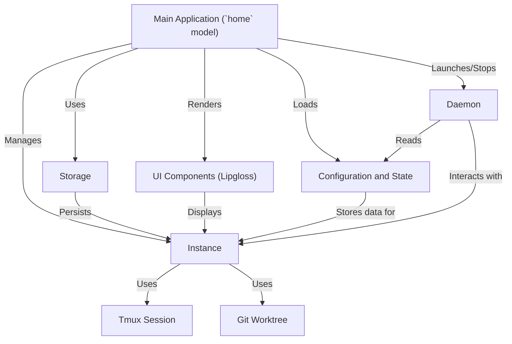

# Tutorial: claude-squad

**Claude Squad** is a terminal application that helps you manage *multiple AI agents* (like Claude Code or Aider) working on Your Git projects. It provides a dedicated *workspace and a virtual terminal* for each AI, ensuring they can work on separate tasks without interference. You can easily view their progress, interact with them, and save their ongoing work for later, even allowing some to *auto-accept* prompts in the background.

**Source Repository:** [https://github.com/smtg-ai/claude-squad.git](https://github.com/smtg-ai/claude-squad.git)

## Chapters

1. [Main Application (`home` model)
](01_main_application___home__model__.md)
2. [Instance
](02_instance_.md)
3. [Git Worktree
](03_git_worktree_.md)
4. [Tmux Session
](04_tmux_session_.md)
5. [UI Components (Lipgloss)
](05_ui_components__lipgloss__.md)
6. [Configuration and State
](06_configuration_and_state_.md)
7. [Storage
](07_storage_.md)
8. [Daemon
](08_daemon_.md)

---

Generated by [AI Codebase Knowledge Builder](https://github.com/The-Pocket/Tutorial-Codebase-Knowledge)