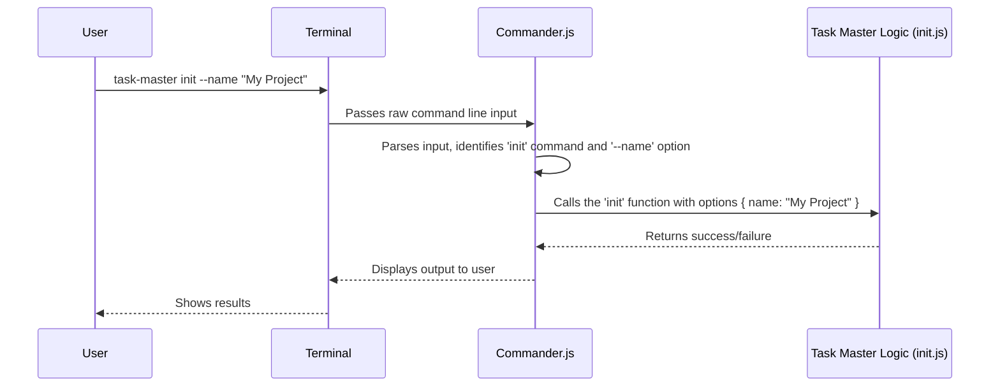

# Chapter 1: CLI Commands (Commander.js)

Welcome to the first chapter of our Task Master journey! Have you ever used programs on your computer that you control by typing commands into a terminal, like `git commit` or `npm install`? These are called "Command Line Interface" (CLI) programs. Task Master is one such program!

### What's This Chapter About?

This chapter is all about how you, the user, "talk" to Task Master. Think of it like the steering wheel and dashboard of a car. You use them to tell the car what to do (like go forward, turn, or stop). Similarly, CLI commands allow you to give instructions to Task Master, like "start a new project" or "show me my tasks."

The tool that helps Task Master understand your commands is called **Commander.js**. It's like the car's computer that translates your steering wheel movements into actions.

### Why Do We Need CLI Commands?

Imagine you have a big project with many tasks. How would you tell Task Master to organize them, create new ones, or see what's next? You could click buttons in a complicated graphical app, but for many developers, typing simple commands is faster, more efficient, and can even be automated!

CLI commands provide a clear, consistent way to interact with Task Master. Each command tells Task Master to perform a specific job.

#### Our First Mission: Starting a New Project

Let's imagine our goal is to start a brand new Task Master project. This is a common first step when you begin using the system. In Task Master, you'd do this by running a command like:

```bash
task-master init
```

This simple command tells Task Master: "Hey, I want to `init`ialize a new project!"

### Understanding the Basics of CLI Commands

Let's break down how a CLI command works, using `task-master init` as our example.

A typical CLI command has a few parts:

1.  **The Program Name**: This is the main name of the tool you want to use.
    In our case, it's `task-master`.

2.  **The Command**: This is the specific action you want the program to perform.
    For starting a project, it's `init`.

3.  **Options (or Flags)**: These are extra pieces of information you can give the command to customize its behavior. Think of them as checkboxes or settings. They usually start with one or two hyphens (e.g., `-y` or `--yes`).

Let's look at `init` with some options:

```bash
task-master init --name "My Awesome Project" --author "Your Name" -y
```

Here:
*   `--name "My Awesome Project"`: This option sets the name of your new project.
*   `--author "Your Name"`: This option sets the author of the project.
*   `-y` (or `--yes`): This option is a shortcut to tell Task Master to answer "yes" to any standard setup questions, skipping interactive prompts.

When you run this, Task Master will create a new project folder, set up some basic files, and configure it with the name "My Awesome Project" and "Your Name" as the author, without asking you any questions.

### How it Works "Under the Hood": Commander.js

So, how does Task Master know what to do when you type `task-master init`? That's where **Commander.js** comes in.

Commander.js is a "library" (a collection of pre-written code) that helps developers easily create CLI tools. It handles all the complex work of:
*   Reading what you type in the terminal.
*   Figuring out which command you're trying to run (`init`, `list`, etc.).
*   Extracting any options you provide (`--name`, `--author`, `-y`).
*   Then, it calls the right part of the Task Master code to actually perform the action.

Let's trace what happens when you type `task-master init --name "My Project"`:



The `index.js` file is the entry point for Task Master, meaning it's the very first part of the code that runs when you type `task-master`. Inside `index.js`, Commander.js is used to define these commands.

Let's look at a simplified version of the code that defines the `init` command:

```javascript
// --- Simplified from index.js ---
import { Command } from 'commander'; // This brings in the Commander.js library

const program = new Command(); // Create a new program instance

program
    .command('init') // Define a command named 'init'
    .description('Initialize a new project') // A short description for help messages
    .option('-n, --name <n>', 'Project name') // Define the --name option
    .option('-y, --yes', 'Skip prompts') // Define the --yes option
    .action(async (cmdOptions) => {
        // This is the function that runs when 'init' is called
        // cmdOptions will contain values from the options (e.g., cmdOptions.name)
        
        // ... (inside the action)
        const init = await import('./scripts/init.js'); // Load the init script
        await init.initializeProject(cmdOptions); // Call the main init function
        console.log("Project initialized!"); // Simple feedback
    });

program.parse(process.argv); // Tell Commander.js to process the command line arguments
```

**Explanation of the code:**

*   `import { Command } from 'commander';`: This line brings in the Commander.js library so we can use its features.
*   `const program = new Command();`: We create a new `Command` object which will be our main CLI program.
*   `.command('init')`: This is how we tell Commander.js that we want a command called `init`.
*   `.description(...)`: This adds a helpful description that appears when you run `task-master --help`.
*   `.option('-n, --name <n>', 'Project name')`: This defines an option.
    *   `-n` is a short alias (like `-y` for `--yes`).
    *   `--name` is the full option name.
    *   `<n>` means this option expects a value (like "My Project").
*   `.action(async (cmdOptions) => { ... });`: This is the most important part! It defines *what happens* when the `init` command is executed. The `cmdOptions` variable will automatically contain all the options you provided (e.g., `cmdOptions.name` will be "My Project").
*   `await import('./scripts/init.js');`: This line loads another file (`scripts/init.js`) that contains the actual logic for initializing a project. We use `await import` because it's a modern way to load modules when they are needed.
*   `await init.initializeProject(cmdOptions);`: This calls the core function that does the work of setting up your project, passing along the options like the project name.
*   `program.parse(process.argv);`: This line is crucial! It tells Commander.js to take the arguments from your command line (`process.argv` contains everything you typed) and figure out which command and options you used.

So, when a user types `task-master init`, Commander.js does all the initial parsing and then hands over control to the `initializeProject` function inside `scripts/init.js`. The actual project creation logic lives there, which is a good example of modularity – breaking down big programs into smaller, manageable pieces (a concept we'll explore more in later chapters like [Tasks Data Management](02_tasks_data_management_.md)).

### Other CLI Commands in Task Master

Task Master isn't just about `init`! It has many other commands to help you manage your tasks. For instance, to see your tasks, you might use:

```bash
task-master list
```

This command simply `list`s out your current tasks.

And to find out what task to work on next, you'd use:

```bash
task-master next
```

These commands also follow the same pattern: Commander.js captures the command and then calls the relevant internal function to execute the action. You can see how these are defined in `index.js` and `scripts/dev.js` that also use Commander.js.

### Conclusion

In this chapter, we've learned that **CLI Commands** are how you interact with Task Master. These commands, often combined with **options**, tell the program what to do. The **Commander.js** library acts as the translator, parsing your input and directing it to the correct internal functions within Task Master. This allows for a flexible and powerful way to manage your AI development tasks.

Now that you understand how to "talk" to Task Master, let's move on to what it stores and how it manages your actual tasks.

[Next Chapter: Tasks Data Management](02_tasks_data_management_.md)

---

Generated by [AI Codebase Knowledge Builder](https://github.com/The-Pocket/Tutorial-Codebase-Knowledge)