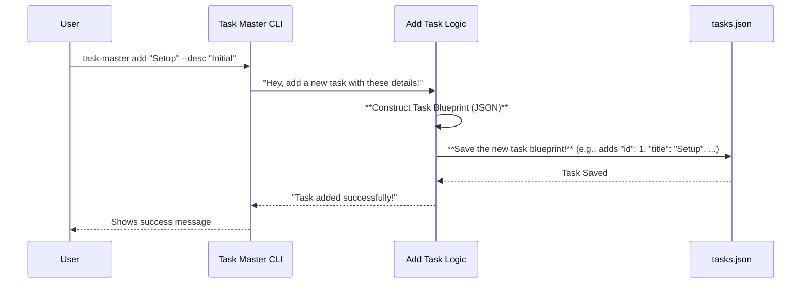

# Chapter 2: Tasks Data Management

Welcome back, future Task Master! In [Chapter 1: CLI Commands (Commander.js)](01_cli_commands__commander_js__.md), we learned how to "talk" to Task Master using commands like `task-master init` and `task-master list`. Think of those commands as giving instructions to a chef: "Make a salad," "Bake a cake."

But what exactly is the chef working with? What's *in* the salad or the cake? That's what this chapter is all about! We're going to dive into how Task Master understands and stores your tasks.

### What's This Chapter About?

This chapter focuses on **Tasks Data Management**. Imagine you're building a house. You don't just start hammering nails! You need a blueprint. This blueprint shows exactly what the house needs: how many rooms, where the doors go, what materials to use, and so on.

In Task Master, our "blueprint" is how we structure individual tasks. It's the "master plan" that defines the format for every single task, making sure they all look the same and have the same important information. This is super important because Task Master needs to consistently add, update, list, and understand your tasks.

#### Our First Mission: Understanding a Single Task

Let's imagine you have a task like "Set up the project." How would Task Master store all the important details about this task?

It wouldn't just be the title. You'd probably want to know:
*   Is it done? (Status)
*   What does it involve? (Description)
*   Are there other things I need to do first? (Dependencies)
*   Are there smaller steps within this task? (Subtasks)

Task Master needs a clear, consistent way to represent all these details.

### The "Blueprint" of a Task: What Does It Look Like?

In Task Master, each task is like a little container of information, organized in a specific way. It's stored as a special kind of text called **JSON** (JavaScript Object Notation), which is a common way for computers to store and exchange data.

Think of JSON like a list of ingredients and their amounts for a recipe.

Here’s a simplified example of how a single task might look in Task Master's data:

```json
{
  "id": 1,
  "title": "Set up project initialization",
  "description": "Create the basic project structure and necessary configuration files.",
  "status": "pending",
  "dependencies": [],
  "priority": "high",
  "subtasks": []
}
```

Let's break down this "blueprint" for a task:

*   **`"id": 1`**: This is a unique number for the task. It's like a task's social security number – no two are the same!
*   **`"title": "Set up project initialization"`**: A short, clear name for the task.
*   **`"description": "Create the basic project structure..."`**: More details about what the task involves.
*   **`"status": "pending"`**: What's the current state of the task? Is it `pending` (waiting), `in-progress`, `done`, `blocked`?
*   **`"dependencies": []`**: A list of *other task IDs* that need to be finished before this task can start. Here, it's an empty list, meaning no dependencies.
*   **`"priority": "high"`**: How important is this task? Maybe `high`, `medium`, or `low`.
*   **`"subtasks": []`**: Sometimes, a big task needs to be broken down into smaller steps. This is a list of those smaller tasks, called subtasks.

All these pieces of information, like `id`, `title`, and `status`, are called **properties** of the task. They give Task Master a clear, consistent way to know everything important about each task.

### How Task Master Uses This Blueprint

When you use commands like `task-master add` or `task-master update`, Task Master is always working with this task blueprint.

Let's re-visit adding a task from [Chapter 1: CLI Commands (Commander.js)](01_cli_commands__commander_js__.md). When you type something like:

```bash
task-master add "Set up the project" --description "Initial setup for Task Master" --priority high
```

This command doesn't just store the text "Set up the project." Instead, Task Master takes your input and *creates* a beautiful JSON object following our blueprint.



As you can see, the `AddTaskLogic` is where our "blueprint" comes to life. It takes your simple command-line inputs and transforms them into a structured JSON task.

### A Peek Under the Hood: How `add-task.js` Works

The `addTask` function, found in `scripts/modules/task-manager/add-task.js`, is responsible for taking your human-friendly command and turning it into machine-friendly JSON.

Let's look at a very simplified part of how `addTask` works:

```javascript
// Simplified from scripts/modules/task-manager/add-task.js

// This part defines what an AI-generated task *should* look like
const AiTaskDataSchema = z.object({
	title: z.string(),
	description: z.string(),
	details: z.string(),
	testStrategy: z.string(),
	dependencies: z.array(z.number()).optional()
});

async function addTask(tasksPath, prompt, dependencies = [], priority = null, context = {}) {
    // ... many lines of code for AI interaction ...

    // Imagine the AI returns an object like this from the prompt:
    const aiGeneratedData = {
        title: "Implement user authentication",
        description: "Allow users to log in/out securely.",
        details: "Use OAuth2, store hashed passwords.",
        testStrategy: "Unit and integration tests for login/logout.",
        dependencies: [1] // Depends on task ID 1
    };

    // This creates the final task, combining AI data with other inputs
    const newTask = {
        id: newTaskId, // Task Master figures out the next ID
        title: aiGeneratedData.title,
        description: aiGeneratedData.description,
        status: "pending", // New tasks start as pending
        dependencies: dependencies.length > 0 ? dependencies : aiGeneratedData.dependencies,
        priority: effectivePriority,
        details: aiGeneratedData.details,
        testStrategy: aiGeneratedData.testStrategy,
        subtasks: [] // New tasks have no subtasks initially
    };

    // Load existing tasks from tasks.json
    const data = readJSON(tasksPath);
    data.tasks.push(newTask); // Add the new task to the list
    writeJSON(tasksPath, data); // Save the updated list back to disk
}
```

**Explanation of the code:**

1.  **`AiTaskDataSchema`**: This is a `Zod` schema (we'll learn about Zod more in later chapters like [Configuration Management](04_configuration_management_.md)). For now, just know it's like a strict checker that makes sure the data we get, especially from the AI, *matches our blueprint*. It ensures `title` is a string, `dependencies` is an array of numbers, and so on. This is crucial for maintaining data integrity.
2.  **`aiGeneratedData`**: This represents the information about the task that the AI (`generateObjectService` from [AI Service Unification](05_ai_service_unification_.md)) might come up with based on your prompt.
3.  **`newTask` object creation**: Here, Task Master builds the actual `newTask` object. It combines the smart suggestions from the AI (like `title`, `description`, `details`) with properties that Task Master itself manages (like `id`, `status`). It also makes sure to include any `dependencies` or `priority` you specified in the command. This `newTask` now perfectly matches our task blueprint!
4.  **`readJSON` and `writeJSON`**: These are helper functions (from [Utility Functions](06_utility_functions_.md)) that read the existing `tasks.json` file (which holds *all* your projects' tasks) and then save the updated list back after adding the new task.

This process ensures that no matter how you create a task, it always fits the defined structure, making it easy for Task Master to work with.

### Impact on Other Operations

This consistent "blueprint" isn't just for adding tasks. It's used everywhere!

*   **`task-master list`**: When you run `list` (from `scripts/modules/task-manager/list-tasks.js`), Task Master reads all these JSON task objects from `tasks.json`. Because they all have `id`, `title`, and `status`, it knows exactly how to format them nicely for you in a table.

    ```javascript
    // Simplified from scripts/modules/task-manager/list-tasks.js
    function listTasks(tasksPath, statusFilter) {
        const data = readJSON(tasksPath); // Read all tasks
        if (!data || !data.tasks) {
            console.log("No tasks found!");
            return;
        }

        // Loop through each task and display its properties
        data.tasks.forEach(task => {
            console.log(`#${task.id} ${task.title} [${task.status}]`);
            // ... more complex display logic ...
        });
    }
    ```
    This function expects each `task` to have an `id`, `title`, and `status` because it's guaranteed by our blueprint!

*   **`task-master update-task`**: When you update a task (e.g., change its status from `pending` to `in-progress` using `scripts/modules/task-manager/update-task-by-id.js` or `scripts/modules/task-manager/update-tasks.js`), Task Master again reads the task, modifies the specific property (`status`), and then saves the updated JSON back to the file. It also uses AI to suggest updates to `description` and `details` based on your new context, always fitting it back into the same schema.

    ```javascript
    // Simplified from scripts/modules/task-manager/update-task-by-id.js
    async function updateTaskById(taskId, prompt) {
        const data = readJSON(tasksPath);
        const taskIndex = data.tasks.findIndex(t => t.id === taskId);
        if (taskIndex === -1) {
            throw new Error(`Task with ID ${taskId} not found.`);
        }

        const taskToUpdate = data.tasks[taskIndex];

        // AI might modify some fields
        const aiServiceResponse = await generateTextService(/* ... */);
        const updatedTaskFromAI = parseUpdatedTaskFromText(aiServiceResponse.mainResult, taskId);

        // Crucially, merge AI's updates while preserving what's important
        taskToUpdate.title = updatedTaskFromAI.title || taskToUpdate.title;
        taskToUpdate.description = updatedTaskFromAI.description || taskToUpdate.description;
        // ... and other fields ...

        // Save the modified task back
        data.tasks[taskIndex] = taskToUpdate;
        writeJSON(tasksPath, data);
    }
    ```
    Notice how `updateTaskById` specifically finds the task by its `id`, then updates specific properties within that task's object. It knows what properties to expect and how to update them because of our structured blueprint.

### Conclusion

In this chapter, we explored the "blueprint" of tasks in Task Master, understanding how each task is structured using JSON. This consistent data model ensures that every operation, from adding to listing to updating, works smoothly and reliably. By adhering to this structure, Task Master can effectively manage all your project requirements, making it a robust and dependable tool for AI development.

Now that we know how tasks are structured, let's look at how Task Master integrates with the Model Control Protocol (MCP) to interact with AI models and data more deeply.

[Next Chapter: MCP (Model Control Protocol) Integration](03_mcp__model_control_protocol__integration.md)

---

Generated by [AI Codebase Knowledge Builder](https://github.com/The-Pocket/Tutorial-Codebase-Knowledge)