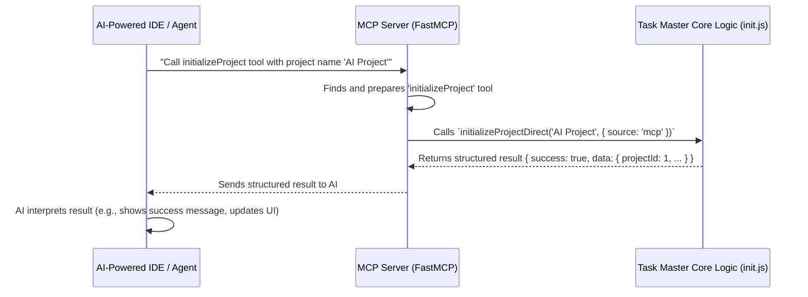

# Chapter 3: MCP (Model Control Protocol) Integration

Welcome back! In [Chapter 1: CLI Commands (Commander.js)](01_cli_commands__commander_js__.md), we learned how to "talk" to Task Master using commands, and in [Chapter 2: Tasks Data Management](02_tasks_data_management_.md), we explored how Task Master organizes and stores your tasks.

Now, imagine this: You're using an advanced AI-powered code editor (like Cursor) to help you build software. Instead of you always typing `task-master init` or `task-master list` directly in the terminal, wouldn't it be amazing if your AI assistant could *understand* what Task Master does and call its functions directly?

That's exactly what **MCP (Model Control Protocol) Integration** is all about!

### What's This Chapter About?

This chapter introduces the idea of turning Task Master's abilities into "tools" that an AI can use. Think of it like this:

*   **Task Master CLI**: You, the human, are directly driving a car using the steering wheel (CLI commands).
*   **Task Master with MCP**: The car now has "self-driving" features. You tell the car, "Go to the supermarket," and the car's AI figures out how to use its internal systems (steering, brakes, acceleration) to get there.

The `claude-task-master` project uses **FastMCP**, a library that helps create these "self-driving" capabilities for our Task Master. It makes Task Master’s functions callable by AI models or AI-powered IDEs.

### Why Do We Need MCP Integration?

The goal is to make Task Master more accessible and powerful, especially when working with AI. Instead of manually typing commands to see your tasks, start new projects, or analyze complexity, an AI can simply "call" Task Master's functions. This opens up possibilities for:

*   **Smarter AI Assistants**: Your AI can directly interact with your task management system.
*   **Automated Workflows**: AI can automate task creation, updating, or analysis based on your project context.
*   **Integrated Development Environments**: AI-powered IDEs can offer Task Master features seamlessly within your coding environment.

#### Our First Mission: AI Initializing a Project

Let's imagine you're in an AI-powered IDE. Instead of you typing `task-master init`, you just tell your AI: "Hey AI, can you set up a new project for me called 'My AI Project'?" The AI then uses Task Master's MCP integration to call the `initializeProject` function.

### How Does It Work? The Core Idea

The core idea behind MCP integration is to wrap our existing Task Master functions (like `listTasks`, `addTask`, `initializeProject`) in a way that AI models can understand and execute. This means:

1.  **Standardized Function Calls**: AI needs a consistent way to know what functions are available and what inputs they need.
2.  **Structured Outputs**: AI needs structured data back from Task Master, not just plain text for parsing.

This is achieved by making each core Task Master function adaptable to be called from either the CLI (human user) or from the MCP server (AI agent).



### Making Functions Accessible to AI: The `source` Parameter

Task Master's internal functions are designed to handle both CLI and MCP requests using a special `options` object with a `source` parameter.

Let's look at a simplified example of how this works for initializing a project:

```javascript
// Simplified from scripts/modules/initialize.js
import displayBanner from '../../utils/display-banner.js'; // For CLI view

export async function initializeProject(options = {}) {
    // 1. Check if the call is from MCP or CLI
    if (options.source !== 'mcp') {
        // Only display banner for CLI users
        displayBanner();
        console.log("Initializing your new project via CLI...");
    }

    // 2. Core Logic (shared between CLI and MCP)
    // This is where the actual project setup happens
    const projectId = await setupProjectFiles(options.name); 

    // 3. Return / Display based on source
    if (options.source === 'mcp') {
        // Return structured data for AI
        return { success: true, projectId: projectId, message: "Project initialized successfully!" };
    } else {
        // Display user-friendly message for CLI
        console.log(`Project '${options.name}' initialized with ID ${projectId}!`);
        return {}; // CLI typically doesn't return value
    }
}
```

**Explanation of the code:**

*   **`options.source !== 'mcp'`**: This is the magic check! If the function is called from the CLI, `options.source` will be `undefined` or something other than `'mcp'`. In this case, we show user-friendly messages and banners.
*   **`setupProjectFiles(options.name)`**: This is the actual work of creating the project files. This code is *shared* whether you're using CLI or MCP. This keeps our code efficient and avoids duplication (a concept called DRY: Don't Repeat Yourself).
*   **`options.source === 'mcp'`**: If the function was called by the MCP server (meaning an AI agent), we return a neat, structured JavaScript object (which gets converted to JSON by FastMCP). This is easy for AI to understand. Otherwise, we just print messages to the terminal.

This `initializeProject` function is then registered with the FastMCP server as an available "tool."

### Making MCP Functions Available for AI

The `FastMCP` server, found in `mcp-server/src/index.js`, acts as the central hub. It listens for requests from AI agents and exposes Task Master's capabilities as tools.

Here's how it generally sets up the tools:

```javascript
// Simplified from mcp-server/src/index.js
import { FastMCP } from 'fastmcp';
import { registerTaskMasterTools } from './tools/index.js'; // Imports all our tools

class TaskMasterMCPServer {
    constructor() {
        this.server = new FastMCP({ name: 'Task Master MCP Server' });
    }

    async init() {
        // This line registers all Task Master functions as available tools
        registerTaskMasterTools(this.server); 
        this.initialized = true;
    }

    async start() {
        if (!this.initialized) await this.init();
        await this.server.start({ transportType: 'stdio' }); // Starts listening
    }
}

export default TaskMasterMCPServer;
```

**Explanation of the code:**

*   **`import { FastMCP } from 'fastmcp';`**: This brings in the FastMCP library.
*   **`this.server = new FastMCP(...)`**: We create an instance of the FastMCP server.
*   **`registerTaskMasterTools(this.server)`**: This is a crucial step! It calls a function that goes through Task Master's core operations (like `initializeProject`, `listTasks`, `addTask`) and tells the `FastMCP` server about them. Each operation is defined as a "tool" with:
    *   A unique `name` (e.g., `initializeProject`).
    *   A `description` (what it does).
    *   `parameters` (what inputs it needs, like a project name, using `zod` for strictness).
    *   An `execute` function (how to run the actual Task Master logic).

### Defining a Tool: Example for `initializeProject`

In `mcp-server/src/tools/initialize-project.js`, the `initializeProject` tool is formally defined for MCP:

```javascript
// Simplified from mcp-server/src/tools/initialize-project.js
import { z } from 'zod'; // For defining strict parameters
import { executeTaskMasterCommand, createContentResponse, createErrorResponse } from './utils.js';

export function registerInitializeProjectTool(server) {
    server.addTool({
        name: 'initializeProject', // The name AI agents will use
        description: 'Initializes a new Task Master project.',
        parameters: z.object({ // What parameters this tool accepts
            projectName: z.string().describe('The name of the new project.'),
            projectRoot: z.string().describe('Root directory of the project.')
        }),
        execute: async (args, { log }) => {
            try {
                // This calls the underlying CLI command, but internally it uses the 'mcp' source
                const result = await executeTaskMasterCommand(
                    'init', // The CLI command equivalent for internal call
                    log,
                    [`--name=${args.projectName}`], // Pass project name as a CLI option
                    args.projectRoot // Pass project root
                );

                if (!result.success) {
                    throw new Error(result.error);
                }

                return createContentResponse(`Project "${args.projectName}" initialized successfully in ${args.projectRoot}.`);
            } catch (error) {
                log.error(`Error initializing project: ${error.message}`);
                return createErrorResponse(`Error initializing project: ${error.message}`);
            }
        }
    });
}
```

**Explanation of the code:**

*   **`server.addTool({...})`**: This registers a new tool with the `FastMCP` server.
*   **`name: 'initializeProject'`**: This is the name the AI agent will use to call this specific function.
*   **`parameters: z.object({...})`**: This block uses `Zod` (we'll learn more about Zod in [Chapter 4: Configuration Management](04_configuration_management_.md)) to define the inputs. It strictly says that `initializeProject` needs a `projectName` (which must be a string) and a `projectRoot`. This is very important for AI, so it knows what information to provide.
*   **`execute: async (args, { log }) => { ... }`**: This is the heart of the tool. When AI calls `initializeProject`, this function runs.
    *   **`executeTaskMasterCommand('init', ...)`**: This helper function wraps the call to Task Master's underlying core logic. Critically, it *sends* the `source: 'mcp'` flag to the core function internally, so it knows to return structured data rather than print to the console.
    *   **`createContentResponse` / `createErrorResponse`**: These functions format the output back to the AI in a standardized way (success or error, with details).

This setup allows an AI agent to see 'initializeProject' as a callable tool, understand its inputs, and receive structured results back.

### Conclusion

In this chapter, we've explored **MCP (Model Control Protocol) Integration**. We learned how Task Master transforms its internal functions into "tools" that can be called by AI models or AI-powered IDEs. The key concepts covered include using a special `source` parameter to differentiate between CLI and MCP calls, and how `FastMCP` is used to formally define and expose these tools to AI agents. This abstraction is crucial for Task Master to become a truly "self-driving" task management system, capable of seamless integration with advanced AI environments.

Now that we understand how Task Master exposes its features, let's dive into how it manages and stores its configuration settings.

[Next Chapter: Configuration Management](04_configuration_management_.md)

---

Generated by [AI Codebase Knowledge Builder](https://github.com/The-Pocket/Tutorial-Codebase-Knowledge)