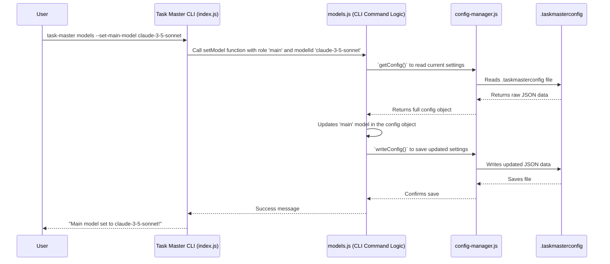

# Chapter 4: Configuration Management

Welcome back, future Task Master! In [Chapter 1: CLI Commands (Commander.js)](01_cli_commands__commander_js__.md), we learned how to "talk" to Task Master. In [Chapter 2: Tasks Data Management](02_tasks_data_management_.md), we explored how Task Master organizes your tasks using a special "blueprint." And in [Chapter 3: MCP (Model Control Protocol) Integration](03_mcp__model_control_protocol__integration.md), we saw how Task Master makes its functions available to AI.

Now, imagine this: Task Master is like a highly customizable robot assistant. It can talk to different AI models (like Claude or GPT), use different settings (like how creative or "hot" the AI is), and even know if your project has a special name. How does this robot remember all these preferences?

That's where **Configuration Management** comes in!

### What's This Chapter About?

This chapter is all about Task Master's "settings menu." Just like your phone has a settings app where you can change the ringtone, wallpaper, or Wi-Fi, Task Master has a system for managing all its important settings. These settings tell Task Master:

*   Which AI model to use (e.g., Claude 3.7, GPT-4o)?
*   How "creative" or "focused" the AI should be (temperature setting)?
*   How much text the AI should generate (max tokens)?
*   What's the name of your project?
*   What level of messages should it show (logging level)?

This system makes sure Task Master behaves exactly how you want it to, and correctly connects to the AI services you prefer.

#### Our First Mission: Setting up Our AI Models

Our concrete goal in this chapter is to understand how Task Master knows which AI models to use. For example, how does it know to use "claude-3-7-sonnet" as the main model for tasks, and "sonar-pro" for research?

### The "Settings File": `.taskmasterconfig`

Task Master stores most of its settings in a special file named `.taskmasterconfig`. This file lives at the root of your project. Think of it like a sticky note on your project folder, reminding Task Master of all its preferences.

Here's what a simplified `.taskmasterconfig` file might look like:

```json
{
  "models": {
    "main": {
      "provider": "anthropic",
      "modelId": "claude-3-7-sonnet-20250219",
      "temperature": 0.2
    },
    "research": {
      "provider": "perplexity",
      "modelId": "sonar-pro",
      "maxTokens": 8700
    }
  },
  "global": {
    "projectName": "My Awesome AI Project",
    "logLevel": "info"
  }
}
```

This JSON file (remember JSON from [Chapter 2: Tasks Data Management](02_tasks_data_management_.md)?) is Task Master's brain for remembering settings.

*   `"models"`: This section defines which AI models Task Master uses for different jobs (`main` for general tasks, `research` for research-heavy tasks).
*   `"global"`: This section holds general settings like the project name and how much information Task Master should print (logging level).

### How to Change Settings: Using the CLI

You *could* open the `.taskmasterconfig` file and edit it directly, but Task Master also provides a helpful CLI command to manage your models.

To set up your models initially, or change them later, you'd use a command like:

```bash
task-master models --setup
```

This command will guide you through choosing your main, research, and fallback AI models.

To specifically change a model, like your main AI model:

```bash
task-master models --set-main-model claude-3-5-sonnet
```
Or for the research model:
```bash
task-master models --set-research-model sonar-mini --openrouter
```
The `--openrouter` flag is a hint for Taskmaster to look for `sonar-mini` via the `openrouter` provider.

### How it Works "Under the Hood": `config-manager.js`

When you run `task-master models --set-main-model ...`, Task Master needs to:

1.  **Find** the `.taskmasterconfig` file.
2.  **Read** the current settings from it.
3.  **Update** the specific setting (like the `main` model).
4.  **Save** the updated settings back to the file.
5.  **Validate** that the settings make sense (e.g., is "claude-3-5-sonnet" a real model?).

The `scripts/modules/config-manager.js` file is like the librarian for Task Master's settings. It knows how to find, read, write, and validate the `.taskmasterconfig` file.

Let's trace how Task Master gets its configuration:



### Diving into the Code: `config-manager.js`

Let's look at simplified parts of `config-manager.js` to see how it loads and saves settings.

#### 1. Loading Configuration (`getConfig`)

The `getConfig` function is responsible for reading the `.taskmasterconfig` file.

```javascript
// Simplified from scripts/modules/config-manager.js
import fs from 'fs';
import path from 'path';

const CONFIG_FILE_NAME = '.taskmasterconfig';
const DEFAULTS = { /* ... default settings ... */ };

let loadedConfig = null; // Cache to avoid re-reading file often

function _loadAndValidateConfig(explicitRoot = null) {
    let rootToUse = explicitRoot || findProjectRoot(); // Find project root if not given
    if (!rootToUse) return DEFAULTS; // If no root found, use defaults

    const configPath = path.join(rootToUse, CONFIG_FILE_NAME);
    let config = { ...DEFAULTS }; // Start with defaults

    if (fs.existsSync(configPath)) {
        try {
            const rawData = fs.readFileSync(configPath, 'utf-8');
            const parsedConfig = JSON.parse(rawData);

            // Deep merge parsed config onto defaults
            config = {
                models: { ...DEFAULTS.models, ...parsedConfig?.models },
                global: { ...DEFAULTS.global, ...parsedConfig?.global }
            };
            // ... (validation of models/providers happens here) ...
        } catch (error) {
            console.error(`Error reading config: ${error.message}. Using defaults.`);
        }
    }
    return config;
}

function getConfig(explicitRoot = null) {
    if (loadedConfig && !explicitRoot) { // Return cached config if it exists
        return loadedConfig;
    }
    const config = _loadAndValidateConfig(explicitRoot);
    if (!explicitRoot) { // Cache if not an explicit (temporary) root
        loadedConfig = config;
    }
    return config;
}
```
**Explanation:**
*   `CONFIG_FILE_NAME` and `DEFAULTS`: These store the name of the config file and the default settings Task Master should use if no file is found or settings are missing.
*   `_loadAndValidateConfig`: This is the real core logic. It figures out where your project root is (`findProjectRoot()`), constructs the full path to `.taskmasterconfig`, reads it, and merges its contents with the `DEFAULTS`. It also includes important validation steps (not fully shown here) to ensure the settings are valid.
*   `getConfig`: This is the main function exposed to others. It first checks if the config has already been loaded (`loadedConfig`). If so, it returns the cached version to save time. Otherwise, it calls `_loadAndValidateConfig` to do the actual work.

#### 2. Writing Configuration (`writeConfig`)

When you change a setting, Task Master needs to save it back to the file.

```javascript
// Simplified from scripts/modules/config-manager.js
// ... (imports and other functions as above) ...

function writeConfig(config, explicitRoot = null) {
    let rootPath = explicitRoot || findProjectRoot(); // Determine project root
    if (!rootPath) {
        console.error('Error: Could not determine project root. Config not saved.');
        return false;
    }

    const configPath = path.join(rootPath, CONFIG_FILE_NAME);
    try {
        fs.writeFileSync(configPath, JSON.stringify(config, null, 2)); // Write to file
        loadedConfig = config; // Update the cache
        return true;
    } catch (error) {
        console.error(`Error writing config: ${error.message}`);
        return false;
    }
}
```

**Explanation:**
*   `writeConfig`: This function takes the *entire* configuration object (which has been updated in memory) and writes it back to the `.taskmasterconfig` file.
    *   `JSON.stringify(config, null, 2)`: This converts the JavaScript object back into a nicely formatted JSON string. `null, 2` means it will add a 2-space indentation for readability.
*   `loadedConfig = config;`: After successfully writing, the `loadedConfig` cache is updated so that future `getConfig` calls get the very latest settings.

### Combining with Model Management (`models.js`)

The `scripts/modules/task-manager/models.js` file uses these `config-manager` functions to provide the `models` CLI commands.

For example, the `setModel` function logic (when you run `task-master models --set-main-model ...`) would look something like this:

```javascript
// Simplified from scripts/modules/task-manager/models.js
import { getConfig, writeConfig, MODEL_MAP } from '../config-manager.js';

async function setModel(role, modelId, providerHint, projectRoot) {
    try {
        // 1. Get the current configuration
        const currentConfig = getConfig(projectRoot);

        // 2. Determine the provider and validate the modelId
        //    (This part involves checking MODEL_MAP, possibly fetching from OpenRouter/Ollama)
        let determinedProvider = 'unknown';
        // ... complex logic to validate modelId and figure out its provider ...
        // For example, if modelId is "claude-3-5-sonnet", it knows provider is "anthropic".
        // If it's a custom OpenRouter/Ollama model, it might use providerHint and fetch.

        // 3. Update the config in memory
        currentConfig.models[role] = {
            ...currentConfig.models[role], // Keep existing params like maxTokens/temperature
            provider: determinedProvider,
            modelId: modelId
        };

        // 4. Save the updated configuration to the file
        const writeResult = writeConfig(currentConfig, projectRoot);
        if (!writeResult) {
            throw new Error('Error writing updated configuration.');
        }

        return { success: true, message: `Set ${role} model to ${modelId}` };
    } catch (error) {
        return { success: false, error: error.message };
    }
}
```

**Explanation:**
*   `getConfig(projectRoot)`: This fetches the current settings.
*   `currentConfig.models[role] = { ... }`: This line is where the magic happens! It updates *only* the specific model (identified by `role` like 'main' or 'research') within the `currentConfig` object. It uses the `...` (spread operator) to keep any other settings for that model (like `maxTokens` or `temperature`) that weren't changed.
*   `writeConfig(currentConfig, projectRoot)`: Finally, the *entire* (but now updated) configuration object is saved back to the `.taskmasterconfig` file.

### Environment Variables for Sensitive Data

While `.taskmasterconfig` holds most settings, for very sensitive information like **API keys**, Task Master uses **environment variables**. This is a common best practice in software development because you don't want to accidentally commit your secret keys into version control (like Git)!

Think of environment variables as secret notes you give your robot assistant, that aren't written down in the primary settings file.

For example, your Anthropic API key should be set as: `ANTHROPIC_API_KEY`.

How Task Master knows about them:

*   **For CLI**: You can put these in a `.env` file in your project root, and tools like `dotenv` (which Task Master might use internally) will load them.
*   **For MCP/Cursor**: If you're using Task Master with an AI IDE like Cursor, you'd put these API keys in the `env` section of your MCP configuration file (e.g., `.cursor/mcp.json`).

The `config-manager.js` file also has functions like `isApiKeySet` that check if these environment variables are available. These functions *do not store* the key; they only check if it exists.

```javascript
// Simplified from scripts/modules/config-manager.js
import { resolveEnvVariable } from './utils.js'; // Helper to get env vars

function isApiKeySet(provider) {
    const envVarName = getProviderEnvVarName(provider); // e.g., "ANTHROPIC_API_KEY"
    const apiKey = resolveEnvVariable(envVarName); // Tries to get the env var
    return typeof apiKey === 'string' && apiKey.length > 0;
}

// Example usage to check if Anthropic API key is set
const hasAnthropicKey = isApiKeySet('anthropic');
if (!hasAnthropicKey) {
    console.warn("Anthropic API key is not set! Models may not work.");
}
```

This way, configuration is split: general settings go in the file, and sensitive secrets go in environment variables.

### Conclusion

In this chapter, we explored **Configuration Management** in Task Master. We learned that Task Master uses a special `.taskmasterconfig` file at your project's root to store most of its settings, like chosen AI models and project details. We also saw how the `task-master models` CLI commands allow you to easily manage these settings. Under the hood, the `config-manager.js` file is the central piece that handles reading, writing, and validating this configuration, while sensitive API keys are kept separate in environment variables for security. This robust system ensures Task Master behaves exactly as you intend, connecting seamlessly with various AI services.

Now that we understand how Task Master manages its own settings, let's look at how it brings together different AI services from various providers to work as one unified system.

[Next Chapter: AI Service Unification](05_ai_service_unification_.md)

---

Generated by [AI Codebase Knowledge Builder](https://github.com/The-Pocket/Tutorial-Codebase-Knowledge)