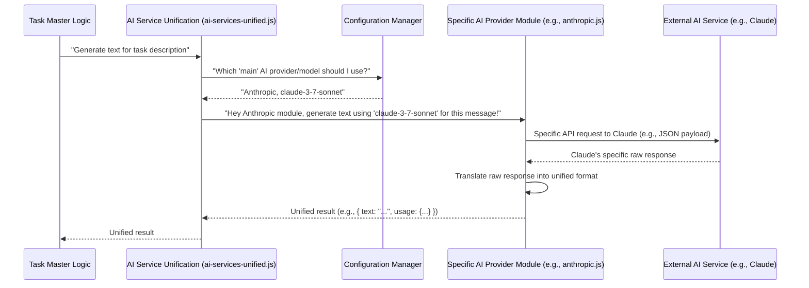

# Chapter 5: AI Service Unification

Welcome back, future Task Master! In [Chapter 1: CLI Commands (Commander.js)](01_cli_commands__commander_js__.md), we learned how to "talk" to Task Master. In [Chapter 2: Tasks Data Management](02_tasks_data_management_.md), we explored how Task Master organizes your tasks. [Chapter 3: MCP (Model Control Protocol) Integration](03_mcp__model_control_protocol__integration.md) showed us how AI can control Task Master. And in [Chapter 4: Configuration Management](04_configuration_management_.md), we saw how Task Master remembers its settings, like which AI models to use.

Now, imagine this: You're a chef, and you have a recipe that calls for "flour." But what kind of flour? All-purpose, bread, pastry, almond? They all do slightly different things but are still "flour."

Similarly, Task Master needs to talk to many different "flours" – different AI models like Claude, GPT, Gemini, Perplexity, or even local ones like Ollama. Each of these AI models has its own "diet" and "language." Some prefer JSON, others prefer YAML; some want a `temperature` setting, others use `top_p`.

### What's This Chapter About?

This chapter is all about **AI Service Unification**. This is like Task Master's "universal translator." It allows Task Master to speak one consistent "language" when asking an AI to do something, and then it handles all the complicated "dialects" and "customs" for communicating with each specific AI provider. This makes integrating new AI capabilities surprisingly easy!

#### Our First Mission: Asking AI for a Task Description

Let's imagine Task Master needs a detailed description for a new task. It just wants to say, "Hey AI, give me a description for 'Set up project environment'."

Instead of thinking, "Okay, if it's Claude, I need to use `createAnthropicText` with `messages` in this format, and then if it's GPT, I use `generateOpenAIText` with a different message format...", Task Master simply says, "Give me text!" and the `ai-services-unified.js` module handles the rest.

### The Problem: AI Models are Like Different Hotels

Imagine you're traveling the world. Each hotel has its own way of checking in:
*   Hotel A: Fill out a paper form, give ID.
*   Hotel B: Use a QR code on an app.
*   Hotel C: Talk to a robot.

If you had to learn a new way for every single hotel, travel would be a nightmare!

AI models are similar. They all generate text or objects, but their specific ways of communicating (API calls, parameters, response formats) are different.

### The Solution: A Universal Front Desk

The AI Service Unification layer (`ai-services-unified.js`) acts as Task Master's universal front desk. Task Master tells the front desk what it needs ("I need text generated by the main AI model"), and the front desk then knows how to talk to the specific hotel (AI provider) selected in your configuration.



### Key Concepts

**1. Standardized Functions:**
Instead of having many different functions for `generateClaudeText`, `generateGPTText`, etc., Task Master only needs to call three main functions, no matter which AI is behind the scenes:
*   `generateTextService`: Ask the AI for plain text.
*   `streamTextService`: Ask the AI for text piece-by-piece, like watching someone type.
*   `generateObjectService`: Ask the AI to generate structured data (like a JSON object) based on a schema.

**2. Provider Modules:**
Each AI provider (Anthropic, Perplexity, OpenAI, Ollama, etc.) has its own dedicated file (e.g., `src/ai-providers/anthropic.js`). These files contain the specific code needed to talk to that *particular* AI. They know how to translate Task Master's unified requests into the AI's "dialect" and translate the AI's response back into Task Master's unified format.

**3. Configuration Integration:**
The `config-manager.js` (from [Chapter 4: Configuration Management](04_configuration_management_.md)) tells the AI Service Unification layer which AI provider and model to use for different roles (e.g., `main`, `research`, `fallback`).

### How to Use It: Generating a Task Description

Let's see how Task Master asks the AI to generate a task description using the unified service.

Imagine a simplified version of `add-task.js` (from [Chapter 2: Tasks Data Management](02_tasks_data_management_.md)) that needs to ask the AI for a description:

```javascript
// Simplified example of how generateTextService is used
import { generateTextService } from '../../scripts/modules/ai-services-unified.js';

async function generateDescription(topic) {
    const prompt = `Generate a concise description for a task about: ${topic}`;
    const result = await generateTextService({
        role: 'main', // Use the 'main' configured AI model
        prompt: prompt,
        commandName: 'addTask' // For logging/telemetry
    });
    return result.text;
}

// Example call:
const description = await generateDescription('Refactor authentication module');
console.log("AI-generated description:", description);
// Output: "AI-generated description: Optimize and restructure the user authentication system for improved security and maintainability."
```
**Explanation:**
*   `import { generateTextService } from ...`: We import the `generateTextService` function from our universal front desk.
*   `role: 'main'`: This tells the `generateTextService` to use the AI model configured as the 'main' one in your `.taskmasterconfig` file.
*   `prompt: prompt`: This is the actual question we are asking the AI.
*   `commandName: 'addTask'`: This is just for internal tracking and logging.

Notice that nowhere in `generateDescription` do we mention "Claude," "GPT," or "Perplexity." The `generateTextService` handles all of that!

### Under the Hood: `ai-services-unified.js`

Let's look at the core of `ai-services-unified.js`. It has a central function, `_unifiedServiceRunner`, that figures out which provider's specific function to call.

```javascript
// Simplified from scripts/modules/ai-services-unified.js
import { getMainProvider, getMainModelId } from './config-manager.js';
import * as anthropic from '../../src/ai-providers/anthropic.js';
import * as perplexity from '../../src/ai-providers/perplexity.js';

// This maps provider names to their specific functions
const PROVIDER_FUNCTIONS = {
    anthropic: {
        generateText: anthropic.generateAnthropicText,
        streamText: anthropic.streamAnthropicText,
        generateObject: anthropic.generateAnthropicObject
    },
    perplexity: {
        generateText: perplexity.generatePerplexityText,
        streamText: perplexity.streamPerplexityText,
        generateObject: perplexity.generatePerplexityObject
    }
    // ... other providers like openai, openrouter, ollama
};

async function _unifiedServiceRunner(serviceType, params) {
    const { role, prompt, schema, commandName, session, projectRoot } = params;

    // 1. Get the configured provider and model based on the 'role'
    const providerName = getMainProvider(session, projectRoot); // Example for 'main' role
    const modelId = getMainModelId(session, projectRoot);

    // 2. Check if the provider functions exist
    const providerFuncs = PROVIDER_FUNCTIONS[providerName];
    if (!providerFuncs || !providerFuncs[serviceType]) {
        throw new Error(`Service ${serviceType} not supported for provider ${providerName}.`);
    }

    // 3. Resolve API key (from config-manager or environment variables)
    const apiKey = "YOUR_API_KEY_HERE"; // Simplified: Actual logic in config-manager
    const baseUrl = "YOUR_BASE_URL_HERE"; // Simplified: Actual logic in config-manager

    // 4. Prepare parameters for the specific provider's function
    const commonParams = { apiKey, modelId, messages: [{ role: 'user', content: prompt }] };
    let specificParams = commonParams;
    if (serviceType === 'generateObject') {
        specificParams = { ...commonParams, schema: schema, objectName: "my_object" };
    }

    // 5. Call the specific provider's function
    const result = await providerFuncs[serviceType](specificParams);
    
    // 6. Log usage for telemetry (covered in Chapter 6)
    // await logAiUsage({...});

    return result;
}

// The exposed generateTextService function uses _unifiedServiceRunner
async function generateTextService(params) {
    return _unifiedServiceRunner('generateText', params);
}

export { generateTextService /* and others */ };
```

**Explanation of the code:**

*   **`PROVIDER_FUNCTIONS`**: This is a lookup table. It maps human-readable provider names (like `anthropic` or `perplexity`) to the actual functions (`generateAnthropicText`, `generatePerplexityText`) that know how to talk to those specific AI services.
*   **`_unifiedServiceRunner(serviceType, params)`**: This is the central director.
    *   It first asks the `config-manager` (our librarian from [Chapter 4: Configuration Management](04_configuration_management_.md)) which provider and model you want to use (`getMainProvider`, `getMainModelId`).
    *   Then, it looks up the correct specific provider function in `PROVIDER_FUNCTIONS` based on the `providerName` and the `serviceType` (e.g., `generateText`).
    *   It resolves the necessary API keys and base URLs.
    *   Finally, it calls that specific provider's function, passing all the necessary parameters.

### Under the Hood: Specific Provider Modules (e.g., `src/ai-providers/anthropic.js`)

Each provider module (like `anthropic.js`, `perplexity.js`, `ollama.js`) implements the actual calls to its respective AI. They are designed to take a standardized set of parameters (like `apiKey`, `modelId`, `messages`) and return a standardized result (`text` and `usage` for text generation).

Let's look at `src/ai-providers/anthropic.js`:

```javascript
// Simplified from src/ai-providers/anthropic.js
import { createAnthropic } from '@ai-sdk/anthropic'; // From Vercel AI SDK
import { generateText } from 'ai'; // From Vercel AI SDK also

function getClient(apiKey, baseUrl) {
    return createAnthropic({ apiKey: apiKey, baseURL: baseUrl });
}

export async function generateAnthropicText({ apiKey, modelId, messages, maxTokens, temperature, baseUrl }) {
    const client = getClient(apiKey, baseUrl); // Get authenticated client
    const result = await generateText({
        model: client(modelId), // Use the specific model
        messages: messages,
        maxTokens: maxTokens,
        temperature: temperature
    });
    // This is the crucial part: Translate the result to the unified format
    return {
        text: result.text,
        usage: {
            inputTokens: result.usage.promptTokens,
            outputTokens: result.usage.completionTokens
        }
    };
}

// export similar functions for streamAnthropicText, generateAnthropicObject
```

**Explanation:**
*   `createAnthropic` and `generateText`: These come from a helpful external library called Vercel AI SDK (`@ai-sdk/anthropic`, `ai`). This SDK itself helps unify different AI APIs. Think of it as a sub-translator that helps our main universal translator.
*   `generateAnthropicText`: This function takes the unified parameters.
*   `model: client(modelId)`: This uses the instantiated client to tell the Vercel AI SDK which specific Claude model to use.
*   **Return Value**: The crucial part is that this function returns an object with `text` and `usage` properties. This is the **unified format** that `ai-services-unified.js` expects and uses across all providers.

This powerful setup means that if a new AI model comes out, you only need to create a new small file in `src/ai-providers/` for it and add it to the `PROVIDER_FUNCTIONS` map in `ai-services-unified.js`. The rest of Task Master doesn't need to change!

### Conclusion

In this chapter, we explored **AI Service Unification**. We learned how `ai-services-unified.js` acts as a universal translator, allowing Task Master to communicate with various AI models (like Claude, GPT, Perplexity, Ollama) using a consistent set of functions (`generateTextService`, `streamTextService`, `generateObjectService`). This is achieved by relying on specific provider modules (e.g., `anthropic.js`) that handle the unique "dialects" of each AI service. This unified approach makes Task Master highly flexible and extensible, ready to integrate with new AI technologies with minimal effort.

Now that we understand how Task Master seamlessly interacts with AI services, let's look at the smaller, reusable helpers that make this all possible.

[Next Chapter: Utility Functions](06_utility_functions_.md)

---

Generated by [AI Codebase Knowledge Builder](https://github.com/The-Pocket/Tutorial-Codebase-Knowledge)