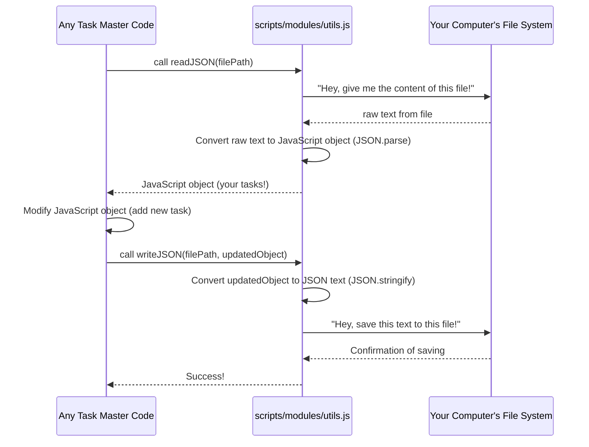

# Chapter 6: Utility Functions

Welcome back, future Task Master! In [Chapter 1: CLI Commands (Commander.js)](01_cli_commands__commander_js__.md), we learned how to "talk" to Task Master. In [Chapter 2: Tasks Data Management](02_tasks_data_management_.md), we explored how Task Master organizes your tasks. [Chapter 3: MCP (Model Control Protocol) Integration](03_mcp__model_control_protocol__integration.md) showed us how AI can control Task Master. In [Chapter 4: Configuration Management](04_configuration_management_.md), we saw how Task Master remembers its settings. And in [Chapter 5: AI Service Unification](05_ai_service_unification_.md), we learned how Task Master talks to different AI models smoothly.

Now, imagine you're building a LEGO set. You don't just have big, fancy pieces like walls and roofs. You also have lots of small, essential pieces: tiny connector bricks, round studs, or simple flat plates. These small pieces aren't the main star, but they make building much easier because you can use them over and over in different ways!

That's exactly what **Utility Functions** are in Task Master!

### What's This Chapter About?

This chapter is all about Task Master's "handyman's toolbox." This toolbox contains many small, reusable helper functions that do little but important jobs. They are like the hammer, screwdriver, or wrench that different parts of Task Master's code can borrow to get their specific jobs done efficiently without reinventing the wheel.

These utility functions help with common tasks like:
*   Reading and writing information to files (like our `tasks.json` or `.taskmasterconfig`).
*   Logging messages (printing helpful notes to your terminal).
*   Figuring out important file paths (where is my project? where is `tasks.json`?).
*   Checking if things exist or are formatted correctly.

#### Our First Mission: Reading and Writing Task Data

Our concrete goal in this chapter is to understand how Task Master reads and writes the `tasks.json` file. Remember from [Chapter 2: Tasks Data Management](02_tasks_data_management_.md) that `tasks.json` stores all your tasks. When you add a task, Task Master needs to read the current tasks, add your new one, and then save the whole list back.

### The Problem: Repeating Yourself

Imagine every time Task Master needed to read `tasks.json`, it had to write the same lines of code:
1.  Open the file.
2.  Read everything in the file.
3.  Make sure it's valid JSON.
4.  If something goes wrong, report an error.

And then to write it back:
1.  Turn the data into JSON text.
2.  Open the file.
3.  Write the text.
4.  If something goes wrong, report an error.

This would make the code very long and messy! Plus, if there's a bug in how you read/write, you would have to fix it in many places.

### The Solution: Helper Functions!

Instead, Task Master uses helper functions called `readJSON` and `writeJSON`. These functions do the file reading and writing work once, perfectly, and make it available for any part of the code that needs it.

Let's see how they are used:

```javascript
// Simplified example of how readJSON and writeJSON are used
import { readJSON, writeJSON } from '../utils.js'; // Imagine this is how we import them

// 1. Where do our tasks live?
const tasksFilePath = './tasks/tasks.json';

// --- Reading tasks ---
let allTasks = [];
try {
    const data = readJSON(tasksFilePath); // Use the helper to read the file
    if (data && Array.isArray(data.tasks)) {
        allTasks = data.tasks;
    }
} catch (error) {
    console.error("Failed to read tasks:", error.message);
}

console.log("Current tasks count:", allTasks.length);

// --- Adding a new task ---
const newTask = { id: allTasks.length + 1, title: "Learn Utility Functions", status: "pending" };
allTasks.push(newTask);

// --- Writing tasks back ---
try {
    writeJSON(tasksFilePath, { tasks: allTasks }); // Use the helper to write the file
    console.log("New task added and saved!");
} catch (error) {
    console.error("Failed to save tasks:", error.message);
}
```

**Explanation:**
*   `readJSON(tasksFilePath)`: This function takes the file path and gives you back the content of that JSON file as a JavaScript object.
*   `writeJSON(tasksFilePath, { tasks: allTasks })`: This function takes the file path and a JavaScript object, converts the object into JSON text, and saves it to the file.

Notice how simple it is in the main code! You just call `readJSON` or `writeJSON`, and you don't need to worry about the messy details of opening files, parsing, or handling errors.

### How it Works "Under the Hood": `utils.js`

Most of Task Master's general utility functions live in the `scripts/modules/utils.js` file. This file is like the handyman's toolbox containing all those reusable tools.

Let's trace what happens when you use `readJSON` or `writeJSON`:



Now let's look at the simplified code for these functions inside `scripts/modules/utils.js`.

#### 1. `readJSON` Function

```javascript
// Simplified from scripts/modules/utils.js
import fs from 'fs'; // 'fs' means File System, allows us to work with files.

function readJSON(filepath) {
    try {
        const rawData = fs.readFileSync(filepath, 'utf-8'); // Read file content as text
        return JSON.parse(rawData); // Convert the text to a JavaScript object
    } catch (error) {
        // If the file doesn't exist, is empty, or has bad JSON, it will throw an error
        console.error(`Error reading JSON file ${filepath}: ${error.message}`);
        throw error; // Re-throw the error so the calling code knows something went wrong
    }
}
```
**Explanation:**
*   `import fs from 'fs';`: This line brings in Node.js's built-in file system module, which has functions to interact with files on your computer.
*   `fs.readFileSync(filepath, 'utf-8')`: This reads the entire content of the given `filepath` as a string (`'utf-8'` ensures it reads text correctly).
*   `JSON.parse(rawData)`: This is a built-in JavaScript function that takes a string of JSON text and converts it into a JavaScript object (like the task blueprint we saw in [Chapter 2: Tasks Data Management](02_tasks_data_management_.md)).
*   `try...catch`: This block is important! If something goes wrong (like the file doesn't exist or isn't valid JSON), it "catches" the error instead of stopping the whole program. It logs the error and then `throw error` to let the part of the code that called `readJSON` know about the problem.

#### 2. `writeJSON` Function

```javascript
// Simplified from scripts/modules/utils.js
import fs from 'fs';
import path from 'path'; // 'path' helps us work with file paths correctly

function writeJSON(filepath, data) {
    try {
        // Ensure the directory exists before writing the file
        const directory = path.dirname(filepath);
        if (!fs.existsSync(directory)) {
            fs.mkdirSync(directory, { recursive: true }); // Create directory if it doesn't exist
        }

        const jsonString = JSON.stringify(data, null, 2); // Convert object to nicely formatted JSON text
        fs.writeFileSync(filepath, jsonString, 'utf-8'); // Write the text to the file
    } catch (error) {
        console.error(`Error writing JSON file ${filepath}: ${error.message}`);
        throw error;
    }
}
```
**Explanation:**
*   `import path from 'path';`: This brings in Node.js's path module, which is useful for tasks like getting the directory name from a full file path (`path.dirname`).
*   `path.dirname(filepath)`: Gets the directory part of the path (e.g., for `tasks/tasks.json` it gets `tasks/`).
*   `fs.existsSync(directory)`: Checks if the directory exists.
*   `fs.mkdirSync(directory, { recursive: true })`: If the directory doesn't exist, this creates it. `recursive: true` means it will create any missing parent folders too.
*   `JSON.stringify(data, null, 2)`: This takes a JavaScript object (`data`) and converts it into a JSON string. `null, 2` tells it to make the JSON "pretty-printed" with 2 spaces for indentation, which makes the file easy for humans to read.
*   `fs.writeFileSync(filepath, jsonString, 'utf-8')`: This writes the JSON string to the specified `filepath`.

### Other Handy Utilities in `utils.js`

Beyond `readJSON` and `writeJSON`, `scripts/modules/utils.js` contains many other small, useful functions that Task Master uses all the time:

*   **`log`**: This function is used to print messages to the console (your terminal). It's smarter than `console.log` because it respects Task Master's configured [log levels](04_configuration_management_.md) (like `debug`, `info`, `warn`, `error`) and adds pretty colors.
    ```javascript
    // Simplified log function usage
    import { log } from './utils.js';

    log('info', 'Starting project initialization...');
    log('warn', 'Some files already exist!');
    log('error', 'Failed to create directory.');
    ```
    This function lets Task Master give you clear feedback without every single part of the code needing to manage colors or log levels.

*   **`findProjectRoot`**: This function figures out where the "root" of your Task Master project is. It does this by looking for special files like `package.json`, `.git` folders, or `tasks.json` by searching upwards from your current location. This is crucial for Task Master to find your configuration and task files.
    ```javascript
    // Simplified findProjectRoot usage
    import { findProjectRoot } from './utils.js';

    const root = findProjectRoot(); // Finds the project root automatically
    console.log("Your project root is:", root);
    // Output: Your project root is: /Users/yourname/my-awesome-project
    ```
    This avoids you having to tell Task Master where your project is every time!

*   **`resolveEnvVariable`**: This helps Task Master securely get important information like API keys. It first checks for variables provided by an [MCP session](03_mcp__model_control_protocol__integration.md) (if you're using an AI IDE like Cursor), then looks in a `.env` file, and finally checks your computer's general environment variables. This is key for [Configuration Management](04_configuration_management_.md) with sensitive data.
    ```javascript
    // Simplified resolveEnvVariable usage
    import { resolveEnvVariable } from './utils.js';

    const apiKey = resolveEnvVariable('ANTHROPIC_API_KEY'); // Tries to find the key
    if (apiKey) {
        console.log("Anthropic API Key found (we won't print it though!)");
    } else {
        console.warn("Anthropic API Key not set!");
    }
    ```
    This ensures API keys are handled safely and found reliably.

These are just a few examples, but they illustrate the purpose of "utility functions": small, focused, reusable pieces of code that handle common chores, allowing the main parts of Task Master to focus on their bigger jobs.

### Conclusion

In this chapter, we explored **Utility Functions** in Task Master. We learned that these are like a handyman's toolbox, containing many small, reusable helper functions that perform common tasks. We saw how `readJSON` and `writeJSON` simplify handling data files, and how other utilities like `log`, `findProjectRoot`, and `resolveEnvVariable` provide essential services. This collection of well-organized, small tools makes Task Master's codebase cleaner, more reliable, and easier to manage and extend.

This concludes our beginner-friendly tutorial on `claude-task-master`'s core concepts! You've learned about CLI commands, task data, AI integration, configurations, AI service unification, and the essential utility functions that tie it all together. You are now equipped with a foundational understanding of how `claude-task-master` works!

---

Generated by [AI Codebase Knowledge Builder](https://github.com/The-Pocket/Tutorial-Codebase-Knowledge)