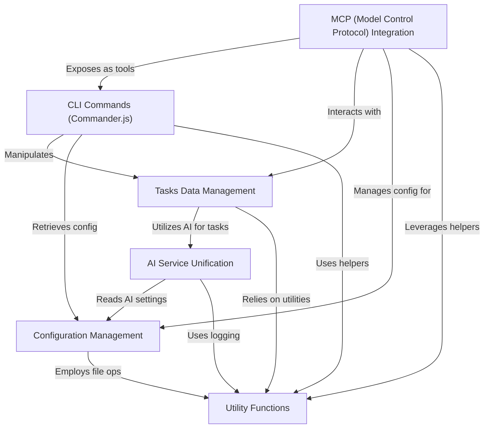

# Tutorial: claude-task-master

**Claude Task Master** is a powerful task management system designed for *AI-driven development*. It helps users **structure and manage project tasks** by allowing interaction through a *command-line interface* (CLI), integrates with *AI IDEs* using a control protocol, and unifies access to various *AI models* for intelligent task processing. All its behavior can be customized via *flexible configuration*.

**Source Repository:** [https://github.com/eyaltoledano/claude-task-master.git](https://github.com/eyaltoledano/claude-task-master.git)

## Chapters

1. [CLI Commands (Commander.js)
](01_cli_commands__commander_js__.md)
2. [Tasks Data Management
](02_tasks_data_management_.md)
3. [MCP (Model Control Protocol) Integration
](03_mcp__model_control_protocol__integration_.md)
4. [Configuration Management
](04_configuration_management_.md)
5. [AI Service Unification
](05_ai_service_unification_.md)
6. [Utility Functions
](06_utility_functions_.md)

---

Generated by [AI Codebase Knowledge Builder](https://github.com/The-Pocket/Tutorial-Codebase-Knowledge)