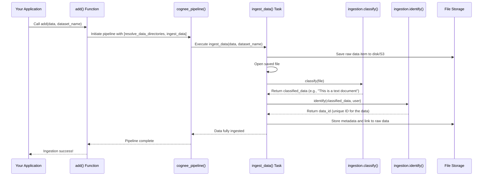

# Chapter 1: Data Ingestion and Pipelines

Imagine you have tons of information spread out everywhere – like a messy room full of books, notes, and drawings. Before you can make sense of it all, you need to clean up, organize, and perhaps put similar items together.

In the world of computers and artificial intelligence, especially with powerful systems like **cognee**, this "messy room" is raw data. This data can be anything: text documents, images, recordings, or even computer code. The first crucial step is to get this raw data *into* the system and prepare it so the system can understand and use it effectively. This entire process is called **Data Ingestion**.

Think of Data Ingestion and Pipelines as the system's "digestive tract." Just as your body takes food, breaks it down, and absorbs what it needs, cognee takes various types of raw data, processes it, and turns it into structured, understandable knowledge. This cleaned-up and organized knowledge then becomes useful for answering questions, identifying patterns, and making smart decisions.

## So, what problem does Data Ingestion solve?

Let's say you want to build a smart assistant that can answer questions about all the documents in your company's shared drive. These documents are in different formats: PDFs, Word files, spreadsheets, and emails. They are scattered and not organized for a computer to easily "read" and understand.

The problem is: **How do we take all these different raw documents and turn them into a unified, understandable format that our AI system can work with?**

This is where Data Ingestion comes in. It's the first step to turning chaos into order, making your data ready for AI magic.

## Key Concepts in Data Ingestion

To understand how cognee digests data, let's break down the process into a few simple concepts:

### Raw Data

This is your starting point – the "food" for our system. It could be:
*   A text file with customer feedback.
*   An image of a company logo.
*   A research paper in PDF format.
*   Even pieces of code for a software project.

### Classification

Just like you'd recognize if a piece of food is an apple or a carrot, cognee needs to know what *kind* of data it's dealing with. Is it text? An image? A structured table? This initial recognition helps the system decide how to process it next.

### Chunking

Imagine reading a very long book. You don't try to understand the entire book all at once. You read it page by page, or even paragraph by paragraph. Similarly, large data files need to be broken down into smaller, more manageable pieces called "chunks." This makes them easier for the AI to process and understand.

```python
# Example: Breaking a document into chunks
from cognee.modules.chunking.TextChunker import TextChunker
from cognee.modules.data.processing.document_types.Document import Document
from typing import AsyncGenerator

async def extract_chunks_from_documents(
    documents: list[Document],
    max_chunk_size: int,
    chunker=TextChunker,
) -> AsyncGenerator:
    """
    Simulated function to show chunking.
    In real code, it reads document content and breaks it.
    """
    for doc in documents:
        # Imagine 'doc.read()' breaks the document into smaller pieces
        # For simplicity, we just yield a dummy chunk
        print(f"Breaking down document: {doc.name}")
        yield f"Chunk 1 from {doc.name}"
        yield f"Chunk 2 from {doc.name}"

# This code shows how a document is broken into smaller chunks to be processed.
# The 'extract_chunks_from_documents' function takes a document and a maximum chunk size.
# It then uses a 'chunker' (like TextChunker for text) to divide the document into pieces.
# This makes it easier for the system to handle large files.
```

The `extract_chunks_from_documents` function in the real cognee system ([cognee/tasks/documents/extract_chunks_from_documents.py](cognee/tasks/documents/extract_chunks_from_documents.py)) does exactly this, often using the `TextChunker` for text-based documents.

### Cognification (Knowledge Graph Creation)

This is where the magic truly begins! After data is classified and chunked, cognee tries to understand the *meaning* of the data and how different pieces of information relate to each other. It turns your raw data into a **knowledge graph**.

Think of a knowledge graph like a sophisticated mind map. It’s a network of "nodes" (which are like concepts or entities, e.g., "Paris," "Eiffel Tower," "France") connected by "edges" (which describe the relationships between them, e.g., "Paris is located in France," "Eiffel Tower is in Paris"). This structured format makes it incredibly easy for the AI to retrieve and reason about information.

```python
# Simplified example of creating a knowledge graph
from cognee.shared.data_models import KnowledgeGraph
from pydantic import BaseModel

class SimplifiedChunk(BaseModel):
    id: str
    content: str

async def extract_graph_from_data(
    chunk: SimplifiedChunk,
    graph_model: BaseModel = KnowledgeGraph
):
    """
    Imagine this function analyzes a tiny piece of text (a chunk)
    and turns it into a small knowledge graph.
    """
    print(f"Analyzing chunk '{chunk.content}' to build a graph...")
    # In real cognee, this identifies entities and relationships.
    # For example, from "The Eiffel Tower is in Paris", it creates:
    # Node: Eiffel Tower, Node: Paris, Edge: Eiffel Tower --located_in--> Paris
    return f"Simplified graph for chunk {chunk.id}"

# This is a highly simplified view of how knowledge graphs are generated.
# The `extract_graph_from_data` function takes a processed data chunk.
# It then "cognifies" it, meaning it finds important concepts and their connections,
# turning them into a structured knowledge graph that AI can easily understand.
```

### Pipelines and Tasks

How does cognee perform all these steps (classification, chunking, cognification) in order? It uses **pipelines**. A pipeline is simply a series of ordered "tasks." Each task is a small, specific job that contributes to the overall goal of processing the data.

Imagine a factory assembly line. Each station on the line performs a specific task (e.g., attach wheels, paint the car). The car moves from one station to the next until it's a finished product. Similarly, in cognee, data moves through a pipeline, getting transformed by each task along the way.

```python
# Example of defining tasks in a pipeline
from cognee.modules.pipelines.tasks.task import Task

def task_classify(data):
    print(f"Task: Classifying {data}...")
    return f"Classified_{data}"

def task_chunk(data):
    print(f"Task: Chunking {data}...")
    return f"Chunked_{data}"

def task_extract_graph(data):
    print(f"Task: Extracting graph from {data}...")
    return f"Graph_from_{data}"

# A list of tasks forms a simple pipeline
my_ingestion_tasks = [
    Task(task_classify),
    Task(task_chunk),
    Task(task_extract_graph),
]

# This list represents the sequence of operations.
# Each `Task` wraps a function that performs a single step in the process.
# When the pipeline runs, these tasks execute in the defined order.
```

The `add` function in cognee ([cognee/api/v1/add/add.py](cognee/api/v1/add/add.py)) sets up tasks for data ingestion. The `cognify` function ([cognee/api/v1/cognify/cognify.py](cognee/api/v1/cognify/cognify.py)) sets up tasks for processing the ingested data into a knowledge graph.

## How to use Data Ingestion in cognee

Let's go back to our corporate document example. We want to add all our company documents to cognee so that our AI assistant can answer questions about them.

The primary function you'll use for data ingestion is `add`. This function takes your raw data and a `dataset_name`, which is like a folder where you want to store and organize your data.

```python
from cognee.api.v1.add import add
import asyncio

async def run_ingestion_example():
    # Imagine 'my_document.txt' is a file on your computer
    # Or it could be raw text like "Hello, cognee!"
    sample_data = "This is a contract document outlining project terms."
    dataset_name = "company_documents"

    print(f"Adding '{sample_data}' to dataset '{dataset_name}'...")
    await add(data=sample_data, dataset_name=dataset_name)
    print("Ingestion process initiated.")

# To run this, you'd typically put it in an async context:
# asyncio.run(run_ingestion_example())

# This simple call starts the entire ingestion pipeline.
# You provide the data you want to add and the name of the dataset (like a collection)
# where it should be stored. Cognee handles all the complex steps behind the scenes.
```

**What happens when you call `add()`?**

1.  **Data Received**: The `add` function gets your raw data (e.g., "This is a contract...").
2.  **Tasks Defined**: It sets up a small pipeline with tasks specifically for ingestion. Look at [cognee/api/v1/add/add.py](cognee/api/v1/add/add.py) for the tasks. The key tasks are `resolve_data_directories` and `ingest_data`.
3.  **Pipeline Run**: The `cognee_pipeline` (defined in [cognee/modules/pipelines/operations/pipeline.py](cognee/modules/pipelines/operations/pipeline.py)) then takes these tasks and your data, and starts processing!

After `add` finishes, your data is stored in the system and ready to be further processed (cognified) to create the knowledge graph. This further processing is often kicked off by the `cognify` function.

```python
from cognee.api.v1.cognify import cognify
import asyncio

async def run_cognify_example():
    dataset_name = "company_documents"

    print(f"Cognifying data in dataset '{dataset_name}'...")
    await cognify(datasets=dataset_name)
    print("Cognification process initiated.")

# To run this:
# asyncio.run(run_cognify_example())

# After adding data, this step processes it to extract knowledge.
# It doesn't take raw data directly, but rather processes data already in a dataset.
# This stage breaks data into chunks, extracts entities, and builds the knowledge graph.
```

## Under the Hood: How Data Ingestion Works

Let's trace what happens when you call `add(data=sample_data, dataset_name=dataset_name)`.



1.  **`user` calls `add(...)`**: This is your starting point in your Python script. ([cognee/api/v1/add/add.py](cognee/api/v1/add/add.py))
2.  **Pipeline Setup**: The `add` function defines a minimal set of `tasks` for ingestion: `resolve_data_directories` and `ingest_data`. It then passes these, along with your `data` and `dataset_name`, to the core `cognee_pipeline`.
    ```python
    # From cognee/api/v1/add/add.py
    # This is how tasks are defined for the add operation
    tasks = [Task(resolve_data_directories), Task(ingest_data, dataset_name, user, node_set)]

    await cognee_pipeline(
        tasks=tasks, datasets=dataset_name, data=data, user=user, pipeline_name="add_pipeline"
    )
    ```
3.  **`cognee_pipeline` execution**: This central function ([cognee/modules/pipelines/operations/pipeline.py](cognee/modules/pipelines/operations/pipeline.py)) orchestrates the running of tasks. It manages datasets, user permissions, and ensures all necessary database connections are ready. For incoming data, it checks if it needs to process new information.
    ```python
    # From cognee/modules/pipelines/operations/pipeline.py
    # Simplified view of pipeline execution. It iterates through tasks.
    async def cognee_pipeline(tasks: list[Task], data=None, datasets=None, user=None, ...):
        # ... setup relational and vector databases ...
        # ... get user info and datasets ...

        # The actual work of running tasks is delegated
        pipeline_run = run_tasks(tasks, dataset_id, data, user, pipeline_name)
        async for run_status in pipeline_run:
            # Each task's output feeds into the next, if applicable
            pass # Monitor status
    ```
4.  **`ingest_data` Task**: This is the heavy lifter for ingestion ([cognee/tasks/ingestion/ingest_data.py](cognee/tasks/ingestion/ingest_data.py)).
    *   **Save to Storage**: It first saves your raw `data` to a designated storage location (like a local file or an S3 bucket). This ensures the original data is preserved.
        ```python
        # Simplified from cognee/tasks/ingestion/ingest_data.py
        # Saves the raw data item (e.g., your document) to storage.
        file_path = await save_data_item_to_storage(data_item, dataset_name)
        ```
    *   **Classification**: Once saved, it `classify`s the data. This means identifying its type (e.g., PDF, plain text, image).
        ```python
        # Simplified from cognee/tasks/ingestion/ingest_data.py
        # It opens the saved file and uses a 'classify' module to determine its type.
        with open_data_file(file_path) as file:
            classified_data = ingestion.classify(file)
        ```
    *   **Identification**: A unique ID (`data_id`) is generated for the data. This ID is super important for tracking the data throughout the system.
        ```python
        # Simplified from cognee/tasks/ingestion/ingest_data.py
        # Generates a unique ID for the data based on its content and owner.
        data_id = ingestion.identify(classified_data, user)
        ```
    *   **Metadata Storage**: Finally, it stores all this crucial information (the data's name, file path, extension, MIME type, content hash, owner, external metadata, and the unique `data_id`) in a relational database. This acts like a catalog for all your ingested data. Permissions are also set here.
        ```python
        # Simplified from cognee/tasks/ingestion/ingest_data.py
        # This part saves the metadata about your data into the database.
        # It acts like a librarian, cataloging each piece of data.
        data_point = Data(
            id=data_id,
            name=file_metadata["name"],
            raw_data_location=file_metadata["file_path"],
            # ... and other metadata
            owner_id=user.id,
        )
        await session.merge(data_point)
        await session.commit()
        ```
    *   **DLT Pipeline**: `ingest_data` also uses a DLT (Data Load Tool) pipeline to ensure data about the ingested files (metadata like file_path, name, mime_type) is robustly loaded into a table, often for deduplication and consistent logging.
        ```python
        # Simplified from cognee/tasks/ingestion/ingest_data.py
        # DLT helps manage the data loading process, especially for metadata.
        pipeline = dlt.pipeline(
            pipeline_name="metadata_extraction_pipeline",
            destination=destination,
        )
        pipeline.run(
            data_resources(file_paths, user),
            table_name="file_metadata",
            dataset_name="public", # or "main" for sqlite
            write_disposition="merge", # intelligently updates existing records
        )
        ```
        This `dlt.pipeline` is configured to run a `data_resources` function which yields metadata about each file. It's often used to ensure that if you try to ingest the same file twice, it's recognized and potentially updated, rather than creating a duplicate.

And that's it! Once these steps are complete, your raw data is successfully ingested, cataloged, and ready for the next exciting stage: turning it into actionable knowledge via graph extraction, which is part of the "cognify" process.

## Conclusion

In this chapter, we've explored the foundational process of **Data Ingestion** in cognee. We learned how raw, unstructured data is taken into the system, classified, broken into manageable chunks, and its metadata is meticulously stored. We saw how **pipelines** and **tasks** are used to orchestrate this complex "digestive" process, turning raw data into an organized collection ready for deeper analysis.

This ingestion process is just the first step. Once the data is comfortably inside cognee, the real magic of converting it into a rich, interconnected **knowledge graph** begins. This structured knowledge is what makes cognee so powerful for understanding complex information.

Next, we'll dive deeper into the fundamental building block of data within cognee: the [DataPoint](02_datapoint_.md).

---

Generated by [AI Codebase Knowledge Builder](https://github.com/The-Pocket/Tutorial-Codebase-Knowledge)