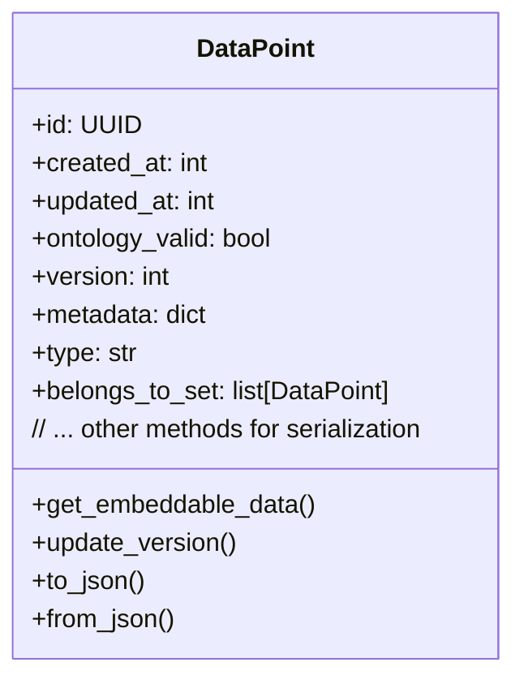

# Chapter 2: DataPoint

In the previous chapter, [Data Ingestion and Pipelines](01_data_ingestion_and_pipelines_.md), we learned how to get raw information, like documents or text, into cognee and prepare it. Think of it like taking all your ingredients (vegetables, meat, spices) and cleaning them, chopping them, and getting them ready to cook. But once they're ready, how does cognee actually *store* and *think about* each individual piece of information? That's where the **DataPoint** comes in!

Imagine you're building a massive LEGO model. Each individual LEGO brick, no matter its size or color, is a fundamental building block. You can connect them in endless ways to create complex structures. In cognee, a **DataPoint** is exactly like one of these fundamental LEGO bricks. It's the most basic unit of information that cognee understands and remembers.

## What Problem Does DataPoint Solve?

Let's say you've ingested a long document about "Project Alpha." This document contains lots of different kinds of information:
*   A meeting minute about "budget allocation."
*   The name of a specific person, "Alice Johnson."
*   A summary of the project's goals.

How does cognee store each of these distinct pieces of information independently, yet also keep track of how they relate to the original document and to each other?

The problem is: **How can cognee represent every single piece of information, regardless of its type, in a uniform way, and provide a structure for connecting these pieces?**

The DataPoint solves this by providing a universal "fact card" or "LEGO brick" for every bit of data. Whether it's a chunk of text, a person's name, a concept, or a relationship, it all becomes a DataPoint.

## Key Concepts of a DataPoint

A DataPoint is more than just a piece of data; it's a structured piece of data with built-in features to help cognee manage it.

### Universal Building Block

Every piece of information in cognee's memory — whether it's a small text snippet, the name of a person, a summary, or even a line of code — is represented as a DataPoint. This uniformity makes it easy for cognee to process and connect different types of information.

### ID (Unique Identifier)

Just like every person has a unique ID number, every DataPoint has its own unique ID. This allows cognee to easily find, reference, and link to any specific piece of information.

```python
from uuid import UUID, uuid4
from pydantic import BaseModel, Field

# This is a simplified version of DataPoint for illustration
class SimpleDataPoint(BaseModel):
    id: UUID = Field(default_factory=uuid4) # Unique ID for each DataPoint
    content: str

# Create a DataPoint
my_first_data_point = SimpleDataPoint(content="Hello world!")
print(f"DataPoint ID: {my_first_data_point.id}")

# This shows that when you create a DataPoint, it automatically gets a unique ID.
# This ID is essential for cognee to keep track of every individual piece of information.
```
In cognee, the unique ID for a DataPoint is automatically generated using `uuid4()`.

### Timestamps (`created_at`, `updated_at`)

DataPoints keep track of when they were created and when they were last changed. This is super useful for understanding the history of information and for tasks like finding the most recent version of a fact.

```python
from datetime import datetime, timezone

class SimpleDataPointWithTime(SimpleDataPoint):
    created_at: int = Field(
        default_factory=lambda: int(datetime.now(timezone.utc).timestamp() * 1000)
    )
    updated_at: int = Field(
        default_factory=lambda: int(datetime.now(timezone.utc).timestamp() * 1000)
    )

# Create a DataPoint
dp_with_time = SimpleDataPointWithTime(content="Project Falcon started.")
print(f"Created at: {datetime.fromtimestamp(dp_with_time.created_at / 1000)}")

# Imagine you update it later
dp_with_time.content = "Project Falcon is progressing well."
dp_with_time.updated_at = int(datetime.now(timezone.utc).timestamp() * 1000)
print(f"Updated at: {datetime.fromtimestamp(dp_with_time.updated_at / 1000)}")

# DataPoints automatically record when they are made and updated.
# This is crucial for keeping track of the freshness of information.
```
Timestamps are stored as milliseconds since the Unix epoch, making them easy to sort and compare.

### Metadata

Metadata is like a label on your LEGO brick. It's extra information *about* the DataPoint itself, not the content of the DataPoint. This can include its `type` (e.g., "TextSummary", "CodeFile"), and `index_fields`. `index_fields` are important because they tell cognee which parts of the DataPoint are most descriptive and should be used when searching for similar information.

```python
from typing import Optional, Dict

class SimpleDataPointWithMetadata(SimpleDataPointWithTime):
    type: str = Field(default_factory=lambda: "SimpleDataPoint")
    metadata: Optional[Dict] = {"index_fields": []}

# Create a DataPoint representing a text summary
text_summary_dp = SimpleDataPointWithMetadata(
    content="The meeting confirmed the budget allocation for Q3.",
    type="TextSummary",
    metadata={"index_fields": ["content"]}
)

print(f"DataPoint Type: {text_summary_dp.type}")
print(f"Embeddable Field: {text_summary_dp.metadata['index_fields']}")

# Metadata helps classify the DataPoint and tells cognee which parts of it are
# most important for searching or embedding.
```
By default, a DataPoint's `type` is set to the class name used to create it. `index_fields` are crucial for later steps like [Retrievers](04_retrievers_.md) and [Vector Database Interface](06_vector_database_interface_.md).

### Creating Relationships (`belongs_to_set`)

While not immediately obvious from the basic DataPoint structure, DataPoints can be linked together. For example, a DataPoint representing a "summary" could `belong_to_set` of DataPoints representing the "original document" from which it was summarized. This is how cognee builds its interconnected "mind," forming a [Graph Database Interface](05_graph_database_interface_.md).

```python
from typing import List

class DataPoint(SimpleDataPointWithMetadata):
    belongs_to_set: Optional[List["DataPoint"]] = None

# We'd usually link these later, but here's how the field looks.
doc_chunk = DataPoint(content="First paragraph of the report.")
summary_data_point = DataPoint(
    content="This summary is from the first paragraph.",
    belongs_to_set=[doc_chunk] # This shows the connection
)

print(f"Summary belongs to: {summary_data_point.belongs_to_set[0].content}")

# DataPoints can have explicit links to other DataPoints, forming a network of knowledge.
```
The `belongs_to_set` field is a simple illustration. In cognee, relationships are robustly managed through the knowledge graph.

## How DataPoint is Used in Cognee

Going back to our "Project Alpha" document example:
When you ingest the document, cognee breaks it down into smaller, understandable pieces. Each of these pieces becomes a DataPoint.

*   The text "budget allocation" could become a DataPoint.
*   The name "Alice Johnson" could become another DataPoint.
*   The summary of project goals could become yet another DataPoint.

These aren't just raw strings; they are now structured objects (DataPoints) in cognee's memory, each with a unique ID, timestamps, and metadata. This structured approach allows cognee to:
1.  **Easily retrieve** any specific piece of information using its ID or by searching its metadata.
2.  **Form relationships** between DataPoints (e.g., "Alice Johnson" is mentioned in the "budget allocation" DataPoint, and both are part of the "Project Alpha Document" DataPoint). These relationships are key to building the knowledge graph.
3.  **Perform operations** like summarization or question-answering on these structured units.

Look at how various parts of cognee define their key information as DataPoints:

```python
# From cognee/modules/summarization/models.py
from cognee.infrastructure.engine import DataPoint
from cognee.modules.chunking.models import DocumentChunk # Another DataPoint type

class TextSummary(DataPoint):
    text: str
    made_from: DocumentChunk # This links a summary to the chunk it was made from!

    metadata: dict = {"index_fields": ["text"]}

# From cognee/shared/CodeGraphEntities.py
from cognee.low_level import DataPoint

class FunctionDefinition(DataPoint):
    name: str
    source_code: str
    file_path: str

    metadata: dict = {"index_fields": ["source_code"]}

# These examples show how different types of information (summaries, code functions)
# are all defined as extensions of the base DataPoint.
# Notice how TextSummary links to a DocumentChunk, which itself is a DataPoint.
```
These code snippets show that different kinds of data (summaries, code definitions) are simply specialised versions of the core `DataPoint`, inheriting all its fundamental properties. This inheritance is a powerful way for cognee to manage diverse data types uniformly.

## Under the Hood: The DataPoint Structure

When we talk about a `DataPoint`, we are really referring to a Python class that inherits from `pydantic.BaseModel`. This is a powerful library that helps define data structures and ensures data validity.

Here's a simplified walkthrough of what a `DataPoint` object contains:



1.  **`id: UUID`**: A unique identifier generated automatically.
2.  **`created_at: int`**: A timestamp (in milliseconds) when the DataPoint was created.
3.  **`updated_at: int`**: A timestamp (in milliseconds) when the DataPoint was last modified.
4.  **`ontology_valid: bool`**: Indicates if the DataPoint adheres to specific knowledge structure rules (more advanced concept for future chapters).
5.  **`version: int`**: A number that increases every time the DataPoint is updated.
6.  **`metadata: Optional[MetaData]`**: A dictionary containing extra information like `"index_fields"` which specify which attributes of the `DataPoint` are most important for embedding or similarity search. The `type` field is also part of metadata.
7.  **`type: str`**: The name of the specific class that created this DataPoint (e.g., "TextSummary", "CodeFile").
8.  **`belongs_to_set: Optional[List["DataPoint"]]`**: A field that allows a DataPoint to be explicitly linked to other DataPoints, indicating it's part of a larger collection or concept.

Let's look at the actual `DataPoint` definition in `cognee/infrastructure/engine/models/DataPoint.py`:

```python
# From cognee/infrastructure/engine/models/DataPoint.py
import pickle
from uuid import UUID, uuid4
from pydantic import BaseModel, Field
from datetime import datetime, timezone
from typing import Optional, Any, Dict, List

class DataPoint(BaseModel):
    id: UUID = Field(default_factory=uuid4)
    created_at: int = Field(
        default_factory=lambda: int(datetime.now(timezone.utc).timestamp() * 1000)
    )
    updated_at: int = Field(
        default_factory=lambda: int(datetime.now(timezone.utc).timestamp() * 1000)
    )
    version: int = 1
    metadata: Optional[Dict] = {"index_fields": []}
    type: str = Field(default_factory=lambda: DataPoint.__name__)
    belongs_to_set: Optional[List["DataPoint"]] = None

    def __init__(self, **data):
        super().__init__(**data)
        # Set the type to the name of the actual class that was instantiated
        object.__setattr__(self, "type", self.__class__.__name__)

    # ... other methods like get_embeddable_data, update_version, to_json, etc.
```

When you create a DataPoint (or any class that inherits from it, like `TextSummary`), the `__init__` method automatically sets the `type` field to the name of the class being created. This helps cognee know exactly what kind of information it's dealing with.

The `metadata` dictionary is especially important. The `index_fields` within `metadata` tell processes like text embedding (which converts text into numerical representations for search) what content to focus on.

For example, a `TextSummary` DataPoint would likely have `"text"` in its `index_fields` because the summary's content (`text`) is what you'd want to embed for searching.

```python
# From cognee/modules/summarization/models.py
from cognee.infrastructure.engine import DataPoint

class TextSummary(DataPoint):
    text: str # This is the actual summary content
    # ... other fields

    metadata: dict = {"index_fields": ["text"]} # We tell cognee to focus on 'text'
```
This means when cognee needs to understand the "meaning" of a `TextSummary` DataPoint, it will look at the `text` attribute to generate its numerical representation (embedding).

## Conclusion

The DataPoint is the foundational `LEGO brick` of information within cognee. By providing a standardized structure for every piece of data, complete with unique IDs, timestamps, and descriptive metadata, it enables cognee to build a coherent and interconnected understanding of the world. No matter how diverse the raw data ingested through [Data Ingestion and Pipelines](01_data_ingestion_and_pipelines_.md) is, it is ultimately broken down and represented as these fundamental DataPoints. This uniformity is crucial for cognee to build a comprehensive internal "mind" using a [Graph Database Interface](05_graph_database_interface_.md) and to perform sophisticated AI tasks.

Next, we'll explore how Large Language Models ([LLM Integration](03_llm_integration_.md)) work with these DataPoints to generate insights, answers, and summaries.

---

Generated by [AI Codebase Knowledge Builder](https://github.com/The-Pocket/Tutorial-Codebase-Knowledge)