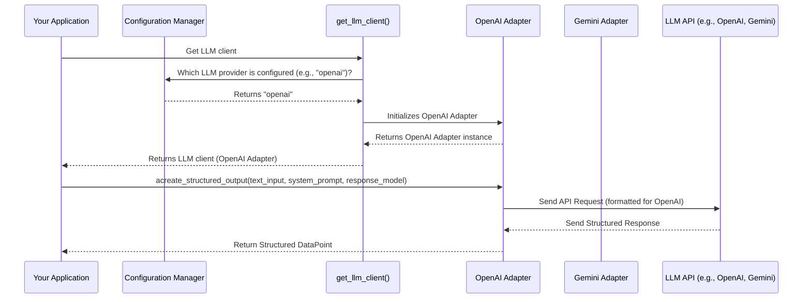

# Chapter 3: LLM Integration

In the previous chapter, [DataPoint](02_datapoint_.md), we learned that every piece of information in cognee, from text snippets to people's names, is stored as a standardized "LEGO brick" called a DataPoint. These DataPoints are the building blocks of cognee's internal knowledge.

But what if we want to *do* something intelligent with these DataPoints? Like asking a question about them, summarizing content, or even generating new content based on what cognee knows? This is where Large Language Models (LLMs) come in, and the **LLM Integration** abstraction is cognee's way of talking to them.

## What Problem Does LLM Integration Solve?

Imagine you have a super smart friend who can answer almost any question, write stories, and even translate languages. This friend is like an LLM. Now, imagine you have *many* such friends, each with a different accent or way of speaking (like OpenAI's GPT models, Google's Gemini, or open-source models like Ollama).

The problem is: **How can cognee talk to all these different "smart friends" (LLMs) without needing to learn a new "language" for each one, and without getting overwhelmed by their unique rules (like how many questions you can ask per minute)?**

LLM Integration solves this by acting as a **universal translator and polite assistant**. It allows cognee to send requests (like asking a question or requesting a summary) and get back responses, no matter which specific LLM is being used behind the scenes. It also handles the tricky parts, like making sure we don't ask our "smart friends" too many questions too quickly (rate limiting) or trying again if they're busy (retries).

## Key Concepts in LLM Integration

### Universal Adapter

Think of this like a universal plug adapter. You can plug your device (cognee) into any type of wall socket (any LLM like OpenAI, Gemini, Anthropic, or Ollama), and it just works. The LLM Integration provides a standard way to interact with all these different LLMs.

### Standardized Communication

No matter which LLM cognee talks to, it always sends messages in a similar format: a "system prompt" (telling the LLM what kind of role it should play or what rules to follow) and a "user input" (the actual question or task). It also expects responses back in a consistent, structured way.

```python
# Simplified example of standardized communication
from pydantic import BaseModel

class MyResponse(BaseModel):
    summary: str
    keywords: list[str]

async def speak_to_llm(llm_client, user_question: str):
    system_guide = "You are a helpful assistant that summarizes text and extracts keywords."

    # This is how cognee sends a request, no matter the LLM
    structured_response = await llm_client.acreate_structured_output(
        text_input=user_question,
        system_prompt=system_guide,
        response_model=MyResponse
    )
    return structured_response

# This shows that cognee uses a single, consistent method (`acreate_structured_output`)
# to ask LLMs to perform tasks and expects a specific type of response back.
```

### Rate Limiting and Retries

LLMs often have limits on how many requests you can send per minute or per second. LLM Integration is like a courteous scheduler. It waits patiently if the LLM is busy and automatically tries again if a request fails, ensuring smooth and reliable communication without overwhelming the LLM.

```python
# Simplified example of a rate-limited function
import asyncio

async def call_llm_api_with_rate_limit():
    print("Sending request to LLM (might wait if rate-limited)...")
    await asyncio.sleep(1) # Simulate network call
    print("LLM responded!")

# In cognee, this is handled automatically by decorators like @rate_limit_async
# and @sleep_and_retry_async on the LLM adapter methods.
# You don't need to write this logic yourself when using cognee's LLM client.
```

## How to Use LLM Integration in Cognee

You typically don't directly choose which LLM cognee talks to in your code. Instead, you configure it once (we'll cover [Configuration Management](07_configuration_management_.md) in a later chapter) and then just tell cognee what you want to achieve. Cognee will then pick the right LLM client based on your settings.

Let's say we want to summarize a DataPoint we previously ingested.

```python
from cognee.infrastructure.llm.get_llm_client import get_llm_client
from cognee.infrastructure.engine import TextSummary
import asyncio

async def summarize_data_point(data_content: str):
    # 1. Get the configured LLM client
    llm_client = get_llm_client()

    # 2. Define the system's role for the LLM
    system_prompt = "You are an expert summarizer. Provide a concise summary."

    print(f"Asking LLM to summarize: '{data_content[:50]}...'")

    # 3. Call the LLM to get a structured summary
    # The 'response_model=TextSummary' ensures the LLM attempts to return
    # its answer in the format of our TextSummary DataPoint (which inherits from BaseModel)
    summary_as_datapoint = await llm_client.acreate_structured_output(
        text_input=data_content,
        system_prompt=system_prompt,
        response_model=TextSummary
    )

    print(f"Generated Summary: {summary_as_datapoint.text}")
    print(f"Summary ID: {summary_as_datapoint.id}")

# Example usage (you'd typically put this in an async function and run it)
# asyncio.run(summarize_data_point("In a village in Spain, there lived a knight named Don Quixote..."))
# This will output a summary of the text and its automatically generated DataPoint ID.
```

**What happens when you call `get_llm_client()` and then `acreate_structured_output()`?**

1.  **Configuration Check**: `get_llm_client()` looks at your `cognee` configuration (e.g., in an environment variable or a config file) to see which LLM provider you've chosen (OpenAI, Gemini, Ollama, etc.) and what model within that provider.
2.  **Adapter Selection**: Based on the configuration, it chooses the correct "adapter" (like the `OpenAIAdapter`, `GeminiAdapter`, or `OllamaAPIAdapter`). Each adapter knows how to talk to its specific LLM.
3.  **Request Sending**: When you call `acreate_structured_output`, the chosen adapter takes your `text_input`, `system_prompt`, and `response_model`, translates them into the LLM's specific API call, and sends it.
4.  **Automatic Handling**: Behind the scenes, the adapter automatically handles things like retrying if the LLM is busy or waiting to respect rate limits. It also uses tools like `instructor` and `litellm` to ensure the LLM's response is formatted correctly into your specified `response_model` (e.g., `TextSummary`).
5.  **Structured Response**: The LLM's structured answer is then returned to you as an instance of your `response_model` (in our case, a `TextSummary` DataPoint).

## Under the Hood: How LLM Integration Works

Let's look at the simplified flow of how cognee picks the right LLM and then talks to it.



1.  **`get_llm_client()`**: When you call `get_llm_client()`, it reads your `llm_provider` setting from the configuration. Based on this, it instantiates the correct LLM adapter.
    *   See `cognee/infrastructure/llm/get_llm_client.py`: This file contains the logic to inspect the `llm_provider` from your configuration and return the appropriate adapter class (like `OpenAIAdapter`, `GeminiAdapter`, `OllamaAPIAdapter`, etc.). It uses an `Enum` called `LLMProvider` to represent the different choices.

    ```python
    # Simplified from cognee/infrastructure/llm/get_llm_client.py
    from enum import Enum
    # ... other imports

    class LLMProvider(Enum):
        OPENAI = "openai"
        OLLAMA = "ollama"
        GEMINI = "gemini"
        # ... other providers

    def get_llm_client():
        llm_config = get_llm_config() # Reads your setup from config
        provider = LLMProvider(llm_config.llm_provider)

        if provider == LLMProvider.OPENAI:
            from .openai.adapter import OpenAIAdapter
            return OpenAIAdapter(...)
        elif provider == LLMProvider.GEMINI:
            from .gemini.adapter import GeminiAdapter
            return GeminiAdapter(...)
        # ... and so on for other providers
        raise ValueError(f"Unsupported LLM provider: {provider}")

    # This code snippet shows how get_llm_client looks at your configuration
    # and decides which specific LLM adapter to create and return.
    ```

2.  **LLM Adapter (`OpenAIAdapter`, `GeminiAdapter`, etc.)**: Each adapter implements a common interface (`LLMInterface`). This interface defines methods like `acreate_structured_output`. When you call this method on the returned client, the adapter translates your request into the specific format required by its LLM.
    *   Take the `GeminiAdapter` as an example (`cognee/infrastructure/llm/gemini/adapter.py`). It uses the `litellm` library (which is a universal API for LLMs) to make the actual API call to Gemini. Crucially, it also uses `instructor` to force Gemini to return its response in the exact structure defined by your `response_model` (e.g., `TextSummary`).

    ```python
    # Simplified from cognee/infrastructure/llm/gemini/adapter.py
    import litellm
    from pydantic import BaseModel
    import instructor # Helps with structured output
    # ... other imports and class definition

    class GeminiAdapter(LLMInterface):
        def __init__(self, api_key: str, model: str, max_tokens: int, ...):
            self.api_key = api_key
            self.model = model
            self.aclient = instructor.from_litellm(litellm.acompletion) # Patches litellm for structured output

        @sleep_and_retry_async() # Handles retries
        @rate_limit_async       # Handles waiting if rate limited
        async def acreate_structured_output(
            self, text_input: str, system_prompt: str, response_model: Type[BaseModel]
        ) -> BaseModel:
            messages = [
                {"role": "system", "content": system_prompt},
                {"role": "user", "content": text_input},
            ]
            response = await self.aclient( # Uses the patched litellm client
                model=self.model,
                messages=messages,
                api_key=self.api_key,
                response_model=response_model, # This tells instructor to format the output
                max_tokens=self.max_tokens,
                num_retries=5,
            )
            return response

    # This example shows how the adapter wraps the actual LLM call,
    # ensuring it adheres to the interface and handles complexities like retries and structured output.
    ```
    The `OpenAIAdapter` (`cognee/infrastructure/llm/openai/adapter.py`) and `AnthropicAdapter` (`cognee/infrastructure/llm/anthropic/adapter.py`) work similarly, each configuring `litellm` and `instructor` for their specific LLM's API. The `OllamaAPIAdapter` (`cognee/infrastructure/llm/ollama/adapter.py`) also uses instructor, but directly with an `OpenAI` client pointing to the Ollama server.

This unified approach means that the rest of cognee doesn't need to know the specifics of OpenAI versus Gemini; it just expects a client that can fulfill the `LLMInterface`'s promises.

## Conclusion

**LLM Integration** is the bridge that allows cognee to communicate seamlessly with various powerful Large Language Models. By providing a standardized interface, automatic handling of rate limits and retries, and ensuring structured output, it simplifies the complex task of leveraging external AI "brains." This means cognee can easily switch between different LLMs, ensuring flexibility and robustness in its AI capabilities.

Now that we know how cognee talks to LLMs, the next chapter, [Retrievers](04_retrievers_.md), will show us how cognee finds the *right* information (DataPoints) from its vast knowledge base to send to these LLMs for summarization or answering questions.

---

Generated by [AI Codebase Knowledge Builder](https://github.com/The-Pocket/Tutorial-Codebase-Knowledge)