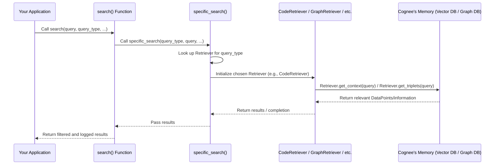

# Chapter 4: Retrievers

In the previous chapter, [LLM Integration](03_llm_integration_.md), we learned how cognee can talk to powerful Large Language Models (LLMs) to perform tasks like summarizing information or answering questions. But before an LLM can answer a question, it first needs the *relevant* information. Imagine asking a librarian for a book, but you first have to tell them *where* to find it.

This is where **Retrievers** come in. They are like specialized librarians within Cognee. They know how to efficiently find the exact pieces of information (our [DataPoints](02_datapoint_.md)) that are most relevant to your question or task, pulling them from Cognee's vast memory.

## What Problem Do Retrievers Solve?

Imagine Cognee has ingested a massive amount of data – documents, code, summaries, facts, relationships – a true digital brain built from countless [DataPoints](02_datapoint_.md).

Now, you ask Cognee a question like: "What are the latest updates on Project Alpha's budget allocation?"

Cognee can't just send *all* its knowledge about "Project Alpha" to an LLM. That would be too much! The LLM would get overwhelmed, and the process would be slow and expensive.

The problem is: **How does Cognee find only the specific, most useful pieces of information from its vast memory that directly answer your question, without sending irrelevant data to the LLM?**

Retrievers solve this by acting as highly skilled search agents. They take your question, understand what kind of information you need, and then fetch only those specific [DataPoints](02_datapoint_.md) that are likely to contain the answer.

## Key Concepts of Retrievers

Think of Retrievers as having different "search strategies" or "specializations," each designed to find a particular kind of information.

### Specialized Search Strategies

Just like you might go to a different section of a library (fiction, non-fiction, encyclopedias) depending on what you're looking for, Cognee has different types of Retrievers. Each type is expert at finding specific kinds of data:

*   **Summaries Retriever**: Good at finding short summaries of documents or topics.
*   **Code Retriever**: Expert at digging through code files to find relevant functions or snippets.
*   **Graph Completion Retriever**: Knows how to traverse relationships in the [Graph Database Interface](05_graph_database_interface_.md) to find interconnected facts.
*   **Natural Language Retriever**: Uses a general approach to find textually similar information.

### Context Building

A Retriever doesn't just find isolated facts. It gathers these relevant [DataPoints](02_datapoint_.md) and combines them into a "context." This context is then given to the LLM, giving it all the necessary background information to generate a correct and comprehensive answer.

```python
# Simplified example of a Retriever
from typing import List, Dict

class SimpleRetriever:
    def __init__(self, data_store: List[Dict]):
        self.data_store = data_store # Imagine this is Cognee's memory

    async def get_context(self, query: str) -> str:
        """
        Simulates finding relevant information.
        In a real Retriever, sophisticated search happens here.
        """
        print(f"Retriever searching for: '{query}'...")
        found_info = []
        for item in self.data_store:
            if query.lower() in item["content"].lower():
                found_info.append(item["content"])

        if found_info:
            return "\n".join(found_info)
        else:
            return "No relevant information found."

# This simple code shows a Retriever taking a query and finding relevant
# pieces of information to build a context.
```

### Callable `get_completion` Method

Retrievers are designed to be easily "called" to get their results. Most Retrievers have a `get_completion` method that takes your query and returns the relevant findings. Internally, this method often calls `get_context` first.

```python
from typing import Any, Optional

class SimpleRetrieverWithCompletion:
    # ... (previous code for __init__ and get_context) ...

    async def get_completion(self, query: str, context: Optional[Any] = None) -> Any:
        """
        Gets the context and then acts as a 'completion' for it.
        In real Cognee, Retrievers often directly return the found data,
        or use an LLM with the context to generate an answer.
        """
        if context is None:
            context = await self.get_context(query)

        # For this simple example, we just return the context.
        # A real Retriever might use an LLM here (like in CompletionRetriever)
        # to generate a human-readable answer from the context.
        return [context] # Return as a list to match Cognee's search results structure

# This shows the common pattern: get_completion often calls get_context internally.
```

## How to Use Retrievers in Cognee

You don't usually call Retrievers directly. Instead, you use Cognee's main `search` function and tell it *what kind* of search you want to perform. The `search` function then picks the right Retriever for you.

Let's imagine our use case: We want to find relevant code snippets related to a feature we're developing.

```python
from cognee.api.v1.add import add
from cognee.modules.search.methods.search import search
from cognee.modules.search.types import SearchType
from cognee.modules.users.models import User
import asyncio

async def run_code_search_example():
    # 1. First, make sure some code is ingested into Cognee
    # In a real scenario, you would have already ingested your code project.
    sample_code_1 = "def calculate_discount(price, rate): return price * (1 - rate)"
    sample_code_2 = "class Order: def __init__(self, id): self.id = id"
    sample_code_3 = "def apply_tax(amount, tax_rate): return amount * (1 + tax_rate)"

    my_user = User(id="user_123", email="test@example.com") # Dummy user

    # Ingresamos el código de ejemplo. Esto lo convierte en DataPoints.
    await add(data=sample_code_1, dataset_name="my_codebase", user=my_user)
    await add(data=sample_code_2, dataset_name="my_codebase", user=my_user)
    await add(data=sample_code_3, dataset_name="my_codebase", user=my_user)
    print("Sample code ingested.")

    # 2. Now, use the search function with a specific query type
    query = "Find functions related to financial calculations"
    datasets = ["my_codebase"] # Search within this dataset

    print(f"\nSearching for: '{query}' using {SearchType.CODE} retriever...")

    # We specify SearchType.CODE to tell Cognee to use the CodeRetriever
    results = await search(query_text=query, query_type=SearchType.CODE, datasets=datasets, user=my_user)

    print("\n--- Search Results ---")
    for result in results:
        print(f"Content: {result.get('content')[:100]}...") # Show partial content
        print(f"Name: {result.get('name')}")
        print("-" * 20)

# To run this:
# asyncio.run(run_code_search_example())
```

In the example above, `SearchType.CODE` is the key. When you specify this, Cognee knows to activate its `CodeRetriever` to intelligently search for code elements. You don't need to import `CodeRetriever` directly; the `search` function handles that.

**What happens when you call `search(query_type=SearchType.CODE)`?**

1.  **`search` Receives Request**: The `search` function gets your query and the `SearchType.CODE`.
2.  **Retriever Selection**: It looks up an internal mapping of `SearchType` to the correct Retriever. For `SearchType.CODE`, it selects the `CodeRetriever`.
3.  **Retriever `get_completion`**: The selected `CodeRetriever`'s `get_completion` method is called with your `query`.
4.  **Internal Search**: The `CodeRetriever` then performs its specialized search (e.g., using a [Vector Database Interface](06_vector_database_interface_.md) for semantic similarity or a [Graph Database Interface](05_graph_database_interface_.md) for code relationships).
5.  **Context/Results Returned**: The relevant code snippets (as [DataPoints](02_datapoint_.md) or derived information) are returned.
6.  **Results Filtered and Logged**: The `search` function filters the results (e.g., based on user permissions) and logs them before returning them to you.

## Under the Hood: How Retrievers Work

The central piece orchestrating the use of Retrievers is the `search` function, which can be found in `cognee/modules/search/methods/search.py`. This function acts as a dispatcher.



1.  **`search` Function (`cognee/modules/search/methods/search.py`)**: This is the top-level API endpoint. It prepares the request, logs the query, and calls `specific_search`. After `specific_search` returns, it filters the results based on user permissions and logs the outcome.

2.  **`specific_search` Function (`cognee/modules/search/methods/search.py`)**: This is where the magic of selecting the right Retriever happens. It maintains a dictionary (`search_tasks`) that maps each `SearchType` (like `SearchType.CODE` or `SearchType.GRAPH_COMPLETION`) to an instance of the corresponding Retriever class and its `get_completion` method.

    ```python
    # Simplified from cognee/modules/search/methods/search.py
    from cognee.modules.retrieval.code_retriever import CodeRetriever
    from cognee.modules.retrieval.graph_completion_retriever import GraphCompletionRetriever
    from cognee.modules.retrieval.completion_retriever import CompletionRetriever
    from cognee.modules.search.types import SearchType
    from typing import Callable

    async def specific_search(query_type: SearchType, query: str, ...):
        search_tasks: dict[SearchType, Callable] = {
            SearchType.CODE: CodeRetriever(top_k=3).get_completion,
            SearchType.GRAPH_COMPLETION: GraphCompletionRetriever(top_k=5).get_completion,
            SearchType.RAG_COMPLETION: CompletionRetriever().get_completion,
            # ... many other retrievers
        }

        search_task = search_tasks.get(query_type) # Finds the correct retriever's method

        if search_task is None:
            raise ValueError(f"Unsupported search type: {query_type}")

        results = await search_task(query) # Calls the retriever's get_completion method
        return results
    ```
    This code snippet shows how `specific_search` acts as a lookup table, quickly finding and executing the correct Retriever's logic based on the `query_type`.

3.  **Base Retriever (`cognee/modules/retrieval/base_retriever.py`)**: All individual Retriever classes (like `CodeRetriever`, `GraphCompletionRetriever`, `CompletionRetriever`) inherit from `BaseRetriever`. This ensures they all have the `get_context` and `get_completion` methods, providing a consistent interface.

    ```python
    # From cognee/modules/retrieval/base_retriever.py
    from abc import ABC, abstractmethod
    from typing import Any, Optional

    class BaseRetriever(ABC):
        """Base class for all retrieval operations."""

        @abstractmethod
        async def get_context(self, query: str) -> Any:
            """Retrieves context based on the query."""
            pass

        @abstractmethod
        async def get_completion(self, query: str, context: Optional[Any] = None) -> Any:
            """Generates a response using the query and optional context."""
            pass
    ```
    This `BaseRetriever` defines the contract that all specific Retrievers must follow.

4.  **Individual Retriever Implementations (e.g., `CodeRetriever`, `GraphCompletionRetriever`)**:
    *   **`CodeRetriever` (`cognee/modules/retrieval/code_retriever.py`)**: This Retriever focuses on finding code.
        *   It first uses an [LLM Integration](03_llm_integration_.md) to understand the user's natural language query (e.g., "Find functions related to tax calculation") and extract specific filenames or source code patterns that might be relevant. This is done by `_process_query` which calls `llm_client.acreate_structured_output`.
        *   Then, it queries the [Vector Database Interface](06_vector_database_interface_.md) (specifically `vector_engine.search`) to find code snippets or file names that are semantically similar to the extracted patterns.
        *   It might also use the [Graph Database Interface](05_graph_database_interface_.md) (`graph_engine.get_connections`) to get related code entities (e.g., functions called by other functions, classes that inherit from others).
        *   Finally, it retrieves the actual code content from disk/storage using the identified file paths.

    ```python
    # Simplified from cognee/modules/retrieval/code_retriever.py
    from cognee.modules.retrieval.base_retriever import BaseRetriever
    from cognee.infrastructure.databases.vector import get_vector_engine
    from cognee.infrastructure.llm.get_llm_client import get_llm_client
    # ... other imports

    class CodeRetriever(BaseRetriever):
        def __init__(self, top_k: int = 3):
            self.top_k = top_k
            # Collections are where vector embeddings of code pieces are stored
            self.file_name_collections = ["CodeFile_name"]
            self.classes_and_functions_collections = ["FunctionDefinition_source_code"]

        async def _process_query(self, query: str):
            llm_client = get_llm_client()
            # Asks LLM to identify filenames and source code patterns from query
            return await llm_client.acreate_structured_output(text_input=query, # ... )

        async def get_context(self, query: str):
            vector_engine = get_vector_engine()
            files_and_codeparts = await self._process_query(query)

            # Search in vector database for similar file names and code content
            # using files_and_codeparts as enhanced query
            # ...
            # Then retrieve and return the actual code
    ```
    This shows how the `CodeRetriever` combines intelligent query processing (via LLMs) with efficient vector database searches to find relevant code.

    *   **`CompletionRetriever` (`cognee/modules/retrieval/completion_retriever.py`)**: This is a more general-purpose Retriever often used for RAG (Retrieval Augmented Generation).
        *   Its `get_context` method primarily uses the [Vector Database Interface](06_vector_database_interface_.md) (`vector_engine.search`) to find semantically similar "chunks" of text (from DataPoints like `DocumentChunk_text`).
        *   Its `get_completion` method then takes this retrieved context and the original query, and passes them to an LLM ([LLM Integration](03_llm_integration_.md)) to generate a human-readable answer.

    ```python
    # Simplified from cognee/modules/retrieval/completion_retriever.py
    from cognee.modules.retrieval.base_retriever import BaseRetriever
    from cognee.infrastructure.databases.vector import get_vector_engine
    from cognee.modules.retrieval.utils.completion import generate_completion # Uses LLM

    class CompletionRetriever(BaseRetriever):
        async def get_context(self, query: str) -> str:
            vector_engine = get_vector_engine()
            # Search for relevant document chunks in the vector DB
            found_chunks = await vector_engine.search("DocumentChunk_text", query, limit=self.top_k)
            # Combine found chunks into a single context string
            return "\n".join([chunk.payload["text"] for chunk in found_chunks])

        async def get_completion(self, query: str, context: Optional[Any] = None) -> Any:
            if context is None:
                context = await self.get_context(query)
            # Use an LLM to generate a completion based on the query and context
            completion = await generate_completion(query=query, context=context, # ... )
            return [completion]
    ```
    This illustrates the classic RAG pattern where relevant documents are retrieved and then used as context for an LLM to generate a sophisticated answer.

    *   **`GraphCompletionRetriever` (`cognee/modules/retrieval/graph_completion_retriever.py`)**: This Retriever is specifically designed to leverage the interconnected nature of the knowledge graph.
        *   Its `get_triplets` method uses a "brute-force" search (which means it's comprehensive, but more advanced graph queries are also possible) powered by the [Vector Database Interface](06_vector_database_interface_.md) to find initial relevant nodes, and then uses the [Graph Database Interface](05_graph_database_interface_.md) (`graph_engine.get_connections`) to get connected facts (triplets).
        *   The `resolve_edges_to_text` method then takes these graph connections and turns them into a human-readable narrative, which becomes the context for an LLM (similar to `CompletionRetriever`).

    ```python
    # Simplified from cognee/modules/retrieval/graph_completion_retriever.py
    from cognee.modules.retrieval.base_retriever import BaseRetriever
    from cognee.modules.retrieval.utils.brute_force_triplet_search import brute_force_triplet_search # Uses graph/vector DB
    from cognee.modules.retrieval.utils.completion import generate_completion # Uses LLM

    class GraphCompletionRetriever(BaseRetriever):
        async def get_triplets(self, query: str) -> list:
            # Find relevant graph nodes/edges using vector search and graph connections
            found_triplets = await brute_force_triplet_search(query, top_k=self.top_k)
            return found_triplets

        async def resolve_edges_to_text(self, retrieved_edges: list) -> str:
            # Converts graph edges (relationships) into a readable text format for LLM context
            # ... logic to format nodes and connections as string ...
            return "Formatted graph context"

        async def get_context(self, query: str) -> str:
            triplets = await self.get_triplets(query)
            return await self.resolve_edges_to_text(triplets)

        # get_completion is similar to CompletionRetriever's, passing context to LLM
    ```
    This shows how `GraphCompletionRetriever` excels at taking complex graph data and transforming it into a narrative that LLMs can use for powerful reasoning.

## Conclusion

**Retrievers** are the dedicated information finders within Cognee. They leverage different specialized strategies, often combining intelligent understanding (via [LLM Integration](03_llm_integration_.md)) with efficient search techniques (using [Vector Database Interface](06_vector_database_interface_.md) and [Graph Database Interface](05_graph_database_interface_.md)), to retrieve precisely the relevant [DataPoints](02_datapoint_.md) from Cognee's vast memory. By building focused "context" for LLMs, Retrievers ensure that Cognee can answer complex questions accurately and efficiently.

Now that we understand how Cognee stores its information as [DataPoints](02_datapoint_.md) and effectively retrieves them, the next chapter will dive into the core of how Cognee structures and connects this information: the [Graph Database Interface](05_graph_database_interface_.md).

---

Generated by [AI Codebase Knowledge Builder](https://github.com/The-Pocket/Tutorial-Codebase-Knowledge)