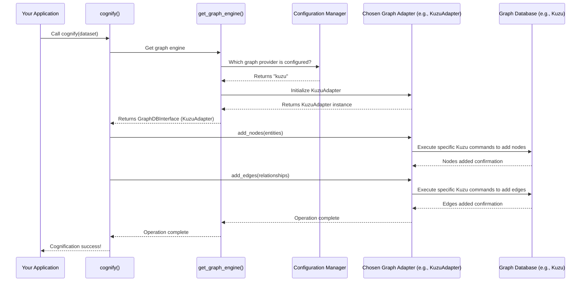

# Chapter 5: Graph Database Interface

In the previous chapter, [Retrievers](04_retrievers_.md), we saw how Cognee finds the right pieces of information ([DataPoints](02_datapoint_.md)) from its memory. But how *is* this memory built? How does Cognee store not just isolated facts, but also the important connections and relationships *between* those facts? This is where the **Graph Database Interface** comes in.

Imagine Cognee's brain is not just a pile of facts (like a dictionary), but a giant, interconnected map. On this map, every important concept, person, event, or document part is a location (a "node"), and lines between these locations (an "edge") show how they are related. For example, "Paris" is a node, "Eiffel Tower" is another node, and a line labeled "located_in" connects "Eiffel Tower" to "Paris."

## What Problem Does the Graph Database Interface Solve?

Let's revisit our "Project Alpha" example. Once we've ingested documents about it, Cognee has many [DataPoints](02_datapoint_.md):
*   A DataPoint for "Project Alpha."
*   A DataPoint for "budget allocation."
*   A DataPoint for "Alice Johnson."
*   A DataPoint for a specific "meeting minute."

The problem is: **How do we efficiently store and query the *relationships* between these pieces of information?** For example, we want to know that "Alice Johnson" *participated in* the "meeting minute," which *discusses* "budget allocation" for "Project Alpha." Just having separate facts isn't enough; we need to see the whole interconnected picture.

The Graph Database Interface is Cognee's solution. It provides a standardized way to build and navigate this "mind map" (also known as a **Knowledge Graph**). It allows Cognee to:
*   **Store connections**: Like "meeting minute HAS_PARTICIPANT Alice Johnson."
*   **Easily traverse connections**: Find everything Alice Johnson is connected to, or all documents related to Project Alpha.
*   **Ask complex questions**: "Who participated in meetings discussing Project Alpha's budget?" (This involves following several links in the graph).

## Key Concepts of a Graph Database Interface

### Nodes and Edges (Entities and Relationships)

This is the core idea of a graph:
*   **Nodes**: These are the "things" or "concepts" in your data. In Cognee, many [DataPoints](02_datapoint_.md) become nodes in the graph (e.g., a document, a person, a topic).
*   **Edges**: These are the "relationships" or "connections" between nodes. They explain how nodes are related (e.g., "created," "is_part_of," "discusses"). Edges have a "direction" (e.g., A -> B) and a "type" (the `relationship_name`).

```python
# Analogy: A very simple graph
nodes = [
    ("Alice", {"label": "Person"}),
    ("Project Alpha", {"label": "Project"}),
    ("Budget Meeting", {"label": "Event"}),
]

edges = [
    ("Alice", "Budget Meeting", "participated_in"),
    ("Budget Meeting", "Project Alpha", "discusses"),
]

# This shows how information is stored as interconnected nodes and edges.
# 'Alice', 'Project Alpha', 'Budget Meeting' are nodes.
# 'participated_in', 'discusses' are the relationships (edges).
```

### Standardized Operations

Just like how [LLM Integration](03_llm_integration_.md) provides a common way to talk to different LLMs, the Graph Database Interface provides a common way to talk to different graph databases. Whether Cognee is using Neo4j, Kuzu, or a simpler NetworkX graph, it uses the same set of commands (like "add a node," "add an edge," "find neighbors").

### Abstraction

This "interface" hides the complexity of the underlying graph database. Cognee doesn't need to know the specific commands for Neo4j versus Kuzu. It just asks the interface to perform a graph operation, and the interface translates it for the specific database being used. This means Cognee can switch between different graph storage solutions easily.

```python
# Simplified example of standardized operations
from abc import ABC, abstractmethod

class SimpleGraphInterface(ABC):
    @abstractmethod
    async def add_node(self, node_id: str, properties: dict):
        pass

    @abstractmethod
    async def add_edge(self, source_id: str, target_id: str, rel_name: str):
        pass

# In Cognee, different adapters (Neo4j, Kuzu) would implement this interface.
# The core Cognee code just calls add_node or add_edge, without caring which database is behind it.
```

## How to Use the Graph Database Interface in Cognee

You typically don't directly call methods like `add_node` or `add_edge` from the Graph Database Interface in your application code. Instead, Cognee uses it internally during the "cognification" process (part of [Data Ingestion and Pipelines](01_data_ingestion_and_pipelines_.md)) to build the knowledge graph.

However, you can use the interface through Cognee's search functionalities (specifically the [Retrievers](04_retrievers_.md) that leverage the graph), or if you need to perform advanced graph operations for analysis or debugging.

Let's imagine we want to know what a specific document is connected to in the graph. We could use a graph retriever for this (though usually, `cognify` would have created these connections already).

```python
from cognee.api.v1.add import add
from cognee.api.v1.cognify import cognify
from cognee.modules.search.methods.search import search
from cognee.modules.search.types import SearchType
from cognee.modules.users.models import User
import asyncio

async def run_graph_example():
    my_user = User(id="user_graph_test", email="graph@example.com")

    # 1. Add some data. This will create initial DataPoints.
    # Cognee will later process this during cognification to build graph relationships.
    doc_content = "The latest project update for Apollo includes critical budget adjustments discussed by Sarah in Q2."
    await add(data=doc_content, dataset_name="internal_updates", user=my_user)
    print("Data added.")

    # 2. Run cognification to build the knowledge graph.
    # This step is where the Graph Database Interface is heavily used internally.
    await cognify(datasets="internal_updates", user=my_user)
    print("Data cognified (graph relationships created).")

    # 3. Now, use a GraphCompletionRetriever (via search) to explore connections.
    # We want to find relationships around "Sarah".
    query = "What is Sarah connected to in the internal_updates dataset?"

    print(f"\nSearching relationships for '{query}'...")
    results = await search(query_text=query, query_type=SearchType.GRAPH_COMPLETION, datasets=["internal_updates"], user=my_user)

    print("\n--- Graph Search Results ---")
    if results:
        for triple in results:
            # Result will contain structured graph data (like a sentence)
            print(triple)
    else:
        print("No immediate graph connections found for the query.")

# To run this:
# asyncio.run(run_graph_example())
```

**What happens when you call `cognify()` and `search(query_type=SearchType.GRAPH_COMPLETION)`?**

During `cognify()`, Cognee analyzes the ingested [DataPoints](02_datapoint_.md) to identify entities (like "Sarah," "Apollo," "Q2") and relationships between them ("Sarah DISCUSSED budget adjustments," "budget adjustments ARE_PART_OF Apollo project"). It then uses the underlying Graph Database Interface to add these nodes and edges to the graph.

When `search(query_type=SearchType.GRAPH_COMPLETION)` is called, the [GraphCompletionRetriever](04_retrievers_.md) uses the same Graph Database Interface to:
1.  Find nodes related to "Sarah."
2.  Traverse edges from "Sarah" to discover connected facts (e.g., "Sarah performed action X," "Sarah is related to Y").
3.  Format these connections into a readable context for an LLM to interpret and present to you.

## Under the Hood: How the Graph Database Interface Works

The core of the Graph Database Interface is defined in `cognee/infrastructure/databases/graph/graph_db_interface.py`. This file contains the `GraphDBInterface` abstract class, which outlines all the methods that any graph database adapter (like Neo4j, Kuzu, or NetworkX) must implement.



1.  **`get_graph_engine()`**: This factory function (`cognee/infrastructure/databases/graph/get_graph_engine.py`) is the entry point. Similar to `get_llm_client()`, it reads your `graph_database_provider` setting from the configuration. Based on this, it instantiates and returns the correct adapter (e.g., `Neo4jAdapter`, `KuzuAdapter`, `NetworkXAdapter`).

    ```python
    # Simplified from cognee/infrastructure/databases/graph/get_graph_engine.py
    from cognee.infrastructure.databases.graph.graph_db_interface import GraphDBInterface
    from .config import get_graph_config

    async def get_graph_engine() -> GraphDBInterface:
        config = get_graph_config()
        provider = config.graph_database_provider.lower()

        if provider == "neo4j":
            from .neo4j_driver.adapter import Neo4jAdapter
            return Neo4jAdapter(config.graph_database_url, config.graph_database_username, config.graph_database_password)
        elif provider == "kuzu":
            from .kuzu.adapter import KuzuAdapter
            return KuzuAdapter(db_path=config.graph_file_path)
        # ... other providers or default to NetworkXAdapter
        else:
            from .networkx.adapter import NetworkXAdapter
            return NetworkXAdapter(filename=config.graph_file_path)
    ```
    This function dynamically loads the correct adapter based on your configuraton, ensuring flexibility.

2.  **`GraphDBInterface` (`cognee/infrastructure/databases/graph/graph_db_interface.py`)**: This is an `ABC` (Abstract Base Class) that defines the contract for all graph database adapters. It specifies methods like `add_nodes`, `add_edges`, `get_node`, `get_connections`, etc. Any adapter *must* implement these methods.

    ```python
    # Simplified from cognee/infrastructure/databases/graph/graph_db_interface.py
    from abc import ABC, abstractmethod
    from typing import List, Dict, Any, Tuple
    from cognee.infrastructure.engine import DataPoint # DataPoint becomes a Node

    class GraphDBInterface(ABC):
        @abstractmethod
        async def add_nodes(self, nodes: List[DataPoint]) -> None:
            """Add multiple DataPoints as nodes to the graph."""
            pass

        @abstractmethod
        async def add_edges(self, edges: List[Tuple[str, str, str, Dict[str, Any]]]) -> None:
            """Add multiple edges to the graph."""
            pass

        @abstractmethod
        async def get_connections(self, node_id: str) -> List[Tuple[Dict, Dict, Dict]]:
            """Get all nodes connected to a specified node and their relationship details."""
            pass
        # ... many more abstract methods for querying, deleting, etc.
    ```
    This `GraphDBInterface` ensures that regardless of the chosen graph database, Cognee can interact with it using a consistent set of commands.

3.  **Specific Adapters (e.g., `KuzuAdapter`, `Neo4jAdapter`, `NetworkXAdapter`)**: Each adapter implements the `GraphDBInterface` for its specific graph database. They translate Cognee's general requests into the native commands of their respective databases.

    *   **`KuzuAdapter` (`cognee/infrastructure/databases/graph/kuzu/adapter.py`)**: This adapter uses the `kuzu` Python library. It creates a local Kuzu database file and executes Cypher-like queries specialized for Kuzu.

        ```python
        # Simplified from cognee/infrastructure/databases/graph/kuzu/adapter.py
        import kuzu
        from cognee.infrastructure.databases.graph.graph_db_interface import GraphDBInterface

        class KuzuAdapter(GraphDBInterface):
            def __init__(self, db_path: str):
                self.db = kuzu.Database(db_path)
                self.connection = kuzu.Connection(self.db)
                self.connection.execute("CREATE NODE TABLE IF NOT EXISTS Node(...)") # Define schema

            async def add_nodes(self, nodes: list[DataPoint]) -> None:
                for node in nodes:
                    # Kuzu-specific query to add a node
                    query = f"MERGE (n:Node {{id: '{node.id}'}}) SET n.name = '{getattr(node, 'name', '')}', n.type = '{node.type}'"
                    await self.query(query) # `self.query` sends native Kuzu command

            async def add_edges(self, edges: list[tuple]) -> None:
                for source_id, target_id, rel_name, props in edges:
                     # Kuzu-specific query to add an edge
                    query = f"MATCH (s:Node), (t:Node) WHERE s.id = '{source_id}' AND t.id = '{target_id}' MERGE (s)-[:EDGE {{relationship_name: '{rel_name}'}}]->(t)"
                    await self.query(query)
            # ... and so on for other methods
        ```
        The `KuzuAdapter` translates generic requests into Kuzu's native query language.

    *   **`Neo4jAdapter` (`cognee/infrastructure/databases/graph/neo4j_driver/adapter.py`)**: This adapter uses the official `neo4j` Python driver and executes Cypher queries.

        ```python
        # Simplified from cognee/infrastructure/databases/graph/neo4j_driver/adapter.py
        from neo4j import AsyncGraphDatabase
        from cognee.infrastructure.databases.graph.graph_db_interface import GraphDBInterface

        class Neo4jAdapter(GraphDBInterface):
            def __init__(self, url: str, user: str, password: str):
                self.driver = AsyncGraphDatabase.driver(url, auth=(user, password))

            async def add_nodes(self, nodes: list[DataPoint]) -> None:
                query = "UNWIND $nodes AS node MERGE (n {id: node.id}) SET n += node.properties, n:node.type"
                # Neo4j query with parameters for bulk insertion
                neo4j_nodes = [{"id": str(n.id), "type": n.type, "properties": n.model_dump()} for n in nodes]
                await self.query(query, {"nodes": neo4j_nodes})

            async def add_edges(self, edges: list[tuple]) -> None:
                query = """UNWIND $edges AS edge
                           MATCH (s {id: edge.source_id}), (t {id: edge.target_id})
                           MERGE (s)-[r:`rel_name` {properties: edge.properties}]->(t)"""
                neo4j_edges = [{"source_id": s, "target_id": t, "rel_name": r, "properties": p} for s, t, r, p in edges]
                await self.query(query, {"edges": neo4j_edges})
            # ... and so on for other methods
        ```
        This demonstrates how the `Neo4jAdapter` also translates requests into its native Cypher language.

    Notice the `@record_graph_changes` decorator in `graph_db_interface.py` on methods like `add_nodes` and `add_edges`. This decorator automatically logs changes to a `GraphRelationshipLedger` in a separate relational database. This ledger keeps a historical record of which parts of the graph were modified and by which function, which is useful for auditing and debugging.

## Conclusion

The **Graph Database Interface** is the foundational layer that allows Cognee to build and manage its interconnected "mind map" – the knowledge graph. By defining a standardized set of operations for adding, retrieving, and querying nodes (facts) and edges (relationships), it abstracts away the complexities of different graph databases. This crucial abstraction enables Cognee to understand not just isolated pieces of information ([DataPoints](02_datapoint_.md)), but the rich tapestry of how they relate to one another, which is essential for advanced AI reasoning.

Now that we understand how Cognee stores interconnected knowledge, the next chapter, [Vector Database Interface](06_vector_database_interface_.md), will explore how it stores numerical representations of information for efficient similarity searches.

---

Generated by [AI Codebase Knowledge Builder](https://github.com/The-Pocket/Tutorial-Codebase-Knowledge)