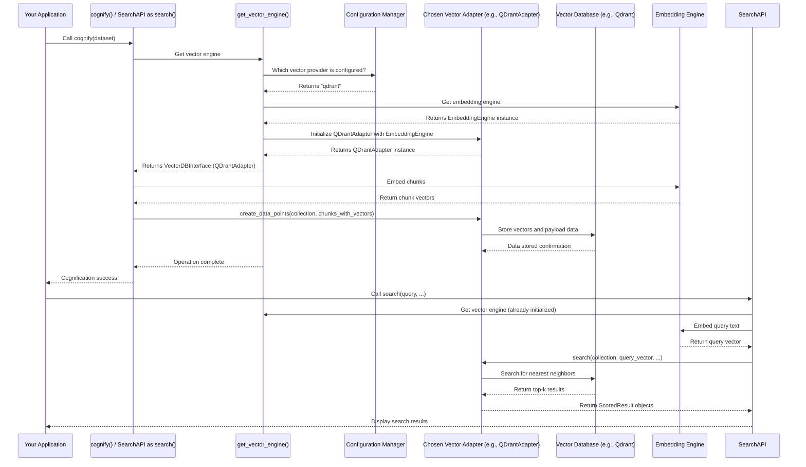

# Chapter 6: Vector Database Interface

In the previous chapter, [Graph Database Interface](05_graph_database_interface_.md), we explored how Cognee builds a rich, interconnected "mind map" by storing facts as nodes and relationships as edges. This is fantastic for understanding how things relate to each other explicitly.

But what if you want to find information that is *semantically similar* even if it doesn't share direct relationships in the graph or the exact same words? Imagine you're looking for "a tool that helps manage creative projects" but your documents only talk about "project management software for artists." They don't use the exact same words, but the *meaning* is very similar.

This is where the **Vector Database Interface** comes in. This component is like a "smart index" for finding similar information quickly. It stores numerical representations (vectors) of data and allows for efficient "similarity searches." For example, if you ask a question, Cognee can use this to find the most relevant text chunks or entities that have similar meanings, even if they don't use the exact same words. This is vital for improving the speed and relevance of search results.

## What Problem Does the Vector Database Interface Solve?

Imagine you have thousands of short text descriptions about different projects. You want to find projects that are *like* "developing AI applications for healthcare," but some descriptions might use terms like "machine learning in medicine," "smart health solutions," or "predictive diagnostics."

The problem is: **How can Cognee find information based on its *meaning*, rather than just exact keyword matches? How can it efficiently compare a new piece of information (like a query) to millions of existing pieces of information to find the closest matches?**

The Vector Database Interface solves this by:
1.  **Transforming information into numbers**: It converts text, images, or any data into high-dimensional numerical arrays called "vectors" or "embeddings." Think of these vectors as unique numerical fingerprints of the data's meaning. Information with similar meanings will have vectors that are "close" to each other in this high-dimensional space.
2.  **Efficiently searching these numbers**: It uses specialized databases (vector databases) that are built specifically to find the closest vectors to a given query vector, very, very quickly.

This allows Cognee to perform "similarity searches" – finding information that *means* something similar, even if the words are different.

## Key Concepts of a Vector Database Interface

### Embeddings (Numerical Fingerprints)

The core idea is to convert all data into numbers. This process is called "embedding," and the resulting numerical representations are called "embeddings" or "vectors."

```python
# Analogy: Words converted to simple numbers based on 'meaning'
# (In reality, embeddings are much more complex and have many dimensions)

# Fictional simplified embedding:
# "dog": [0.1, 0.2, 0.3]
# "puppy": [0.11, 0.22, 0.31] # Very similar to "dog"
# "cat": [0.8, 0.7, 0.9]     # Different from "dog"
# "car": [0.0, 0.0, 0.1]     # Very different

# When "puppy" is searched, "dog" will be found because their numbers are close.
```
These embeddings are generated by complex models ([LLM Integration](03_llm_integration_.md) often plays a role here, or dedicated embedding models). The closer two vectors are, the more semantically similar their original data is.

### Collections

Think of collections in a vector database like "folders" or "categories" where you store similar types of embeddings. For example, you might have one collection for "document summaries," another for "code snippets," and another for "user queries." This helps organize the information and makes searches more efficient.

```python
# Simplified notion of collections in a vector database
vector_db_collections = {
    "DocumentSummaries_embeddings": [
        "vector_for_summary_1",
        "vector_for_summary_2",
    ],
    "CodeSnippets_embeddings": [
        "vector_for_code_A",
        "vector_for_code_B",
    ],
}
# When you search for code, you only search in the "CodeSnippets_embeddings" collection.
```

### Similarity Search

This is the main operation a vector database performs. You provide a query (which is first converted into a vector), and the database finds other vectors (and their associated original data) that are numerically closest to your query vector. This is how you find "similar meaning" information.

## How to Use the Vector Database Interface in Cognee

Just like the [Graph Database Interface](05_graph_database_interface_.md), you usually don't directly interact with the Vector Database Interface's `create_data_points` or `search` methods in your application code. Cognee uses it internally for several crucial operations:

1.  **During Ingestion and Cognification**: When you `add` and `cognify` data, Cognee takes the [DataPoints](02_datapoint_.md) (like chunks of text or code) and converts them into embeddings. These embeddings, along with their associated metadata (which identifies the original DataPoint), are then stored in relevant collections in the vector database.
2.  **By Retrievers**: Many of Cognee's [Retrievers](04_retrievers_.md) (like `CompletionRetriever` or `CodeRetriever`) heavily rely on the Vector Database Interface to find relevant information quickly. When you ask a question using `search`, the Retriever takes your query, converts it into a vector, and then asks the vector database to find the most similar stored embeddings.

Let's illustrate how the `search` function, specifically using the `RAG_COMPLETION` type, leverages the Vector Database Interface to find similar text and then provides it to an LLM.

```python
from cognee.api.v1.add import add
from cognee.api.v1.cognify import cognify
from cognee.modules.search.methods.search import search
from cognee.modules.search.types import SearchType
from cognee.modules.users.models import User
import asyncio

async def run_vector_search_example():
    my_user = User(id="user_vector_test", email="vector@example.com")

    # 1. Add some data. During cognification, this text will be embedded and stored
    # in the vector database.
    doc_content_1 = "The latest project update for Apollo includes critical budget adjustments discussed by Sarah."
    doc_content_2 = "Revised spending plans for Project Artemis show an increase in allocation for new software."
    doc_content_3 = "The team evaluated various financial applications to optimize capital outflow."

    await add(data=doc_content_1, dataset_name="financial_docs", user=my_user)
    await add(data=doc_content_2, dataset_name="financial_docs", user=my_user)
    await add(data=doc_content_3, dataset_name="financial_docs", user=my_user)
    print("Sample financial documents added.")

    # 2. Run cognification to process the raw data into DataPoints,
    # generate embeddings, and store them in the vector database.
    await cognify(datasets="financial_docs", user=my_user)
    print("Documents cognified (embeddings created and stored).")

    # 3. Now, search for semantically similar information using a natural language query.
    # The RAG_COMPLETION search type (which uses CompletionRetriever) relies on the vector DB.
    query = "What are the recent changes in funding for projects?"
    datasets = ["financial_docs"]

    print(f"\nSearching for: '{query}' using {SearchType.RAG_COMPLETION} retriever...")

    # The CompletionRetriever (used by RAG_COMPLETION) will embed this query,
    # then search the vector database for similar content.
    results = await search(query_text=query, query_type=SearchType.RAG_COMPLETION, datasets=datasets, user=my_user)

    print("\n--- Search Results (LLM Completion) ---")
    if results:
        for result in results:
            print(result) # This will be the LLM's generated answer based on retrieved context.
    else:
        print("No relevant information found for the query.")

# To run this:
# asyncio.run(run_vector_search_example())
```

**What happens when you call `cognify()` and then `search(query_type=SearchType.RAG_COMPLETION)`?**

During `cognify()`:
*   The raw text (`doc_content`) is broken into smaller `DocumentChunk` [DataPoints](02_datapoint_.md).
*   For each `DocumentChunk`, Cognee calls an `EmbeddingEngine` (obtained via `get_embedding_engine()` in `create_vector_engine.py`) to generate an embedding for its `text` content.
*   These `DocumentChunk` DataPoints, along with their new embeddings, are then sent to the `VectorDBInterface` (`create_data_points` method) and stored in a collection (e.g., `DocumentChunk_text`).

When `search(query_type=SearchType.RAG_COMPLETION)` is called:
*   The `CompletionRetriever` is activated.
*   It takes your `query` ("What are the recent changes in funding for projects?").
*   It uses the `EmbeddingEngine` to convert this query into a vector.
*   It then calls the `VectorDBInterface`'s `search` method, providing this query vector and specifying the `DocumentChunk_text` collection.
*   The `VectorDBInterface` (using its underlying vector database like Qdrant or LanceDB) quickly finds the most similar document chunks.
*   These retrieved chunks (the context) are then passed to an LLM ([LLM Integration](03_llm_integration_.md)) to generate a coherent answer.

## Under the Hood: How the Vector Database Interface Works

The core of the Vector Database Interface is defined in `cognee/infrastructure/databases/vector/vector_db_interface.py`. This file contains the `VectorDBInterface` Protocol, which outlines all the methods a vector database adapter must implement.



1.  **`get_vector_engine()`**: This factory function (`cognee/infrastructure/databases/vector/get_vector_engine.py`) is the entry point. It reads your `vector_db_provider` setting from the configuration. Based on this, it instantiates and returns the correct adapter (e.g., `QDrantAdapter`, `LanceDBAdapter`, `MilvusAdapter`, etc.), and crucially, also obtains the `EmbeddingEngine` it will use for converting text to vectors.

    ```python
    # Simplified from cognee/infrastructure/databases/vector/get_vector_engine.py
    from cognee.infrastructure.databases.vector.create_vector_engine import create_vector_engine
    from cognee.infrastructure.databases.vector.config import get_vectordb_config

    def get_vector_engine():
        """Creates and returns a vector engine instance based on configuration."""
        # This function fetches config and uses create_vector_engine to instantiate adapter
        return create_vector_engine(**get_vectordb_config().to_dict())

    # This function uses `create_vector_engine` to get the configured vector DB adapter.
    ```
    The `create_vector_engine` function (`cognee/infrastructure/databases/vector/create_vector_engine.py`) is where the actual selection and instantiation happen. It checks the `vector_db_provider` and loads the corresponding adapter, along with an `EmbeddingEngine`.

    ```python
    # Simplified from cognee/infrastructure/databases/vector/create_vector_engine.py
    from .embeddings import get_embedding_engine
    # ... adapter imports

    def create_vector_engine(vector_db_provider: str, vector_db_url: str, ...):
        embedding_engine = get_embedding_engine() # Get the tool to make numerical fingerprints

        if vector_db_provider == "qdrant":
            from .qdrant.QDrantAdapter import QDrantAdapter
            return QDrantAdapter(url=vector_db_url, ..., embedding_engine=embedding_engine)
        elif vector_db_provider == "lancedb":
            from .lancedb.LanceDBAdapter import LanceDBAdapter
            return LanceDBAdapter(url=vector_db_url, ..., embedding_engine=embedding_engine)
        # ... and so on for other providers
    ```
    This shows how the `create_vector_engine` function selects the right adapter and provides it with the `embedding_engine`.

2.  **`VectorDBInterface` (`cognee/infrastructure/databases/vector/vector_db_interface.py`)**: This `Protocol` (similar to an Abstract Base Class) defines the contract for all vector database adapters. It specifies methods like `has_collection`, `create_collection`, `create_data_points`, `search`, `batch_search`, etc. Any adapter *must* implement these methods.

    ```python
    # Simplified from cognee/infrastructure/databases/vector/vector_db_interface.py
    from typing import List, Protocol, Optional
    from abc import abstractmethod
    from cognee.infrastructure.engine import DataPoint # DataPoint is stored

    class VectorDBInterface(Protocol):
        @abstractmethod
        async def create_data_points(self, collection_name: str, data_points: List[DataPoint]):
            """Insert new data points (with their embeddings) into the specified collection."""
            pass

        @abstractmethod
        async def search(
            self,
            collection_name: str,
            query_text: Optional[str],
            query_vector: Optional[List[float]],
            limit: int,
            with_vector: bool = False,
        ):
            """Perform a similarity search."""
            pass
        # ... and many more abstract methods
    ```
    This `VectorDBInterface` ensures that regardless of the chosen vector database, Cognee can interact with it using a consistent set of commands.

3.  **Specific Adapters (e.g., `QDrantAdapter`, `LanceDBAdapter`)**: Each adapter implements the `VectorDBInterface` for its specific vector database. They translate Cognee's general requests into the native commands of their respective databases.

    *   **`QDrantAdapter` (`cognee/infrastructure/databases/vector/qdrant/QDrantAdapter.py`)**: This adapter uses the `AsyncQdrantClient` to interact with a Qdrant instance.

        ```python
        # Simplified from cognee/infrastructure/databases/vector/qdrant/QDrantAdapter.py
        from qdrant_client import AsyncQdrantClient, models
        # ... other imports
        from ..embeddings.EmbeddingEngine import EmbeddingEngine
        from ..vector_db_interface import VectorDBInterface

        class QDrantAdapter(VectorDBInterface):
            def __init__(self, url: str, api_key: str, embedding_engine: EmbeddingEngine, ...):
                self.embedding_engine = embedding_engine
                self.client = AsyncQdrantClient(url=url, api_key=api_key) # Initialize Qdrant client

            async def create_data_points(self, collection_name: str, data_points: list[DataPoint]):
                # Convert DataPoints to Qdrant's format (vector + payload)
                points = []
                for dp in data_points:
                    if dp.metadata and "index_fields" in dp.metadata and dp.metadata["index_fields"]:
                        # Get the text to embed from the DataPoint's specified index_field
                        text_to_embed = getattr(dp, dp.metadata["index_fields"][0])
                        vector = (await self.embedding_engine.embed_text([text_to_embed]))[0]
                        points.append(models.PointStruct(id=str(dp.id), payload=dp.model_dump(), vector={"text": vector})) # Store vector and DataPoint as payload
                await self.client.upsert(collection_name=collection_name, points=points) # Qdrant 'upsert' command

            async def search(self, collection_name: str, query_text: str = None, query_vector: list[float] = None, limit: int = 15, with_vector: bool = False):
                if query_text and not query_vector:
                    query_vector = (await self.embedding_engine.embed_text([query_text]))[0] # Embed query if text is given
                results = await self.client.search(
                    collection_name=collection_name,
                    query_vector=models.NamedVector(name="text", vector=query_vector), # Search using the 'text' vector
                    limit=limit,
                    with_vectors=with_vector,
                )
                return results # Return Qdrant's search results
            # ... and so on for other methods
        ```
        This shows how the `QDrantAdapter` takes Cognee's `DataPoint` and search requests, embeds them using the `embedding_engine`, and then translates them into Qdrant's native commands.

    *   **`LanceDBAdapter` (`cognee/infrastructure/databases/vector/lancedb/LanceDBAdapter.py`)**: This adapter uses the `lancedb` Python library to interact with LanceDB.

        ```python
        # Simplified from cognee/infrastructure/databases/vector/lancedb/LanceDBAdapter.py
        import lancedb
        from lancedb.pydantic import LanceModel, Vector
        # ... other imports
        from ..embeddings.EmbeddingEngine import EmbeddingEngine
        from ..vector_db_interface import VectorDBInterface

        class LanceDBAdapter(VectorDBInterface):
            def __init__(self, url: str, api_key: str, embedding_engine: EmbeddingEngine):
                self.url = url
                self.api_key = api_key
                self.embedding_engine = embedding_engine
                self.connection = None # Connection created on first use

            async def get_connection(self):
                if self.connection is None:
                    self.connection = await lancedb.connect_async(self.url, api_key=self.api_key)
                return self.connection

            async def create_data_points(self, collection_name: str, data_points: list[DataPoint]):
                # First, ensure the collection exists with the correct schema
                collection = await self.create_collection(collection_name, type(data_points[0]))

                data_for_lancedb = []
                for dp in data_points:
                    if dp.metadata and "index_fields" in dp.metadata and dp.metadata["index_fields"]:
                        text_to_embed = getattr(dp, dp.metadata["index_fields"][0])
                        vector = (await self.embedding_engine.embed_text([text_to_embed]))[0]
                        data_for_lancedb.append({"id": str(dp.id), "vector": vector, "payload": dp.model_dump()}) # Prepare data for LanceDB

                await collection.add(data_for_lancedb) # Add data to LanceDB collection

            async def search(self, collection_name: str, query_text: str = None, query_vector: list[float] = None, limit: int = 15, with_vector: bool = False):
                if query_text and not query_vector:
                    query_vector = (await self.embedding_engine.embed_text([query_text]))[0] # Embed query
                collection = await self.get_collection(collection_name) # Get the collection
                results = await collection.vector_search(query_vector).limit(limit).to_pandas() # Perform vector search
                return results.to_dict("records") # Return results from Pandas DataFrame
            # ... and so on for other methods
        ```
        This shows how the `LanceDBAdapter` handles `DataPoint` storage and similarity search operations specific to LanceDB.

In essence, the `VectorDBInterface` and its adapters are the unsung heroes that enable Cognee to understand the *meaning* of data and find information that is semantically similar, even if the exact words or explicit graph relationships are missing.

## Conclusion

The **Vector Database Interface** is a fundamental component that empowers Cognee to perform advanced "similarity searches." By converting all types of data into numerical "embeddings" and storing them in specialized vector databases, Cognee can efficiently find information based on its semantic meaning, greatly enhancing its ability to retrieve relevant context for [LLM Integration](03_llm_integration_.md) and respond to complex queries. This is complementary to the explicit relationship storage provided by the [Graph Database Interface](05_graph_database_interface_.md), allowing Cognee to have a comprehensive understanding of its ingested knowledge.

Next, we'll shift our focus to how Cognee manages all its different settings and external service connections: [Configuration Management](07_configuration_management_.md).

---

Generated by [AI Codebase Knowledge Builder](https://github.com/The-Pocket/Tutorial-Codebase-Knowledge)