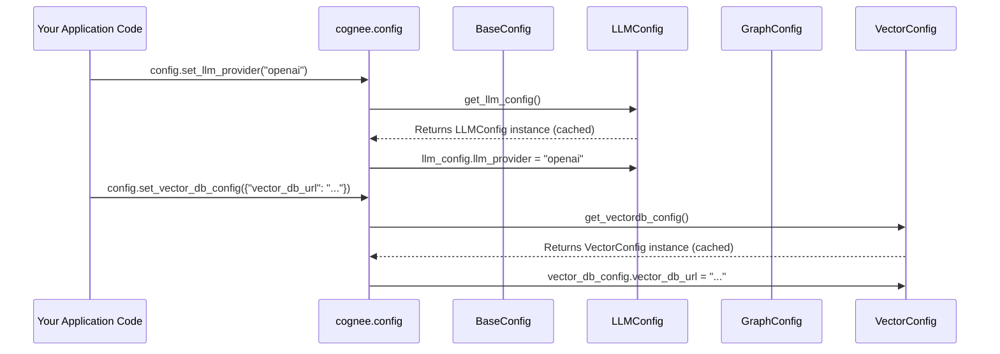

# Chapter 7: Configuration Management

In the previous chapters, we've explored many powerful features of Cognee: how it ingests data ([Data Ingestion and Pipelines](01_data_ingestion_and_pipelines_.md)), stores it as basic units ([DataPoint](02_datapoint_.md)), talks to smart AI models ([LLM Integration](03_llm_integration_.md)), finds information ([Retrievers](04_retrievers_.md)), and manages its memory using graphs ([Graph Database Interface](05_graph_database_interface_.md)) and vectors ([Vector Database Interface](06_vector_database_interface_.md)).

But how does Cognee *know* which Large Language Model to use, or where its databases are located? When you use Google Maps, you tell it your destination, but it needs to know if you prefer driving or walking, and which city it should search in. This is where **Configuration Management** comes in.

## What Problem Does Configuration Management Solve?

Imagine Cognee as a very powerful, customizable robot assistant. It has many different parts: a "brain" (LLM), a "long-term memory" (databases), and "eyes" for reading data. To make this robot work, you need to tell it very specific instructions:

*   "Use the super-smart GPT-4o-mini brain."
*   "Store all the interconnected knowledge in the 'kuzu' database, located at this specific file."
*   "Keep the numerical meanings of information in the 'lancedb' database, also at a specific file."
*   "All my raw data should go into a folder called `my_cognee_data`."

The problem is: **How can you easily tell Cognee all these settings and preferences, in one clear place, without changing its core code every time you want to try a new brain or a different memory location?**

Configuration Management is like the "control panel" or "settings menu" for your Cognee robot. It centralizes all these choices. It ensures that all parts of Cognee (LLM, databases, data ingestion) operate with consistent parameters. This makes it easy to adapt Cognee to different environments (e.g., your local computer vs. a powerful cloud server) or to customize its behavior without "digging deep into the code."

## Key Concepts of Configuration Management

### Centralized Settings Access

Instead of scattered bits of code hardcoding database paths or LLM names, all important settings are gathered in one logical place. This means you can find and change them easily.

### Separate Configuration Sections

Settings are grouped into logical families. For example, all LLM-related settings (like provider, model name, API key) are together. All graph database settings are together. This makes it neat and tidy.

```python
# Simplified example of configuration sections
class LLMSettings:
    provider: str = "openai"
    model: str = "gpt-4o"
    api_key: str = "your_openai_key"

class DBSettings:
    graph_provider: str = "kuzu"
    vector_provider: str = "lancedb"
    data_path: str = "/var/cognee/data"

# Cognee organizes settings like this, making them easy to manage.
```

### Flexibility and Overrides

You can often set default values, but easily "override" them. This is usually done through:
1.  **Code**: By calling specific `config.set_something(...)` functions.
2.  **Environment Variables**: Setting `LLM_API_KEY` or `LLM_PROVIDER` in your operating system before running Cognee. This is powerful for deploying Cognee on servers.
3.  **`.env` file**: A special file named `.env` in your project folder where you list `KEY=VALUE` pairs. Cognee can automatically load these.

### Global Access

Once configured, any part of Cognee can access these settings. For example, the [LLM Integration](03_llm_integration_.md) just asks "what's the current LLM provider?", and the configuration system provides the answer.

## How to Use Configuration Management in Cognee

Let's use a very common scenario: you want to switch Cognee from using a local, open-source LLM (like Ollama) to a powerful cloud-based LLM (like OpenAI's GPT models). You also want to put your data in a specific folder.

```python
from cognee.api.v1.config.config import config
import os
import asyncio

async def configure_cognee_example():
    # 1. Setting the root directory for all Cognee's internal files and databases
    # This also influences where LanceDB (.lancedb) and Kuzu (.graph) files are stored.
    my_system_root = "/tmp/my_cognee_system_files"
    config.system_root_directory(my_system_root)
    print(f"Set system root directory to: {my_system_root}")

    # 2. Setting the main data storage directory
    # This is where raw ingested data goes.
    my_data_root = "/tmp/my_personal_cognee_data"
    config.data_root_directory(my_data_root)
    print(f"Set data root directory to: {my_data_root}")

    # 3. Switching LLM provider to OpenAI and setting model/API key
    # You would typically get your OpenAI API key from environment variables (e.g., OPENAI_API_KEY)
    # or directly set it here.
    config.set_llm_provider("openai")
    config.set_llm_model("gpt-4o-mini")
    # For safety, it's highly recommended to use environment variables for API keys
    # config.set_llm_api_key(os.getenv("OPENAI_API_KEY"))
    print(f"Set LLM provider to OpenAI with model: gpt-4o-mini")

    # 4. Switching vector database provider to Qdrant (a common cloud/containerized choice)
    # config.set_vector_db_provider("qdrant")
    # config.set_vector_db_url("http://localhost:6333") # URL for your Qdrant instance
    # print(f"Set Vector DB provider to Qdrant at: http://localhost:6333")

    # 5. Switching graph database provider to Neo4j (another popular choice)
    # config.set_graph_database_provider("neo4j")
    # config.set_graph_db_config({
    #     "graph_database_url": "neo4j://localhost:7687",
    #     "graph_database_username": "neo4j",
    #     "graph_database_password": "your_neo4j_password"
    # })
    # print(f"Set Graph DB provider to Neo4j at: neo4j://localhost:7687")

    print("\nCognee configuration updated successfully!")

# To run this:
# asyncio.run(configure_cognee_example())
```

In this example, we directly call `config.set_...` methods. This is the most explicit way to change settings in your Python code. After these calls, any subsequent operation in Cognee (like `add()`, `search()`, `cognify()`) will use these new settings.

For example, when `get_llm_client()` (from [LLM Integration](03_llm_integration_.md)) is called later, it will read `llm_provider` as "openai" and `llm_model` as "gpt-4o-mini" and initialize the correct client. Similarly, `get_vector_engine()` will get "lancedb" (or "qdrant" if uncommented) from the configuration.

## Under the Hood: How Configuration Management Works

Cognee's configuration system uses a few clever techniques to make managing settings easy and robust:



1.  **`config` Class (`cognee/api/v1/config/config.py`)**: This is the main gateway for you to set and change configurations. It acts as a collection of static methods (like `set_llm_provider` or `system_root_directory`). Each method targets a specific part of Cognee's settings.

    ```python
    # From cognee/api/v1/config/config.py (simplified)
    from cognee.infrastructure.llm.config import get_llm_config
    from cognee.infrastructure.databases.vector import get_vectordb_config

    class config:
        @staticmethod
        def set_llm_provider(llm_provider: str):
            llm_config = get_llm_config() # Get the specific LLM configuration object
            llm_config.llm_provider = llm_provider # Update a property on it

        @staticmethod
        def set_vector_db_provider(vector_db_provider: str):
            vector_db_config = get_vectordb_config() # Get the specific Vector configuration object
            vector_db_config.vector_db_provider = vector_db_provider # Update a property
        # ... other set methods for different configs
    ```
    This `config` class centralizes all the ways you can modify Cognee's behavior.

2.  **Specialized `Config` Classes (e.g., `LLMConfig`, `GraphConfig`, `VectorConfig`)**: Cognee doesn't just have one giant configuration object. Instead, it breaks settings down into smaller, more manageable classes using `pydantic.BaseSettings`. Each of these classes (`LLMConfig`, `GraphConfig`, `VectorConfig`, etc.) focuses on a specific area of Cognee's operations.

    *   **`LLMConfig` (`cognee/infrastructure/llm/config.py`)**: Stores all settings related to Large Language Models.
    *   **`GraphConfig` (`cognee/infrastructure/databases/graph/config.py`)**: Manages settings for the graph database.
    *   **`VectorConfig` (`cognee/infrastructure/databases/vector/config.py`)**: Handles settings for the vector database.
    *   **`BaseConfig` (`cognee/base_config.py`)**: Contains general system-wide settings.

    ```python
    # From cognee/infrastructure/llm/config.py (simplified)
    from pydantic_settings import BaseSettings, SettingsConfigDict
    from functools import lru_cache
    import os

    class LLMConfig(BaseSettings):
        llm_provider: str = "openai"
        llm_model: str = "gpt-4o-mini"
        llm_api_key: Optional[str] = None # Will try to load from env var or .env

        model_config = SettingsConfigDict(env_file=".env", extra="allow")

    @lru_cache # This is important for caching!
    def get_llm_config():
        return LLMConfig()
    ```

    The `BaseSettings` class from `pydantic-settings` automatically looks for values in environment variables and `.env` files. This means if you set `LLM_API_KEY=your_key_here` in an `.env` file next to your code, `LLMConfig.llm_api_key` will automatically pick it up *before* you even try to set it via `config.set_llm_api_key()`. The `extra="allow"` in `model_config` allows extra (unrecognized) fields in your `.env` file to be ignored, preventing errors.

    The `@lru_cache` decorator on `get_llm_config()` (and similar `get_..._config()` functions for other config classes) is crucial. It ensures that when you call `get_llm_config()` multiple times, you always get the *exact same* `LLMConfig` object. This is called a "singleton" pattern. Any changes you make to this object (`llm_config.llm_provider = "openai"`) will be reflected everywhere else in Cognee that accesses the same configuration.

3.  **Directory Management (`config.system_root_directory` and `config.data_root_directory`)**: These methods are special because they not only update an internal variable but also ensure that the necessary file paths for databases and data storage are correctly set up and exist on your file system.

    ```python
    # From cognee/api/v1/config/config.py (simplified)
    class config:
        @staticmethod
        def system_root_directory(system_root_directory: str):
            databases_directory_path = os.path.join(system_root_directory, "databases")
            # Get specific database configs and update their file paths
            relational_config = get_relational_config()
            relational_config.db_path = databases_directory_path

            graph_config = get_graph_config()
            graph_config.graph_file_path = os.path.join(databases_directory_path, "cognee.graph")

            # LanceDB is an example of a vector DB that uses a local file
            vector_config = get_vectordb_config()
            if vector_config.vector_db_provider == "lancedb":
                vector_config.vector_db_url = os.path.join(databases_directory_path, "cognee.lancedb")

            # Ensure the directory actually exists on disk
            LocalStorage.ensure_directory_exists(databases_directory_path)
    ```
    This method ties the database locations to a single `system_root_directory`, helping keep your Cognee installation organized.

In summary, Cognee's configuration management uses a neatly organized system of specialized configuration classes, automatic loading from environment variables and `.env` files, and intelligent caching to provide a powerful and flexible control panel for customizing its behavior.

## Conclusion

**Configuration Management** is the unsung hero that brings all of Cognee's powerful components together. By providing a centralized, flexible, and easy-to-use system for managing settings like LLM providers, database locations, and API keys, it allows you to adapt Cognee to any environment or task without complex code changes. This "control panel" ensures that your Cognee robot always knows which "brain" to use, where its "memory" is, and how to store incoming information, making it truly adaptable and robust.

---

Generated by [AI Codebase Knowledge Builder](https://github.com/The-Pocket/Tutorial-Codebase-Knowledge)