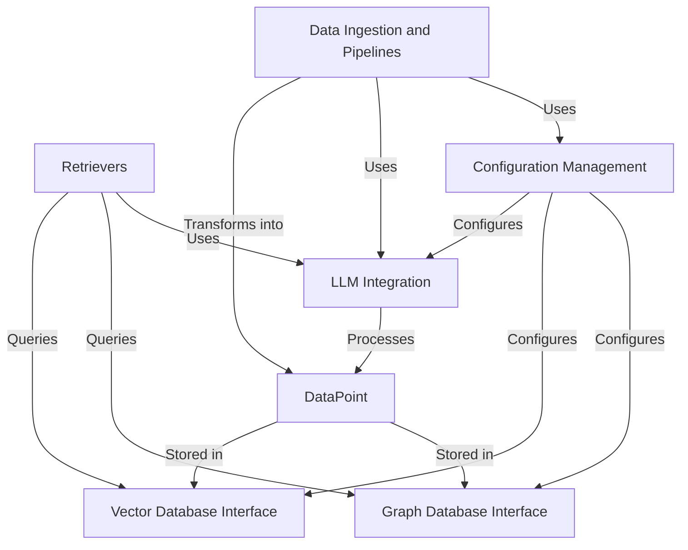

# Tutorial: cognee

Cognee is an **AI-powered knowledge management system** that acts like an *intelligent memory*. It takes raw data from various sources (*Data Ingestion and Pipelines*), transforms it into structured "fact cards" (*DataPoint*), and links them together to form a complex *knowledge graph*. It uses *Large Language Models (LLMs)* for understanding and generating content, and efficiently retrieves relevant information using *Vector and Graph Databases* via specialized *Retrievers*. All its operations are controlled by a central *Configuration Management* system.

**Source Repository:** [https://github.com/topoteretes/cognee.git](https://github.com/topoteretes/cognee.git)

## Chapters

1. [Data Ingestion and Pipelines
](01_data_ingestion_and_pipelines_.md)
2. [DataPoint
](02_datapoint_.md)
3. [LLM Integration
](03_llm_integration_.md)
4. [Retrievers
](04_retrievers_.md)
5. [Graph Database Interface
](05_graph_database_interface_.md)
6. [Vector Database Interface
](06_vector_database_interface_.md)
7. [Configuration Management
](07_configuration_management_.md)

---

Generated by [AI Codebase Knowledge Builder](https://github.com/The-Pocket/Tutorial-Codebase-Knowledge)