# Tutorial: crush

Crush is a **terminal-based AI assistant** that helps developers with *software development tasks*. It offers an *interactive chat interface* powered by an AI agent that can understand requests, execute commands, modify files, and learn from code context using Language Server Protocol (LSP) integration, all while ensuring user control through a *permission system*.


**Source Repository:** [https://github.com/charmbracelet/crush.git](https://github.com/charmbracelet/crush.git)

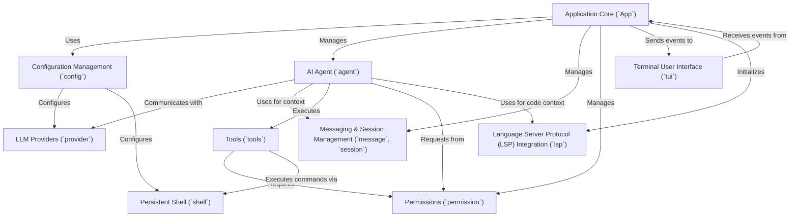

## Table of Contents

1. [Chapter 1: Terminal User Interface (`tui`)](#chapter-1-terminal-user-interface-tui)
2. [Chapter 2: Application Core (`App`)](#chapter-2-application-core-app)
3. [Chapter 3: AI Agent (`agent`)](#chapter-3-ai-agent-agent)
4. [Chapter 4: Messaging & Session Management (`message`, `session`)](#chapter-4-messaging--session-management-message-session)
5. [Chapter 5: Tools (`tools`)](#chapter-5-tools-tools)
6. [Chapter 6: Persistent Shell (`shell`)](#chapter-6-persistent-shell-shell)
7. [Chapter 7: Permissions (`permission`)](#chapter-7-permissions-permission)
8. [Chapter 8: Language Server Protocol (LSP) Integration (`lsp`)](#chapter-8-language-server-protocol-lsp-integration-lsp)
9. [Chapter 9: LLM Providers (`provider`)](#chapter-9-llm-providers-provider)
10. [Chapter 10: Configuration Management (`config`)](#chapter-10-configuration-management-config)

---

# Chapter 1: Terminal User Interface (`tui`)

Welcome to the world of Crush! In this first chapter, we're going to explore the very first thing you'll see and interact with when you use Crush: the Terminal User Interface, or `tui` for short.

Imagine you're driving a car. You don't see the engine or the complex electronics; instead, you see a dashboard with speedometers, fuel gauges, and buttons. You interact with the car through the steering wheel, pedals, and gear stick. The `tui` in Crush is just like that dashboard – it's the visual and interactive front-end that lets you control and understand what Crush is doing, all within your terminal window!

## What Problem Does the `tui` Solve?

Crush is a powerful tool, but without a good way to interact with it, it would be difficult to use. How would you type commands? How would you see chat messages from an AI agent? How would you know what files are being changed? The `tui` provides all of this in a friendly, organized way.

Let's think about a central use case: **having a conversation with Crush's AI agent and seeing its responses.** You'll type your question, and Crush will display the AI's answer, potentially showing you file changes or other actions it's taking. The `tui` makes this entire interaction possible and pleasant.

## Key Concepts of the `tui`

The `tui` is built using a fantastic Go library called [Bubble Tea](https://github.com/charmbracelet/bubbletea). Bubble Tea helps us create interactive applications right in your terminal, making them feel almost like desktop apps!

Here are the key concepts that make up Crush's `tui`:

1.  **Pages:** Think of pages as different screens or views in a traditional application. In Crush, you might have a chat page, a settings page, or a splash screen.
2.  **Components:** Pages are made up of smaller, reusable building blocks called components. For example, a chat page might have a "message list" component to show conversations, an "editor" component for typing, and a "status bar" component at the bottom.
3.  **Dialogs:** These are like pop-up windows that appear on top of your current page to ask for input or display important information (e.g., "Are you sure you want to quit?").
4.  **Key Bindings:** Since you're in the terminal, you interact mainly with your keyboard. Key bindings define what happens when you press certain keys (e.g., `Ctrl+C` to quit, `Enter` to send a message).
5.  **Styling:** Just like a good website uses CSS to make things look nice, Crush's `tui` uses [Lipgloss](https://github.com/charmbracelet/lipgloss) to add colors, borders, and layouts, making the terminal experience visually appealing.

## How the `tui` Handles a Chat Conversation

Let's walk through our use case: you want to ask Crush's AI agent a question.

1.  **You type your message:** You'll see an input field (the "editor" component) where you can type your question.
2.  **You press Enter:** This sends your message.
3.  **Crush processes your request:** Behind the scenes, the message goes to the [AI Agent (`agent`)](03_ai_agent___agent___.md) and other parts of Crush.
4.  **Crush displays the AI's response:** The AI's answer appears in the message list, along with any other information like file changes.

### Example: Sending a Message

Here's how the `tui` handles your message input:

```go
// internal/tui/components/chat/editor/editor.go (simplified)
func (m *editorCmp) Update(msg tea.Msg) (tea.Model, tea.Cmd) {
	switch msg := msg.(type) {
	case tea.KeyMsg:
		switch {
		case key.Matches(msg, m.keyMap.Submit): // You pressed Enter
			text := m.textarea.Value() // Get what you typed
			if text == "" {
				return m, nil // Don't send empty messages
			}
			m.textarea.SetValue("") // Clear the input field
			// Send your message to the main application
			return m, m.app.SendMessage(text, m.attachments...)
		}
	}
	// ... other update logic for the editor component
	return m, m.textarea.Update(msg)
}
```
This simplified code snippet from the `editor` component shows that when you press the "Submit" key (which is usually `Enter`), it grabs your typed text, clears the input field, and then sends your message to the main Crush application (`m.app.SendMessage`).

### Example: Displaying Messages

Once the AI agent responds, the `tui` needs to show that response. This happens in the `messages` component:

```go
// internal/tui/components/chat/messages/messages.go (simplified)
type messageCmp struct {
	message message.Message // The actual message content
	// ... other fields
}

func (m *messageCmp) View() string {
	t := styles.CurrentTheme()
	content := m.message.Content().Text // Get the text to display

	// Apply styling based on who sent the message (user or assistant)
	if m.message.Role == message.User {
		return t.S().UserMessage.Render(content)
	}
	return t.S().AssistantMessage.Render(content)
}
```
This `View()` function in the `messageCmp` component takes the `message.Message` data and renders it. It checks if the message came from the `User` or the `Assistant` and applies different styles (like colors or padding) to make it easy to read.

## Under the Hood: How the `tui` Works

Let's look at the internal workings when you start Crush and see the main chat interface.

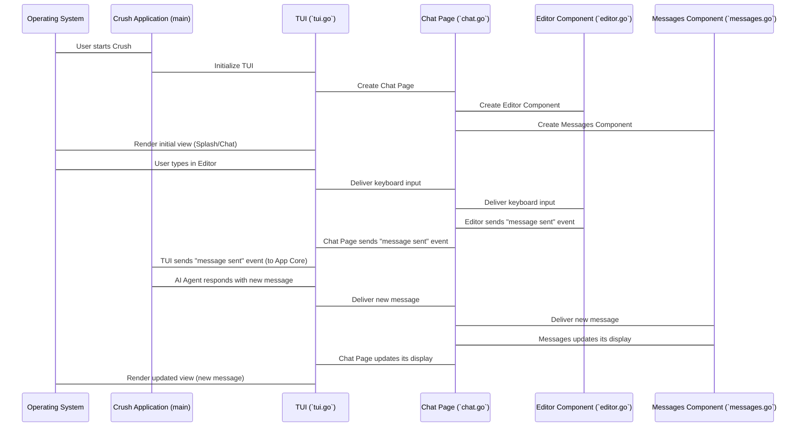

1.  **Starting Crush:** When you launch Crush, the main application (the `Crush` participant) starts up.
2.  **Initializing the `tui`:** The `Crush` application then tells the `tui` package to initialize itself. This happens in `internal/tui/tui.go`.
3.  **Creating Pages and Components:** The `tui` creates the different "pages" it can show. Initially, it might show a splash screen (`internal/tui/components/chat/splash/splash.go`) or directly the main chat page (`internal/tui/page/chat/chat.go`). The chat page, in turn, creates its smaller components like the message editor (`internal/tui/components/chat/editor/editor.go`) and the message display area (`internal/tui/components/chat/messages/messages.go`).
4.  **Initial Render:** The `tui` then draws this initial layout to your terminal screen.
5.  **User Interaction:** When you type something or press a key, your operating system (`OS`) sends this input to the `tui`.
6.  **Event Handling:** The `tui` (`internal/tui/tui.go`) receives this input and decides which page or component should handle it. If you're typing in the editor, the input goes to the `chatPage`, and then to the `editorCmp`.
7.  **Updating State:** The `editorCmp` updates its internal state (what text you've typed). When you press `Enter`, it sends a message (an event) back up the chain, eventually reaching the main `Crush` application.
8.  **AI Response:** Once the [AI Agent (`agent`)](03_ai_agent___agent___.md) processes your message and generates a response, it sends that new message back to the `tui`.
9.  **Re-rendering:** The `tui` receives the new message, tells the `chatPage`, which then tells the `messagesCmp` to display it. The `tui` then re-draws the screen with the new message included.

This cycle of "receive input -> update state -> re-render" is the core of how interactive terminal applications like Crush work.

### `appModel` in `tui.go`

The heart of the entire `tui` is the `appModel` struct in `internal/tui/tui.go`. It's like the conductor of an orchestra, managing all the different parts.

```go
// internal/tui/tui.go (simplified)
type appModel struct {
	currentPage  page.PageID // Which page is currently showing
	pages        map[page.PageID]util.Model // All available pages
	// ... other fields like dialogs, status bar, etc.
}

// Update handles incoming messages (events) for the entire TUI.
func (a appModel) Update(msg tea.Msg) (tea.Model, tea.Cmd) {
	var cmds []tea.Cmd
	// ... logic to handle global key bindings like Ctrl+C
	// ... logic to pass messages to the current page or dialogs

	// Pass the message to the currently active page
	currentPageModel, cmd := a.pages[a.currentPage].Update(msg)
	a.pages[a.currentPage] = currentPageModel.(util.Model)
	cmds = append(cmds, cmd)

	return a, tea.Batch(cmds...)
}

// View constructs the final visual output for the entire TUI.
func (a *appModel) View() tea.View {
	// Gets the view from the current page
	pageView := a.pages[a.currentPage].View()

	// Lays out the page view, status bar, and any active dialogs
	appView := lipgloss.JoinVertical(lipgloss.Top, pageView, a.status.View())

	// Handles overlays like dialogs or completions
	// ...
	return view
}

// New creates and initializes a new TUI application model.
func New(app *app.App) tea.Model {
	chatPage := chat.New(app) // Create the chat page
	model := &appModel{
		currentPage: chat.ChatPageID, // Set chat as the initial page
		app:         app,
		pages: map[page.PageID]util.Model{
			chat.ChatPageID: chatPage, // Register the chat page
		},
		// ... initialize other components
	}
	return model
}
```
The `appModel`'s `Update` method is crucial. It's the central hub for all events happening in the `tui`. It decides if an event is for a dialog, a global key binding, or should be passed down to the currently active page (like the chat page). The `View` method then takes the rendered output from the current page and combines it with other elements like the status bar or dialogs to create the final display you see.

When Crush starts, the `New` function in `tui.go` creates an `appModel`, sets the initial page to `chat.ChatPageID`, and registers the `chatPage` model.

### `chatPage` in `chat.go`

The `chatPage` (`internal/tui/page/chat/chat.go`) is responsible for the layout and interaction specifically within the chat interface. It manages the editor, the list of messages, and other chat-related elements.

```go
// internal/tui/page/chat/chat.go (simplified)
type chatPage struct {
	editor   editor.Editor      // The input field for typing messages
	messages messages.MessageCmp // The component that displays messages
	// ... other components like sidebar, header
}

func (p *chatPage) Update(msg tea.Msg) (tea.Model, tea.Cmd) {
	var cmds []tea.Cmd
	// ... logic to handle chat-specific messages

	// Update the editor component
	editorModel, cmd := p.editor.Update(msg)
	p.editor = editorModel.(editor.Editor)
	cmds = append(cmds, cmd)

	// Update the messages component
	messagesModel, cmd := p.messages.Update(msg)
	p.messages = messagesModel.(messages.MessageCmp)
	cmds = append(cmds, cmd)

	return p, tea.Batch(cmds...)
}

func (p *chatPage) View() string {
	// Render the editor and messages components
	editorView := p.editor.View()
	messagesView := p.messages.View()

	// Combine them vertically (messages above editor)
	return lipgloss.JoinVertical(lipgloss.Top, messagesView, editorView)
}

// New creates a new chat page model.
func New(app *app.App) page.Page {
	return &chatPage{
		editor:   editor.New(app),   // Initialize the editor
		messages: messages.New(),    // Initialize the messages display
		// ... initialize other components
	}
}
```
The `chatPage`'s `Update` method passes relevant messages down to its sub-components, like the `editor` and `messages` components, allowing them to handle their specific updates. Its `View` method then combines the visual output of these components to form the complete chat screen.

## Conclusion

In this chapter, we've taken our first look at the Terminal User Interface (`tui`) of Crush. We learned that it's the visual dashboard that allows you to interact with Crush, much like a car's dashboard. We explored how it handles a simple chat conversation, from typing your message to seeing the AI's response, and peeked at the underlying code that makes it all work using Bubble Tea and Lipgloss.

The `tui` is just one part of the Crush ecosystem. In the next chapter, we'll dive into the core brain of Crush, the [Application Core (`App`)](02_application_core___app___.md), which orchestrates all the different parts of Crush, including how it communicates with the `tui`.

[Chapter 2: Application Core (`App`)](02_application_core___app___.md)

---

# Chapter 2: Application Core (`App`)

Welcome back! In [Chapter 1: Terminal User Interface (`tui`)](01_terminal_user_interface___tui___.md), we learned about Crush's dashboard – the `tui` – which lets you see and interact with the application. But just like a car's dashboard needs an engine and other systems to work, the `tui` needs a "brain" to tell it what to display and what actions to take. That's where the **Application Core**, or `App` for short, comes in!

## What Problem Does the `App` Solve?

Imagine Crush as a small city. You, the user, interact with the `tui` (the city's streets, buildings, and signs). But who manages the city's services, like electricity, water, and emergency response? Who makes sure everything runs smoothly and communicates with each other? That's the job of the `App`!

The `App` is the central orchestrator of Crush. It's like the main control panel of a spaceship, bringing together all the different parts and making them work as a team. Without the `App`, Crush would just be a bunch of separate pieces that don't know how to talk to each other.

Let's think about our central use case from the last chapter: **having a conversation with Crush's AI agent.** When you type a message into the `tui` and press Enter, the `tui` doesn't directly talk to the [AI Agent (`agent`)](03_ai_agent___agent___.md). Instead, it sends your message to the `App`. The `App` then figures out:

1.  "Okay, a new message from the user! I need to store this in our message history."
2.  "Now, I should pass this message to the [AI Agent (`agent`)](03_ai_agent___agent___.md) so it can generate a response."
3.  "When the AI agent responds, I'll receive that response, store it, and then tell the `tui` to display it."

The `App` acts as the middleman, making sure messages and actions flow correctly between all the different parts of Crush.

## Key Concepts of the `App`

The `App` is a powerful hub, managing many important aspects of Crush:

1.  **Orchestration:** It connects all the different services and components, like the [AI Agent (`agent`)](03_ai_agent___agent___.md), [Messaging & Session Management (`message`, `session`)](04_messaging___session_management___message____session___.md), [Permissions (`permission`)](07_permissions___permission___.md), and [Language Server Protocol (LSP) Integration (`lsp`)](08_language_server_protocol__lsp__integration___lsp___.md).
2.  **Initialization:** When Crush starts, the `App` is responsible for setting up all these services, making sure they are ready to go.
3.  **Configuration:** It holds and provides access to Crush's settings, which come from the [Configuration Management (`config`)](10_configuration_management___config___.md).
4.  **Event Handling:** It listens for events (like you typing a message) and dispatches them to the correct component, then collects responses and sends them back to the `tui`.
5.  **Shutdown:** When you close Crush, the `App` gracefully shuts down all its components, saving data and closing connections properly.

## How the `App` Manages a Chat Conversation

Let's trace our chat conversation example again, but this time focusing on the `App`'s role.

1.  **You type and press Enter:** The `tui` (specifically the editor component) captures your input.
2.  **`tui` sends message to `App`:** The `tui` doesn't know *how* to process an AI query; it just knows *that* you've sent a message. So, it hands it over to the `App`.
    ```go
    // internal/tui/components/chat/editor/editor.go (simplified)
    // ... inside the Update method when Enter is pressed
    return m, m.app.SendMessage(text, m.attachments...)
    ```
    Here, `m.app.SendMessage` is a call to a method on the `App` instance. The `tui` is simply asking the `App` to handle sending the message.
3.  **`App` processes the message:** The `App` receives your message. It does a few things:
    *   It uses its `Messages` service to save your message to the chat history.
    *   It then passes your message to the `CoderAgent` (the [AI Agent (`agent`)](03_ai_agent___agent___.md)) for processing.
    ```go
    // internal/app/app.go (simplified, inside an App method)
    func (app *App) SendMessage(text string, attachments ...message.Attachment) tea.Cmd {
        // 1. Store the user's message
        userMsg, err := app.Messages.AddUserMessage(app.globalCtx, text, attachments...)
        // ... error handling and logging ...

        // 2. Pass it to the AI agent
        return app.CoderAgent.SendMessage(app.globalCtx, userMsg)
    }
    ```
    This `SendMessage` function within the `App` is a simplified look at how it coordinates actions. It first interacts with the `Messages` service, then with the `CoderAgent` service.
4.  **AI Agent responds:** The [AI Agent (`agent`)](03_ai_agent___agent___.md) thinks about your message and generates a response.
5.  **`App` receives AI response:** The `App` gets the AI's response back from the [AI Agent (`agent`)](03_ai_agent___agent___.md).
    *   It again uses its `Messages` service to save the AI's response.
    *   It then tells the `tui` that there's a new message to display. This is done by sending a `tea.Msg` (a Bubble Tea message) back to the `tui`.

This constant back-and-forth, managing data, and coordinating between different parts is the `App`'s main role.

## Under the Hood: How the `App` Works

Let's look at the lifecycle of Crush, from starting up to shutting down, and how the `App` plays its central role.

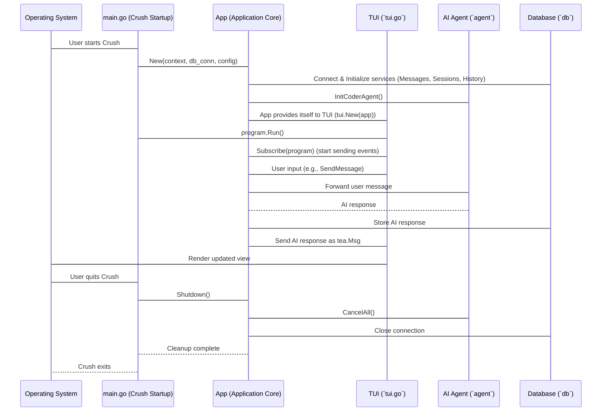

1.  **Crush Startup (`main.go`):** When you run `crush` in your terminal, the `main.go` file is the first to execute. It's like the launchpad for our spaceship.
    ```go
    // internal/cmd/root.go (simplified)
    func runE(cmd *cobra.Command, args []string) error {
        app, err := setupApp(cmd) // This is where our App is created!
        if err != nil { return err }
        defer app.Shutdown() // Ensure App shuts down when main exits

        program := tea.NewProgram(tui.New(app), tea.WithAltScreen(), ...)
        go app.Subscribe(program) // App starts sending events to TUI
        if _, err := program.Run(); err != nil { return err }
        return nil
    }
    ```
    The `main.go` (specifically `root.go` in the `cmd` package) calls `setupApp` to create an `App` instance. Notice `defer app.Shutdown()` – this ensures that the `App`'s shutdown sequence is called automatically when the program finishes. Also, `tui.New(app)` shows that the `App` instance is passed directly to the `tui` during its creation, allowing the `tui` to communicate with the `App`.
2.  **`App` Initialization (`app.go`):** The `New` function in `internal/app/app.go` is where the `App` comes to life.
    ```go
    // internal/app/app.go (simplified)
    func New(ctx context.Context, conn *sql.DB, cfg *config.Config) (*App, error) {
        q := db.New(conn)
        app := &App{
            Sessions:    session.NewService(q),
            Messages:    message.NewService(q),
            History:     history.NewService(q, conn),
            Permissions: permission.NewPermissionService(...),
            LSPClients:  csync.NewMap[string, *lsp.Client](),
            globalCtx: ctx,
            config: cfg,
            events: make(chan tea.Msg, 100), // Channel for TUI events
            // ...
        }
        app.setupEvents() // Start listening for internal events
        app.initLSPClients(ctx)
        if err := app.InitCoderAgent(); err != nil { return nil, err } // Initialize AI Agent
        return app, nil
    }
    ```
    Here, the `App` sets up all its core services: `Sessions`, `Messages`, `History`, `Permissions`, and `LSPClients`. It also initializes the `CoderAgent` (our [AI Agent (`agent`)](03_ai_agent___agent___.md)) and a channel (`events`) to communicate with the `tui`.
3.  **Event Subscription (`app.Subscribe`):** Once the `App` and `tui` are set up, the `App` starts `Subscribe`ing to its internal `events` channel and sends any messages it receives to the `tui`.
    ```go
    // internal/app/app.go (simplified)
    func (app *App) Subscribe(program *tea.Program) {
        // ... setup for graceful shutdown ...
        for {
            select {
            case <-tuiCtx.Done(): return // TUI wants to stop
            case msg, ok := <-app.events: // A message from an internal service!
                if !ok { return }
                program.Send(msg) // Send it to the TUI to be displayed
            }
        }
    }
    ```
    This `Subscribe` method runs in its own "thread" (goroutine in Go). It constantly watches the `app.events` channel. When any internal service (like the AI agent) sends an event (e.g., "new AI message ready"), the `App` picks it up and forwards it to the `tui`'s `tea.Program` using `program.Send(msg)`. This is how the `tui` gets updates from the `App`.
4.  **Shutdown (`app.Shutdown`):** When Crush is closed, the `App` takes care of cleaning up.
    ```go
    // internal/app/app.go (simplified)
    func (app *App) Shutdown() {
        if app.CoderAgent != nil {
            app.CoderAgent.CancelAll() // Tell the AI agent to stop
        }
        // Shutdown all LSP clients.
        for name, client := range app.LSPClients.Seq2() {
            // ... close LSP connections ...
        }
        // Call all registered cleanup functions (like closing the DB connection)
        for _, cleanup := range app.cleanupFuncs {
            if cleanup != nil {
                if err := cleanup(); err != nil {
                    slog.Error("Failed to cleanup app properly", "error", err)
                }
            }
        }
    }
    ```
    The `Shutdown` method ensures that all active processes (like the AI agent's tasks) are cancelled, connections (like LSP clients and the database) are closed, and any other necessary cleanup is performed. This prevents data loss or corrupted files.

The `App` is the glue that holds Crush together, ensuring that all its powerful features communicate and operate harmoniously.

## Conclusion

In this chapter, we've uncovered the vital role of the Application Core (`App`) in Crush. We learned that it acts as the central brain, orchestrating all major components, from handling user messages and interacting with the [AI Agent (`agent`)](03_ai_agent___agent___.md) to managing system services and ensuring a graceful shutdown. We saw how it connects the `tui` with the internal workings of Crush, making the entire application functional and responsive.

Next, we'll dive deeper into one of the `App`'s most exciting components: the [AI Agent (`agent`)](03_ai_agent___agent___.md), and discover how it processes your requests to provide intelligent assistance.

[Chapter 3: AI Agent (`agent`)](03_ai_agent___agent___.md)

---

# Chapter 3: AI Agent (`agent`)

Welcome back to Crush! In [Chapter 1: Terminal User Interface (`tui`)](01_terminal_user_interface___tui___.md), we learned about the visual part of Crush, and in [Chapter 2: Application Core (`App`)](02_application_core___app___.md), we saw how everything is connected and orchestrated. Now, it's time to meet the star of the show: the **AI Agent**, or `agent` for short!

## What Problem Does the `agent` Solve?

Imagine you have a super-smart personal assistant who can understand what you want, plan how to do it, use various tools to get the job done, and then tell you the results. That's exactly what the `agent` in Crush is! It's the intelligent brain that takes your requests and turns them into actions and meaningful responses.

Let's revisit our central use case: **having a conversation with Crush's AI agent and getting intelligent help.** When you ask Crush to "Find all files related to user authentication and summarize them," the `tui` passes this to the `App`, but it's the `agent` that actually understands what "find files" and "summarize" mean. It then decides which tools to use (like searching your codebase) and how to present the information back to you.

Without the `agent`, Crush would just be an empty shell. The `agent` gives Crush its intelligence, allowing it to understand natural language, make decisions, and interact with the world (your project files, for example) to accomplish tasks.

## Key Concepts of the `agent`

The `agent` is like a highly skilled problem-solver. Here are its core abilities:

1.  **Understanding Your Request:** It uses Large Language Models (LLMs) to comprehend what you're asking for.
2.  **Planning Actions:** Based on your request, it figures out a step-by-step plan. This might involve using one or more "tools."
3.  **Using Tools:** The `agent` has access to a set of specialized [Tools (`tools`)](05_tools___tools___.md). Think of these as its hands and eyes – they allow it to perform actions like reading files, searching code, or even launching another agent for complex tasks.
4.  **Communicating with LLMs:** It sends your request (and its internal thoughts) to powerful LLMs (like GPT-4 or Gemini) and interprets their responses.
5.  **Managing the Conversation:** It keeps track of the ongoing discussion, making sure its responses are relevant to what's been said before.
6.  **Reporting Results:** Once it has completed a task, it provides a clear and concise summary of its findings or actions back to you.

## How the `agent` Handles a Chat Conversation

Let's trace our example: "Find all files related to user authentication and summarize them."

1.  **You type your request:** You type "Find all files related to user authentication and summarize them" into the `tui`.
2.  **`tui` sends to `App`:** The `tui` sends your message to the [Application Core (`App`)](02_application_core___app___.md).
3.  **`App` sends to `agent`:** The `App` recognizes this as a task for the `agent` and passes your message to it.
4.  **`agent` understands and plans:**
    *   The `agent` receives your message.
    *   It uses an LLM to understand that you want to *find files* and *summarize* them.
    *   It might decide to use a "GlobTool" or "GrepTool" to find files, and then a "ViewTool" to read them. Finally, it uses an LLM to summarize.
5.  **`agent` executes tools:** It calls the relevant tools, like searching your project for "authentication."
6.  **`agent` processes results:** The tools return their findings (e.g., a list of file paths, then the content of those files). The `agent` then feeds this back to the LLM to generate a summary.
7.  **`agent` sends response to `App`:** Once the summary is ready, the `agent` sends it back to the `App`.
8.  **`App` sends to `tui`:** The `App` receives the AI's response and sends it to the `tui` for display.
9.  **`tui` displays response:** You see the summary in your terminal.

## Under the Hood: How the `agent` Works

Let's simplify the interaction when the `App` asks the `agent` to run a task based on your prompt.

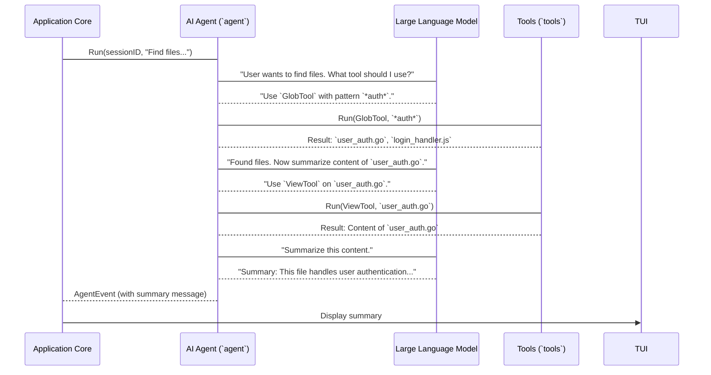

1.  **`App` calls `agent.Run()`:** The `App` starts the `agent` with your prompt in `internal/llm/agent/agent.go`.
    ```go
    // internal/llm/agent/agent.go (simplified)
    func (a *agent) Run(ctx context.Context, sessionID string, content string, attachments ...message.Attachment) (<-chan AgentEvent, error) {
        // ... setup context and track active requests ...
        go a.startAgentLoop(ctx, sessionID, content, attachments)
        return a.Broker.Subscribe(sessionID), nil // Return a channel to send updates
    }
    ```
    The `Run` method immediately starts a new "agent loop" in the background (`startAgentLoop`) and returns a channel (`Broker.Subscribe`). This channel is how the `agent` will send updates (like its final response) back to the `App`.

2.  **`agent` enters `startAgentLoop()`:** This is where the magic happens. The `agent` continuously talks to the LLM and uses tools until it's done.
    ```go
    // internal/llm/agent/agent.go (simplified)
    func (a *agent) startAgentLoop(ctx context.Context, sessionID string, content string, attachments []message.Attachment) {
        // ... initial setup, get chat history, etc. ...

        for { // Loop until the task is complete or an error occurs
            response, err := a.provider.Chat(ctx, chatRequest) // Talk to the LLM!
            // ... error handling ...

            if response.Message.ToolCalls != nil { // Did the LLM suggest using a tool?
                for _, tc := range response.Message.ToolCalls {
                    toolResponse, err := a.runTool(ctx, sessionID, tc) // Run the tool
                    // ... handle tool response and add to chat history ...
                }
            } else { // LLM provided a text response
                a.messages.AddAssistantMessage(ctx, sessionID, response.Message.Content().String())
                a.Broker.Publish(sessionID, AgentEvent{
                    Type:    AgentEventTypeResponse,
                    Message: response.Message,
                })
                return // Task complete!
            }
            // If tools were run, loop again to ask LLM what to do next
        }
    }
    ```
    Inside `startAgentLoop`, the `agent` performs a loop:
    *   It sends the current conversation history (your prompt + any previous tool outputs) to the `provider.Chat()` method, which communicates with the actual LLM.
    *   The LLM responds. It might suggest `ToolCalls` (meaning it wants to use a tool) or give a direct text `Message`.
    *   If `ToolCalls` are suggested, the `agent` calls `a.runTool()` to execute them.
    *   If a text `Message` is received, the `agent` adds it to the message history and publishes an `AgentEvent` to its `Broker`. This event contains the final message, which the `App` (listening on the subscribed channel) will receive and forward to the `tui`. Then the loop ends.

3.  **`agent.runTool()`:** This method looks up the requested tool and executes it.
    ```go
    // internal/llm/agent/agent.go (simplified)
    func (a *agent) runTool(ctx context.Context, sessionID string, tc tools.ToolCall) (tools.ToolResponse, error) {
        tool, ok := a.baseTools.Get(tc.FunctionName) // Find the tool by name
        if !ok {
            // ... check mcpTools ...
            return tools.NewTextErrorResponse("tool not found"), nil
        }
        return tool.Run(ctx, tc) // Run the tool!
    }
    ```
    The `runTool` function looks up the tool name (e.g., "GlobTool") in its list of available tools (`a.baseTools` or `a.mcpTools`) and then calls that tool's `Run` method. The tool performs its action (like searching files) and returns a `tools.ToolResponse`.

### The `agent` Tool Itself!

Interestingly, the `agent` can even "use" another agent as a tool! This allows for complex, nested problem-solving. If the `agent` decides a sub-task is too complex for its current set of tools, it can launch a new `agent` to handle that specific problem.

```go
// internal/llm/agent/agent-tool.go (simplified)
type agentTool struct {
	agent    Service // This is the AI Agent service itself!
	sessions session.Service
	messages message.Service
}

func (b *agentTool) Run(ctx context.Context, call tools.ToolCall) (tools.ToolResponse, error) {
	// ... parse parameters for the new agent's prompt ...
	session, err := b.sessions.CreateTaskSession(ctx, call.ID, sessionID, "New Agent Session")
	// ... error handling ...

	done, err := b.agent.Run(ctx, session.ID, params.Prompt) // Launch a new agent!
	// ... error handling ...

	result := <-done // Wait for the new agent to finish
	// ... process result and return ...
}
```
This `agentTool` (found in `internal/llm/agent/agent-tool.go`) demonstrates how an `agent` can recursively call another `agent` to solve a problem. It creates a new "task session" for the sub-agent and then calls `b.agent.Run()` with the new agent's prompt. It then waits for the result from this sub-agent before continuing.

## Conclusion

In this chapter, we've explored the intelligent core of Crush: the AI Agent (`agent`). We learned that it's the personal assistant that understands your requests, plans actions using various [Tools (`tools`)](05_tools___tools___.md), communicates with LLMs, and reports back results. We saw how it orchestrates complex tasks by repeatedly interacting with LLMs and executing tools, and even how it can launch other agents for nested problem-solving.

Next up, we'll dive deeper into how Crush keeps track of all your conversations and interactions with the `agent` in [Chapter 4: Messaging & Session Management (`message`, `session`)](04_messaging___session_management___message____session___.md).

[Chapter 4: Messaging & Session Management (`message`, `session`)](04_messaging___session_management___message____session___.md)

---

# Chapter 4: Messaging & Session Management (`message`, `session`)

Welcome back to Crush! In [Chapter 3: AI Agent (`agent`)](03_ai_agent___agent___.md), we met the intelligent brain of Crush, the `agent`, which processes your requests. But how does Crush remember what you've said before? How does it keep different conversations separate, even if they're about the same project? That's where **Messaging & Session Management** comes in, using the `message` and `session` abstractions!

## What Problem Do `message` and `session` Solve?

Imagine you're having a conversation with a friend. You don't just say random things; you build on what was said before. You also wouldn't mix up a conversation about planning a party with a conversation about fixing your car, even if you're talking to the same friend!

In Crush, the `message` and `session` components work together to do just that:

*   **`message`:** This is like a single entry in a diary. It records each "turn" in a conversation – what you said, what the AI said, or what a tool did. It's the building block of any interaction.
*   **`session`:** This is like a whole diary or notebook dedicated to a specific topic or project. It groups together all the related `message`s into one continuous conversation. This allows Crush to keep context for different tasks separate.

Let's think about our central use case: **having a continuous conversation with Crush's AI agent about a specific coding task.** You want to ask a question, get an answer, then ask a follow-up question, and have Crush remember the previous context. You also want to be able to switch to a *different* coding task and have a completely separate conversation there. `message` and `session` make this possible!

## Key Concepts of `message`

A `message` is more than just text; it's a rich data structure that captures everything about a single turn in the conversation.

1.  **Role:** Who sent the message? Was it the `User` (you), the `Assistant` (the AI agent), `System` (Crush itself), or `Tool` (the output of a tool used by the AI)?
2.  **Content:** This is the actual information. It can be simple text (`TextContent`), the AI's "thinking process" (`ReasoningContent`), an image URL (`ImageURLContent`), or even details about a tool being called (`ToolCall`) or its result (`ToolResult`).
3.  **Session ID:** Every `message` belongs to a `session`. This is the link that ties it to a specific conversation.
4.  **Metadata:** Things like when it was created, which AI model or provider was used, and unique IDs.

Think of a `message` as a detailed record of *what happened* at a specific point in time during a conversation.

## Key Concepts of `session`

A `session` organizes these individual `message`s into meaningful conversations.

1.  **ID:** A unique identifier for this particular conversation.
2.  **Title:** A human-readable name for the session (e.g., "Implement User Login," "Debug Database Connection").
3.  **Parent Session ID:** This is really cool! Sessions can be nested. If the AI agent needs to solve a sub-problem, it might create a "child" session to work on that specific task, keeping the messages for that sub-task separate but linked to the main conversation.
4.  **Metrics:** `session`s also keep track of important statistics like `MessageCount`, `PromptTokens` (how much input was sent to the AI), `CompletionTokens` (how much output the AI generated), and `Cost` (how much that interaction cost, if applicable).

A `session` is like a folder for all the messages related to one specific topic or task.

## How `message` and `session` Manage a Chat Conversation

Let's trace our example: you're working on "Implement User Login" and have a conversation.

1.  **Start a new `session`:** When you begin a new task, Crush creates a new `session` for it.
    ```go
    // Simplified: App asks Session service to create a new session
    // internal/app/app.go (inside NewSession method)
    session, err := app.Sessions.Create(app.globalCtx, title)
    if err != nil { /* ... handle error ... */ }
    // Now you have an empty session ready for messages!
    ```
    The `App` (from [Chapter 2: Application Core (`App`)](02_application_core___app___.md)) uses the `Sessions` service to create a new `session` with a title.
2.  **You send a message:** You type "How do I implement user login?"
    ```go
    // Simplified: App asks Message service to add user message to current session
    // internal/app/app.go (inside SendMessage method)
    userMsg, err := app.Messages.AddUserMessage(app.globalCtx, app.currentSession.ID, text, attachments...)
    if err != nil { /* ... handle error ... */ }
    // userMsg now represents your question, linked to the current session.
    ```
    Your input becomes a `message.Message` with `Role: User`, and it's saved by the `Messages` service, linked to the currently active `session.ID`.
3.  **AI responds:** The [AI Agent (`agent`)](03_ai_agent___agent___.md) processes your message and replies.
    ```go
    // Simplified: App asks Message service to add assistant message
    // internal/app/app.go (after agent responds)
    aiMsg, err := app.Messages.AddAssistantMessage(app.globalCtx, app.currentSession.ID, aiResponseText)
    if err != nil { /* ... handle error ... */ }
    // aiMsg now represents the AI's answer, also linked to the current session.
    ```
    The AI's answer is also saved as a `message.Message` with `Role: Assistant`, still linked to the same `session.ID`.
4.  **Follow-up question:** You ask "Can you show me an example in Go?"
    *   This becomes another `User` `message`.
    *   Because it's in the same `session`, the [AI Agent (`agent`)](03_ai_agent___agent___.md) automatically has access to the previous `message`s (your first question and its first answer) to understand the context of your follow-up.
5.  **Switching `session`s:** If you decide to work on "Debug Database Connection," you simply switch to (or create) that `session`. All future `message`s will then be associated with that new `session`, completely separate from the "Implement User Login" conversation.

This ensures that each conversation is self-contained and has its own history, allowing Crush to maintain context effectively.

## Under the Hood: How `message` and `session` Work

Both `message` and `session` services interact with Crush's database to store and retrieve their data, ensuring persistence even if Crush is closed.

Let's look at a simplified sequence of how a new `message` is created and added to a `session`:

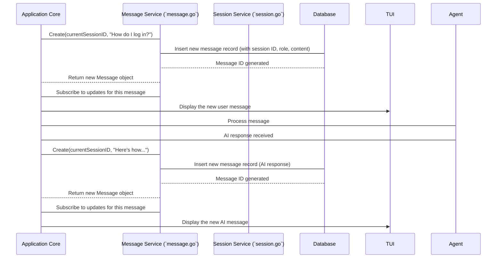

1.  **`App` calls `message.Service.Create()`:** When the `App` wants to save a new message (either from you or the AI), it calls the `Create` method on its `message.Service` instance.
    ```go
    // internal/message/message.go (simplified Create method)
    func (s *service) Create(ctx context.Context, sessionID string, params CreateMessageParams) (Message, error) {
        // ... prepare message parts for storage ...
        dbMessage, err := s.q.CreateMessage(ctx, db.CreateMessageParams{
            ID:        uuid.New().String(), // Generate a unique ID
            SessionID: sessionID,           // Link to the session!
            Role:      string(params.Role),
            Parts:     string(partsJSON),
            // ... other fields ...
        })
        if err != nil { /* ... handle error ... */ }
        message, err := s.fromDBItem(dbMessage) // Convert database item to our Message struct
        if err != nil { /* ... handle error ... */ }
        s.Publish(pubsub.CreatedEvent, message) // Tell anyone listening that a new message was created
        return message, nil
    }
    ```
    This `Create` function generates a unique ID for the message, associates it with the `sessionID` you provide, converts the `ContentParts` into a format suitable for the database (JSON), and then tells the database to save it. It also uses a `pubsub.Broker` to "publish" an event, letting other parts of Crush (like the `tui`) know that a new message exists.

2.  **`message.Message` Structure:** Let's look at the `Message` struct itself.
    ```go
    // internal/message/content.go (simplified)
    type Message struct {
        ID        string
        Role      MessageRole // User, Assistant, System, Tool
        SessionID string      // The session this message belongs to
        Parts     []ContentPart // The actual content of the message
        Model     string
        Provider  string
        CreatedAt int64
        UpdatedAt int64
    }
    ```
    This struct defines what every message looks like. Notice `SessionID` and `Parts`. `Parts` is a slice of `ContentPart`s, which is an interface. This allows a single message to contain different types of content (text, tool calls, reasoning, etc.).

3.  **`session.Service.Create()`:** Similarly, when a `session` is created:
    ```go
    // internal/session/session.go (simplified Create method)
    func (s *service) Create(ctx context.Context, title string) (Session, error) {
        dbSession, err := s.q.CreateSession(ctx, db.CreateSessionParams{
            ID:    uuid.New().String(), // Generate a unique ID
            Title: title,
        })
        if err != nil { /* ... handle error ... */ }
        session := s.fromDBItem(dbSession) // Convert database item to our Session struct
        s.Publish(pubsub.CreatedEvent, session) // Announce new session
        event.SessionCreated()
        return session, nil
    }
    ```
    The `session.Service` `Create` method is very similar to the `message.Service` one. It creates a new `Session` record in the database with a unique ID and a title, then publishes an event.

4.  **`session.Session` Structure:**
    ```go
    // internal/session/session.go (simplified)
    type Session struct {
        ID               string
        ParentSessionID  string // For nested sessions!
        Title            string
        MessageCount     int64 // How many messages are in this session
        PromptTokens     int64
        CompletionTokens int64
        Cost             float64
        CreatedAt        int64
        UpdatedAt        int64
    }
    ```
    This `Session` struct holds all the information about a specific conversation, including its `ID`, `Title`, and important metrics. The `ParentSessionID` is key for organizing sub-tasks.

By having these two distinct but interconnected abstractions, Crush can effectively manage complex, multi-turn conversations across different projects, providing a rich and persistent user experience.

## Conclusion

In this chapter, we've explored the crucial role of Messaging & Session Management in Crush. We learned that `message`s are the individual turns in a conversation, recording everything from user prompts to AI responses and tool outputs. We also discovered how `session`s act as containers, grouping these messages into distinct, context-aware conversations, even allowing for nested sub-tasks. These two work hand-in-hand to give Crush its memory and organizational capabilities.

Next, we'll dive into how the [AI Agent (`agent`)](03_ai_agent___agent___.md) actually *does* things by exploring the [Tools (`tools`)](05_tools___tools___.md) it can use to interact with your system.

[Chapter 5: Tools (`tools`)](05_tools___tools___.md)

---

# Chapter 5: Tools (`tools`)

Welcome back to Crush! In [Chapter 4: Messaging & Session Management (`message`, `session`)](04_messaging___session_management___message____session___.md), we learned how Crush keeps track of your conversations. Now, let's explore how Crush's AI Agent actually *does* things in your project! This is where the **Tools** module, or `tools` for short, comes into play.

## What Problem Do `tools` Solve?

Imagine you've hired a super-smart assistant (that's our [AI Agent (`agent`)](03_ai_agent___agent___.md)). This assistant can understand your language and come up with brilliant ideas. But what if you ask them to "Find the bug in `main.go` and fix it"? They can't just wave a magic wand! They need actual tools to *look* at the file, *understand* the code, and then *make changes*.

The `tools` module is like a specialized toolbox for our AI assistant. It's filled with different "gadgets" that allow the AI Agent to interact with your computer and project files in meaningful ways, far beyond just talking. Each tool has a specific job, enabling the AI to extend its capabilities and perform real-world actions.

Let's revisit our central use case: **The AI Agent needs to read a file, find something specific, and then make an edit.** For example, you might ask Crush: "Find the `helloWorld()` function in `main.go` and change its message to 'Hello, Crush!'"

Without `tools`, the AI Agent would be stuck. It couldn't "see" `main.go`, "read" its contents, or "edit" the line. `tools` provide these essential capabilities.

## Key Concepts of `tools`

Each "tool" in Crush is a specialized function that the AI Agent can call. Here are the key ideas behind them:

1.  **Specific Purpose:** Each tool does one job well. For example, there's a tool to read files, a tool to write files, a tool to list directory contents, and a tool to run bash commands.
2.  **Input Parameters:** Just like you give instructions to a tool (e.g., "read *this* file"), the AI Agent provides specific `parameters` to a tool (e.g., `file_path: "main.go"`).
3.  **Output:** After a tool runs, it gives back a `ToolResponse`. This response tells the AI Agent what happened, like the content of a file, or the output of a command.
4.  **ToolInfo:** Every tool has a `ToolInfo` object that describes its `Name`, `Description`, `Parameters` it accepts, and which parameters are `Required`. This info is crucial because the AI Agent uses it to understand *how* to use the tool.
5.  **`BaseTool` Interface:** In Go, all tools follow a common blueprint, defined by the `BaseTool` interface. This ensures they all have `Name()`, `Info()`, and `Run()` methods, making it easy for the AI Agent to interact with any tool.

Think of it like a remote control for your project environment, with each button on the remote being a different tool the AI can press.

## How `tools` Solve Our Use Case

Let's trace how the AI Agent uses `tools` to fulfill your request: "Find the `helloWorld()` function in `main.go` and change its message to 'Hello, Crush!'"

1.  **User Request:** You type your request into the `tui`.
2.  **`App` to `Agent`:** The [Application Core (`App`)](02_application_core___app___.md) passes your request to the [AI Agent (`agent`)](03_ai_agent___agent___.md).
3.  **`Agent` Plans (using an LLM):** The AI Agent, with the help of an LLM, figures out the steps:
    *   "First, I need to *read* `main.go` to find the `helloWorld()` function."
    *   "Then, I need to *edit* that file to change the message."
4.  **`Agent` uses `ViewTool`:** To read the file, the AI Agent decides to use the `ViewTool`.
    *   It calls `ViewTool` with `file_path: "main.go"`.
    *   The `ViewTool` reads the file and returns its content.
5.  **`Agent` Processes `ViewTool` Output:** The AI Agent now has the content of `main.go`. It can locate the `helloWorld()` function and the specific message.
6.  **`Agent` uses `EditTool`:** To make the change, the AI Agent decides to use the `EditTool`.
    *   It calls `EditTool` with `file_path: "main.go"`, `old_string: "Hello, World!"`, and `new_string: "Hello, Crush!"`.
    *   The `EditTool` modifies the file on your disk.
7.  **`Agent` Reports:** The `EditTool` returns a success message, and the AI Agent then reports back to you via the `App` and `tui`.

## Under the Hood: How `tools` Work

Let's look at a simplified sequence of how the AI Agent interacts with a tool, specifically the `ViewTool` to read a file.

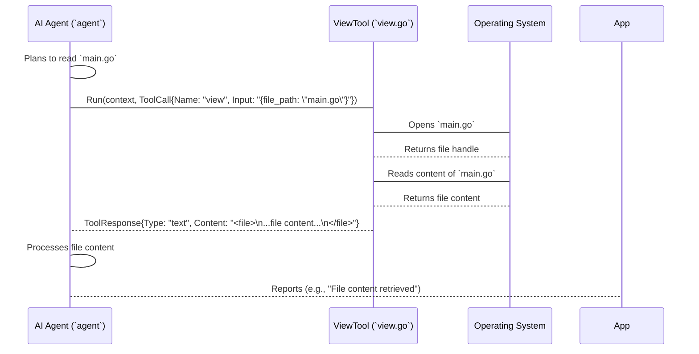

1.  **The `ToolCall`:** When the [AI Agent (`agent`)](03_ai_agent___agent___.md) decides to use a tool, it creates a `ToolCall` object. This object specifies the `Name` of the tool and the `Input` parameters (usually as a JSON string).

    ```go
    // internal/llm/tools/tools.go (simplified)
    type ToolCall struct {
        ID    string `json:"id"`
        Name  string `json:"name"`
        Input string `json:"input"` // JSON string of parameters
    }
    ```
    The `Input` field is a JSON string because LLMs are great at generating structured text like JSON.

2.  **The `BaseTool` Interface:** All tools in Crush must implement this interface. This is how the AI Agent knows what methods it can call on any given tool.

    ```go
    // internal/llm/tools/tools.go (simplified)
    type BaseTool interface {
        Info() ToolInfo // Describes the tool
        Name() string   // Returns the tool's name
        Run(ctx context.Context, params ToolCall) (ToolResponse, error) // Executes the tool
    }
    ```
    The `Run` method is where the actual work of the tool happens.

3.  **Example: `ViewTool` (`internal/llm/tools/view.go`)**
    Let's look at a simplified `Run` method for the `ViewTool`.

    ```go
    // internal/llm/tools/view.go (simplified)
    func (v *viewTool) Run(ctx context.Context, call ToolCall) (ToolResponse, error) {
        var params ViewParams
        // 1. Parse the input parameters from the ToolCall
        if err := json.Unmarshal([]byte(call.Input), &params); err != nil {
            return NewTextErrorResponse("error parsing parameters"), nil
        }

        // 2. Validate parameters (e.g., file_path is required)
        if params.FilePath == "" {
            return NewTextErrorResponse("file_path is required"), nil
        }

        // 3. Read the file content
        content, _, err := readTextFile(params.FilePath, params.Offset, params.Limit)
        if err != nil {
            return NewTextErrorResponse(fmt.Sprintf("error reading file: %s", err)), nil
        }

        // 4. Format the output and return a ToolResponse
        output := "<file>\n" + content + "\n</file>\n"
        return NewTextResponse(output), nil
    }
    ```
    This `Run` method:
    *   Decodes the `Input` JSON string from the `ToolCall` into a `ViewParams` struct.
    *   Performs basic validation (e.g., checks if `FilePath` is provided).
    *   Calls a helper function `readTextFile` to actually read the file from the operating system.
    *   Formats the file content (often wrapping it in `<file>...</file>` tags for clarity) and returns it as a `ToolResponse`.

4.  **Example: `EditTool` (`internal/llm/tools/edit.go`)**
    The `EditTool` works similarly but performs file *writing*.

    ```go
    // internal/llm/tools/edit.go (simplified)
    func (e *editTool) Run(ctx context.Context, call ToolCall) (ToolResponse, error) {
        var params EditParams
        if err := json.Unmarshal([]byte(call.Input), &params); err != nil {
            return NewTextErrorResponse("invalid parameters"), nil
        }

        // 1. Read existing content (if file exists)
        oldContent, _ := os.ReadFile(params.FilePath) // Simplified: error handling omitted

        // 2. Perform the replacement
        newContent := strings.Replace(string(oldContent), params.OldString, params.NewString, 1) // Only replace first occurrence

        // 3. Request permission before writing (important for security!)
        // This is where the Permissions module comes in!
        // p := e.permissions.Request(...)
        // if !p { return permission.ErrorPermissionDenied }

        // 4. Write the new content to the file
        err := os.WriteFile(params.FilePath, []byte(newContent), 0o644)
        if err != nil {
            return ToolResponse{}, fmt.Errorf("failed to write file: %w", err)
        }

        // 5. Return success response
        return NewTextResponse("Content replaced in file: " + params.FilePath), nil
    }
    ```
    The `EditTool` reads the old content, performs string replacement, requests permission (which is a crucial step for user safety and will be covered in [Chapter 7: Permissions (`permission`)](07_permissions___permission___.md)), and then writes the new content back to the file.

### Other Important Tools

Crush includes several other powerful tools:

*   **`lsTool` (`internal/llm/tools/ls.go`):** Lists the contents of a directory. Useful for exploring the project structure.
*   **`globTool` (`internal/llm/tools/glob.go`):** Finds files matching a specific pattern (like `*.go` or `test_*.js`).
*   **`bashTool` (`internal/llm/tools/bash.go`):** Executes arbitrary shell commands. This is one of the most powerful and therefore most carefully managed tools, as it allows the AI to run almost anything. This tool heavily relies on the [Persistent Shell (`shell`)](06_persistent_shell___shell___.md) for consistent execution.

All these tools follow the `BaseTool` interface, allowing the `agent` to interact with them uniformly.

## Conclusion

In this chapter, we've unpacked the concept of `tools` in Crush. We learned that they are the specialized gadgets that empower the [AI Agent (`agent`)](03_ai_agent___agent___.md) to perform concrete actions in your project environment, such as reading, writing, and listing files, or executing bash commands. We saw how the AI Agent uses these tools by providing specific parameters and interpreting their responses, making Crush a truly interactive and capable assistant.

Next, we'll dive deeper into one of the most powerful tools: the `bashTool`, and understand how Crush manages its execution through the [Persistent Shell (`shell`)](06_persistent_shell___shell___.md).

[Chapter 6: Persistent Shell (`shell`)](06_persistent_shell___shell___.md)

---

# Chapter 6: Persistent Shell (`shell`)

Welcome back to Crush! In [Chapter 5: Tools (`tools`)](05_tools___tools___.md), we saw how the AI Agent uses various `tools` to interact with your project. One of the most powerful and versatile tools is the `bashTool`, which allows the AI to run almost any command in your terminal. But how does Crush make sure that when the AI runs `cd my_folder`, it actually *stays* in `my_folder` for the next command? This is where the **Persistent Shell**, or `shell` for short, comes in!

## What Problem Does the `shell` Solve?

Imagine you're working in your terminal. You type `cd my_project` to go into your project folder. Then you type `ls` to see what's inside. You expect `ls` to show you the files *in `my_project`*, not in the folder you were in before. This is because your terminal session "remembers" your current working directory.

If the AI Agent just ran commands one by one, each command would start fresh, forgetting what happened before. So, if the AI ran `cd my_project`, and then immediately ran `ls`, the `ls` command wouldn't know it was supposed to be in `my_project`! It would be like opening a new terminal window for every single command. This makes multi-step operations (like navigating, then listing, then editing) impossible.

The `shell` component provides a consistent environment for executing shell commands, acting like a dedicated terminal session that remembers its working directory and environment variables. Unlike running individual commands, the persistent shell allows for multi-step operations where context (like `cd` commands) is maintained, crucial for the AI to navigate and interact with the filesystem.

Let's think about our central use case: **The AI Agent needs to navigate into a subdirectory, then create a new file there.**

Without the `shell`, the AI would struggle:
1.  AI runs: `cd src/my_feature` (but this command's effect is immediately forgotten).
2.  AI runs: `touch new_file.go` (this would create `new_file.go` in the *original* directory, not `src/my_feature`).

The `shell` ensures that the `touch` command happens in the `src/my_feature` directory, just like you'd expect in your own terminal.

## Key Concepts of the `shell`

The `shell` module provides a special kind of shell that maintains its state.

1.  **Stateful Execution:** The most important concept! Unlike running a command directly (which starts a new process each time), the persistent shell keeps track of things like:
    *   **Current Working Directory (CWD):** If the AI runs `cd`, the shell remembers this change for future commands.
    *   **Environment Variables:** If a command sets an environment variable (e.g., `export MY_VAR=value`), the shell remembers it.
2.  **Singleton Instance:** For a given "session" with Crush, there's typically only one persistent shell instance. This means all `bashTool` commands executed by the AI Agent for that session go through the *same* shell, ensuring consistency.
3.  **Cross-Platform (POSIX Emulation):** Crush uses a special Go library (`mvdan.cc/sh/v3`) that can understand and run POSIX-style shell commands (like `ls`, `cd`, `grep`) even on Windows, making the AI's interactions consistent regardless of your operating system.
4.  **Security & Control:** Because `bashTool` is so powerful, the `shell` also works with the [Permissions (`permission`)](07_permissions___permission___.md) system to ask for your approval before running potentially dangerous commands. It also has a list of "banned" commands to prevent the AI from doing harmful things.

Think of the `persistent shell` as a single, dedicated "mini-terminal" that the AI uses to interact with your project, remembering its actions across multiple steps.

## How the `shell` Solves Our Use Case

Let's trace how the AI Agent uses the `bashTool` and the `shell` to fulfill your request: "Navigate into `src/my_feature` and create a new file `new_file.go` there."

1.  **User Request:** You ask Crush.
2.  **`App` to `Agent`:** The [Application Core (`App`)](02_application_core___app___.md) passes your request to the [AI Agent (`agent`)](03_ai_agent___agent___.md).
3.  **`Agent` Plans (using an LLM):** The AI Agent decides it needs to:
    *   Change directory: `cd src/my_feature`
    *   Create a file: `touch new_file.go`
4.  **`Agent` uses `bashTool` for `cd`:**
    *   The AI Agent calls the `bashTool` with the command `cd src/my_feature`.
    *   The `bashTool` uses the `PersistentShell` to execute this command.
    *   The `PersistentShell` *updates its internal current working directory* to `src/my_feature`.
5.  **`Agent` uses `bashTool` for `touch`:**
    *   Now, the AI Agent calls the `bashTool` again with the command `touch new_file.go`.
    *   The `bashTool` again uses the *same* `PersistentShell` instance.
    *   Because the `PersistentShell` remembers its CWD, `touch new_file.go` is executed *inside* `src/my_feature`, creating the file in the correct location.
6.  **`Agent` Reports:** The `bashTool` returns the output (or lack thereof) of the commands, and the AI Agent reports back to you that the file was created in `src/my_feature`.

This sequence works because the `PersistentShell` acts as a continuous environment for the AI's commands.

## Under the Hood: How the `shell` Works

Let's look at the simplified sequence of how the `bashTool` uses the `PersistentShell` to execute commands.

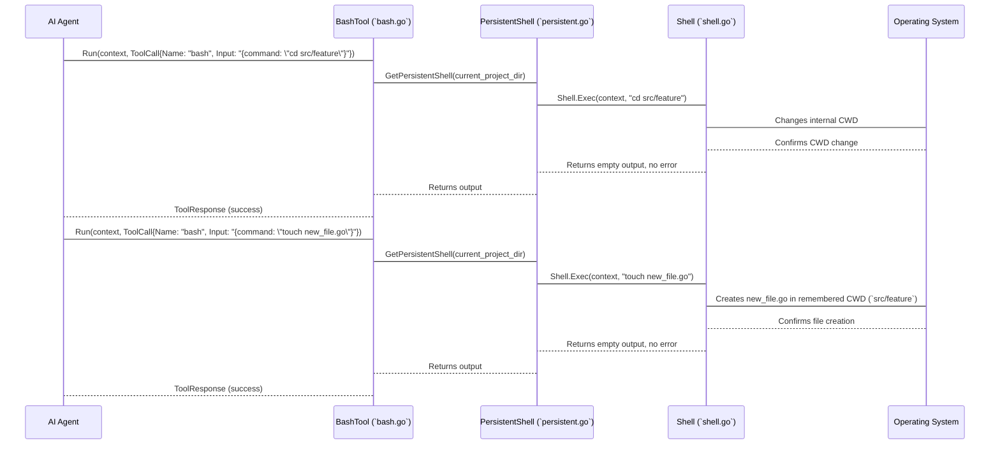

1.  **`bashTool` calls `shell.GetPersistentShell()`:**
    When the `bashTool`'s `Run` method is called, it needs access to the persistent shell. It gets this by calling `shell.GetPersistentShell()`.

    ```go
    // internal/llm/tools/bash.go (simplified)
    func (b *bashTool) Run(ctx context.Context, call ToolCall) (ToolResponse, error) {
        // ... permission checks ...

        persistentShell := shell.GetPersistentShell(b.workingDir) // Get the shell!
        stdout, stderr, err := persistentShell.Exec(ctx, params.Command)

        // ... process output and return ...
    }
    ```
    Notice that `GetPersistentShell` is called with `b.workingDir`. This is the initial directory for the shell.

2.  **`GetPersistentShell()` is a Singleton:**
    The `GetPersistentShell` function ensures that only *one* instance of the `PersistentShell` is created and used throughout the application's lifetime for a given starting directory. This is why it's called "persistent" – it's the same shell instance every time.

    ```go
    // internal/shell/persistent.go (simplified)
    var (
        once          sync.Once
        shellInstance *PersistentShell
    )

    func GetPersistentShell(cwd string) *PersistentShell {
        once.Do(func() { // This code runs only once!
            shellInstance = &PersistentShell{
                Shell: NewShell(&Options{
                    WorkingDir: cwd,
                    // ... other options like a logger ...
                }),
            }
        })
        return shellInstance // Always returns the same instance after the first call
    }
    ```
    The `sync.Once` mechanism guarantees that the `NewShell` function (which creates the actual `Shell` object) is called only once, ensuring we have a single, consistent `shellInstance`.

3.  **`PersistentShell` wraps `Shell`:**
    The `PersistentShell` itself is a very thin wrapper around the more general `Shell` struct. It simply holds an instance of `Shell`.

    ```go
    // internal/shell/persistent.go (simplified)
    type PersistentShell struct {
        *Shell // This means PersistentShell *has* a Shell
    }
    ```
    This means that when `persistentShell.Exec(ctx, params.Command)` is called, it's actually calling the `Exec` method on the underlying `Shell` object.

4.  **`Shell.Exec()` – The Core Execution:**
    The `Exec` method of the `Shell` struct is where the command is actually run. It uses the `mvdan.cc/sh/v3` library to interpret and execute POSIX shell commands.

    ```go
    // internal/shell/shell.go (simplified)
    type Shell struct {
        env        []string
        cwd        string // This is where the state is stored!
        mu         sync.Mutex
        // ... other fields ...
    }

    func (s *Shell) Exec(ctx context.Context, command string) (string, string, error) {
        s.mu.Lock() // Protect shared state (cwd, env)
        defer s.mu.Unlock()

        return s.execPOSIX(ctx, command) // Execute using the POSIX interpreter
    }

    func (s *Shell) execPOSIX(ctx context.Context, command string) (string, string, error) {
        // ... parse command ...
        runner, err := interp.New(
            // ... setup standard I/O (stdout, stderr buffers) ...
            interp.Env(expand.ListEnviron(s.env...)), // Use the shell's current environment
            interp.Dir(s.cwd),                       // Use the shell's current working directory
            // ...
        )
        // ... run the command ...
        s.cwd = runner.Dir // IMPORTANT: Update the shell's CWD after execution
        // ... update env vars ...
        return stdout.String(), stderr.String(), err
    }
    ```
    Key points in `Shell.execPOSIX()`:
    *   `s.mu.Lock()`: This `Mutex` (lock) ensures that only one command can run at a time within this shell instance, preventing race conditions if multiple AI tasks tried to use the shell simultaneously.
    *   `interp.Env(expand.ListEnviron(s.env...))`: The shell starts the command with its *current* set of environment variables.
    *   `interp.Dir(s.cwd)`: The command is executed in the shell's *current* working directory.
    *   `s.cwd = runner.Dir`: **This is the magic!** After the command finishes, the `runner.Dir` (which is the directory the command might have changed to, e.g., via `cd`) is stored back into `s.cwd`. This makes the change *persistent* for the next command executed by this `Shell` instance.

## Conclusion

In this chapter, we've explored the crucial role of the Persistent Shell (`shell`) in Crush. We learned that it provides a consistent, stateful environment for the AI Agent to execute shell commands, remembering its working directory and environment variables across multiple steps. This enables the AI to perform complex, multi-step operations like navigating directories and creating files, just like a human would in a regular terminal. We saw how the `bashTool` leverages a singleton `PersistentShell` instance to ensure this continuity and how the underlying `Shell` struct meticulously updates its internal state.

Next, we'll delve into a very important aspect of Crush: how it asks for your permission before making significant changes or running powerful commands, in [Chapter 7: Permissions (`permission`)](07_permissions___permission___.md).

[Chapter 7: Permissions (`permission`)](07_permissions___permission___.md)

---

# Chapter 7: Permissions (`permission`)

Welcome back to Crush! In [Chapter 6: Persistent Shell (`shell`)](06_persistent_shell___shell___.md), we learned how the AI Agent can execute commands in a consistent environment. But what if the AI wants to delete a file, change critical code, or download something from the internet? These actions can be risky! This is where the **Permissions** module, or `permission` for short, steps in.

## What Problem Does `permission` Solve?

Imagine you've given your super-smart AI assistant (our [AI Agent (`agent`)](03_ai_agent___agent___.md)) the ability to use tools that can read, write, and even run code on your computer. That's incredibly powerful, but also a little scary, right? You wouldn't want it accidentally deleting your important files or making unwanted changes without your say-so.

The `permission` system acts as a security guard, ensuring that the AI agent only performs actions with explicit user approval. Whenever the AI wants to do something potentially impactful (like modifying a file, running a shell command, or downloading something), it asks for your permission. This gives you full control and prevents unintended changes. It's like a digital "Are you sure?" prompt for the AI's actions.

Let's think about our central use case: **The AI Agent wants to modify a file in your project.** You've asked it to "Refactor `utils.go`." The AI needs to read the file, make its changes, and then *write* those changes back.

Without `permission`, the AI could potentially rewrite `utils.go` in a way you don't like, or even introduce bugs, and you wouldn't know until it's too late. With `permission`, you get to review the proposed changes *before* they happen and decide if you want to allow them.

## Key Concepts of `permission`

The `permission` module introduces a crucial layer of safety and control.

1.  **Permission Request:** When the AI (or a tool it uses) wants to perform a sensitive action, it doesn't just do it. Instead, it creates a `PermissionRequest`. This is a detailed description of what it wants to do.
2.  **User Approval:** You, the user, receive this request. Crush will display a special dialog in the [Terminal User Interface (`tui`)](01_terminal_user_interface___tui___.md) showing you exactly what the AI wants to do. You then have three choices:
    *   **Allow:** Grant permission for this specific action *once*.
    *   **Allow for Session:** Grant permission for this specific type of action for the *rest of the current session*.
    *   **Deny:** Prevent the AI from performing this action.
3.  **Contextual Information:** A `PermissionRequest` includes important details like:
    *   `ToolName`: Which tool wants to do the action (e.g., `EditTool`, `BashTool`).
    *   `Action`: What specific action it wants to perform (e.g., `edit file`, `run command`).
    *   `Description`: A human-readable summary of the action.
    *   `Path`: The file or directory involved (e.g., `src/utils.go`).
    *   `Params`: The actual parameters the tool would use (e.g., the exact code changes if it's an `EditTool` request).
4.  **Automatic Approval/Skipping:** For convenience during development or for trusted actions, Crush allows you to:
    *   `AutoApproveSession`: Automatically approve all requests for a specific session.
    *   `SetSkipRequests`: Completely skip all permission requests. (Use with caution!)
    *   `allowedTools`: Configure a list of tools or tool actions that are always approved.

Think of the `permission` system as a gatekeeper. Every time the AI wants to go through a gate (perform a sensitive action), the gatekeeper asks you for the key (your approval).

## How `permission` Solves Our Use Case

Let's trace how the AI Agent modifies `utils.go` with your approval:

1.  **User Request:** You ask Crush to "Refactor `utils.go`."
2.  **`App` to `Agent`:** The [Application Core (`App`)](02_application_core___app___.md) passes your request to the [AI Agent (`agent`)](03_ai_agent___agent___.md).
3.  **`Agent` Plans (using an LLM):** The AI Agent decides it needs to:
    *   Read `utils.go` (using `ViewTool`).
    *   Figure out the changes.
    *   Write the changes back to `utils.go` (using `EditTool`).
4.  **`Agent` uses `ViewTool`:** The `ViewTool` reads the file. This is generally not considered a "sensitive" action, so it might not trigger a permission request.
5.  **`Agent` prepares `EditTool` action:** The AI Agent calculates the new content for `utils.go`.
6.  **`EditTool` requests `permission`:** Before actually writing the file, the `EditTool` calls the `permission` service to ask for approval.
    ```go
    // Simplified: Inside internal/llm/tools/edit.go's Run method
    // ... calculate newContent ...
    if !e.permissions.Request(permission.CreatePermissionRequest{
        SessionID:   sessionID,
        ToolCallID:  call.ID,
        ToolName:    tools.EditToolName,
        Description: "Modify file content",
        Action:      "write",
        Path:        params.FilePath,
        Params:      map[string]any{"diff": calculatedDiff}, // Show the diff!
    }) {
        return NewTextErrorResponse("Permission denied by user."), nil
    }
    // If permission is granted, proceed to write the file
    // ... os.WriteFile(params.FilePath, newContent, 0o644) ...
    ```
    The `EditTool` constructs a `CreatePermissionRequest` detailing what it wants to do, including the `Path` to `utils.go` and even a `diff` representing the changes. It then calls `e.permissions.Request()`.
7.  **`permission` service displays dialog:** The `permission` service receives the request and, through its integration with the [TUI](01_terminal_user_interface___tui___.md), displays a dialog box on your screen. This dialog shows you the tool name, the file path, and, most importantly, the exact changes (the `diff`) the AI wants to make.
8.  **You Grant/Deny:** You review the changes. If they look good, you select "Allow" or "Allow for Session." If not, you select "Deny."
9.  **`EditTool` proceeds or stops:**
    *   If you grant permission, `e.permissions.Request()` returns `true`, and the `EditTool` proceeds to write the new content to `utils.go`.
    *   If you deny permission, `e.permissions.Request()` returns `false`, and the `EditTool` stops, reporting back that permission was denied.
10. **`Agent` Reports:** The AI Agent then reports back the outcome to you via the `App` and `tui`.

This flow ensures you always have the final say over critical actions.

## Under the Hood: How `permission` Works

Let's look at a simplified sequence of how a permission request is handled.

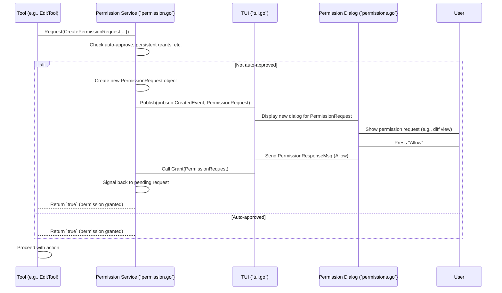

1.  **`permissionService.Request()` is the Entry Point:**
    When a tool needs permission, it calls this method.

    ```go
    // internal/permission/permission.go (simplified Request method)
    func (s *permissionService) Request(opts CreatePermissionRequest) bool {
        // ... (1) Check if skipping requests is enabled ...
        if s.skip { return true }

        // ... (2) Check for auto-approval for the current session ...
        s.autoApproveSessionsMu.RLock()
        autoApprove := s.autoApproveSessions[opts.SessionID]
        s.autoApproveSessionsMu.RUnlock()
        if autoApprove { return true }

        // ... (3) Check for already granted persistent permissions ...
        s.sessionPermissionsMu.RLock()
        for _, p := range s.sessionPermissions {
            if p.ToolName == opts.ToolName && p.Action == opts.Action && p.SessionID == opts.SessionID {
                // Simplified: More robust matching needed for path/params
                s.sessionPermissionsMu.RUnlock()
                return true
            }
        }
        s.sessionPermissionsMu.RUnlock()

        // ... (4) If no auto-approval, create a new request and wait for user ...
        permission := PermissionRequest{
            ID: uuid.New().String(),
            // ... copy fields from opts ...
        }

        respCh := make(chan bool, 1) // Channel to wait for user response
        s.pendingRequests.Set(permission.ID, respCh) // Store this channel
        defer s.pendingRequests.Del(permission.ID) // Clean up after response

        s.Publish(pubsub.CreatedEvent, permission) // (5) Tell the TUI about the request!

        return <-respCh // (6) Block and wait for the user's decision
    }
    ```
    *   **(1)-(3) Pre-checks:** The `Request` method first quickly checks if the request should be automatically approved (e.g., if `skip` is true, or if `AutoApproveSession` is enabled for this session, or if you've already granted this specific type of permission persistently). If any of these are true, it immediately returns `true`.
    *   **(4) Create Request:** If not auto-approved, it creates a new `PermissionRequest` object with a unique ID.
    *   **(5) Publish to TUI:** It then `Publish`es this `PermissionRequest` as an event. The [TUI](01_terminal_user_interface___tui___.md) is listening for these events.
    *   **(6) Wait for User:** Crucially, it creates a Go channel (`respCh`) and then blocks (`<-respCh`) until a value is sent to this channel. This means the tool's execution *pauses* until the user makes a decision.

2.  **`TUI` displays `PermissionDialog`:**
    The [TUI](01_terminal_user_interface___tui___.md) (`internal/tui/tui.go`) listens for `PermissionRequest` events. When it receives one, it opens a `PermissionDialogCmp` (`internal/tui/components/dialogs/permissions/permissions.go`).

    ```go
    // internal/tui/components/dialogs/permissions/permissions.go (simplified)
    func NewPermissionDialogCmp(permission permission.PermissionRequest, opts *Options) PermissionDialogCmp {
        // ... setup viewport and initial state ...
        return &permissionDialogCmp{
            permission: permission, // Store the request details
            // ...
        }
    }

    func (p *permissionDialogCmp) View() string {
        // This method renders the dialog on screen
        // It uses p.permission.ToolName, p.permission.Path, and especially p.permission.Params
        // to show details like the diff for EditTool or the bash command for BashTool.
        // It also renders buttons for Allow, Allow for Session, Deny.
        // ...
    }

    func (p *permissionDialogCmp) Update(msg tea.Msg) (tea.Model, tea.Cmd) {
        switch msg := msg.(type) {
        case tea.KeyMsg:
            switch {
            case key.Matches(msg, p.keyMap.Allow): // User pressed 'a' or 'enter'
                // ... logic to send "Allow" response ...
                return p, func() tea.Msg {
                    return PermissionResponseMsg{
                        Permission: p.permission,
                        Action:     PermissionAllow,
                    }
                }
            case key.Matches(msg, p.keyMap.AllowSession): // User pressed 's'
                // ... logic to send "Allow for Session" response ...
            case key.Matches(msg, p.keyMap.Deny): // User pressed 'd' or 'esc'
                // ... logic to send "Deny" response ...
            }
        }
        // ... other update logic ...
        return p, nil
    }
    ```
    The `PermissionDialogCmp` is a Bubble Tea component that displays the request details. Its `View()` method constructs the visual output (e.g., a diff for file edits, or a command for bash). Its `Update()` method handles user input (like pressing 'a' for Allow), and when a decision is made, it sends a `PermissionResponseMsg` back to the main TUI loop.

3.  **`TUI` informs `permissionService`:**
    The main [TUI](01_terminal_user_interface___tui___.md) receives the `PermissionResponseMsg` and calls the appropriate method on the `permissionService` (`Grant`, `GrantPersistent`, or `Deny`).

    ```go
    // internal/permission/permission.go (simplified Grant method)
    func (s *permissionService) Grant(permission PermissionRequest) {
        // Tell anyone listening that permission was granted (e.g., TUI can update status)
        s.notificationBroker.Publish(pubsub.CreatedEvent, PermissionNotification{
            ToolCallID: permission.ToolCallID,
            Granted:    true,
        })

        // Find the channel for this specific request and unblock it
        respCh, ok := s.pendingRequests.Get(permission.ID)
        if ok {
            respCh <- true // Send 'true' to the channel, unblocking the tool
        }
    }
    ```
    The `Grant` (or `Deny`) method finds the correct `respCh` using the `permission.ID` and sends `true` (or `false`) to it. This unblocks the `Request()` method, allowing the tool to proceed or stop.

This intricate dance between the `permission` service and the [TUI](01_terminal_user_interface___tui___.md) ensures that you are always in control of the AI's potentially impactful actions.

## Conclusion

In this chapter, we've explored the critical role of the Permissions (`permission`) module in Crush. We learned that it acts as a security layer, requiring your explicit approval for sensitive AI actions like modifying files or running shell commands. We saw how `PermissionRequest`s provide detailed context, allowing you to make informed decisions through a special dialog in the [TUI](01_terminal_user_interface___tui___.md). This system empowers you with ultimate control, ensuring a safe and predictable interaction with the AI Agent.

Next, we'll dive into how Crush integrates with your code editor's intelligence through the [Language Server Protocol (LSP) Integration (`lsp`)](08_language_server_protocol__lsp__integration___lsp___.md).

[Chapter 8: Language Server Protocol (LSP) Integration (`lsp`)](08_language_server_protocol__lsp__integration___lsp___.md)

---

# Chapter 8: Language Server Protocol (LSP) Integration (`lsp`)

Welcome back to Crush! In [Chapter 7: Permissions (`permission`)](07_permissions___permission___.md), we learned how Crush keeps you in control by asking for your permission before making big changes. Now, let's explore another powerful feature that helps Crush understand your code almost as well as you do: the **Language Server Protocol (LSP) Integration**, or `lsp` for short!

## What Problem Does the `lsp` Solve?

Imagine you're writing code in your favorite editor (like VS Code or Sublime Text). As you type, the editor often gives you helpful hints:
*   It underlines errors in red.
*   It suggests ways to complete your code.
*   It tells you what a function does when you hover over it.
*   It can even automatically reformat your code.

This "code intelligence" isn't magic; it's usually provided by something called a **Language Server**. A Language Server is a separate program (like `gopls` for Go, `pyright` for Python, or `tsserver` for TypeScript) that specializes in understanding a particular programming language. Your editor talks to this Language Server using a common language called the **Language Server Protocol (LSP)**.

The `lsp` module in Crush allows Crush to speak this same language! By connecting to these Language Servers, Crush can get real-time, in-depth information about your code. This is incredibly valuable for the [AI Agent (`agent`)](03_ai_agent___agent__). If the AI wants to fix a bug, it needs to know *where* the bug is and *what kind* of bug it is. The LSP helps the AI "see" these problems.

Let's think about our central use case: **You want the AI to fix a compilation error in your Go project.**

Without LSP integration, the AI might have to guess where the error is, or rely on running the compiler and parsing its output, which can be slow and less precise. With LSP, the AI can ask the Go Language Server (gopls) directly: "Are there any errors in this file? If so, where are they and what do they mean?" This gives the AI a much clearer picture of the code's health.

## Key Concepts of `lsp`

The `lsp` module acts as a translator and coordinator between Crush and external Language Servers.

1.  **Language Server (LS):** A separate program (e.g., `gopls`, `pyright`, `tsserver`) that understands a specific programming language. It runs in the background.
2.  **LSP Client:** This is the part of Crush that connects to and talks with a Language Server. Crush can run multiple LSP clients, one for each language server you configure.
3.  **Protocol:** The common language (LSP) that clients and servers use to communicate. It's a set of rules for sending and receiving messages.
4.  **Diagnostics:** These are the errors, warnings, and hints that a Language Server provides about your code. The LSP client in Crush collects these.
5.  **Root Markers:** Language Servers usually only activate when they detect a specific project structure (e.g., a `go.mod` file for Go, `package.json` for Node.js). These are called "root markers." Crush checks for these to decide if an LSP client should start.
6.  **File Types:** Each LSP client is configured to handle specific file types (e.g., `.go` for `gopls`, `.ts`, `.tsx` for `tsserver`).

Think of it like Crush having a team of specialized linguists, each fluent in a different programming language's "grammar" and "vocabulary." When Crush needs to understand Go code, it consults its Go linguist.

## How `lsp` Solves Our Use Case

Let's trace how Crush uses `lsp` to help the AI fix a Go compilation error:

1.  **Crush Starts:** When Crush starts up, it looks at your project and its configuration.
    ```go
    // internal/app/lsp.go (simplified)
    func (app *App) initLSPClients(ctx context.Context) {
        for name, clientConfig := range app.config.LSP {
            // ... check if disabled ...
            go app.createAndStartLSPClient(ctx, name, clientConfig)
        }
    }
    ```
    The [Application Core (`App`)](02_application_core___app___.md) iterates through your configured Language Servers and starts them in the background.
2.  **LSP Client Initialization:** For a Go project, Crush's LSP client for `gopls` starts up.
    ```go
    // internal/app/lsp.go (simplified)
    // ... inside createAndStartLSPClient ...
    if !lsp.HasRootMarkers(app.config.WorkingDir(), config.RootMarkers) {
        slog.Info("Skipping LSP client - no root markers found")
        return
    }
    // ... create and initialize lspClient ...
    ```
    The `lsp` client first checks for `RootMarkers` (like `go.mod`). If found, it creates and initializes the `gopls` Language Server.
3.  **Opening Files:** When the AI agent focuses on a specific Go file (e.g., `main.go`), Crush notifies the `gopls` client that this file is "open."
    ```go
    // internal/lsp/client.go (simplified)
    func (c *Client) OpenFile(ctx context.Context, filepath string) error {
        // ... send didOpen notification to LSP server ...
    }
    ```
    This `OpenFile` method sends a special message to the Language Server, telling it to start processing the file.
4.  **Receiving Diagnostics:** As `gopls` analyzes `main.go`, it sends back any errors or warnings it finds. Crush's LSP client receives these as "diagnostics."
    ```go
    // internal/lsp/handlers.go (simplified)
    func HandleDiagnostics(client *Client, params json.RawMessage) {
        var diagParams protocol.PublishDiagnosticsParams
        // ... unmarshal diagnostic data ...
        client.diagnostics.Set(diagParams.URI, diagParams.Diagnostics) // Store errors
        if client.onDiagnosticsChanged != nil {
            client.onDiagnosticsChanged(client.name, totalCount) // Notify TUI
        }
    }
    ```
    The `HandleDiagnostics` function receives these errors, stores them, and then notifies the [TUI](01_terminal_user_interface___tui___.md) so you can see them.
5.  **AI Agent Uses Diagnostics:** The [AI Agent (`agent`)](03_ai_agent___agent___.md) can then query the LSP client for these diagnostics.
    ```go
    // internal/lsp/client.go (simplified)
    func (c *Client) GetDiagnosticsForFile(ctx context.Context, filepath string) ([]protocol.Diagnostic, error) {
        // ... ensure file is open ...
        diagnostics, _ := c.diagnostics.Get(protocol.URIFromPath(filepath))
        return diagnostics, nil
    }
    ```
    The agent can ask "What are the diagnostics for `main.go`?" and get a list of errors, including their exact line numbers and descriptions. This precise information helps the AI understand and fix the bug much more effectively.
6.  **AI Fixes and LSP Updates:** When the AI suggests a fix (e.g., using the `EditTool`), the LSP client is notified that the file has changed. The Language Server then re-analyzes the file and updates its diagnostics, showing if the fix was successful.

This integration makes the AI's understanding of your codebase much deeper and more accurate, especially for language-specific problems.

## Under the Hood: How `lsp` Works

Let's look at a simplified sequence of how Crush initializes and interacts with an LSP server.

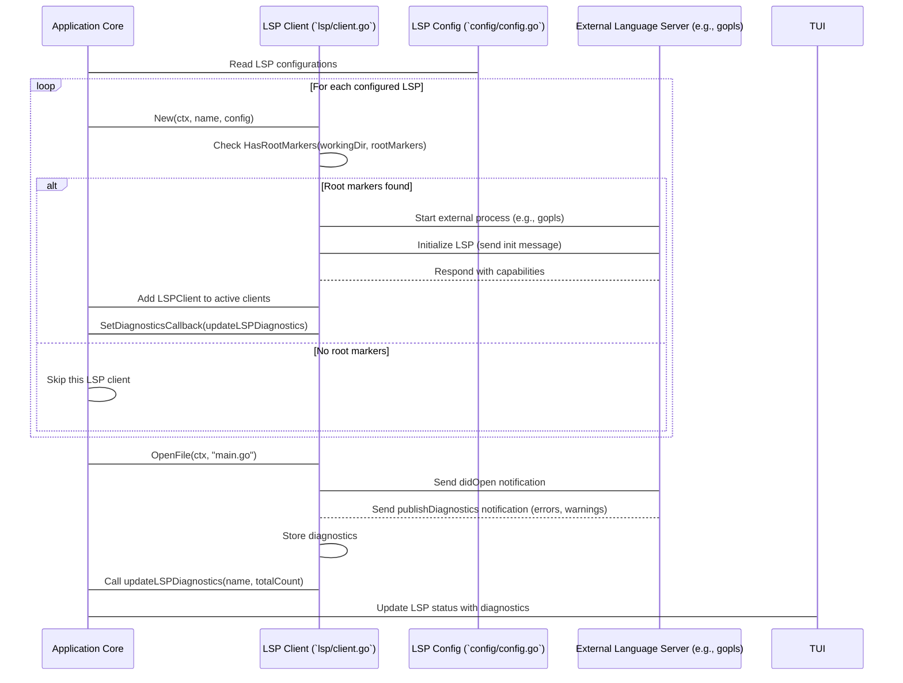

1.  **`App` Init (`internal/app/lsp.go`):**
    The `App` is responsible for initializing all LSP clients based on your configuration. It calls `createAndStartLSPClient` for each configured LSP.

    ```go
    // internal/app/lsp.go (simplified initialization)
    func (app *App) createAndStartLSPClient(ctx context.Context, name string, config config.LSPConfig) {
        // ... (check root markers) ...

        // Create LSP client.
        lspClient, err := lsp.New(ctx, name, config, app.config.Resolver())
        if err != nil { /* ... error handling ... */ return }

        // Set diagnostics callback (function to call when diagnostics change)
        lspClient.SetDiagnosticsCallback(updateLSPDiagnostics)

        // Initialize LSP client. This actually starts the external LS process.
        _, err = lspClient.Initialize(ctx, app.config.WorkingDir())
        if err != nil { /* ... error handling ... */ return }

        // Wait for the server to be ready.
        lspClient.WaitForServerReady(ctx) // Blocks until LS is ready or timeout

        app.LSPClients.Set(name, lspClient) // Add to map of active clients
    }
    ```
    This function handles starting the external Language Server process, performing the initial handshake (the `Initialize` call), and setting up a callback (`updateLSPDiagnostics`) to react to new errors/warnings.

2.  **`lsp.Client` (`internal/lsp/client.go`):**
    This struct is Crush's representation of an LSP client. It holds the connection to the external Language Server.

    ```go
    // internal/lsp/client.go (simplified)
    type Client struct {
        client *powernap.Client // The actual library that handles LSP communication
        name   string
        fileTypes []string
        diagnostics *csync.VersionedMap[protocol.DocumentURI, []protocol.Diagnostic] // Stores diagnostics
        // ...
    }

    // New creates a new LSP client.
    func New(ctx context.Context, name string, config config.LSPConfig, resolver config.VariableResolver) (*Client, error) {
        // ... resolve command, prepare powernap.ClientConfig ...
        powernapClient, err := powernap.NewClient(clientConfig) // Creates the underlying LSP client
        // ... error handling ...
        client := &Client{
            client:      powernapClient,
            name:        name,
            fileTypes:   config.FileTypes,
            diagnostics: csync.NewVersionedMap[protocol.DocumentURI, []protocol.Diagnostic](),
            // ...
        }
        return client, nil
    }
    ```
    The `New` function here creates an instance of `powernap.NewClient`, which is a powerful Go library that handles all the low-level details of the LSP. Our `Client` struct wraps this to add Crush-specific logic like managing diagnostics and file types. The `diagnostics` field is a `csync.VersionedMap`, which is a thread-safe way to store and track changes to diagnostics for different files (DocumentURIs).

3.  **Handling Diagnostics (`internal/lsp/handlers.go`):**
    When the external Language Server finds errors or warnings, it sends a `textDocument/publishDiagnostics` notification. Crush has a handler function to receive and process these.

    ```go
    // internal/lsp/handlers.go (simplified)
    func HandleDiagnostics(client *Client, params json.RawMessage) {
        var diagParams protocol.PublishDiagnosticsParams
        if err := json.Unmarshal(params, &diagParams); err != nil { /* ... error handling ... */ return }

        // Store the received diagnostics in the client's cache.
        client.diagnostics.Set(diagParams.URI, diagParams.Diagnostics)

        // Calculate total diagnostic count and notify the App.
        totalCount := 0
        for _, diagnostics := range client.diagnostics.Seq2() {
            totalCount += len(diagnostics)
        }
        if client.onDiagnosticsChanged != nil {
            client.onDiagnosticsChanged(client.name, totalCount)
        }
    }
    ```
    This `HandleDiagnostics` function is registered with the `powernap.Client` to be called whenever a diagnostic notification arrives. It parses the incoming JSON, updates the `client.diagnostics` map, and then calls the `onDiagnosticsChanged` callback (which eventually leads to the [TUI](01_terminal_user_interface___tui___.md) updating its display).

4.  **Displaying LSP Status in TUI (`internal/tui/components/lsp/lsp.go`):**
    The [TUI](01_terminal_user_interface___tui___.md) uses the `RenderLSPList` function to show the status of all active LSP clients, including their state (starting, ready, error) and any diagnostics they've reported.

    ```go
    // internal/tui/components/lsp/lsp.go (simplified)
    func RenderLSPList(lspClients *csync.Map[string, *lsp.Client], opts RenderOptions) []string {
        // ... get sorted LSP configs and states ...
        for _, l := range lspConfigs {
            // ... determine icon and description based on state ...
            var extraContent string
            if client, ok := lspClients.Get(l.Name); ok {
                // Calculate error, warning, info counts from client.GetDiagnostics()
                // ...
                extraContent = strings.Join(errs, " ") // e.g., "❌ 2 ⚠️ 1"
            }
            // ... append formatted status to list ...
        }
        return lspList
    }
    ```
    This function iterates through all configured LSP clients, checks their current state and diagnostics, and then formats this information into a visually appealing list that's displayed in the Crush interface.

This continuous communication and feedback loop between Crush and the Language Servers provide the [AI Agent (`agent`)](03_ai_agent___agent___.md) with a powerful "sixth sense" for code quality and correctness.

## Conclusion

In this chapter, we've explored the inner workings of Crush's **Language Server Protocol (LSP) Integration**. We learned that `lsp` allows Crush to communicate with specialized Language Servers, gaining deep, real-time insights into your code's errors, warnings, and structure. This capability significantly enhances the [AI Agent (`agent`)](03_ai_agent___agent__)'s ability to understand and interact with your codebase effectively, making it a much more intelligent and accurate assistant.

Next, we'll shift our focus to how Crush connects to various Large Language Models (LLMs) to power its AI Agent, in [Chapter 9: LLM Providers (`provider`)](09_llm_providers___provider___.md).

[Chapter 9: LLM Providers (`provider`)](09_llm_providers___provider___.md)

---

# Chapter 9: LLM Providers (`provider`)

Welcome back to Crush! In [Chapter 8: Language Server Protocol (LSP) Integration (`lsp`)](08_language_server_protocol__lsp__integration___lsp___.md), we saw how Crush gets intelligent insights into your code. Now, we're going to explore the heart of Crush's intelligence: how it talks to the different Large Language Models (LLMs) that power its AI. This is where the **LLM Providers**, or `provider` for short, come in!

## What Problem Does the `provider` Solve?

Imagine you want to use a smart AI assistant, but there are many different companies offering these assistants: OpenAI (with models like GPT-4), Anthropic (with models like Claude), Google (with Gemini), and others. Each company has its own way of communicating with its AI models, like speaking a different language or using a different type of electrical plug.

The `provider` module acts as a **universal translator and power adapter**. It allows Crush to communicate with *any* of these different LLM services using a single, standardized approach. This means the [AI Agent (`agent`)](03_ai_agent___agent__.md) doesn't need to learn the specific "language" or "plug type" for each LLM. It just tells the `provider` what it wants, and the `provider` handles all the complex translation and connection details.

Let's think about our central use case: **You want Crush to be able to use either an OpenAI model or an Anthropic model, depending on your preference, without changing any of Crush's core logic.**

Without the `provider`, Crush would have to write separate code for OpenAI, separate code for Anthropic, separate code for Gemini, and so on. This would be messy and hard to maintain. The `provider` makes it easy to switch between different LLMs, or even use multiple LLMs, seamlessly.

## Key Concepts of `provider`

The `provider` module simplifies the interaction with various LLM services.

1.  **Standardized Interface:** All LLM providers in Crush follow a common set of rules for how they communicate. This means the [AI Agent (`agent`)](03_ai_agent___agent__.md) always asks for information in the same way, regardless of which LLM is actually being used.
2.  **LLM-Specific Implementation:** Behind the scenes, each `provider` (e.g., `openai.go`, `anthropic.go`, `gemini.go`) contains the specific code needed to talk to its respective LLM service. This includes handling API keys, message formats, tool call structures, and error messages unique to that service.
3.  **Message Conversion:** LLMs often have slightly different ways of understanding messages (e.g., how they represent user input, assistant responses, or tool outputs). The `provider` handles converting Crush's internal [Message (`message`)](04_messaging___session_management___message____session__.md) format into the format expected by the specific LLM, and then converting the LLM's response back into Crush's `Message` format.
4.  **Tool Call Handling:** When the [AI Agent (`agent`)](03_ai_agent___agent__.md) wants to use one of its [Tools (`tools`)](05_tools___tools__.md), it tells the LLM. The `provider` translates this request into the LLM's specific "tool calling" format and then interprets the LLM's suggestions for which tools to run.
5.  **Streaming and Events:** Many LLMs can "stream" their responses, meaning they send words back as they generate them, instead of waiting for the full response. The `provider` supports this, sending `ProviderEvent`s to Crush as new content or tool calls become available.
6.  **Error Handling and Retries:** The `provider` includes logic to handle common networking issues, rate limits, and API errors, often retrying requests automatically.

Think of the `provider` as a universal remote control. You press "play," and it sends the right signal to your TV, DVD player, or streaming device, even though each uses a different underlying technology.

## How `provider` Solves Our Use Case

Let's trace how Crush uses different `provider`s to let you choose your preferred LLM:

1.  **Configuration:** You tell Crush in its [Configuration Management (`config`)](10_configuration_management___config__.md) file which LLM model you want to use (e.g., `openai-gpt4` or `anthropic-claude-3-opus`).
    ```yaml
    # ~/.config/crush/config.yaml (simplified)
    llm:
      default_model: anthropic-claude-3-opus # Or openai-gpt-4o
      providers:
        anthropic:
          type: anthropic
          api_key: $ANTHROPIC_API_KEY
          models:
            claude-3-opus:
              id: claude-3-opus-20240229
              token_limit: 200000
        openai:
          type: openai
          api_key: $OPENAI_API_KEY
          models:
            gpt-4o:
              id: gpt-4o
              token_limit: 128000
    ```
    Crush's configuration specifies which providers are available and their API keys.

2.  **`App` Initializes `Provider`:** When Crush starts, the [Application Core (`App`)](02_application_core___app__.md) reads this configuration and uses the `provider.NewProvider` function to create the correct LLM `Provider` instance.

    ```go
    // internal/llm/agent/agent.go (simplified)
    func New(app *app.App) Service {
        // ...
        cfg := config.Get()
        // ...
        p, err := provider.NewProvider(cfg.LLM.Providers[cfg.LLM.DefaultProvider],
            provider.WithModel(cfg.LLM.SelectedModelType()),
            provider.WithSystemMessage(cfg.LLM.SystemMessage),
        )
        // ...
        return &agent{
            provider: p, // The agent holds a reference to the chosen provider!
            // ...
        }
    }
    ```
    The `NewProvider` function looks at your configuration (e.g., `cfg.LLM.DefaultProvider` which could be "anthropic") and creates an `anthropicClient` if that's what's configured. The [AI Agent (`agent`)](03_ai_agent___agent__.md) then stores this `provider` instance.

3.  **`Agent` Sends Message to `Provider`:** When you ask the AI a question, the [AI Agent (`agent`)](03_ai_agent___agent__.md) calls its `provider.StreamResponse` method.

    ```go
    // internal/llm/agent/agent.go (simplified startAgentLoop)
    // ... inside the loop ...
    eventChan := a.provider.StreamResponse(ctx, chatRequest.Messages, chatRequest.Tools)
    for event := range eventChan {
        // ... process events (content, tool calls) from the provider ...
    }
    ```
    The `agent` simply calls `StreamResponse` on its `provider` field. It doesn't care if that `provider` is an OpenAI one, an Anthropic one, or a Gemini one. The `provider` handles the details.

4.  **`Provider` Communicates with LLM:** The specific `provider` (e.g., `anthropicClient` or `openaiClient`) takes Crush's internal messages, converts them into the format expected by its LLM, sends them, and then streams back the LLM's response.

    *   If you configured Anthropic, the `anthropicClient` handles the conversion and API calls specific to Anthropic's Claude models.
    *   If you configured OpenAI, the `openaiClient` handles the conversion and API calls specific to OpenAI's GPT models.

5.  **`Agent` Receives Universal Events:** The `agent` receives `ProviderEvent`s from the `provider`, which are always in the same format, regardless of the underlying LLM. This allows the `agent` to process the response (e.g., display new text, run a tool) without knowing which LLM generated it.

By abstracting away the LLM-specific details, the `provider` module makes Crush flexible and powerful, allowing you to easily leverage different AI models.

## Under the Hood: How `provider` Works

Let's look at a simplified sequence of how Crush creates a provider and how that provider communicates with an external LLM.

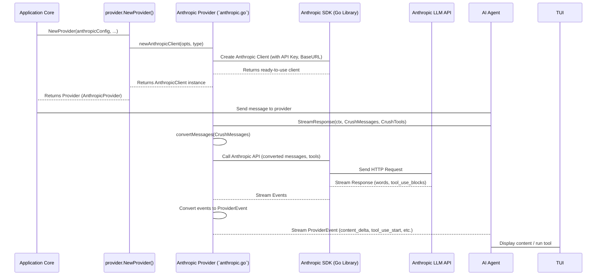

1.  **`NewProvider` Function (`internal/llm/provider/provider.go`):**
    This is the main entry point for creating an LLM `Provider`. It acts as a factory, deciding which specific client to create based on your configuration.

    ```go
    // internal/llm/provider/provider.go (simplified NewProvider)
    func NewProvider(cfg config.ProviderConfig, opts ...ProviderClientOption) (Provider, error) {
        // ... (resolve API key, extra headers from config) ...

        clientOptions := providerClientOptions{
            baseURL:      cfg.BaseURL,
            apiKey:       resolvedAPIKey,
            extraHeaders: resolvedExtraHeaders,
            // ... other options from config ...
        }
        for _, o := range opts { // Apply any dynamic options
            o(&clientOptions)
        }

        switch cfg.Type { // This determines which client to create!
        case catwalk.TypeAnthropic:
            return &baseProvider[AnthropicClient]{
                options: clientOptions,
                client:  newAnthropicClient(clientOptions, AnthropicClientTypeNormal),
            }, nil
        case catwalk.TypeOpenAI:
            return &baseProvider[OpenAIClient]{
                options: clientOptions,
                client:  newOpenAIClient(clientOptions),
            }, nil
        // ... (other cases for Gemini, Bedrock, Azure, VertexAI) ...
        }
        return nil, fmt.Errorf("provider not supported: %s", cfg.Type)
    }
    ```
    The `NewProvider` function reads the `cfg.Type` (e.g., `catwalk.TypeAnthropic`) and then calls the appropriate `newAnthropicClient`, `newOpenAIClient`, etc., to create the specific client. It then wraps this client in a `baseProvider` which handles common logic like cleaning messages.

2.  **Specific Client Creation (e.g., `internal/llm/provider/anthropic.go`):**
    Each specific client (like `anthropicClient`) has its own `createAnthropicClient` function that uses the official Go SDKs for that LLM.

    ```go
    // internal/llm/provider/anthropic.go (simplified createAnthropicClient)
    func createAnthropicClient(opts providerClientOptions, tp AnthropicClientType) anthropic.Client {
        anthropicClientOptions := []option.RequestOption{}
        if opts.apiKey != "" {
            anthropicClientOptions = append(anthropicClientOptions, option.WithAPIKey(opts.apiKey))
        }
        if opts.baseURL != "" {
            resolvedBaseURL, _ := config.Get().Resolve(opts.baseURL)
            if resolvedBaseURL != "" {
                anthropicClientOptions = append(anthropicClientOptions, option.WithBaseURL(resolvedBaseURL))
            }
        }
        // ... (add HTTP client for debugging, handle bedrock/vertex types) ...
        return anthropic.NewClient(anthropicClientOptions...)
    }
    ```
    This function uses `anthropic.NewClient` from the `anthropic-sdk-go` library, passing in configuration like the API key and base URL. This `anthropic.Client` is the actual object that will make network calls to the Anthropic API.

3.  **Message Conversion (e.g., `internal/llm/provider/anthropic.go`):**
    Each client needs to convert Crush's generic `message.Message` format into the specific format expected by its LLM.

    ```go
    // internal/llm/provider/anthropic.go (simplified convertMessages)
    func (a *anthropicClient) convertMessages(messages []message.Message) []anthropic.MessageParam {
        var anthropicMessages []anthropic.MessageParam
        for _, msg := range messages {
            switch msg.Role {
            case message.User:
                var content []anthropic.MessageContent
                content = append(content, anthropic.NewTextContent(msg.Content().String()))
                // ... (handle image content, tool results) ...
                anthropicMessages = append(anthropicMessages, anthropic.NewUserMessage(content))
            case message.Assistant:
                if msg.Content().String() != "" {
                    anthropicMessages = append(anthropicMessages, anthropic.NewAssistantMessage(
                        []anthropic.MessageContent{anthropic.NewTextContent(msg.Content().String())},
                    ))
                }
                // ... (handle tool calls from assistant) ...
            // ... (handle tool role) ...
            }
        }
        return anthropicMessages
    }
    ```
    The `convertMessages` method iterates through Crush's `message.Message`s and creates `anthropic.MessageParam` objects, which are understood by the Anthropic API. It maps Crush's `User` role to Anthropic's user messages, `Assistant` role to Anthropic's assistant messages, and so on. It also handles converting tool calls and tool results.

4.  **Streaming Responses (e.g., `internal/llm/provider/anthropic.go`):**
    The `stream` method is where the real-time communication happens.

    ```go
    // internal/llm/provider/anthropic.go (simplified stream)
    func (a *anthropicClient) stream(ctx context.Context, messages []message.Message, tools []tools.BaseTool) <-chan ProviderEvent {
        eventChan := make(chan ProviderEvent)
        go func() {
            defer close(eventChan)

            anthropicMessages := a.convertMessages(messages)
            anthropicTools := a.convertTools(tools) // Convert Crush tools to Anthropic tool format

            res, err := a.client.Messages.Create(ctx, anthropic.MessageCreateParams{
                Model:       a.Model().ID,
                Messages:    anthropicMessages,
                Tools:       anthropicTools,
                MaxTokens:   a.adjustedMaxTokens, // Use adjusted max tokens if needed
                Stream:      param.True(),        // Request streaming!
            })
            // ... (error handling, handle specific API errors, retries) ...

            for streamEvent := range res.Events() { // Loop through streaming events from Anthropic SDK
                switch streamEvent := streamEvent.(type) {
                case *anthropic.MessageDeltaEvent:
                    if streamEvent.Delta.Usage != nil {
                        // ... update token usage ...
                    }
                case *anthropic.ContentBlockDeltaEvent:
                    if streamEvent.Delta.Text != nil {
                        eventChan <- ProviderEvent{Type: EventContentDelta, Content: *streamEvent.Delta.Text}
                    }
                case *anthropic.ContentBlockStartEvent:
                    if streamEvent.ContentBlock.Type == "tool_use" {
                        toolUseBlock := streamEvent.ContentBlock.AsAny().(anthropic.ToolUseBlock)
                        eventChan <- ProviderEvent{
                            Type: EventToolUseStart,
                            ToolCall: &message.ToolCall{
                                ID:   toolUseBlock.ID,
                                Name: toolUseBlock.Name,
                                Type: "function",
                            },
                        }
                    }
                // ... (other event types like tool_use_delta, message_stop) ...
                }
            }
            // ... (send final completion event, handle errors) ...
        }()
        return eventChan
    }
    ```
    This `stream` function is the core of the `provider`. It:
    *   Converts Crush messages and tools into Anthropic's format.
    *   Calls `a.client.Messages.Create` from the Anthropic SDK, crucially setting `Stream: param.True()`.
    *   It then loops through the `res.Events()` channel provided by the SDK, which delivers real-time updates from the LLM.
    *   For each `streamEvent` (e.g., new text, a tool call starting), it converts it into Crush's generic `ProviderEvent` format and sends it to `eventChan`, which the [AI Agent (`agent`)](03_ai_agent___agent__.md) is listening to.

This detailed process ensures that Crush can seamlessly communicate with a wide array of LLM services, providing a consistent and robust AI experience.

## Conclusion

In this chapter, we've demystified the role of the LLM Providers (`provider`) in Crush. We learned that this layer acts as a universal translator, allowing Crush's [AI Agent (`agent`)](03_ai_agent___agent__.md) to communicate with various LLMs like OpenAI, Anthropic, and Gemini using a standardized interface. We explored how it handles message conversion, tool calls, and streaming responses, abstracting away the complexities of each LLM's API. This flexibility is what allows Crush to be powered by the latest and greatest AI models, adaptable to your preferences.

Next, we'll look at how Crush manages all its settings and configurations, from API keys to default models, in [Chapter 10: Configuration Management (`config`)](10_configuration_management___config__.md).

[Chapter 10: Configuration Management (`config`)](10_configuration_management___config__.md)

---

# Chapter 10: Configuration Management (`config`)

Welcome back to Crush! In [Chapter 9: LLM Providers (`provider`)](09_llm_providers___provider___.md), we learned how Crush connects to various Large Language Models (LLMs) to power its intelligence. But how does Crush know *which* LLMs to connect to, what API keys to use, or even what your preferred default settings are? That's where **Configuration Management**, or `config` for short, comes in!

## What Problem Does the `config` Solve?

Imagine Crush as a highly customizable robot. You wouldn't want to reprogram its brain every time you turn it on, right? Instead, you'd give it a set of instructions, preferences, and details about its tools (like which battery to use or what language to speak).

The `config` module is exactly that: it's the robot's instruction manual and preference settings, all rolled into one. It stores all the crucial information Crush needs to operate, such as:
*   Which AI models to use (e.g., GPT-4, Claude).
*   Your API keys for these models (so Crush can talk to them).
*   Your preferred settings for how Crush behaves (e.g., how much detail it should show).
*   Details about other services, like LSP servers.

It's like the operating system of the entire Crush system, telling every part how it should behave.

Let's think about our central use case: **You want to tell Crush which AI model to use by default and provide your API key for it.** For example, you might want to use `gpt-4o` from OpenAI and ensure Crush knows your OpenAI API key.

Without the `config` system, every time you start Crush, it would either have to guess your preferred model, or you'd have to manually type in your API key, which would be tedious and insecure. The `config` system solves this by loading all these details automatically.

## Key Concepts of `config`

The `config` module is responsible for gathering and organizing all of Crush's settings.

1.  **Centralized Settings:** All of Crush's operational parameters are stored in a structured way, typically in a file (like `config.json` or `config.yaml`). This includes settings for [LLM Providers (`provider`)](09_llm_providers___provider___.md), [Tools (`tools`)](05_tools___tools__/.md), the [TUI](01_terminal_user_interface___tui__/.md), and more.
2.  **Loading from Multiple Sources:** Crush doesn't just look in one place for settings. It can combine configurations from:
    *   **Default settings:** Built into Crush itself.
    *   **Global config file:** A file in your user directory (e.g., `~/.config/crush/crush.json`).
    *   **Project-specific config file:** A file in your current project directory (e.g., `./.crush/crush.json`). This allows different projects to have different settings.
    *   **Environment variables:** Values set in your shell (e.g., `OPENAI_API_KEY`).
3.  **Environment Variable Resolution:** Sensitive information like API keys are often stored in environment variables (e.g., `$OPENAI_API_KEY`). The `config` system automatically finds and uses these values.
4.  **Runtime Variables:** Crush can even execute shell commands to get configuration values. For example, if you have a command that generates a temporary token, Crush can run it and use its output.
5.  **LLM Provider Details:** This is a big one! The `config` defines which LLM providers (like OpenAI, Anthropic) are available, their API endpoints, and which specific models (like `gpt-4o`, `claude-3-opus`) belong to them. It also specifies which model Crush should use as its default.
6.  **Agent Definitions:** It defines different "agents" (like a general coding agent or a task-specific agent) and their default settings, such as which tools they can use or which LLM model they prefer.

Think of it like a series of blueprints: a general blueprint for all Crush robots, a specific blueprint for *your* robot, and a small blueprint just for *this particular job*. Crush combines all these to know exactly what to do.

## How `config` Solves Our Use Case

Let's trace how Crush uses its `config` system to use `gpt-4o` by default with your API key:

1.  **You Create/Edit Your Config File:** You'd create or edit `~/.config/crush/crush.json` (or `./.crush/crush.json` for a project-specific setting).

    ```json
    // ~/.config/crush/crush.json (simplified)
    {
      "llm": {
        "default_model": {
          "model": "gpt-4o",
          "provider": "openai"
        },
        "providers": {
          "openai": {
            "type": "openai",
            "api_key": "$OPENAI_API_KEY" // Reference to an environment variable
          }
        }
      }
    }
    ```
    Here, `default_model` specifies `gpt-4o` from the `openai` provider. The `api_key` for `openai` is set to `$OPENAI_API_KEY`, meaning Crush will look for an environment variable named `OPENAI_API_KEY`.

2.  **You Set the Environment Variable:** Before running Crush, you'd set your API key in your shell:

    ```bash
    export OPENAI_API_KEY="sk-your-super-secret-openai-key-here"
    ```

3.  **Crush Starts and Loads Config:** When you run `crush`, the [Application Core (`App`)](02_application_core___app__/.md) starts and immediately tells the `config` module to load all settings.

    ```go
    // internal/cmd/root.go (simplified)
    func runE(cmd *cobra.Command, args []string) error {
        // ...
        cfg, err := config.Load(workingDir, dataDir, debug) // This loads the config!
        if err != nil { return err }
        // ...
    }
    ```
    The `config.Load` function is the magic entry point.

4.  **`config` Resolves Environment Variables:** During loading, the `config` module sees `$OPENAI_API_KEY` and replaces it with the actual value from your environment.

5.  **`App` Uses Configured LLM:** Now, the [Application Core (`App`)](02_application_core___app__/.md) has a fully loaded `Config` object. When it needs to create the [AI Agent (`agent`)](03_ai_agent___agent__/.md) and its [LLM Providers (`provider`)](09_llm_providers___provider__/.md), it asks the `config` module: "What's the default model and its API key?"

    ```go
    // internal/llm/agent/agent.go (simplified)
    func New(app *app.App) Service {
        // ...
        cfg := config.Get() // Get the loaded config
        // ...
        p, err := provider.NewProvider(cfg.LLM.Providers[cfg.LLM.DefaultProvider],
            provider.WithModel(cfg.LLM.SelectedModelType()),
            // ...
        )
        // ...
    }
    ```
    The `config.Get()` function returns the fully resolved configuration. The `agent` then uses `cfg.LLM.DefaultProvider` and `cfg.LLM.SelectedModelType()` to instantiate the correct provider.

Now, Crush is ready to use `gpt-4o` with your API key, without you having to type it in each time!

## Under the Hood: How `config` Works

Let's look at a simplified sequence of how Crush loads and resolves its configuration.

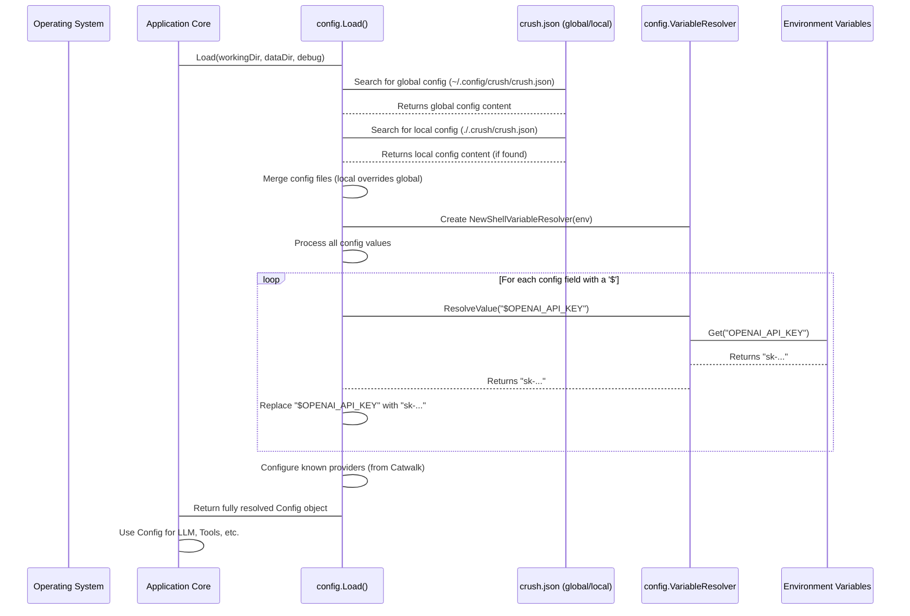

1.  **`Load` Function (`internal/config/load.go`):**
    This is the primary function responsible for loading all configuration.

    ```go
    // internal/config/load.go (simplified)
    func Load(workingDir, dataDir string, debug bool) (*Config, error) {
        configPaths := lookupConfigs(workingDir) // Find config files
        cfg, err := loadFromConfigPaths(configPaths) // Load and merge them
        if err != nil { /* ... handle error ... */ }

        cfg.setDefaults(workingDir, dataDir) // Apply default values

        env := env.New() // Get current environment variables
        valueResolver := NewShellVariableResolver(env) // Create a resolver for '$' values
        cfg.resolver = valueResolver // Store the resolver

        // Configure LLM providers and models, resolving any '$' values
        if err := cfg.configureProviders(env, valueResolver, cfg.knownProviders); err != nil { /* ... */ }

        // Setup agents using the resolved config
        cfg.SetupAgents()
        return cfg, nil
    }
    ```
    This `Load` function orchestrates finding config files, merging them, resolving environment variables, and setting up other parts of the configuration like agents.

2.  **`lookupConfigs` and `loadFromConfigPaths` (`internal/config/load.go`):**
    These functions find and load the actual `crush.json` files. Crush looks for files in a specific order, allowing project-level configurations to override global ones.

    ```go
    // internal/config/load.go (simplified lookupConfigs)
    func lookupConfigs(workingDir string) []string {
        paths := []string{}
        // 1. Global config file (e.g., ~/.config/crush/crush.json)
        paths = append(paths, GlobalConfig())
        // 2. Project-specific config file (e.g., ./crush.json or ./.crush/crush.json)
        // This logic is more complex, looking in different places in the workingDir
        // For simplicity, imagine it adds "./.crush/crush.json"
        projectConfigPath := filepath.Join(workingDir, ".crush", "crush.json")
        if _, err := os.Stat(projectConfigPath); err == nil {
            paths = append(paths, projectConfigPath)
        }
        return paths
    }

    // internal/config/load.go (simplified loadFromConfigPaths)
    func loadFromConfigPaths(configPaths []string) (*Config, error) {
        readers := []io.Reader{}
        for _, path := range configPaths {
            fd, err := os.Open(path)
            if err != nil {
                if os.IsNotExist(err) { continue } // Ignore if file doesn't exist
                return nil, err
            }
            readers = append(readers, fd)
        }
        // Merge all readers into a single JSON object
        return loadFromReaders(readers)
    }
    ```
    The `lookupConfigs` function determines which configuration files are relevant. `loadFromConfigPaths` then reads these files and uses `loadFromReaders` to merge their contents. If the same setting is defined in multiple files, the later file (e.g., project-specific) overrides the earlier one (e.g., global).

3.  **`VariableResolver` (`internal/config/resolve.go`):**
    This is the core component for handling `$VAR` and `$(command)` substitutions.

    ```go
    // internal/config/resolve.go (simplified)
    type VariableResolver interface {
        ResolveValue(value string) (string, error)
    }

    type shellVariableResolver struct {
        shell Shell // Used to execute commands for $(command)
        env   env.Env // Used to get environment variables for $VAR
    }

    func NewShellVariableResolver(env env.Env) VariableResolver {
        return &shellVariableResolver{
            env: env,
            shell: shell.NewShell( // Create a simple shell for command execution
                &shell.Options{ Env: env.Env() },
            ),
        }
    }

    func (r *shellVariableResolver) ResolveValue(value string) (string, error) {
        // ... (logic to find and replace $(command) first) ...
        // ... (logic to find and replace $VAR or ${VAR} next) ...

        // Example for $VAR:
        // if value == "$OPENAI_API_KEY"
        // varName = "OPENAI_API_KEY"
        // envValue := r.env.Get(varName) // Get from environment
        // return envValue // "sk-..."
        return value, nil // Return the fully resolved string
    }
    ```
    The `NewShellVariableResolver` creates an instance that knows how to interact with your environment variables and execute shell commands. The `ResolveValue` method then meticulously scans a string, finds any `$()` or `$` patterns, and replaces them with their actual values. This is why you can put `$OPENAI_API_KEY` directly in your `crush.json` file.

4.  **`configureProviders` (`internal/config/config.go`):**
    After loading and resolving values, the `Config` object itself has a method to set up all the LLM providers.

    ```go
    // internal/config/config.go (simplified configureProviders)
    func (c *Config) configureProviders(e env.Env, resolver VariableResolver, knownProviders []catwalk.Provider) error {
        for id, p := range c.LLM.Providers {
            // Resolve APIKey and BaseURL using the resolver
            resolvedAPIKey, err := resolver.ResolveValue(p.APIKey)
            if err != nil { /* ... error handling ... */ }
            p.APIKey = resolvedAPIKey // Update with resolved value

            resolvedBaseURL, err := resolver.ResolveValue(p.BaseURL)
            if err != nil { /* ... error handling ... */ }
            p.BaseURL = resolvedBaseURL // Update with resolved value

            // ... (further processing for models, etc.) ...
            c.LLM.Providers[id] = p // Store the updated provider config
        }
        return nil
    }
    ```
    This method iterates through each `ProviderConfig` you've defined, uses the `VariableResolver` to fill in any `$VAR` or `$()` placeholders, and then stores the fully configured provider details.

This intricate process ensures that Crush is always running with the correct and up-to-date settings, perfectly tailored to your preferences and environment.

## Conclusion

In this chapter, we've explored the foundational role of **Configuration Management (`config`)** in Crush. We learned that it acts as the application's brain, storing all settings, preferences, and API keys. We saw how it intelligently loads configurations from multiple sources, gracefully handles environment variable resolution, and sets up crucial components like [LLM Providers (`provider`)](09_llm_providers___provider__/.md) and agents. This robust system ensures that Crush operates exactly according to your defined rules, making it a truly personalized and powerful assistant.

This concludes our journey through the core components of Crush! You now have a solid understanding of how all the pieces fit together to create this intelligent and interactive tool.

---

Generated by [AI Codebase Knowledge Builder](https://github.com/The-Pocket/Tutorial-Codebase-Knowledge)
