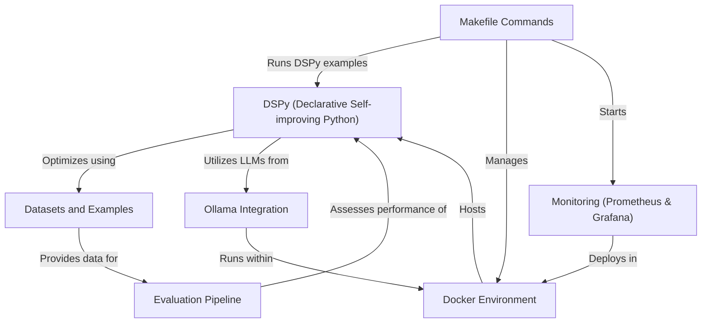
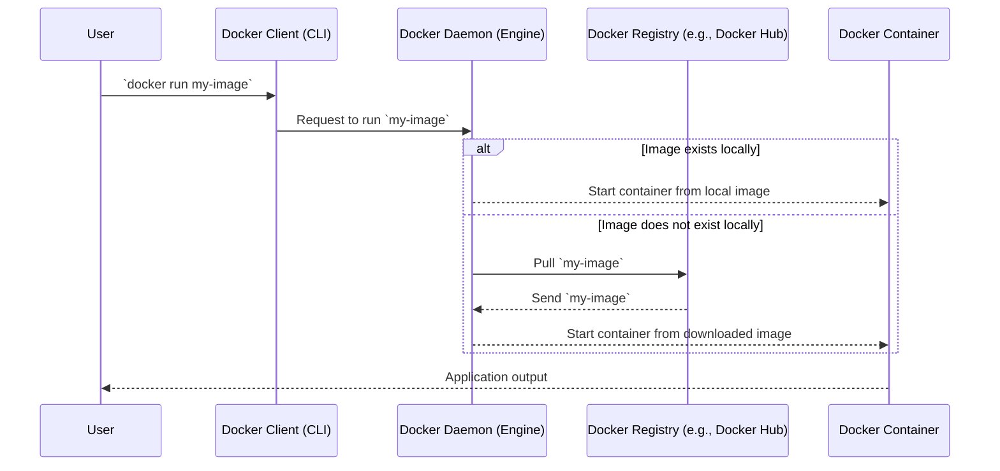
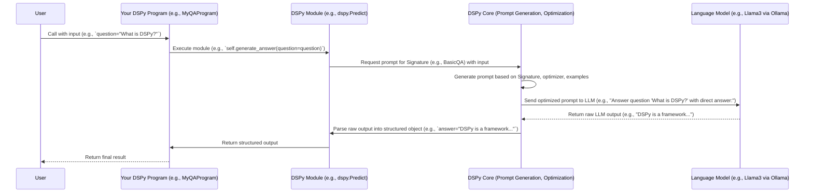
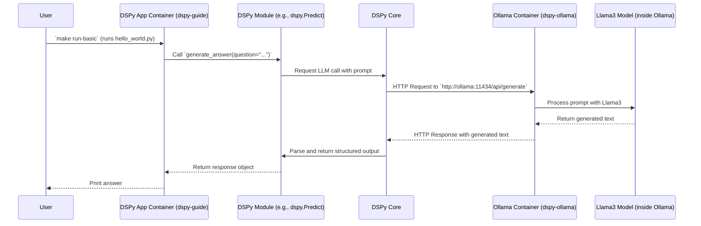
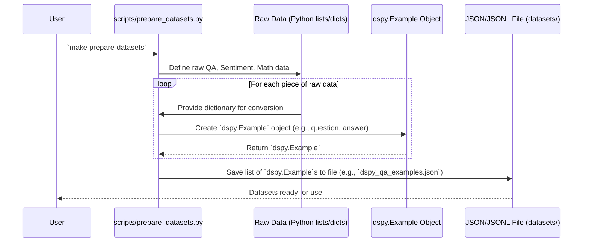
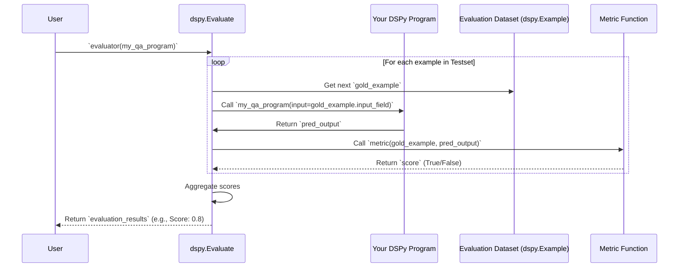
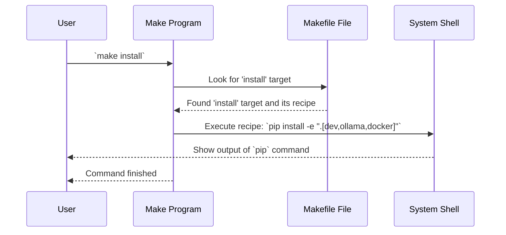
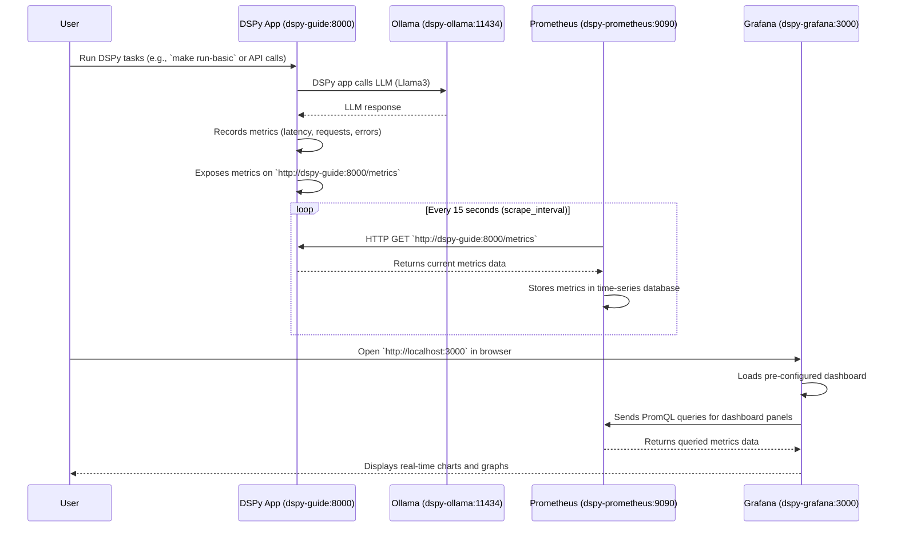

# Tutorial: dspy-0to1-guide

This project is a **beginner-friendly guide** to DSPy, a powerful framework for building *self-improving* LLM applications. It teaches you how to declare what your LLM app should do, and DSPy automatically optimizes the underlying prompts and models. You'll learn to develop, evaluate, and optimize LLM pipelines using local models like Ollama, all within a consistent Docker environment.


**Source Repository:** [https://github.com/haasonsaas/dspy-0to1-guide.git](https://github.com/haasonsaas/dspy-0to1-guide.git)



## Table of Contents

1. [Chapter 1: Docker Environment](#chapter-1-docker-environment)
2. [Chapter 2: DSPy (Declarative Self-improving Python)](#chapter-2-dspy-declarative-self-improving-python)
3. [Chapter 3: Ollama Integration](#chapter-3-ollama-integration)
4. [Chapter 4: Datasets and Examples](#chapter-4-datasets-and-examples)
5. [Chapter 5: Evaluation Pipeline](#chapter-5-evaluation-pipeline)
6. [Chapter 6: Makefile Commands](#chapter-6-makefile-commands)
7. [Chapter 7: Monitoring (Prometheus & Grafana)](#chapter-7-monitoring-prometheus--grafana)

---

# Chapter 1: Docker Environment

Imagine you're baking a cake. You need specific ingredients (flour, eggs, sugar), specific tools (mixer, oven, baking pan), and a specific recipe to follow. If you try to bake the cake in a kitchen that doesn't have all these things, it won't work! Or worse, it might work differently than expected.

Software development can be similar. Your code needs specific versions of Python, certain libraries, and various settings to run correctly. If you share your code with a friend, and their computer has slightly different versions of things, your code might not work for them. This is the classic "it works on my machine!" problem.

This is where **Docker** comes in! Docker is like a magical shipping container for your software. It allows you to package your application and all its dependencies (like Python, libraries, and even operating system settings) into a single, self-contained unit called a **container**.

## What Problem Does Docker Solve?

Let's say you're building an application using DSPy (which we'll learn about in [DSPy (Declarative Self-improving Python)](02_dspy__declarative_self_improving_python__.md)). Your application needs:
*   Python 3.11
*   Specific DSPy library versions
*   Other Python packages
*   An environment to run an AI model (like Ollama, covered in [Ollama Integration](03_ollama_integration_.md))

Without Docker, everyone working on the project would need to manually install all these things on their own computer, making sure they have the exact same versions. This can be a huge headache!

With Docker, you define *once* what your application needs, and then everyone can run it in an identical environment. It's like sending your friend a pre-packaged baking kit with all the exact ingredients and tools, so they can bake the cake perfectly every time.

## Key Concepts of Docker

Let's break down Docker into its core ideas:

### 1. Dockerfile: The Recipe for Your Container

A `Dockerfile` is a plain text file that contains a series of instructions on how to build a Docker image. Think of it as the **recipe** for your shipping container. It tells Docker:
*   What operating system to start with (e.g., a lightweight version of Linux).
*   What software to install (e.g., Python, specific libraries).
*   What files to copy into the container.
*   What commands to run when the container starts.

Here's a simplified look at parts of our project's `Dockerfile`:

```dockerfile
# Start with a base Python image
FROM python:3.11-slim as builder

# Set the working directory inside the container
WORKDIR /build

# Install basic tools needed for building
RUN apt-get update && apt-get install -y build-essential

# Copy our project's configuration file
COPY pyproject.toml .

# Install Python dependencies
RUN pip install --no-cache-dir -e ".[dev,ollama]"

# --- Production stage starts here ---
FROM python:3.11-slim

# Set the final working directory
WORKDIR /app

# Copy Python packages from the "builder" stage
COPY --from=builder /usr/local/lib/python3.11/site-packages /usr/local/lib/python3.11/site-packages

# Copy our application code
COPY . .

# Define what command to run when the container starts
CMD ["python", "examples/basic/hello_world.py"]
```

**Explanation:**

*   `FROM python:3.11-slim`: This line tells Docker to start with a specific version of Python (3.11) built on a very lightweight Linux system. This is our foundation.
*   `WORKDIR /build`: This sets the default directory inside the container for subsequent commands.
*   `RUN apt-get update && apt-get install -y build-essential`: This command updates the package list and installs some essential tools needed to build Python packages.
*   `COPY pyproject.toml .`: This copies our project's configuration file into the container.
*   `RUN pip install ...`: This installs all the necessary Python libraries for our project.
*   The `FROM python:3.11-slim` again marks the start of a "production stage". This is a clever Docker trick called a **multi-stage build**! It allows us to install heavy build tools in an earlier stage and then only copy the essential parts (like the installed Python libraries) to a smaller, cleaner final image. This makes our final container much smaller and more efficient.
*   `COPY . .`: This copies all the files from your current project directory (where your `Dockerfile` is located) into the `/app` directory inside the container.
*   `CMD ["python", "examples/basic/hello_world.py"]`: This specifies the default command that will run when you start a container from this image. In our case, it will run a simple DSPy example.

### 2. Docker Image: The Blueprint for Your Container

Once you have a `Dockerfile`, you use it to build a **Docker image**. An image is a read-only template that contains your application and its environment. Think of it as the **pre-packaged baking kit** itself, ready to be used. You can share this image with others, and they can create their own running instances from it.

### 3. Docker Container: The Running Instance

A **Docker container** is a running instance of a Docker image. It's like taking that pre-packaged baking kit and actually starting to bake the cake. Each container is isolated from other containers and from your host machine, ensuring a consistent environment. You can have multiple containers running from the same image, and they won't interfere with each other.

## How to Use Docker in Our Project

Our project uses Docker to ensure everyone has the same environment to run DSPy code, including any AI models. The `Makefile` (which we'll cover in [Makefile Commands](06_makefile_commands_.md)) provides easy commands to interact with Docker.

### Building the Docker Image

First, we need to build the Docker image using our `Dockerfile`.

```bash
make docker-build
```

**Explanation:**
This command executes `docker build -t dspy-0to1-guide .`.
*   `docker build`: This is the command to build a Docker image.
*   `-t dspy-0to1-guide`: This assigns a "tag" (a name) to our image, making it easy to refer to later. We're calling it `dspy-0to1-guide`.
*   `.`: This tells Docker to look for the `Dockerfile` in the current directory.

When you run this, Docker will go through each instruction in the `Dockerfile`, download necessary base images, install software, and copy files. This might take a few minutes the first time.

### Running a Docker Container

Once the image is built, you can run a container from it.

```bash
make docker-run
```

**Explanation:**
This command executes `docker run -it --rm -p 8000:8000 dspy-0to1-guide`.
*   `docker run`: This command creates and starts a new container from an image.
*   `-it`: This makes the container interactive (so you can see output) and attaches your terminal to it.
*   `--rm`: This is a handy flag that automatically removes the container when it exits. This keeps your system clean.
*   `-p 8000:8000`: This maps port 8000 on your computer to port 8000 inside the container. We'll use this later for monitoring with Prometheus.
*   `dspy-0to1-guide`: This is the name of the image we want to run.

When you run `make docker-run`, you should see the output of `examples/basic/hello_world.py` because that's the `CMD` specified in our `Dockerfile`. This means your DSPy application is running inside an isolated Docker container!

## What Happens Under the Hood?

Let's visualize the basic flow when you run a Docker container.



**Step-by-step:**

1.  **You type a command:** When you run `make docker-run` (which translates to `docker run ...`), your command line interface (CLI) talks to the Docker client.
2.  **Docker Client talks to Docker Daemon:** The Docker client sends this instruction to the Docker Daemon, which is the "engine" that manages Docker containers on your machine.
3.  **Image Check:** The Docker Daemon first checks if it already has the `dspy-0to1-guide` image stored locally.
4.  **Pull (if needed):** If it doesn't have the image (or if the image is very old and you specify to pull a new one), it would typically try to download it from a Docker Registry (like Docker Hub). In our case, since we `docker-build` locally, it will find the image.
5.  **Container Creation & Start:** Once the image is available, the Docker Daemon creates a new container based on that image. It allocates resources, sets up the isolated environment, and then runs the `CMD` specified in the `Dockerfile`.
6.  **Application Runs:** Inside the container, your Python script (`hello_world.py`) executes.
7.  **Output:** The output from your script is then shown in your terminal, as if it were running directly on your machine.

This entire process ensures that your application always runs in the exact same environment, no matter whose computer it's on, as long as Docker is installed.

## Docker Compose: Orchestrating Multiple Containers

For more complex applications, you often need several containers to work together. For example, our project will eventually involve:
*   The main DSPy application container.
*   An Ollama container to host AI models locally.
*   Prometheus and Grafana containers for monitoring (covered in [Monitoring (Prometheus & Grafana)](07_monitoring__prometheus___grafana__.md)).

Managing all these containers individually can get complicated. That's where `docker-compose.yml` comes in! This file allows you to define and run multi-container Docker applications. It's like writing a script that tells Docker how to set up an entire ecosystem of containers that work together.

Here's a snippet from our `docker-compose.yml`:

```yaml
version: '3.8'

services:
  dspy-guide: # Our main DSPy application
    build: .
    container_name: dspy-0to1-guide
    ports:
      - "8000:8000"
    volumes: # Share folders between your computer and the container
      - ./data:/app/data
      - ./logs:/app/logs
    networks:
      - dspy-network

  ollama: # The container for our local AI models
    image: ollama/ollama:latest
    container_name: dspy-ollama
    ports:
      - "11434:11434"
    volumes:
      - ollama-data:/root/.ollama
    networks:
      - dspy-network

volumes: # Define named volumes for persistent data
  ollama-data:

networks: # Define a shared network for containers to talk to each other
  dspy-network:
    driver: bridge
```

**Explanation:**

*   `services:`: This section defines all the individual containers (services) that make up our application.
*   `dspy-guide`: This is our main DSPy application.
    *   `build: .`: Tells Docker Compose to build the image from the `Dockerfile` in the current directory.
    *   `ports: - "8000:8000"`: Maps ports, same as with `docker run`.
    *   `volumes: - ./data:/app/data`: This is important! It creates a shared folder. Any changes you make to the `data` folder on your computer will be reflected inside the container's `/app/data` folder, and vice-versa. This is great for saving data, logs, or configuration files outside the container.
*   `ollama`: This defines a service for Ollama, which will host our local AI models.
    *   `image: ollama/ollama:latest`: Instead of building from a `Dockerfile`, this tells Docker Compose to pull the official `ollama/ollama` image from Docker Hub.
*   `volumes:`: This section defines "named volumes." These are persistent storage areas managed by Docker. Even if you remove a container, the data in these volumes can remain, which is crucial for things like AI model weights or database files.
*   `networks:`: This defines a shared network named `dspy-network`. All services connected to this network can communicate with each other using their service names (e.g., `dspy-guide` can talk to `ollama`).

Docker Compose allows us to start, stop, and manage all these interconnected services with a single command, making complex setups much easier to handle.

## Conclusion

You've just taken your first step into understanding Docker! You learned that:
*   Docker provides a consistent and isolated environment for your applications, solving "it works on my machine" problems.
*   A `Dockerfile` is the recipe for building a Docker image.
*   A Docker image is a blueprint, and a Docker container is a running instance of that blueprint.
*   `make docker-build` builds the project's Docker image.
*   `make docker-run` starts a container from that image.
*   `docker-compose.yml` helps orchestrate multiple interconnected containers.

This foundational knowledge of Docker will be crucial as we dive deeper into the DSPy project, especially when we integrate with external services like Ollama and set up monitoring.

Next, we'll shift our focus to the core of this guide: [DSPy (Declarative Self-improving Python)](02_dspy__declarative_self_improving_python__.md), and see how it helps build powerful language model applications.

---

# Chapter 2: DSPy (Declarative Self-improving Python)

Welcome back! In [Chapter 1: Docker Environment](01_docker_environment_.md), we learned how Docker creates a consistent "container" for our code, ensuring everything runs smoothly no matter where it is. Now that we have our reliable environment, it's time to introduce the star of our show: **DSPy (Declarative Self-improving Python)**.

Imagine you want to build an application that can answer questions based on a document, like a helpful assistant for a new employee handbook. Your goal is for the application to *understand* a question and then *find the right answer* in the document.

Traditionally, you might spend hours crafting a perfect "prompt" for a Large Language Model (LLM) like ChatGPT or Llama. This prompt would tell the LLM exactly what to do: "Here's a document. Here's a question. Find the answer in the document. If you can't find it, say 'I don't know'." This is called **prompt engineering**.

## The Problem with Traditional Prompt Engineering

Prompt engineering can be like trying to tune a complex radio with a tiny, unpredictable dial.
*   **Brittle:** Change one word in your prompt, and the LLM's answer might go from perfect to completely wrong.
*   **Time-consuming:** You'll spend a lot of time tweaking prompts, testing them, and then tweaking them again.
*   **Hard to manage:** As your application gets more complex, with multiple steps (e.g., first find relevant info, then summarize it, then answer), managing all these prompts becomes a nightmare.
*   **Not adaptable:** If you switch to a different LLM (e.g., from Llama to GPT), your carefully crafted prompts might not work well anymore, and you have to start over.

## DSPy's Solution: Declare *What*, Not *How*

DSPy offers a fresh perspective. Instead of telling the LLM *how* to answer (by writing detailed prompts), you tell DSPy *what* you want the application to do. You **declare** the task, and DSPy figures out the best way to prompt the LLM to achieve that task. It's like telling a chef, "I want a delicious chocolate cake," instead of giving them a step-by-step recipe for every ingredient and every oven temperature. The chef (DSPy) knows how to make a great cake!

DSPy stands for **Declarative Self-improving Python**:
*   **Declarative:** You declare the *goals* and *structure* of your LLM application, not the exact prompts.
*   **Self-improving:** DSPy can automatically optimize and refine the prompts and internal steps of your application to improve performance, often by learning from examples.
*   **Python:** It's a Python library, making it easy to integrate into your existing projects.

Let's revisit our "question answering from a document" example. With DSPy, you would declare that you need a step to "find relevant passages" and another step to "answer the question based on those passages." DSPy then takes care of generating the specific prompts and even learning how to make them better!

## Key Concepts of DSPy

DSPy breaks down LLM application development into three core concepts:

### 1. Signatures: Declaring Your Task's Input and Output

A **Signature** is the most fundamental concept in DSPy. It's like defining the input and output types for a function. You tell DSPy: "For this specific step, I expect these inputs, and I want these outputs." You don't specify *how* the LLM should get from input to output, just *what* it should produce.

Let's look at a simple example from our project (`examples/basic/hello_world.py`):

```python
import dspy

# Define a simple Signature
class BasicQA(dspy.Signature):
    """Answer questions with a simple, direct answer."""
    question = dspy.InputField()
    answer = dspy.OutputField()

# That's it!
```

**Explanation:**
*   `class BasicQA(dspy.Signature):`: We're creating a new Signature called `BasicQA`.
*   `"""Answer questions with a simple, direct answer."""`: This is a docstring, which DSPy uses as the instruction to the LLM. It's automatically included in the prompt!
*   `question = dspy.InputField()`: We declare that our task will take a `question` as input.
*   `answer = dspy.OutputField()`: We declare that our task will produce an `answer` as output.

This `BasicQA` signature tells DSPy: "I have a question, and I need a simple, direct answer." DSPy will then generate a prompt for the LLM that includes this instruction and the input question, and expects an answer back.

### 2. Modules: The Building Blocks of Your Application

**Modules** are the actual computational steps in your DSPy program. They take inputs, use LLMs (guided by Signatures), and produce outputs. Think of them as specialized tools that perform a specific part of your overall task.

DSPy provides several built-in modules, such as:
*   `dspy.Predict`: For direct LLM predictions based on a Signature.
*   `dspy.ChainOfThought`: For multi-step reasoning.
*   `dspy.Retrieve`: For searching information from a knowledge base.
*   `dspy.Program`: For combining multiple modules into a larger pipeline.

Let's continue our `hello_world.py` example to see `dspy.Predict` in action:

```python
import dspy

# (Assume BasicQA Signature is defined here, as above)

# Configure DSPy to use a local LLM via Ollama
# We'll cover Ollama in detail in the next chapter!
# For now, just know this connects DSPy to an AI model.
ollama_llama3 = dspy.OllamaLocal(model='llama3', max_tokens=250)
dspy.configure(lm=ollama_llama3)

# Create an instance of our Predict module
# It uses the BasicQA signature we defined
generate_answer = dspy.Predict(BasicQA)

# Call the module with a question
response = generate_answer(question="What is the capital of France?")

# Print the result
print(f"Question: {response.question}")
print(f"Answer: {response.answer}")
```

**Explanation:**
*   `ollama_llama3 = dspy.OllamaLocal(...)`: This line sets up our LLM. It tells DSPy to use a local Llama3 model running through Ollama.
*   `dspy.configure(lm=ollama_llama3)`: This globally sets the default LLM for all DSPy modules.
*   `generate_answer = dspy.Predict(BasicQA)`: Here we create a `Predict` module. We give it our `BasicQA` signature, which means this module's job is to take a `question` and return an `answer`.
*   `response = generate_answer(question="...")`: We call our `generate_answer` module, passing in the `question`. DSPy handles creating the prompt, sending it to the LLM, and getting the answer back.
*   `print(...)`: We access the `question` and `answer` fields from the `response` object.

If you run this code (which you can do using `make run-basic` after setting up Ollama in the next chapter), you would typically see output like:

```
Question: What is the capital of France?
Answer: Paris
```

### 3. Optimizers: Making Your Application Smarter

This is where the "Self-improving" part of DSPy shines! **Optimizers** are algorithms that automatically tune your DSPy program. They can adjust the prompts generated by signatures, select better "few-shot examples" (examples given to the LLM to guide its behavior), or re-order steps in your pipeline. The goal is to make your program more accurate, efficient, or robust, all without you manually tweaking prompts.

Think of an optimizer as a coach for your DSPy modules. You give the coach some examples of good and bad performance, and they figure out how to make your team (your modules) play better.

A common optimizer is `dspy.BootstrapFewShot`. This optimizer takes a small set of example input/output pairs and uses them to teach your modules how to perform better.

```python
import dspy

# (Assume BasicQA Signature and LLM configuration are defined)

class BasicQA(dspy.Signature):
    """Answer questions with a simple, direct answer."""
    question = dspy.InputField()
    answer = dspy.OutputField()

# Define our module (program)
class MyQAProgram(dspy.Program):
    def __init__(self):
        super().__init__()
        self.generate_answer = dspy.Predict(BasicQA)

    def forward(self, question):
        # This defines the flow of our program
        response = self.generate_answer(question=question)
        return response

# Create some example data for optimization
train_examples = [
    dspy.Example(question="What is the highest mountain in the world?", answer="Mount Everest"),
    dspy.Example(question="Who painted the Mona Lisa?", answer="Leonardo da Vinci"),
    dspy.Example(question="What is the chemical symbol for water?", answer="H2O")
]

# Instantiate our program
my_qa_program = MyQAProgram()

# Instantiate the optimizer
optimizer = dspy.BootstrapFewShot(metric=dspy.evaluate.answer_exact_match)

# Compile (optimize) the program using our examples
# This is where DSPy 'learns' and improves
compiled_qa_program = optimizer.compile(student=my_qa_program, trainset=train_examples)

# Now use the optimized program
response = compiled_qa_program(question="What is the capital of Japan?")
print(f"Optimized Answer: {response.answer}")
```

**Explanation:**
*   `class MyQAProgram(dspy.Program):`: We define a `Program` which can contain one or more `Modules`.
*   `self.generate_answer = dspy.Predict(BasicQA)`: Inside our program, we use our `BasicQA` module.
*   `def forward(self, question):`: The `forward` method defines the execution flow of our program. For now, it's very simple.
*   `train_examples = [...]`: These are a few high-quality examples of inputs and desired outputs. DSPy uses these to learn.
*   `optimizer = dspy.BootstrapFewShot(...)`: We create an optimizer. `metric` is a function that tells the optimizer how to judge if an answer is good or bad (e.g., `answer_exact_match` checks if the answer is exactly correct).
*   `compiled_qa_program = optimizer.compile(student=my_qa_program, trainset=train_examples)`: This is the magic step! DSPy takes our `my_qa_program` and the `train_examples`, and the optimizer goes to work. It might run the LLM many times, observe its performance, and then refine the prompts or select better examples to include in future prompts, all automatically.
*   `response = compiled_qa_program(...)`: We use the *optimized* program. It will now perform better because it has learned from the examples.

The output will still be an answer to "What is the capital of Japan?", but the way DSPy constructs the internal prompts to the LLM will be more effective due to the optimization step.

## How DSPy Works Under the Hood

Let's simplify the process of what happens when you use a `dspy.Predict` module with a `Signature` and an LLM.



**Step-by-step:**

1.  **You call your DSPy Program:** You initiate your DSPy application with an input (e.g., a question).
2.  **Program executes a Module:** Your program's `forward` method calls a DSPy module (like `dspy.Predict`).
3.  **Module requests a prompt:** The module tells the DSPy Core, "I need to run the LLM using this Signature and with this input."
4.  **DSPy Core generates the prompt:** This is the clever part. DSPy Core *doesn't* just use a fixed prompt. It looks at:
    *   The `Signature` (e.g., `BasicQA`'s docstring and input/output fields).
    *   Any optimizations that have been applied (e.g., if `BootstrapFewShot` added examples).
    *   The specific input you provided.
    It then dynamically constructs the best possible prompt to send to the LLM.
5.  **Prompt sent to LLM:** This generated prompt is sent to the configured Language Model (e.g., Llama3 running on Ollama).
6.  **LLM responds:** The LLM processes the prompt and sends back its raw text output.
7.  **DSPy Core parses output:** DSPy Core takes the raw LLM output and intelligently parses it back into the structured format defined by your `Signature` (e.g., extracting the `answer` field).
8.  **Module returns structured output:** The module receives this structured data.
9.  **Program returns final result:** Your DSPy program then returns the final, structured output to you.

This entire process means you, the developer, focus on the high-level logic and what you want the LLM to achieve, while DSPy handles the complex, often frustrating, details of prompt engineering and optimization.

## Connection to Our Project

In this `dspy-0to1-guide` project, we'll use DSPy to build various LLM applications. You'll see:
*   How to define `Signatures` for different tasks (like question answering, summarization, or even complex reasoning).
*   How to combine `Modules` to create sophisticated pipelines (e.g., first retrieve information, then summarize it, then answer a question).
*   How to use `Optimizers` to fine-tune these pipelines based on real data, making them more robust and accurate.

The `examples/basic/hello_world.py` and `examples/basic/math_qa.py` files are great starting points to see DSPy in action.

For example, the `math_qa.py` script uses a slightly more complex signature and module to handle mathematical questions:

```python
import dspy

# (LLM configuration assumed)

class MathQA(dspy.Signature):
    """Answer the given math problem. The final answer should be a number."""
    problem = dspy.InputField()
    answer = dspy.OutputField()

class MathProgram(dspy.Program):
    def __init__(self):
        super().__init__()
        # Use ChainOfThought for multi-step reasoning
        self.generate_answer = dspy.ChainOfThought(MathQA)

    def forward(self, problem):
        # The ChainOfThought module automatically adds a 'thought' field
        # to the prompt, encouraging the LLM to think step-by-step.
        response = self.generate_answer(problem=problem)
        return response

# Instantiate and run the program
math_program = MathProgram()
response = math_program(problem="If a train travels at 60 mph for 2 hours, how far does it go?")
print(f"Problem: {response.problem}")
print(f"Thought: {response.thought}") # DSPy added this!
print(f"Answer: {response.answer}")
```

**Explanation:**
*   `class MathQA(dspy.Signature):`: Defines the input (`problem`) and output (`answer`) for a math task.
*   `self.generate_answer = dspy.ChainOfThought(MathQA)`: Here, we use `dspy.ChainOfThought` instead of `dspy.Predict`. This module is designed to encourage the LLM to show its reasoning steps (`thought`) before providing the final answer. This is a powerful technique for improving accuracy in complex tasks.
*   `print(f"Thought: {response.thought}")`: Because we used `ChainOfThought`, DSPy automatically includes a `thought` field in the response, which contains the LLM's step-by-step reasoning.

This demonstrates how DSPy modules encapsulate common LLM patterns, allowing you to easily build more sophisticated reasoning capabilities without manually crafting complex "chain-of-thought" prompts.

## Conclusion

DSPy is a powerful framework that shifts your focus from tedious prompt engineering to declaratively defining your LLM application's goals. By understanding **Signatures** (what your task needs), **Modules** (how to perform steps), and **Optimizers** (how to make it better), you can build robust and self-improving LLM applications with Python.

This declarative approach, combined with DSPy's ability to automatically optimize, makes building complex LLM applications much more manageable and adaptable.

Next up, we'll dive into [Chapter 3: Ollama Integration](03_ollama_integration_.md), where we'll learn how to connect DSPy to local LLMs, allowing us to experiment and develop without relying on external cloud services.

---

# Chapter 3: Ollama Integration

Welcome back! In [Chapter 1: Docker Environment](01_docker_environment_.md), we set up a consistent environment for our code, and in [Chapter 2: DSPy (Declarative Self-improving Python)](02_dspy__declarative_self_improving_python__.md), we learned how to build powerful LLM applications declaratively. Now, it's time to connect our DSPy applications to an actual Large Language Model (LLM).

Imagine you're building a helpful chatbot using DSPy. For it to actually *chat*, it needs a brain – an LLM. You could use a cloud-based LLM like OpenAI's GPT-4, but that often comes with costs, privacy concerns, and reliance on an internet connection. What if you want to develop and test your applications quickly, privately, and without incurring API costs?

This is where **Ollama** comes in! Ollama is like having your very own personal LLM server running right on your computer. It allows you to download and run many different open-source LLMs (like Llama3, Mistral, CodeLlama) locally.

## The Problem Ollama Solves

When developing with LLMs, you often face challenges like:
*   **Cost:** Each API call to a cloud LLM costs money, which can add up during development and testing.
*   **Privacy:** For sensitive applications, sending data to external LLM providers might be a concern.
*   **Internet Dependency:** You need an active internet connection to use cloud LLMs.
*   **Latency:** Network delays can slow down your development loop.

Ollama addresses these by bringing the LLMs to your machine. It's like having a powerful, private AI assistant available 24/7, even offline!

## Key Concepts of Ollama

### 1. Running LLMs Locally

Ollama makes it incredibly easy to download and run various LLMs. It handles all the complex setup, memory management, and execution details for you. You just tell it which model you want, and it takes care of the rest.

### 2. Simple API Access

Once an LLM is running with Ollama, it exposes a simple API. This means your DSPy application (or any other program) can "talk" to the local LLM just as easily as it would talk to a cloud LLM, but without leaving your computer.

### 3. Model Library

Ollama offers a growing library of popular open-source models. You can choose the best model for your specific task, whether it's general conversation, coding, or specific language generation.

## How to Get Ollama Running

Our project uses Docker to manage everything, including Ollama. This means you don't have to install Ollama directly on your computer; it runs neatly inside its own Docker container.

Let's look at the relevant part of our `docker-compose.yml` file:

```yaml
# ... other services ...

  ollama: # The container for our local AI models
    image: ollama/ollama:latest
    container_name: dspy-ollama
    ports:
      - "11434:11434" # This is the default port Ollama uses
    volumes:
      - ollama-data:/root/.ollama # Store model weights persistently
    environment:
      - OLLAMA_HOST=0.0.0.0 # Allows access from other containers
    networks:
      - dspy-network # Connects Ollama to our DSPy app container

volumes:
  ollama-data: # This volume stores Ollama models and data

# ... other networks ...
```

**Explanation:**
*   `ollama:`: We define a service named `ollama` in our Docker Compose setup.
*   `image: ollama/ollama:latest`: This tells Docker to pull the latest official Ollama image from Docker Hub. You don't need to build it yourself.
*   `container_name: dspy-ollama`: Gives our Ollama container a friendly name.
*   `ports: - "11434:11434"`: This maps port 11434 inside the container (where Ollama listens) to port 11434 on your host machine. This means you could access Ollama directly from your browser at `http://localhost:11434` if you wanted to.
*   `volumes: - ollama-data:/root/.ollama`: This is crucial! It means that when you download an LLM (like Llama3) into the Ollama container, the model files are saved to a special Docker volume called `ollama-data`. Even if you stop and remove the Ollama container, the model files will still be there, so you don't have to download them again.
*   `environment: - OLLAMA_HOST=0.0.0.0`: This is a technical detail that ensures Ollama can be accessed by other containers in the Docker network.
*   `networks: - dspy-network`: This connects the Ollama container to the same network as our main DSPy application container (`dspy-guide`). This allows the two containers to communicate with each other using their service names (e.g., `dspy-guide` can talk to `ollama`).

### Starting Ollama and Downloading Models

To get Ollama running and ready to serve models, you'll use `docker-compose`.

1.  **Start all services (including Ollama):**
    ```bash
    make up # This runs `docker compose up -d`
    ```
    This command starts all the services defined in `docker-compose.yml` in "detached" mode (meaning they run in the background).

2.  **Download a model (e.g., Llama3):**
    Once the Ollama container is running, you need to tell it to download an LLM. You can do this by executing a command *inside* the running Ollama container.

    ```bash
    make download-models
    ```

    **Explanation:**
    This command executes `docker exec dspy-ollama ollama pull llama3 && docker exec dspy-ollama ollama pull codellama && docker exec dspy-ollama ollama pull mistral`.
    *   `docker exec dspy-ollama`: This tells Docker to execute a command *inside* the container named `dspy-ollama`.
    *   `ollama pull llama3`: This is the actual Ollama command to download the `llama3` model. It might take a while, as LLMs are large files (several gigabytes).

    You can also download other models like `codellama` or `mistral` using similar commands.

After these steps, Ollama will be running in its container, and the `llama3` model will be downloaded and ready for use.

## Integrating Ollama with DSPy

Now that Ollama is running with a model, let's see how easy it is to connect it to our DSPy application.

Recall from [Chapter 2: DSPy (Declarative Self-improving Python)](02_dspy__declarative_self_improving_python__.md) that we configure DSPy to use an LLM. Here's how we connect to our local Ollama model:

```python
import dspy

# 1. Define the Ollama LLM
# The 'model' argument specifies which LLM you pulled (e.g., 'llama3')
# The 'base_url' points to the Ollama server (within our Docker network)
ollama_llama3 = dspy.OllamaLocal(model='llama3', base_url='http://ollama:11434')

# 2. Configure DSPy to use this LLM
dspy.configure(lm=ollama_llama3)

# Now your DSPy program can use the local Llama3 model!
# Example from hello_world.py
class BasicQA(dspy.Signature):
    """Answer questions with a simple, direct answer."""
    question = dspy.InputField()
    answer = dspy.OutputField()

generate_answer = dspy.Predict(BasicQA)
response = generate_answer(question="What is the capital of France?")
print(f"Answer: {response.answer}")
```

**Explanation:**
*   `ollama_llama3 = dspy.OllamaLocal(model='llama3', base_url='http://ollama:11434')`:
    *   `dspy.OllamaLocal`: This is DSPy's specific class for connecting to local Ollama instances.
    *   `model='llama3'`: This tells DSPy which specific model *you downloaded* (e.g., Llama3) you want to use.
    *   `base_url='http://ollama:11434'`: This is the crucial part for Docker Compose. Instead of `localhost`, we use `ollama` because that's the service name of our Ollama container within the `dspy-network`. Docker's internal networking allows containers to refer to each other by their service names. The port `11434` is Ollama's default API port.
*   `dspy.configure(lm=ollama_llama3)`: This sets our `ollama_llama3` instance as the default Language Model for all subsequent DSPy operations.

Now, when your `generate_answer` module (which uses `dspy.Predict`) needs to interact with an LLM, it will automatically send its requests to the Llama3 model running inside your `dspy-ollama` Docker container.

## What Happens Under the Hood?

Let's visualize the communication flow when your DSPy program uses Ollama in our Docker environment.



**Step-by-step:**

1.  **You run your DSPy application:** You execute `make run-basic`, which starts your `dspy-guide` container and runs `hello_world.py`.
2.  **DSPy Module needs an LLM:** Your `dspy.Predict` module, `generate_answer`, is called with a question. It needs the LLM to process this.
3.  **DSPy Core prepares prompt:** DSPy Core constructs the appropriate prompt based on your [Signature](02_dspy__declarative_self_improving_python__.md).
4.  **DSPy Core sends request to Ollama:** Because you configured `dspy.OllamaLocal`, DSPy sends an HTTP request to `http://ollama:11434/api/generate` (or a similar endpoint depending on the specific Ollama API call).
    *   Crucially, `ollama` here resolves to the IP address of the `dspy-ollama` container within the shared `dspy-network`.
5.  **Ollama container receives request:** The `dspy-ollama` container receives this request on port 11434.
6.  **Ollama processes with Llama3:** Inside the Ollama container, the Ollama server passes the prompt to the loaded `llama3` model.
7.  **Llama3 generates response:** The Llama3 model processes the prompt and generates a text response.
8.  **Ollama sends response back:** Ollama sends this text response back to the `dspy-guide` container.
9.  **DSPy Core parses output:** DSPy Core receives the raw text and parses it into the structured output defined by your Signature.
10. **DSPy Module returns result:** The `generate_answer` module returns the structured response.
11. **DSPy App prints answer:** Your Python script then prints the answer.

This seamless integration allows you to leverage powerful LLMs for your DSPy development, all running locally and privately thanks to Ollama and Docker.

## Running the Examples

You can try this yourself with the `hello_world.py` and `math_qa.py` examples in the project.

First, ensure your Docker Compose services are up and models are downloaded:

```bash
make up
make download-models
```

Then, you can run the basic examples:

```bash
make run-basic
```

You should see output from `hello_world.py` and `math_qa.py`, where the answers are generated by the Llama3 model running locally via Ollama.

## Conclusion

You've learned that **Ollama** is a fantastic tool for running Large Language Models directly on your computer, providing a cost-effective, private, and offline development environment. We saw how `docker-compose.yml` is used to orchestrate the Ollama container, and how `make download-models` helps you get LLMs ready. Most importantly, you now understand how to connect your DSPy applications to these local LLMs using `dspy.OllamaLocal` and configure DSPy to use them.

This local setup is incredibly valuable for rapid prototyping and testing without external dependencies.

Next, we'll explore how to work with **[Datasets and Examples](04_datasets_and_examples_.md)**, which are crucial for training and optimizing your DSPy programs to achieve the best performance.

---

# Chapter 4: Datasets and Examples

Welcome back! In [Chapter 1: Docker Environment](01_docker_environment_.md), we got our consistent coding environment set up. Then, in [Chapter 2: DSPy (Declarative Self-improving Python)](02_dspy__declarative_self_improving_python__.md), we learned how to tell DSPy *what* we want our LLM applications to do, rather than *how* to do it. Finally, in [Chapter 3: Ollama Integration](03_ollama_integration_.md), we connected DSPy to powerful local LLMs using Ollama.

Now, imagine you've built a simple DSPy program that answers questions. You test it with a few questions, and it works okay. But how do you know if it's *really* good? How can you make it even better?

This is where **Datasets and Examples** come in! Just like a student needs practice questions and example solutions to learn and improve, your DSPy program needs data to become smarter.

## The Problem Datasets and Examples Solve

When you're building an LLM application, you often want it to:
*   **Learn from experience:** You want your program to get better at a task by seeing how good answers look.
*   **Be consistent:** You want it to perform reliably across many different situations.
*   **Be measurable:** You need a way to objectively say, "My program is X% accurate" or "It's better than before."

Without structured data, improving and evaluating your LLM application is like trying to hit a target in the dark. Datasets and Examples provide the light!

## What are Datasets and Examples?

Think of it this way:

*   **Dataset:** A large collection of related information. It's like a big textbook filled with practice problems and their correct solutions.
*   **Example:** A single, specific instance from a dataset. It's one practice problem with its correct answer.

In the context of DSPy, Datasets and Examples are crucial for two main things:

1.  **Training (Optimization):** Teaching your DSPy program how to perform its tasks better. DSPy's optimizers (like `BootstrapFewShot` from [Chapter 2: DSPy (Declarative Self-improving Python)](02_dspy__declarative_self_improving_python__.md)) use these examples to refine the internal prompts and strategies used by the LLM.
2.  **Evaluation:** Measuring how well your DSPy program is performing. You feed it new examples it hasn't seen before and check if its answers match the correct ones.

## Key Concepts of DSPy Examples

DSPy has a specific way of representing examples, making it easy for optimizers and evaluation tools to understand them.

### `dspy.Example`: The Building Block

In DSPy, an `Example` is a simple object that holds an input and its corresponding correct output for a specific task.

Let's look at how we create simple examples for a question-answering task:

```python
import dspy

# Example 1: A simple question and its correct answer
example1 = dspy.Example(
    question="What is the capital of France?",
    answer="Paris"
)

# Example 2: Another question and answer
example2 = dspy.Example(
    question="Who painted the Mona Lisa?",
    answer="Leonardo da Vinci"
)

print(f"Example 1 Question: {example1.question}")
print(f"Example 1 Answer: {example1.answer}")
```

**Explanation:**
*   `dspy.Example(...)`: This creates a new DSPy example.
*   `question="...", answer="..."`: We provide keyword arguments that match the input and output fields of our DSPy [Signature](02_dspy__declarative_self_improving_python__.md). If you have a `BasicQA` signature with `question` and `answer` fields, these examples fit perfectly!

These examples are like flashcards for your DSPy program. The optimizer will show these flashcards to the LLM and say, "Hey, when you see a question like this, the answer should be that."

### Datasets as Collections of `dspy.Example`

Typically, you'll have many examples, which you'll group into a list or similar collection to form a dataset.

```python
import dspy

# Create a list of DSPy Examples
trainset = [
    dspy.Example(question="What is the highest mountain?", answer="Mount Everest"),
    dspy.Example(question="What is the largest ocean?", answer="Pacific Ocean"),
    dspy.Example(question="What is the chemical symbol for water?", answer="H2O")
]

# You can access individual examples
print(f"First example question: {trainset[0].question}")
print(f"Number of examples in trainset: {len(trainset)}")
```

**Explanation:**
*   `trainset = [...]`: We create a list containing multiple `dspy.Example` objects. This list now serves as our "training dataset."

## Using Datasets and Examples for Optimization

As we briefly touched upon in [Chapter 2: DSPy (Declarative Self-improving Python)](02_dspy__declarative_self_improving_python__.md), optimizers use these examples to make your DSPy program better.

Let's revisit the `BootstrapFewShot` optimizer:

```python
import dspy

# (Assume LLM configuration is done, e.g., dspy.configure(lm=ollama_llama3))

# Our simple QA Signature
class BasicQA(dspy.Signature):
    """Answer questions with a simple, direct answer."""
    question = dspy.InputField()
    answer = dspy.OutputField()

# Our DSPy program that uses the Signature
class MyQAProgram(dspy.Program):
    def __init__(self):
        super().__init__()
        self.generate_answer = dspy.Predict(BasicQA)

    def forward(self, question):
        return self.generate_answer(question=question)

# --- This is our dataset of examples ---
train_examples = [
    dspy.Example(question="What is the capital of France?", answer="Paris"),
    dspy.Example(question="Who wrote 'Romeo and Juliet'?", answer="William Shakespeare"),
    dspy.Example(question="What is the largest planet?", answer="Jupiter")
]
# ----------------------------------------

# Instantiate our program
my_qa_program = MyQAProgram()

# Instantiate the optimizer
# We'll use a simple metric for evaluation: exact match of the answer
metric = dspy.evaluate.answer_exact_match

optimizer = dspy.BootstrapFewShot(metric=metric, max_bootstrapped_demos=3)

# Compile (optimize) the program using our examples
# DSPy will now use these examples to improve how 'MyQAProgram' works
compiled_qa_program = optimizer.compile(student=my_qa_program, trainset=train_examples)

# Now, when we use the compiled program, it will be smarter
response = compiled_qa_program(question="What is the capital of Germany?")
print(f"Optimized Answer: {response.answer}")
```

**Explanation:**
*   `train_examples`: This list of `dspy.Example` objects is passed to the optimizer.
*   `optimizer.compile(student=my_qa_program, trainset=train_examples)`: During this `compile` step, DSPy takes `my_qa_program` and the `train_examples`. The `BootstrapFewShot` optimizer will then interact with the LLM. It might try generating prompts for the examples, see how well the LLM does, and then automatically add the best-performing examples to the LLM's prompt as "few-shot examples" when it's answering *new* questions. This helps the LLM understand the task better.

## How Datasets are Prepared in Our Project

In our `dspy-0to1-guide` project, we have a dedicated script (`scripts/prepare_datasets.py`) that generates various datasets and converts them into `dspy.Example` format. This script makes sure we have consistent data for both training and evaluation.

Let's look at a simplified version of how `scripts/prepare_datasets.py` creates `dspy.Example` objects:

```python
# From scripts/prepare_datasets.py (simplified)
import dspy
from typing import List, Dict, Any

def create_dspy_examples(
    data_list: List[Dict[str, Any]],
    input_fields: List[str],
    output_fields: List[str]
) -> List[dspy.Example]:
    """Converts raw dictionary data into a list of DSPy Examples."""
    dspy_examples = []
    for item in data_list:
        # Create keyword arguments for dspy.Example
        # e.g., if input_fields=['question'] and output_fields=['answer']
        # then example_kwargs will be {'question': item['question'], 'answer': item['answer']}
        example_kwargs = {field: item[field] for field in input_fields + output_fields}
        
        # Add any other metadata you want to store in the example
        # For instance, if 'category' is in item, you could add it
        if 'category' in item:
            example_kwargs['category'] = item['category']

        dspy_examples.append(dspy.Example(**example_kwargs))
    return dspy_examples

# Example usage:
raw_qa_data = [
    {"question": "What is machine learning?", "answer": "ML is AI subset."},
    {"question": "What is cloud computing?", "answer": "Cloud is internet services."}
]

qa_dspy_examples = create_dspy_examples(
    raw_qa_data,
    input_fields=["question"],
    output_fields=["answer"]
)

print(f"Generated DSPy example: {qa_dspy_examples[0]}")
```

**Explanation:**
*   `create_dspy_examples` function: This function takes a list of raw dictionaries (like the `raw_qa_data`) and converts them into `dspy.Example` objects.
*   `input_fields` and `output_fields`: These lists tell the function which keys from the raw data should become the input and output fields of the `dspy.Example`. This ensures the examples match your DSPy [Signature](02_dspy__declarative_self_improving_python__.md).
*   `dspy.Example(**example_kwargs)`: The `**` operator unpacks the `example_kwargs` dictionary into keyword arguments for the `dspy.Example` constructor.

This script essentially automates the process of creating those "flashcards" for your DSPy programs from raw data.

To run this script and prepare all datasets in the project, you can use:

```bash
make prepare-datasets
```

This will create various JSON and JSONL files in the `datasets/` directory, including files like `dspy_qa_examples.json` which contain `dspy.Example` objects ready for use.

## What Happens Under the Hood (Dataset Preparation)

Let's visualize the process of preparing datasets for DSPy.



**Step-by-step:**

1.  **You run the preparation script:** `make prepare-datasets` executes `scripts/prepare_datasets.py`.
2.  **Raw data is defined:** Inside the script, various types of datasets (like QA, sentiment, math problems) are defined as Python lists of dictionaries.
3.  **Conversion to `dspy.Example`:** For each piece of raw data, the script extracts the relevant input and output fields (e.g., `question` and `answer`).
4.  **`dspy.Example` objects are created:** These extracted fields are then used to construct `dspy.Example` objects.
5.  **Datasets are saved:** Finally, these collections of `dspy.Example` objects are saved as JSON files (and other formats) in the `datasets/` directory, making them easily loadable by your DSPy programs.

This automated process ensures that your DSPy programs always have access to well-structured, consistent data for both optimization and evaluation.

## Conclusion

You've now learned about the critical role of **Datasets and Examples** in building effective DSPy applications. They are the "training wheels" and "report cards" for your LLM programs, enabling them to learn, improve, and be objectively measured. You understand:
*   What Datasets and Examples are in the context of DSPy.
*   How `dspy.Example` objects are structured.
*   How examples are used by optimizers like `BootstrapFewShot`.
*   How our project automates the creation of these examples using `scripts/prepare_datasets.py`.

Having good datasets is the foundation for any successful LLM application. With your datasets ready, you're now well-equipped to evaluate how well your DSPy programs perform.

Next, we'll dive into [Chapter 5: Evaluation Pipeline](05_evaluation_pipeline_.md), where you'll learn how to measure and understand the performance of your DSPy applications using these datasets.

---

# Chapter 5: Evaluation Pipeline

Welcome back! In [Chapter 1: Docker Environment](01_docker_environment_.md), we set up our consistent coding environment. In [Chapter 2: DSPy (Declarative Self-improving Python)](02_dspy__declarative_self_improving_python__.md), we learned how to declare what we want our LLM applications to do. In [Chapter 3: Ollama Integration](03_ollama_integration_.md), we connected DSPy to local LLMs, and in [Chapter 4: Datasets and Examples](04_datasets_and_examples_.md), we learned how to prepare data for our DSPy programs.

Now that you've built your DSPy program and prepared your examples, how do you know if it's actually *good*? How can you tell if the changes you make are improvements or not? This is where the **Evaluation Pipeline** comes in.

Imagine you've just baked a new recipe for chocolate chip cookies. You don't just *assume* they're good; you taste them! You might even have a few friends taste them and give you feedback based on specific criteria like "crispiness," "chocolatey-ness," and "overall flavor."

The evaluation pipeline is like your quality assurance team for your DSPy applications. It systematically runs your applications against a set of test cases (your [Datasets and Examples](04_datasets_and_examples_.md)) and measures how well they perform based on predefined metrics. This helps you understand if your LLM application is working as expected and, crucially, where it can be improved.

## The Problem Evaluation Solves

When developing LLM applications, you often face questions like:
*   "Is my program correctly answering questions?"
*   "Did my optimization step actually make the program better?"
*   "How does my program perform on different types of questions?"
*   "Is the LLM consistently providing correct or desired outputs?"

Without a structured evaluation process, answering these questions is difficult, leading to guesswork and unreliable applications. The evaluation pipeline provides an objective way to measure success.

## Key Concepts of Evaluation

DSPy makes evaluation straightforward by providing tools to run your programs on datasets and calculate performance metrics.

### 1. `dspy.Evaluate`: The Orchestrator

`dspy.Evaluate` is DSPy's main tool for running evaluations. It takes your DSPy program, your evaluation dataset, and a metric (how you judge success) and orchestrates the entire process. It's like the head chef overseeing the cookie tasting, making sure everyone follows the same criteria.

### 2. Metrics: How We Judge Performance

A **metric** is a function that takes an input example and your program's prediction, and then returns a score (usually a boolean `True` for correct, `False` for incorrect, or a numerical score). This score tells you how "good" your program's output was for that specific example.

DSPy offers several built-in metrics, and you can also create your own:
*   `dspy.metrics.answer_exact_match`: Checks if the predicted answer exactly matches the expected answer.
*   `dspy.metrics.answer_passage_match`: Checks if the predicted answer is found within a given passage.
*   Custom metrics: You can write a Python function to define any specific criteria for success.

### 3. Testset: Your Evaluation Data

This is the collection of [Datasets and Examples](04_datasets_and_examples_.md) that your program will be tested against. It's important that these examples are representative of the real-world inputs your application will encounter, and ideally, they should be examples your program hasn't "seen" during any optimization steps. This ensures a fair assessment of its generalization capabilities.

## How to Build an Evaluation Pipeline

Let's walk through a simple evaluation pipeline for our `BasicQA` program. We'll use the `dspy_qa_examples.json` dataset we prepared in the previous chapter.

First, let's define our basic DSPy program and load our evaluation dataset.

```python
import dspy
import json
from pathlib import Path

# --- Configuration (from previous chapters) ---
# Ensure Ollama is running and Llama3 model is pulled
# `make up` and `make download-models`
ollama_llama3 = dspy.OllamaLocal(model='llama3', base_url='http://ollama:11434')
dspy.configure(lm=ollama_llama3)

# Our simple QA Signature
class BasicQA(dspy.Signature):
    """Answer questions with a simple, direct answer."""
    question = dspy.InputField()
    answer = dspy.OutputField()

# Our DSPy program that uses the Signature
class MyQAProgram(dspy.Program):
    def __init__(self):
        super().__init__()
        self.generate_answer = dspy.Predict(BasicQA)

    def forward(self, question):
        return self.generate_answer(question=question)

# --- Load Evaluation Dataset ---
# Assuming 'dspy_qa_examples.json' is in the 'datasets' directory
dataset_path = Path("datasets/dspy_qa_examples.json")
with open(dataset_path, 'r') as f:
    raw_data = json.load(f)

# Convert raw data to dspy.Example objects
testset = [dspy.Example(**item) for item in raw_data]

print(f"Loaded {len(testset)} examples for evaluation.")
# Example: testset[0] -> Example(question='What is machine learning?', answer='ML is AI subset.')
```

**Explanation:**
*   We reuse our `BasicQA` signature and `MyQAProgram` from [Chapter 2: DSPy (Declarative Self-improving Python)](02_dspy__declarative_self_improving_python__.md).
*   We load the `dspy_qa_examples.json` file, which contains a list of dictionaries.
*   `testset = [dspy.Example(**item) for item in raw_data]`: This line converts each dictionary into a `dspy.Example` object, similar to what our `prepare_datasets.py` script does. This creates our evaluation dataset.

Now, let's define our metric and run the evaluation using `dspy.Evaluate`.

```python
# --- Define the Metric ---
# We want to check if the predicted answer exactly matches the expected answer
def my_answer_metric(gold_example, pred_output, trace=None):
    """A simple metric to check for exact answer match."""
    # gold_example is the original dspy.Example from the testset
    # pred_output is the output generated by our DSPy program
    
    # Check if the predicted answer matches the gold answer
    is_correct = pred_output.answer.lower() == gold_example.answer.lower()
    return is_correct

# --- Run the Evaluation ---
# Instantiate our program
my_qa_program = MyQAProgram()

# Instantiate the evaluator
# We'll evaluate on a small subset for demonstration
evaluator = dspy.Evaluate(
    devset=testset[:5],  # Evaluate on the first 5 examples
    metric=my_answer_metric,
    num_threads=1,       # Run evaluations one by one
    display_progress=True,
    display_table=0      # Don't display a full table yet
)

# Run the evaluation!
evaluation_results = evaluator(my_qa_program)

print(f"\nEvaluation Results: {evaluation_results}")
# Expected output: Evaluation Results: Score: 0.8 (4/5)
```

**Explanation:**
*   `my_answer_metric(gold_example, pred_output, trace=None)`: This is our custom metric function.
    *   `gold_example`: This is one `dspy.Example` from our `testset`. It contains the `question` and the `correct answer`.
    *   `pred_output`: This is the `dspy.Prediction` object returned by our `MyQAProgram` for that same `question`. It contains the `question` and the `predicted answer`.
    *   The function compares `pred_output.answer` with `gold_example.answer` and returns `True` if they match (case-insensitive), `False` otherwise.
*   `evaluator = dspy.Evaluate(...)`: We create an instance of `dspy.Evaluate`.
    *   `devset=testset[:5]`: We pass our evaluation dataset. For this example, we're only using the first 5 examples to keep it fast. In a real scenario, you'd use the full `testset`.
    *   `metric=my_answer_metric`: We tell the evaluator to use our custom metric.
    *   `num_threads=1`: For simplicity, we run evaluations sequentially. You can increase this for faster evaluation if your LLM provider supports concurrent calls.
    *   `display_progress=True`: Shows a progress bar during evaluation.
*   `evaluation_results = evaluator(my_qa_program)`: This line kicks off the evaluation. `dspy.Evaluate` will:
    1.  Take each `gold_example` from `devset`.
    2.  Extract the input (`question`) from `gold_example`.
    3.  Call `my_qa_program(question=gold_example.question)` to get a `pred_output`.
    4.  Call `my_answer_metric(gold_example, pred_output)` to get a score.
    5.  Aggregate all scores and report the overall performance (e.g., accuracy).

The output `Score: 0.8 (4/5)` means that out of 5 examples, 4 were answered correctly according to our `my_answer_metric`.

## What Happens Under the Hood?

Let's visualize the evaluation process.



**Step-by-step:**

1.  **You start the evaluation:** You call `evaluator(my_qa_program)`.
2.  **Evaluator iterates through testset:** `dspy.Evaluate` picks one `dspy.Example` at a time from your `devset` (which is your `testset`). This `dspy.Example` is called `gold_example` because it contains the "gold standard" correct answer.
3.  **Program makes a prediction:** `dspy.Evaluate` takes the input field(s) from `gold_example` (e.g., `gold_example.question`) and passes them to your `my_qa_program`. Your program then uses the LLM to generate a `pred_output` (e.g., `pred_output.answer`).
4.  **Metric scores the prediction:** `dspy.Evaluate` then calls your `my_answer_metric` function, giving it both the `gold_example` and the `pred_output`. Your metric function compares them and returns a score (e.g., `True` for correct, `False` for incorrect).
5.  **Scores are aggregated:** This process repeats for every example in the `devset`. `dspy.Evaluate` keeps track of all the individual scores.
6.  **Results are reported:** Finally, `dspy.Evaluate` calculates the overall score (e.g., accuracy percentage) and returns it to you as `evaluation_results`.

This systematic approach ensures that your program is tested consistently, and you get an objective measure of its performance.

## Evaluation in Our Project

In our `dspy-0to1-guide` project, we have a dedicated script (`scripts/evaluate_all.py`) that runs a comprehensive evaluation pipeline across all our example DSPy applications.

You can run this script using a simple `Makefile` command:

```bash
make evaluate
```

This command will execute `scripts/evaluate_all.py`. The script will:
1.  Configure DSPy to use either OpenAI or your local Ollama model (Llama3 by default).
2.  Run various example DSPy programs (basic QA, math QA, summarization, persona-based agents, etc.).
3.  For each program, it will load relevant test datasets, run `dspy.Evaluate` with appropriate metrics, and record the results (e.g., success/failure, accuracy, execution time).
4.  Finally, it will compile all results into a detailed `evaluation_report.json` file and print a summary to the console.

Let's look at a simplified snippet from `scripts/evaluate_all.py` to see how it uses `dspy.Evaluate` for multiple examples.

```python
# From scripts/evaluate_all.py (simplified)
import dspy
import json
from pathlib import Path

# ... (configuration and class definitions) ...

class EvaluationRunner:
    def __init__(self):
        # ... (initialization and DSPy configuration) ...
        pass

    def _load_dataset(self, filename: str) -> list[dspy.Example]:
        """Helper to load a dataset from the 'datasets' directory."""
        dataset_path = Path("datasets") / filename
        with open(dataset_path, 'r') as f:
            raw_data = json.load(f)
        return [dspy.Example(**item) for item in raw_data]

    def _evaluate_qa_program(self, program_instance, test_dataset_name: str) -> dict:
        """Evaluates a generic QA program."""
        testset = self._load_dataset(test_dataset_name)
        
        # Define a simple exact match metric
        def exact_match_metric(gold, pred, trace=None):
            return gold.answer.lower() == pred.answer.lower()

        evaluator = dspy.Evaluate(
            devset=testset,
            metric=exact_match_metric,
            num_threads=1,
            display_progress=False, # Don't show progress for each small eval
            display_table=0
        )
        
        score = evaluator(program_instance)
        return {"score": score, "total_examples": len(testset)}

    def run_basic_examples(self) -> dict:
        """Run and evaluate basic examples."""
        # ... (hello_world execution) ...

        # Evaluate Math QA
        print("   Testing Math QA...")
        from examples.basic.math_qa import MathProgram # Import our Math program
        math_program = MathProgram()
        math_results = self._evaluate_qa_program(math_program, "dspy_math_examples.json")
        print(f"   Math QA Accuracy: {math_results['score']:.2f}")
        
        # ... (more evaluations) ...
        return {"math_qa": math_results}

# To run:
# runner = EvaluationRunner()
# results = runner.run_basic_examples()
# print(results)
```

**Explanation:**
*   `_load_dataset`: This helper function simplifies loading `dspy.Example` objects from our JSON dataset files.
*   `_evaluate_qa_program`: This function encapsulates the `dspy.Evaluate` logic for any program that follows a question-answering pattern. It loads the specified dataset, defines an `exact_match_metric`, and runs the evaluator.
*   `run_basic_examples`: This method then calls `_evaluate_qa_program` for specific programs like `MathProgram` (from `examples/basic/math_qa.py`) with its corresponding dataset (`dspy_math_examples.json`).

When you run `make evaluate`, this script systematically tests all your DSPy applications, providing a comprehensive report on their performance. This is incredibly valuable for understanding the strengths and weaknesses of your LLM applications and guiding further improvements.

## Conclusion

The **Evaluation Pipeline** is your essential tool for ensuring the quality and effectiveness of your DSPy applications. You've learned that:
*   It systematically tests your LLM applications against [Datasets and Examples](04_datasets_and_examples_.md).
*   `dspy.Evaluate` is the orchestrator, using defined metrics to score your program's predictions.
*   Metrics are functions that judge the correctness of an output.
*   Our project provides `scripts/evaluate_all.py` and a `make evaluate` command to run comprehensive evaluations.

By understanding and utilizing the evaluation pipeline, you can objectively measure your DSPy programs' performance, track improvements over time, and confidently build robust LLM solutions.

Next, we'll explore some convenient shortcuts for managing our project with the `Makefile` in [Chapter 6: Makefile Commands](06_makefile_commands_.md).

---

# Chapter 6: Makefile Commands

Welcome back! So far, we've covered quite a journey: setting up our consistent environment with [Chapter 1: Docker Environment](01_docker_environment_.md), diving into the core of DSPy with [Chapter 2: DSPy (Declarative Self-improving Python)](02_dspy__declarative_self_improving_python__.md), connecting to local AI models using [Chapter 3: Ollama Integration](03_ollama_integration_.md), preparing our data with [Chapter 4: Datasets and Examples](04_datasets_and_examples_.md), and finally, measuring our application's performance with the [Chapter 5: Evaluation Pipeline](05_evaluation_pipeline_.md).

You might have noticed that to run these different parts of the project, we've been using commands like `make install`, `make up`, `make run-basic`, and `make evaluate`. But what exactly is `make`, and why are we using it?

Imagine you're trying to build a complex LEGO set. The instructions tell you exactly which pieces to use and in what order. If you had to remember every single step for every single sub-assembly, it would be overwhelming! Instead, you follow the instructions for "build the car," then "build the robot," etc. These are like mini-projects, each with its own set of steps.

In software development, especially for projects with many moving parts (like ours with Docker, DSPy, Ollama, and various scripts), remembering all the commands to do common tasks can be just as overwhelming. You might need to install dependencies, run tests, build Docker images, or start different scripts. Each of these tasks often involves multiple, sometimes long and complicated, command-line instructions.

This is where **Makefile Commands** come in! A `Makefile` acts like a central control panel or a recipe book for your project. Instead of remembering many complex commands, you just type a simple `make` command followed by a short, easy-to-remember "recipe name" (e.g., `make install`, `make test`). It streamlines common development tasks into easy-to-remember shortcuts.

## The Problem Makefiles Solve

When you're working on a project, you'll constantly perform repetitive tasks:
*   **Setting up:** Installing Python packages, creating virtual environments.
*   **Running code:** Starting specific examples, running the whole application.
*   **Testing:** Running unit tests, integration tests.
*   **Maintaining:** Cleaning up temporary files, formatting code.
*   **Infrastructure:** Building Docker images, starting services.

Without a `Makefile`, you'd have to either type out these long commands every time, or keep a separate document with all the commands to copy-paste. This is tedious, prone to errors, and makes it harder for new contributors to get started.

A `Makefile` solves this by:
*   **Centralizing commands:** All common tasks are defined in one place.
*   **Simplifying execution:** You use simple `make <task_name>` commands.
*   **Documenting tasks:** The `Makefile` itself serves as a quick reference for what tasks are available.
*   **Ensuring consistency:** Everyone on the team uses the exact same commands, reducing "it works on my machine" issues.

## Key Concepts of Makefiles

A `Makefile` is a plain text file, usually named `Makefile` (no extension), that contains a set of rules. Each rule tells `make` how to build a certain target or perform a certain action.

### 1. Targets: What You Want to Do

A **target** is essentially the name of the task you want to perform. It's usually a word like `install`, `test`, `clean`, `docker-build`, etc.

In our project's `Makefile`, you'll see lines like:

```makefile
install: ## Install all dependencies
```

Here, `install` is a target. The `## Install all dependencies` part is a comment that helps explain what the target does (and is used by `make help` to show a list of commands).

### 2. Prerequisites: What Needs to Happen First (Optional)

Sometimes, one task depends on another. For example, you might need to install dependencies *before* you can run tests. Prerequisites tell `make` that if target A depends on target B, `make` should ensure target B is up-to-date or executed before target A.

Our project's `Makefile` uses this in `dev-setup`:

```makefile
dev-setup: setup install prepare-datasets ## Complete development setup
```

Here, `dev-setup` depends on `setup`, `install`, and `prepare-datasets`. When you run `make dev-setup`, `make` will first execute the `setup` target, then the `install` target, and finally the `prepare-datasets` target, before considering `dev-setup` complete.

### 3. Recipes: How to Do It

The **recipe** is the actual set of shell commands that `make` executes when you run a target. Recipes are usually indented with a **tab character** (not spaces!) under the target line.

Let's look at the `install` target's recipe:

```makefile
install: ## Install all dependencies
	pip install -e ".[dev,ollama,docker]"
```

Here, the line `pip install -e ".[dev,ollama,docker]"` is the recipe. When you type `make install`, `make` simply runs this command in your terminal.

## How to Use Makefile Commands in Our Project

Our project's `Makefile` is located in the root directory. You interact with it directly from your terminal.

### Getting Help

The most useful command when you're new to a project's `Makefile` is `make help`. This command lists all available targets and their descriptions.

```bash
make help
```

**What happens:** This command executes a special recipe within the `Makefile` that finds all lines starting with `##` and prints them nicely. You'll see output similar to this (but much longer for our project):

```
DSPy 0-to-1 Guide - Available commands:
  install           Install all dependencies
  setup             Initial setup - create virtual environment and install dependencies
  clean             Clean up cache and temporary files
  lint              Run linting checks
  format            Format code with black and isort
  test              Run all tests
  run-basic         Run basic DSPy examples
  docker-build      Build Docker image
  docker-run        Run Docker container
  evaluate          Run evaluation pipeline
  prepare-datasets  Prepare sample datasets
  ... and many more!
```

### Common Tasks

Let's look at some examples of how we've used `make` commands throughout this guide:

1.  **Setting up the environment:**
    ```bash
    make install
    ```
    **What it does:** Runs `pip install -e ".[dev,ollama,docker]"`, which installs all necessary Python packages for development, Ollama integration, and Docker. This saves you from remembering the exact `pip` command and all the extra dependencies.

2.  **Running basic examples:**
    ```bash
    make run-basic
    ```
    **What it does:** Runs the Python scripts for `hello_world.py`, `math_qa.py`, and `summarizer.py` sequentially. Instead of typing `python examples/basic/hello_world.py` then `python examples/basic/math_qa.py` etc., you just type one simple command.

3.  **Building Docker images:**
    ```bash
    make docker-build
    ```
    **What it does:** Runs `docker build -t dspy-0to1-guide .`. This command builds the Docker image for our project, as explained in [Chapter 1: Docker Environment](01_docker_environment_.md).

4.  **Running the evaluation pipeline:**
    ```bash
    make evaluate
    ```
    **What it does:** Runs `python scripts/evaluate_all.py`. This executes the comprehensive evaluation script we discussed in [Chapter 5: Evaluation Pipeline](05_evaluation_pipeline.md).

## What Happens Under the Hood?

When you type `make <target_name>`, the `make` program does the following:



**Step-by-step:**

1.  **You type `make install`:** Your terminal passes this command to the `make` program.
2.  **`make` reads the `Makefile`:** The `make` program looks for a rule (a target) named `install` within the `Makefile` in your current directory.
3.  **`make` finds the target:** It finds the `install:` line.
4.  **`make` executes the recipe:** It then takes the command(s) listed under `install` (the recipe) and passes them to your system's shell (like Bash or Zsh) to execute.
5.  **Shell runs the command:** The shell executes `pip install -e ".[dev,ollama,docker]"`.
6.  **Output is shown:** You see the output of the `pip` command directly in your terminal.
7.  **`make` finishes:** Once the shell command completes, `make` considers the `install` target done.

If a target has prerequisites, `make` will first execute the recipes for those prerequisites, and only then execute the recipe for the requested target. This ensures tasks are performed in the correct order.

## Exploring Our Project's Makefile

Let's look at a few snippets from our `Makefile` to see how these concepts are applied.

```makefile
# Default target
help: ## Show this help message
	@echo "DSPy 0-to-1 Guide - Available commands:"
	@grep -E '^[a-zA-Z_-]+:.*?## .*$$' $(MAKEFILE_LIST) | awk 'BEGIN {FS = ":.*?## "}; {printf "  \033[36m%-15s\033[0m %s\n", $$1, $$2}'
```
**Explanation:**
*   `help:`: This is the target name.
*   `## Show this help message`: This is the comment that `make help` itself will display.
*   `@echo ...`: The `@` symbol before `echo` means that `make` won't print the command itself before executing it (just the output). The `grep` and `awk` commands are a clever trick to automatically extract all target descriptions from the `Makefile` to create the helpful output.

```makefile
clean: ## Clean up cache and temporary files
	rm -rf .pytest_cache/
	rm -rf .dspy_cache/
	rm -rf __pycache__/
	find . -type d -name "__pycache__" -exec rm -rf {} +
	find . -type f -name "*.pyc" -delete
	rm -rf build/
	rm -rf dist/
	rm -rf *.egg-info/
```
**Explanation:**
*   `clean:`: This target removes various temporary and build files that accumulate during development.
*   Each `rm -rf ...` or `find ...` line is a separate command in the recipe. When you run `make clean`, `make` will execute all these commands one after another. This is incredibly useful for keeping your project directory tidy.

```makefile
download-models: ## Download required models for local execution
	ollama pull llama3
	ollama pull codellama
	ollama pull mistral
```
**Explanation:**
*   `download-models:`: This target helps you download the local AI models for Ollama.
*   Notice that `ollama pull llama3`, `ollama pull codellama`, and `ollama pull mistral` are listed. When you run `make download-models`, it will execute each of these commands. This ensures you have all the necessary models pulled for our examples, as discussed in [Chapter 3: Ollama Integration](03_ollama_integration_.md).

## Conclusion

You've now unlocked the power of `Makefile` commands! You've learned that:
*   `Makefile` acts as a central control panel for your project.
*   It solves the problem of remembering long, complex command-line instructions.
*   `make` commands consist of `targets` (what to do) and `recipes` (how to do it).
*   You can use `make help` to see all available commands.
*   Our project uses `Makefile` to simplify tasks like installation, running examples, building Docker images, and evaluating DSPy programs.

By using `make` commands, you can work more efficiently, reduce errors, and collaborate more smoothly on projects.

Next up, we'll dive into how we can monitor our DSPy applications and their underlying infrastructure using powerful tools like Prometheus and Grafana in [Chapter 7: Monitoring (Prometheus & Grafana)](07_monitoring__prometheus___grafana__.md).

---

# Chapter 7: Monitoring (Prometheus & Grafana)

Welcome back! In [Chapter 6: Makefile Commands](06_makefile_commands_.md), we learned how `Makefile` helps us manage all the different tasks in our project with simple commands. Now, imagine your DSPy application is running smoothly, answering questions, and doing its job. How do you know it's *really* healthy? Is it fast enough? Are there any errors happening that you don't immediately see?

This is where **Monitoring** comes in! Monitoring is like adding a dashboard and sensors to your application and its infrastructure. It gives you real-time insights into its health and performance. If your application were a car, monitoring would be the speedometer, fuel gauge, temperature warning light, and oil pressure indicator all rolled into one. It tells you if everything is running optimally or if something needs your attention.

The problem monitoring solves is giving you visibility. Without it, you're flying blind. You might only discover issues when users complain, or when your application completely stops working. With monitoring, you can proactively spot problems, understand trends, and make informed decisions about your application's behavior.

In our project, we'll use two powerful tools for monitoring:
*   **Prometheus:** This is like a very efficient data logger and collector. It constantly "scrapes" (collects) metrics (numerical data points) from your applications and stores them.
*   **Grafana:** This is like your control room display. It connects to Prometheus (and other data sources) and lets you create beautiful, interactive dashboards with charts and graphs to visualize the collected metrics.

Together, Prometheus and Grafana provide a comprehensive monitoring solution for our DSPy application and the surrounding infrastructure (like Ollama).

## The Problem Monitoring Solves

When running LLM applications, you might encounter questions like:
*   "How many requests per second is my DSPy application handling?"
*   "How long does it take for Llama3 (via Ollama) to respond to a query?"
*   "Are there any errors when calling the LLM?"
*   "Is my server running out of memory?"
*   "Is the performance of my application changing over time?"

Monitoring helps you answer these questions by providing concrete data, allowing you to troubleshoot, optimize, and ensure reliability.

## Key Concepts of Prometheus & Grafana

### 1. Metrics: The Data Points

Metrics are simply numerical values that describe some aspect of your system's behavior at a specific point in time. Examples include:
*   `request_total`: The total number of requests received.
*   `request_duration_seconds`: How long a request took to process.
*   `cpu_usage_percent`: The percentage of CPU being used.
*   `memory_usage_bytes`: How much memory your application is consuming.

Your application needs to "expose" these metrics in a format that Prometheus can understand.

### 2. Prometheus: The Collector and Storage

Prometheus's job is to:
*   **Scrape:** Periodically fetch metrics from configured targets (your applications).
*   **Store:** Save these metrics in a time-series database. This means it records the value of a metric along with the timestamp when it was collected.
*   **Query:** Allow you to ask questions about the stored data using its powerful query language, PromQL.

Prometheus is configured using a `prometheus.yml` file, which tells it *what* to scrape and *where* to find it.

### 3. Grafana: The Visualizer

Grafana's job is to:
*   **Connect:** Link to data sources like Prometheus.
*   **Visualize:** Create dynamic dashboards with graphs, charts, and tables using the data from Prometheus.
*   **Alert:** Set up rules to notify you if metrics cross certain thresholds (e.g., if error rate goes too high).

Grafana dashboards are highly customizable, allowing you to create exactly the views you need to understand your system.

## How We Use Monitoring in Our Project

Our project uses Docker Compose to run Prometheus and Grafana alongside our DSPy application and Ollama. This means you don't have to install them directly on your machine.

Let's look at the relevant parts of our `docker-compose.yml` file:

```yaml
# ... other services ...

  dspy-guide: # Our main DSPy application
    # ...
    ports:
      - "8000:8000"  # Prometheus metrics exposed by our DSPy app
      # ...
    environment:
      # ...
      - PROMETHEUS_PORT=8000 # Tell our app which port to use for metrics
    # ...

  prometheus: # The Prometheus service
    image: prom/prometheus:latest
    container_name: dspy-prometheus
    ports:
      - "9090:9090" # Prometheus UI will be on http://localhost:9090
    volumes:
      - ./examples/infrastructure/prometheus.yml:/etc/prometheus/prometheus.yml # Our Prometheus config
      - prometheus-data:/prometheus # Persistent storage for Prometheus data
    command: # Prometheus startup commands
      - '--config.file=/etc/prometheus/prometheus.yml'
      # ... other config ...
    networks:
      - dspy-network

  grafana: # The Grafana service
    image: grafana/grafana:latest
    container_name: dspy-grafana
    ports:
      - "3000:3000" # Grafana UI will be on http://localhost:3000
    environment:
      - GF_SECURITY_ADMIN_PASSWORD=admin # Default password for Grafana admin
    volumes:
      - grafana-data:/var/lib/grafana # Persistent storage for Grafana data
      - ./examples/infrastructure/grafana/dashboards:/etc/grafana/provisioning/dashboards # Auto-load dashboards
      - ./examples/infrastructure/grafana/datasources:/etc/grafana/provisioning/datasources # Auto-load data sources
    networks:
      - dspy-network

# ... volumes and networks ...
```

**Explanation:**
*   **`dspy-guide` service:** We map port `8000` to `8000`. Our DSPy application will run a small web server on this port *within its container* to expose metrics.
*   **`prometheus` service:**
    *   `image: prom/prometheus:latest`: Pulls the official Prometheus Docker image.
    *   `ports: - "9090:9090"`: Maps Prometheus's default UI port (9090) to your host machine, so you can access it at `http://localhost:9090`.
    *   `volumes: - ./examples/infrastructure/prometheus.yml:/etc/prometheus/prometheus.yml`: This is crucial! It mounts our custom `prometheus.yml` configuration file into the Prometheus container. This file tells Prometheus *what* to monitor.
*   **`grafana` service:**
    *   `image: grafana/grafana:latest`: Pulls the official Grafana Docker image.
    *   `ports: - "3000:3000"`: Maps Grafana's default UI port (3000) to your host machine, so you can access it at `http://localhost:3000`.
    *   `volumes`: We mount directories for Grafana's data and, importantly, for auto-provisioning dashboards and data sources. This means our predefined dashboards will automatically appear when Grafana starts.
*   `networks: - dspy-network`: All services are connected to the same `dspy-network`, allowing them to communicate with each other using their service names (e.g., `prometheus` can scrape `dspy-guide`).

### Starting the Monitoring Stack

To start Prometheus and Grafana, along with our DSPy application and Ollama, you use the `make up` command:

```bash
make up
```

This command runs `docker compose up -d`, which starts all services defined in `docker-compose.yml` in the background.

### Exposing Metrics from Our DSPy Application

Our DSPy application needs to tell Prometheus what metrics to collect. We do this by running a small HTTP server that exposes metrics in a specific format. The file `examples/infrastructure/prometheus_metrics.py` handles this.

Here's a simplified look at how it works:

```python
# From examples/infrastructure/prometheus_metrics.py (simplified)
from prometheus_client import Gauge, Counter, Histogram, generate_latest
from flask import Flask, Response
import os
import time

# Create Prometheus metrics
llm_latency = Histogram('llm_latency_seconds', 'LLM response latency in seconds', buckets=[0.1, 0.5, 1, 2, 5, 10, 30])
llm_requests_total = Counter('llm_requests_total', 'Total number of LLM requests')
llm_errors_total = Counter('llm_errors_total', 'Total number of LLM errors')

app = Flask(__name__)

@app.route('/metrics')
def metrics():
    # This endpoint is what Prometheus will scrape
    return Response(generate_latest(), mimetype='text/plain')

def start_metrics_server():
    port = int(os.getenv('PROMETHEUS_PORT', 8000))
    print(f"Starting Prometheus metrics server on port {port}...")
    app.run(host='0.0.0.0', port=port)

if __name__ == "__main__":
    start_metrics_server()

# To use these metrics in your DSPy code:
# with llm_latency.time():
#     # Call your DSPy module here, which interacts with the LLM
#     # e.g., response = my_dspy_program(question="...")
# llm_requests_total.inc()
# if error:
#     llm_errors_total.inc()
```

**Explanation:**
*   `Gauge`, `Counter`, `Histogram`: These are different types of metrics provided by the `prometheus_client` library.
    *   `Counter`: A value that only goes up (e.g., total requests).
    *   `Gauge`: A value that can go up and down (e.g., current temperature, number of active users).
    *   `Histogram`: Tracks the distribution of values (e.g., how long requests take, grouped into buckets).
*   `@app.route('/metrics')`: This creates an HTTP endpoint (`/metrics`) that, when accessed, returns the current state of all defined metrics in a Prometheus-readable format.
*   `start_metrics_server()`: This function starts a small web server (using Flask) to host the `/metrics` endpoint. This server runs on port 8000 inside the `dspy-guide` container.

When you run `make up`, our `dspy-guide` container will automatically start this metrics server in the background because of the `CMD` in its `Dockerfile` and the way `docker-compose.yml` is configured.

### Prometheus Configuration (`prometheus.yml`)

Prometheus needs to know *where* to find the metrics. Our `examples/infrastructure/prometheus.yml` file tells it to scrape our `dspy-guide` application.

```yaml
# From examples/infrastructure/prometheus.yml
global:
  scrape_interval: 15s # How often Prometheus scrapes targets

scrape_configs:
  - job_name: 'dspy-app' # Name for this scraping job
    static_configs:
      - targets: ['dspy-guide:8000'] # Scrape our DSPy app container on port 8000
```

**Explanation:**
*   `scrape_interval: 15s`: Prometheus will try to fetch metrics every 15 seconds.
*   `job_name: 'dspy-app'`: A logical name for this collection of targets.
*   `targets: ['dspy-guide:8000']`: This tells Prometheus to look for metrics at `http://dspy-guide:8000/metrics`.
    *   Remember, `dspy-guide` is the service name of our DSPy application container in the `dspy-network`. Prometheus, being in the same network, can resolve this name to the correct IP address.

### Grafana Dashboards

Grafana is pre-configured to load dashboards from the `examples/infrastructure/grafana/dashboards` directory. This means when you first access Grafana, you'll already have a basic dashboard showing metrics from our DSPy application and Ollama.

You can access Grafana at `http://localhost:3000`. The default login is `admin` / `admin`.

## What Happens Under the Hood?

Let's visualize the entire monitoring flow.



**Step-by-step:**

1.  **Start Services:** You run `make up`, which starts the `dspy-guide`, `ollama`, `prometheus`, and `grafana` containers.
2.  **DSPy Application Runs:** Your `dspy-guide` container is running. When your DSPy code interacts with the LLM via Ollama, it also records metrics (e.g., `llm_latency`, `llm_requests_total`).
3.  **Metrics Server:** The `prometheus_metrics.py` script running within `dspy-guide` exposes these metrics on port 8000 at the `/metrics` endpoint.
4.  **Prometheus Scrapes:** Every 15 seconds (as configured in `prometheus.yml`), the `dspy-prometheus` container sends an HTTP request to `http://dspy-guide:8000/metrics`.
5.  **Prometheus Stores:** The `dspy-guide` container responds with its current metrics. Prometheus collects this data and stores it in its time-series database.
6.  **User Accesses Grafana:** You open your web browser to `http://localhost:3000`.
7.  **Grafana Queries Prometheus:** Grafana, using its pre-configured data source for Prometheus, sends PromQL queries to the `dspy-prometheus` container to fetch the latest metrics data needed for the dashboards.
8.  **Grafana Visualizes:** Grafana receives the data from Prometheus and renders interactive charts and graphs on your dashboard, giving you a real-time view of your DSPy application's performance and health.

To see this in action, after running `make up`, you can run some DSPy examples:

```bash
make run-basic
make run-personas
```

As these examples execute, they will generate LLM calls, and our `prometheus_metrics.py` will record the latency and request counts. Prometheus will scrape these, and Grafana will display them. You'll be able to see the number of requests go up and the average latency change in real-time!

## Conclusion

You've now learned how to set up robust **Monitoring (Prometheus & Grafana)** for your DSPy applications! You understand:
*   Why monitoring is essential for understanding your application's health and performance.
*   **Prometheus** acts as a data collector and storage for metrics.
*   **Grafana** visualizes these metrics with interactive dashboards.
*   Our `docker-compose.yml` orchestrates these services.
*   Your DSPy application exposes metrics via a simple HTTP endpoint that Prometheus scrapes.

This monitoring setup provides invaluable insights, allowing you to proactively manage and optimize your LLM applications.

This marks the end of our `dspy-0to1-guide` journey! You've gone from setting up a [Docker Environment](01_docker_environment_.md) to building, evaluating, and now monitoring sophisticated DSPy applications. Congratulations!

---

Generated by [AI Codebase Knowledge Builder](https://github.com/The-Pocket/Tutorial-Codebase-Knowledge)
