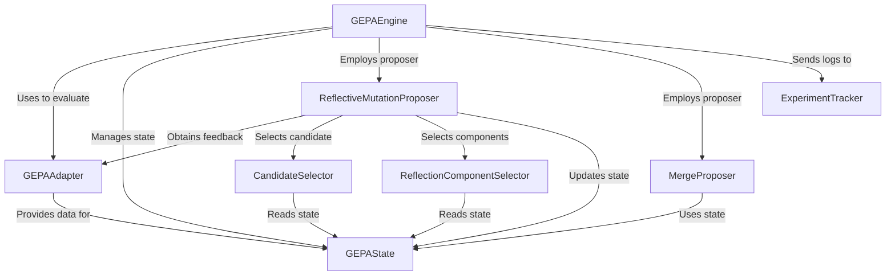
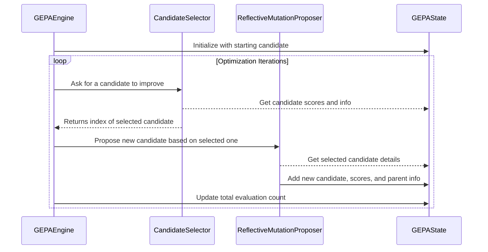
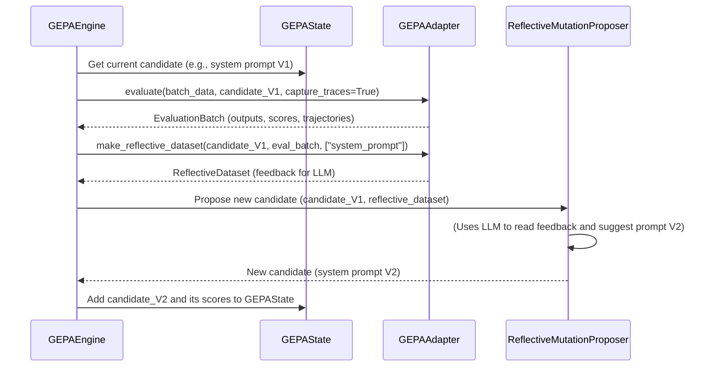
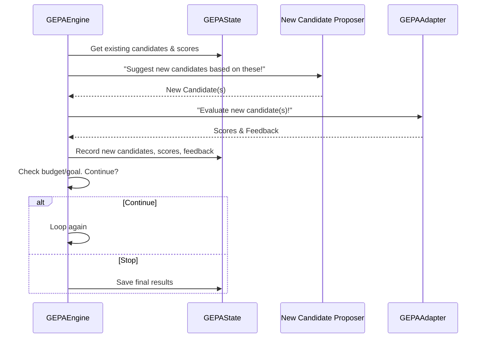
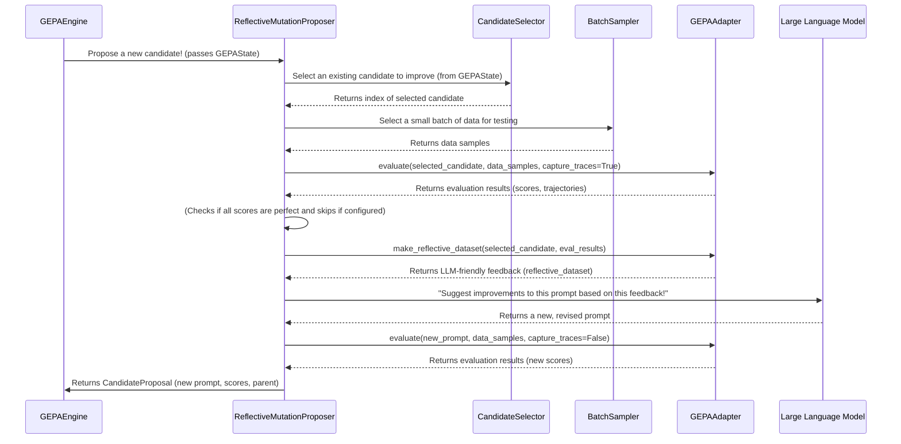
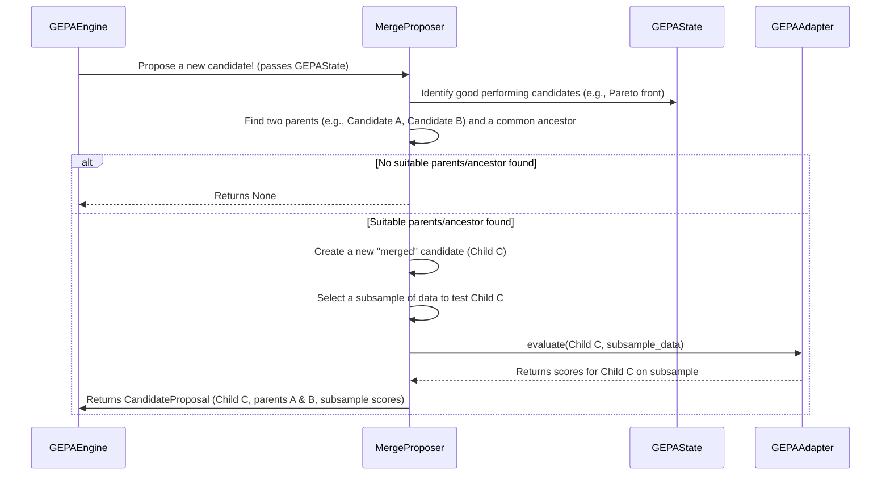
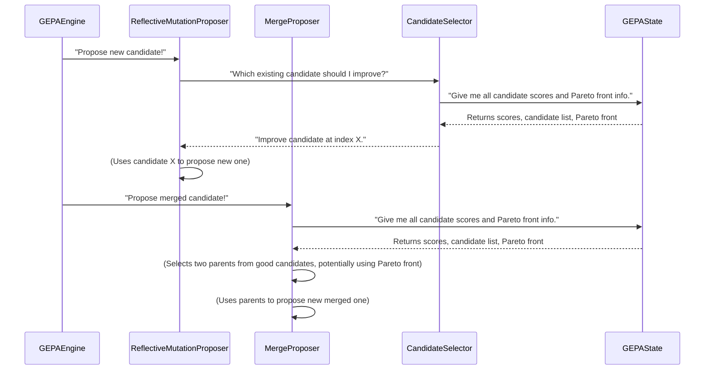
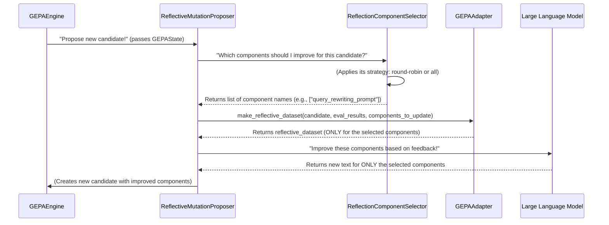

# Tutorial: gepa

GEPA is an *optimization framework* that iteratively improves text-based components like AI prompts or code snippets. It acts like a **smart learner**, using a `GEPAEngine` to manage the process. The engine evaluates candidate solutions with an `GEPAAdapter`, gathers feedback, and then employs strategies like `ReflectiveMutationProposer` (learning from mistakes) and `MergeProposer` (combining good parts) to suggest better versions. All progress is meticulously recorded in a `GEPAState` and monitored by an `ExperimentTracker`.


**Source Repository:** [https://github.com/gepa-ai/gepa.git](https://github.com/gepa-ai/gepa.git)



## Table of Contents

1. [Chapter 1: GEPAState](#chapter-1-gepastate)
2. [Chapter 2: GEPAAdapter](#chapter-2-gepaadapter)
3. [Chapter 3: GEPAEngine](#chapter-3-gepaengine)
4. [Chapter 4: ExperimentTracker](#chapter-4-experimenttracker)
5. [Chapter 5: ReflectiveMutationProposer](#chapter-5-reflectivemutationproposer)
6. [Chapter 6: MergeProposer](#chapter-6-mergeproposer)
7. [Chapter 7: CandidateSelector](#chapter-7-candidateselector)
8. [Chapter 8: ReflectionComponentSelector](#chapter-8-reflectioncomponentselector)

---

# Chapter 1: GEPAState

Welcome to the world of `gepa`! In this chapter, we're going to explore the very first and one of the most fundamental concepts: `GEPAState`.

Imagine you're running a science experiment. You have your lab notebook where you meticulously record everything: what you did, what results you got, what changed, and when. If someone else wanted to understand your experiment or even repeat it, they'd look at your notebook.

The `GEPAState` is exactly like that lab notebook for a `gepa` optimization run. It's a comprehensive record, a "snapshot," of everything important that's happening or has happened during the entire experiment.

### Why do we need a GEPAState?

Let's say you're trying to automatically improve a piece of code or a set of instructions. `gepa` does this by proposing many different versions (we call them "candidate solutions"), testing them, and then using the results to propose even better versions.

To do this effectively, `gepa` needs to:
1.  **Remember all the candidate solutions** it has ever created.
2.  **Know how well each candidate performed**.
3.  **Understand the "family tree"** of these candidates – which candidate was created from which parent(s).
4.  **Keep track of important metrics** like how many times it had to test a candidate.

Without `GEPAState`, `gepa` would be like a scientist with a terrible memory, forgetting previous experiments and unable to build on past discoveries.

### What does GEPAState store?

Think of `GEPAState` as a big container holding several lists of information. Here are some of the key things it keeps track of:

*   **`program_candidates`**: A list of all the different candidate solutions (e.g., pieces of code or instructions) `gepa` has ever proposed. Each candidate is like a unique entry in your lab notebook.
*   **`parent_program_for_candidate`**: This tells us the lineage. For each candidate, it remembers which previous candidate(s) it was derived from. This is crucial for understanding how solutions evolve.
*   **`program_full_scores_val_set`**: This is where `gepa` records how well each candidate performed on a special "validation set" of data. Higher scores usually mean better performance.
*   **`prog_candidate_val_subscores`**: Sometimes, a candidate's performance is measured across many small tasks. This list stores the individual scores for each small task.
*   **`program_at_pareto_front_valset`**: This helps `gepa` identify the "best" candidates, especially when there are multiple performance metrics to consider.
*   **`total_num_evals`**: A counter for how many times `gepa` has had to test (evaluate) candidates. This helps measure the cost of the experiment.

Let's look at a simplified example of how we might initialize a `GEPAState`.

```python
from gepa.core.state import GEPAState

# Imagine our first candidate is a simple instruction
seed_candidate = {"instruction_name": "Do task A"}

# And when we test it, we get some output and scores
# (We'll learn more about `RolloutOutput` in Chapter 2: GEPAAdapter)
class MockRolloutOutput:
    pass

base_valset_eval_output = ([MockRolloutOutput()], [0.75]) # Output and score for one task

# Now, we create our GEPAState!
gepa_state = GEPAState(
    seed_candidate=seed_candidate,
    base_valset_eval_output=base_valset_eval_output,
    track_best_outputs=True,
)

print(f"Initial candidates: {gepa_state.program_candidates}")
print(f"Initial scores: {gepa_state.program_full_scores_val_set}")
```
Explanation:
Here, we're creating the very first `GEPAState`. We give it an initial `seed_candidate` (our starting point) and the results of evaluating this first candidate. `track_best_outputs=True` tells `gepa` to remember the actual outputs of the best-performing candidates, not just their scores.

The output would show:
```
Initial candidates: [{'instruction_name': 'Do task A'}]
Initial scores: [0.75]
```
This shows that our `GEPAState` now holds our initial candidate and its performance score.

### How GEPAState gets updated (under the hood)

The `GEPAState` isn't static; it constantly changes as `gepa` explores new solutions. Other parts of `gepa`, like the [ReflectiveMutationProposer](05_reflectivemutationproposer_.md) (which proposes new candidates) and the [GEPAEngine](03_gepaengine_.md) (which orchestrates the entire process), will interact with and update the `GEPAState`.

Let's visualize a very simplified flow:



**Step-by-step explanation of the diagram:**

1.  **Initialize `GEPAState`**: The [GEPAEngine](03_gepaengine_.md) starts the whole process by creating the first `GEPAState` with a "seed" (starting) candidate.
2.  **Select a candidate**: In each iteration, the [GEPAEngine](03_gepaengine_.md) asks a [CandidateSelector](07_candidateselector_.md) to pick an existing candidate from the `GEPAState` to try and improve. The [CandidateSelector](07_candidateselector_.md) looks at the scores and other information stored in `GEPAState` to make its choice.
3.  **Propose new candidates**: The [GEPAEngine](03_gepaengine_.md) then passes the selected candidate to a [ReflectiveMutationProposer](05_reflectivemutationproposer_.md). This proposer takes the existing candidate, analyzes its performance (often using data from the `GEPAState`), and comes up with one or more new, modified candidates.
4.  **Update `GEPAState`**: Crucially, when a new candidate is generated and evaluated, the [ReflectiveMutationProposer](05_reflectivemutationproposer_.md) adds this new candidate, its performance scores, and its parentage (who created it) to the `GEPAState`.
5.  **Track metrics**: The [GEPAEngine](03_gepaengine_.md) also updates counters like `total_num_evals` in the `GEPAState`.

This cyclical process continues, with `GEPAState` growing richer with data in each step, forming a complete historical record.

### Diving into the Code (Simplified)

Let's look at a simplified version of the `GEPAState` class definition to see how these lists are structured.

```python
# From: src/gepa/core/state.py

class GEPAState(Generic[RolloutOutput]):
    program_candidates: list[dict[str, str]]
    parent_program_for_candidate: list[list[int | None]]
    program_full_scores_val_set: list[float]
    # ... many other lists and variables ...

    def __init__(
        self,
        seed_candidate: dict[str, str],
        base_valset_eval_output: tuple[list[RolloutOutput], list[float]],
        track_best_outputs: bool = False,
    ):
        # Calculate initial score for the seed candidate
        valset_base_score = sum(base_valset_eval_output[1]) / len(base_valset_eval_output[1])

        # Initialize the lists with the first candidate's data
        self.program_candidates = [seed_candidate]
        self.program_full_scores_val_set = [valset_base_score]
        self.parent_program_for_candidate = [[None]] # The first candidate has no parents
        # ... and so on for other lists ...

    # ... methods to add new candidates, save, load, etc. ...
```

Explanation:
-   `program_candidates`: This is a list of dictionaries. Each dictionary represents a candidate, mapping component names (like "instruction\_name") to their actual text.
-   `parent_program_for_candidate`: This is a list of lists. For each candidate, it stores the index (position) of its parent(s) in the `program_candidates` list. `[None]` for the first candidate means no parent.
-   The `__init__` method sets up these lists with the very first candidate's information. As new candidates are proposed, they get `append`ed to these lists.

Let's see how a new candidate might be added:

```python
# From: src/gepa/core/state.py (simplified)

class GEPAState(Generic[RolloutOutput]):
    # ... (previous code) ...

    def add_candidate(
        self,
        candidate_dict: dict[str, str],
        parent_program_indices: list[int],
        valset_eval_output: tuple[list[RolloutOutput], list[float]],
        num_metric_calls: int,
        run_dir: str | None = None,
        # ... other parameters ...
    ) -> tuple[int, int]:
        new_program_idx = len(self.program_candidates) # The index of the new candidate

        # Add the new candidate's data to the lists
        self.program_candidates.append(candidate_dict)
        self.parent_program_for_candidate.append(parent_program_indices)
        self.prog_candidate_val_subscores.append(valset_eval_output[1])
        self.num_metric_calls_by_discovery.append(num_metric_calls)

        # Calculate and store aggregate score
        valset_score = sum(valset_eval_output[1]) / len(valset_eval_output[1])
        self.program_full_scores_val_set.append(valset_score)

        # ... update other lists like pareto_front, best_outputs_valset ...

        return new_program_idx, linear_pareto_front_program_idx # Returns new candidate's index
```

Explanation:
The `add_candidate` method is where new information is recorded. When a new candidate is proposed and evaluated, its details (the candidate itself, its parents, its scores, etc.) are appended to the respective lists within `GEPAState`. This ensures that `GEPAState` always holds the complete history.

### Accessing Information from GEPAState

`GEPAState` also provides convenient ways to access the information it holds. For instance, you can easily get the "best" candidate so far. The `GEPAResult` class (defined in `src/gepa/core/result.py`) is often used to get an immutable (unchangeable) snapshot of a `GEPAState` at the end of a run or at any point, providing easy accessors.

```python
# From: src/gepa/core/result.py (simplified)

from gepa.core.state import GEPAState # Import GEPAState

@dataclass(frozen=True)
class GEPAResult(Generic[RolloutOutput]):
    # ... many fields, mirroring GEPAState ...

    @property
    def best_idx(self) -> int:
        scores = self.val_aggregate_scores
        return max(range(len(scores)), key=lambda i: scores[i])

    @property
    def best_candidate(self) -> dict[str, str]:
        return self.candidates[self.best_idx]

    @staticmethod
    def from_state(state: GEPAState, run_dir: str | None = None, seed: int | None = None) -> "GEPAResult":
        """
        Build a GEPAResult from a GEPAState.
        """
        return GEPAResult(
            candidates=list(state.program_candidates),
            parents=list(state.parent_program_for_candidate),
            val_aggregate_scores=list(state.program_full_scores_val_set),
            # ... populate other fields ...
        )

# Example usage (conceptual)
# gepa_state = ... (after a few iterations)
# final_result = GEPAResult.from_state(gepa_state)
# print(f"Best candidate found: {final_result.best_candidate}")
# print(f"Score of best candidate: {final_result.val_aggregate_scores[final_result.best_idx]}")
```

Explanation:
The `GEPAResult` class takes a `GEPAState` and essentially copies its relevant data into its own structure. It then provides "properties" like `best_idx` and `best_candidate` that automatically calculate and return the index and the actual content of the best-performing candidate found so far, based on the scores stored in `GEPAState`.

### Conclusion

The `GEPAState` is the central repository for all information during a `gepa` optimization run. It's like the experiment's "brain" and "memory," enabling `gepa` to track progress, learn from past attempts, and ultimately find better solutions. Understanding `GEPAState` is key to grasping how `gepa` operates, as almost every other component interacts with it to either read information or update it.

Next, we'll dive into how `gepa` interacts with the outside world – how it takes your problem and translates it into something `gepa` can understand and optimize.

[Next Chapter: GEPAAdapter](02_gepaadapter_.md)

---

# Chapter 2: GEPAAdapter

Welcome back! In [Chapter 1: GEPAState](01_gepastate_.md), we learned that `GEPAState` is like `gepa`'s lab notebook, meticulously recording every detail of an optimization experiment. But how does `gepa` actually *do* those experiments? How does it interact with the "stuff" it's trying to improve, whether that's an AI prompt, a piece of code, or something else entirely?

That's where the `GEPAAdapter` comes in.

## The Universal Translator for GEPA

Imagine you're trying to build a new gadget, but its instructions are written in a language you don't understand. You need a translator to turn those instructions into something you can work with, and then translate your feedback back into the original language.

The `GEPAAdapter` is exactly that translator for `gepa`. It's the **bridge** that connects `gepa`'s powerful optimization engine to *your specific application*. Whether you're optimizing an AI prompt, a piece of Python code, or a complex RAG (Retrieval Augmented Generation) pipeline, the `GEPAAdapter` provides a standardized way for `gepa` to:

1.  **Understand your "candidate solutions"**: `gepa` needs to know how to "run" or "execute" a proposed solution (like evaluating an AI prompt with certain inputs).
2.  **Evaluate performance**: After running a solution, `gepa` needs to know *how good* it was (e.g., did the AI prompt give a correct answer?).
3.  **Extract feedback**: If a solution didn't perform well, `gepa` needs specific, actionable feedback to understand *why* and propose improvements.
4.  **Format feedback for an LLM**: This feedback needs to be presented in a clear, concise way that a Large Language Model (LLM) can use to generate a better next version.

### A Concrete Example: Optimizing an AI System Prompt

Let's say you're building a chatbot, and its behavior is controlled by a "system prompt" – a set of instructions given to the AI. You want to optimize this system prompt so the chatbot gives better answers.

Here's how `GEPAAdapter` would help:

*   **Candidate Solutions**: Each version of your system prompt is a "candidate solution."
*   **Running a Solution**: The `GEPAAdapter` would define how to take a system prompt, feed it to your chatbot model along with a user's question, and get a response.
*   **Evaluating Performance**: It would then compare the chatbot's response to a "correct" answer and give it a score (e.g., 1.0 for correct, 0.0 for incorrect).
*   **Extracting Feedback**: If the answer was wrong, the adapter would gather details like the user's question, the chatbot's incorrect response, and the correct answer.
*   **Formatting Feedback**: It would package this information into a "reflective dataset" that an LLM can read to suggest a better system prompt.

Without `GEPAAdapter`, `gepa` wouldn't know how to interact with your chatbot at all!

## Key Responsibilities of a GEPAAdapter

The `GEPAAdapter` has three main jobs, like the three essential skills of our universal translator:

1.  **`evaluate`**: How to run a candidate solution and measure its performance.
2.  **`make_reflective_dataset`**: How to take the results of that run and turn it into useful feedback for an LLM.
3.  **`propose_new_texts` (Optional)**: How to actually use an LLM (or other method) to generate new candidate solutions based on the feedback. (Often, `gepa` provides a default way to do this, so you might not always need to implement this one directly).

Let's break these down.

### 1. `evaluate`: Running and Scoring Your Solutions

The `evaluate` method is where `gepa` "tests" a candidate solution. It takes a list of inputs (your "batch" of data) and a specific `candidate` (like a system prompt or a piece of code). It then runs your system with that candidate and returns two crucial things for each input:

*   **`outputs`**: The raw results from your system (e.g., the chatbot's response). `gepa` doesn't try to understand these; they're for your reference.
*   **`scores`**: A numerical score indicating how well your system performed for *each individual input*. Higher scores are better.

It can also optionally return **`trajectories`**, which are detailed logs of what happened during the execution. These are super useful for generating feedback later.

```python
from gepa.core.adapter import EvaluationBatch
from typing import TypedDict, list, dict, Any, Callable

# Let's define simple types for our chatbot example
class MyChatbotDataInst(TypedDict):
    question: str
    correct_answer: str

class MyChatbotRolloutOutput(TypedDict):
    chatbot_response: str

class MyChatbotTrajectory(TypedDict):
    question: str
    chatbot_response: str
    correct_answer: str
    # ... maybe more details like internal thoughts of the chatbot

class MyChatbotAdapter: # This would inherit from GEPAAdapter in a real scenario
    def __init__(self, chatbot_model_fn: Callable):
        self.chatbot_model_fn = chatbot_model_fn

    def evaluate(
        self,
        batch: list[MyChatbotDataInst],
        candidate: dict[str, str], # Our system prompt is here, e.g., {"system_prompt": "You are a helpful assistant."}
        capture_traces: bool = False,
    ) -> EvaluationBatch[MyChatbotTrajectory, MyChatbotRolloutOutput]:
        outputs: list[MyChatbotRolloutOutput] = []
        scores: list[float] = []
        trajectories: list[MyChatbotTrajectory] | None = [] if capture_traces else None

        system_prompt = candidate["system_prompt"] # Get the current system prompt

        for data_instance in batch:
            # 1. Run the system (our chatbot)
            full_response_text = self.chatbot_model_fn(system_prompt, data_instance["question"])
            
            # 2. Store the raw output
            outputs.append({"chatbot_response": full_response_text})

            # 3. Score the performance
            # Simple scoring: 1.0 if correct answer is in response, else 0.0
            score = 1.0 if data_instance["correct_answer"] in full_response_text else 0.0
            scores.append(score)

            # 4. Capture trajectory if needed
            if capture_traces:
                trajectories.append({
                    "question": data_instance["question"],
                    "chatbot_response": full_response_text,
                    "correct_answer": data_instance["correct_answer"],
                })

        return EvaluationBatch(outputs=outputs, scores=scores, trajectories=trajectories)

# --- Example Usage (Conceptual) ---
# def mock_chatbot_model(sys_prompt: str, user_q: str) -> str:
#     # In a real scenario, this would call an LLM API
#     if "capital of France" in user_q and "helpful" in sys_prompt:
#         return "Paris is the capital of France."
#     return "I don't know."

# my_adapter = MyChatbotAdapter(mock_chatbot_model)
# test_batch = [
#     {"question": "What is the capital of France?", "correct_answer": "Paris"},
#     {"question": "Who painted the Mona Lisa?", "correct_answer": "Leonardo da Vinci"},
# ]
# current_prompt = {"system_prompt": "You are a helpful assistant. Answer questions concisely."}

# eval_results = my_adapter.evaluate(test_batch, current_prompt, capture_traces=True)
# print(eval_results.scores) # Output: [1.0, 0.0] (for our mock)
```
Explanation:
- `MyChatbotAdapter` is a simplified version of what a `GEPAAdapter` would look like for our chatbot example.
- The `evaluate` method takes a `batch` of questions and a `candidate` (our system prompt).
- It simulates running the chatbot (`self.chatbot_model_fn`) with the given prompt and question.
- It then calculates a `score` for each question (1.0 if the correct answer is found, 0.0 otherwise).
- Finally, it returns an `EvaluationBatch` containing the raw chatbot responses (`outputs`), the `scores`, and detailed `trajectories` (if `capture_traces` is True).

### 2. `make_reflective_dataset`: Turning Results into LLM-Friendly Feedback

After `evaluate` has run a candidate and generated scores and trajectories, `gepa` needs to know *why* something worked or didn't. The `make_reflective_dataset` method takes the `candidate` and the `EvaluationBatch` (especially the `trajectories`) and transforms it into a structured, JSON-serializable format that an LLM can easily understand.

This "reflective dataset" typically includes:

*   **`Inputs`**: A clean view of the original input that led to the problem.
*   **`Generated Outputs`**: What your system actually produced.
*   **`Feedback`**: The most crucial part – a clear explanation of what went wrong, what was expected, or why the output was good.

```python
from gepa.core.adapter import EvaluationBatch
from typing import TypedDict, list, dict, Any, Callable

# (Using the same MyChatbotDataInst, MyChatbotRolloutOutput, MyChatbotTrajectory as above)

class MyChatbotAdapter: # This would inherit from GEPAAdapter in a real scenario
    # ... (previous __init__ and evaluate methods) ...

    def make_reflective_dataset(
        self,
        candidate: dict[str, str], # The system prompt that was evaluated
        eval_batch: EvaluationBatch[MyChatbotTrajectory, MyChatbotRolloutOutput],
        components_to_update: list[str], # Which part of the candidate we're focusing on (e.g., "system_prompt")
    ) -> dict[str, list[dict[str, Any]]]:
        reflective_data_per_component: dict[str, list[dict[str, Any]]] = {}

        # In our simple case, we only have one component: "system_prompt"
        component_name = components_to_update[0] 
        items_for_component: list[dict[str, Any]] = []

        # We zip the trajectories, scores, and raw outputs together
        for traj, score, _output in zip(eval_batch.trajectories, eval_batch.scores, eval_batch.outputs, strict=False):
            feedback_text = ""
            if score > 0.9: # Let's say a score near 1.0 is good
                feedback_text = "The chatbot responded correctly and concisely."
            else:
                feedback_text = (
                    f"The chatbot's response '{traj['chatbot_response']}' was incorrect. "
                    f"The correct answer was '{traj['correct_answer']}'. "
                    f"The original question was: '{traj['question']}'."
                )
            
            # This is the structured feedback for the LLM
            items_for_component.append({
                "Inputs": {"question": traj["question"]},
                "Generated Outputs": {"response": traj["chatbot_response"]},
                "Feedback": feedback_text,
            })
        
        reflective_data_per_component[component_name] = items_for_component
        return reflective_data_per_component

# --- Example Usage (Conceptual) ---
# Assuming 'eval_results' is from the previous evaluate call
# feedback_dataset = my_adapter.make_reflective_dataset(
#     current_prompt, eval_results, ["system_prompt"]
# )
# print(feedback_dataset["system_prompt"][0]["Feedback"]) 
# # Output for the first (correct) example: "The chatbot responded correctly and concisely."
# print(feedback_dataset["system_prompt"][1]["Feedback"]) 
# # Output for the second (incorrect) example: "The chatbot's response 'I don't know.' was incorrect. The correct answer was 'Leonardo da Vinci'. The original question was: 'Who painted the Mona Lisa?'."
```
Explanation:
- The `make_reflective_dataset` method iterates through the `trajectories` and `scores` from the `eval_batch`.
- For each example, it constructs a `feedback_text` string, explaining if the chatbot was right or wrong and why.
- It then formats this into a dictionary with "Inputs", "Generated Outputs", and "Feedback" keys, which is a standard format for LLMs to consume.
- This structured list of dictionaries becomes the `reflective_dataset`.

### 3. `propose_new_texts` (Optional): Generating New Solutions

After `gepa` has the `reflective_dataset`, it needs to propose *new* candidate solutions. This is often done by an LLM that reads the feedback and suggests improvements.

While `GEPAAdapter` *can* have its own `propose_new_texts` method, `gepa` provides a robust default implementation in the [ReflectiveMutationProposer](05_reflectivemutationproposer_.md) that uses an LLM to read the `reflective_dataset` and suggest changes to the `candidate`. You typically only need to implement `propose_new_texts` if you have a very specific, custom way you want to generate new solutions (e.g., not using an LLM, or using a very specialized LLM call).

## How GEPAAdapter Fits In

Let's see how the `GEPAAdapter` interacts with `GEPAState` and other `gepa` components.


Explanation:
1.  The [GEPAEngine](03_gepaengine_.md) (the orchestrator) asks the [GEPAState](01_gepastate_.md) for the current best candidate.
2.  It then gives this candidate and a batch of data to the `GEPAAdapter`'s `evaluate` method.
3.  The `GEPAAdapter` runs the candidate and returns the `EvaluationBatch` (scores, outputs, optional trajectories).
4.  The [GEPAEngine](03_gepaengine_.md) then asks the `GEPAAdapter` to `make_reflective_dataset` from these results.
5.  This `reflective_dataset` (the LLM-friendly feedback) is then passed to the [ReflectiveMutationProposer](05_reflectivemutationproposer_.md).
6.  The [ReflectiveMutationProposer](05_reflectivemutationproposer_.md) (often using an LLM internally) reads the feedback and proposes a new, improved candidate.
7.  Finally, this new candidate and its eventual evaluation results are added back to the [GEPAState](01_gepastate_.md).

This cycle repeats, with the `GEPAAdapter` continuously translating between your specific application and `gepa`'s optimization logic.

## Diving into the Code (Simplified)

Let's look at the actual `GEPAAdapter` definition in `gepa`.

```python
# From: src/gepa/core/adapter.py

# Type variables to make the adapter flexible for different data types
from typing import Any, Generic, Protocol, TypeVar

RolloutOutput = TypeVar("RolloutOutput") # What your system produces (e.g., chatbot's raw text)
Trajectory = TypeVar("Trajectory")       # Detailed logs of execution
DataInst = TypeVar("DataInst")           # A single input example (e.g., a question)

class GEPAAdapter(Protocol[DataInst, Trajectory, RolloutOutput]):
    """
    GEPAAdapter is the single integration point between your system
    and the GEPA optimization engine.
    """

    def evaluate(
        self,
        batch: list[DataInst],
        candidate: dict[str, str],
        capture_traces: bool = False,
    ) -> EvaluationBatch[Trajectory, RolloutOutput]:
        """
        Runs the candidate program on a batch of data instances.
        Returns outputs, scores, and optional trajectories.
        """
        ... # Implementation details would go here

    def make_reflective_dataset(
        self,
        candidate: dict[str, str],
        eval_batch: EvaluationBatch[Trajectory, RolloutOutput],
        components_to_update: list[str],
    ) -> dict[str, list[dict[str, Any]]]:
        """
        Builds a JSON-serializable dataset for an LLM to use for refinement.
        """
        ... # Implementation details would go here

    # propose_new_texts is optional and often handled by default
    # propose_new_texts: ProposalFn | None = None
```
Explanation:
- `GEPAAdapter` is a `Protocol`, which means it defines a blueprint of methods that any class implementing it *must* have.
- The `TypeVar`s (`DataInst`, `Trajectory`, `RolloutOutput`) make `GEPAAdapter` generic, meaning it can work with any types of data, trajectories, and outputs you define for your specific problem.
- The `evaluate` and `make_reflective_dataset` methods are the core responsibilities, exactly as we discussed.

## Real-World Adapters in GEPA

`gepa` comes with several pre-built adapters for common use cases. You can find them in the `src/gepa/adapters/` directory.

For example:

*   **`DefaultAdapter`**: For simple, single-turn LLM tasks like our chatbot example, where you optimize a system prompt.
*   **`DSPyAdapter`**: Integrates `gepa` with [DSPy](https://dspy.ai/) programs, allowing you to optimize individual "modules" (like instructions for specific LLM calls) within a larger DSPy pipeline.
*   **`AnyMathsAdapter`**: Designed for solving mathematical problems with LLMs, focusing on structured output and precise scoring.
*   **`RAGAdapter`**: For optimizing components within a Retrieval Augmented Generation (RAG) system, like query reformulation or context synthesis.

These adapters show how versatile `GEPAAdapter` is. Each one implements the `evaluate` and `make_reflective_dataset` methods in a way that's specific to its domain, providing `gepa` with the "translation" it needs.

## Conclusion

The `GEPAAdapter` is your essential tool for connecting your specific optimization problem to the `gepa` engine. It defines how `gepa` will run your candidate solutions, measure their performance, and generate actionable feedback for improvement. By implementing a `GEPAAdapter`, you tell `gepa` how to speak the language of your application.

Now that we understand how to set up `gepa`'s memory (`GEPAState`) and how it talks to your system (`GEPAAdapter`), let's see how the whole optimization process is orchestrated in the next chapter: [GEPAEngine](03_gepaengine_.md).

---

# Chapter 3: GEPAEngine

Welcome back! In [Chapter 1: GEPAState](01_gepastate_.md), we learned about `gepa`'s "memory," the `GEPAState`, which keeps track of everything happening during an optimization run. Then, in [Chapter 2: GEPAAdapter](02_gepaadapter_.md), we explored how `gepa` "talks" to your specific problem, translating between your system and `gepa`'s logic.

Now, it's time to meet the boss, the conductor of this whole orchestra: the `GEPAEngine`.

## The Brains of the Operation

Imagine you're building a robot that can learn to navigate a maze. You have:
*   A notebook to record all its attempts and how well it did (`GEPAState`).
*   A way for the robot to actually try navigating the maze and report its success (`GEPAAdapter`).

But who tells the robot: "Okay, try this path now," or "That path didn't work, try a slightly different one," or "Combine these two good paths to make a better one"? Who decides when to stop, or what counts as "good enough"?

That's the job of the `GEPAEngine`. It's the **central orchestrator** that manages the entire optimization process. It's like the project manager, making sure all the different parts of `gepa` work together smoothly to find the best possible solution.

### What does the GEPAEngine do?

The `GEPAEngine`'s main goal is to iteratively improve your "candidate solutions" (like our robot's paths or an AI system prompt) until a goal is met (e.g., the robot finds the exit, or the prompt gets a perfect score) or a budget runs out.

It does this by repeatedly going through a cycle:

1.  **Selects** a promising candidate solution from the `GEPAState` to improve.
2.  **Proposes** new, modified candidate solutions based on the selected one (e.g., trying a slightly different path).
3.  **Evaluates** these new candidates using the `GEPAAdapter` to see how well they perform.
4.  **Updates** the `GEPAState` with the results of these evaluations.
5.  **Tracks progress** and decides if the optimization should continue or stop.

This cycle continues, driving the improvement process step-by-step.

## The Optimization Loop: A High-Level View

Let's visualize this core cycle of the `GEPAEngine`:



As you can see, the `GEPAEngine` is at the center, directing traffic between the `GEPAState`, the `GEPAAdapter`, and other components like the "New Candidate Proposer" (which we'll learn about in later chapters, like [ReflectiveMutationProposer](05_reflectivemutationproposer_.md) and [MergeProposer](06_mergeproposer_.md)).

## Using the GEPAEngine (Behind the Scenes)

You typically don't interact directly with `GEPAEngine` in your `gepa` code. Instead, you use the high-level `optimize` function (which lives in `src/gepa/api.py`). This function *sets up* and *runs* the `GEPAEngine` for you.

Let's look at a simplified example of how `optimize` creates and uses the `GEPAEngine`.

```python
# From: src/gepa/api.py (simplified)

def optimize(
    seed_candidate: dict[str, str],
    trainset: list[Any],
    adapter: GEPAAdapter,
    # ... many other parameters for strategies, budgets, etc. ...
):
    # 1. Setup various components (adapter, proposers, selectors, etc.)
    # ... (code to create reflective_proposer, merge_proposer, etc.) ...

    # 2. Define the evaluator function using the adapter
    def evaluator(inputs, prog):
        eval_out = adapter.evaluate(inputs, prog, capture_traces=False)
        return eval_out.outputs, eval_out.scores

    # 3. Create the GEPAEngine instance
    engine = GEPAEngine(
        run_dir=None, # Where to save results
        evaluator=evaluator,
        valset=trainset, # Using trainset as valset for simplicity
        seed_candidate=seed_candidate,
        max_metric_calls=100, # Example budget
        perfect_score=1.0,
        seed=0,
        reflective_proposer=reflective_proposer, # Our strategy for generating new candidates
        merge_proposer=None, # We'll learn about this later
        logger=None,
        experiment_tracker=None,
        track_best_outputs=False,
        display_progress_bar=True,
    )

    # 4. Run the optimization!
    state = engine.run()

    # 5. Process the final state into a GEPAResult
    result = GEPAResult.from_state(state)
    return result

```
Explanation:
- The `optimize` function acts as a convenient wrapper.
- It first prepares all the necessary "ingredients" for the `GEPAEngine`, like the `adapter` (from [Chapter 2: GEPAAdapter](02_gepaadapter_.md)) and the "proposers" (which suggest new candidates).
- It then creates an instance of `GEPAEngine`, passing in all these ingredients and configuration settings (like `max_metric_calls` for the budget and `perfect_score` for the goal).
- Finally, it calls the `engine.run()` method, which starts the entire optimization process. This method returns the final `GEPAState` when the optimization finishes.

## Inside the GEPAEngine: The `run` Method

The heart of the `GEPAEngine` is its `run` method. This is where the main optimization loop lives. Let's look at a simplified version of it.

```python
# From: src/gepa/core/engine.py (simplified)

class GEPAEngine(Generic[DataInst, Trajectory, RolloutOutput]):
    # ... __init__ method as shown in context ...

    def run(self) -> GEPAState:
        # 1. Initialize the GEPAState
        state = initialize_gepa_state(
            seed_candidate=self.seed_candidate,
            val_evaluator=self._val_evaluator(), # A helper to evaluate on valset
            track_best_outputs=self.track_best_outputs,
        )

        # Initialize progress bar if enabled
        progress_bar = None
        if self.display_progress_bar and tqdm:
            progress_bar = tqdm(total=self.max_metric_calls, initial=state.total_num_evals)

        # 2. Main optimization loop
        while state.total_num_evals < self.max_metric_calls:
            # Update progress bar
            if progress_bar:
                progress_bar.n = state.total_num_evals
                progress_bar.refresh()

            # Check for perfect score
            if state.best_val_score >= self.perfect_score:
                self.logger.log("Perfect score achieved. Exiting.")
                break

            # Increment iteration counter
            state.i += 1

            try:
                # 3. Try to propose new candidates using reflective mutation
                proposal = self.reflective_proposer.propose(state)
                if proposal is None:
                    self.logger.log(f"Iteration {state.i}: No new candidate from reflective proposer.")
                    continue

                # 4. Check if the proposed candidate is better on a subsample
                # (This is a quick check before full evaluation)
                old_sum = sum(proposal.subsample_scores_before or [])
                new_sum = sum(proposal.subsample_scores_after or [])
                if new_sum <= old_sum:
                    self.logger.log(f"Iteration {state.i}: New subsample score not better, skipping.")
                    continue

                # 5. If promising, perform full evaluation and add to GEPAState
                self._run_full_eval_and_add(
                    new_program=proposal.candidate, state=state, parent_program_idx=proposal.parent_program_ids
                )

                # (Logic for merge_proposer would go here if enabled)

            except Exception as e:
                self.logger.log(f"Iteration {state.i}: Exception: {e}")
                if self.raise_on_exception:
                    raise e
                else:
                    continue

        # Close progress bar and save final state
        if progress_bar:
            progress_bar.close()
        state.save(self.run_dir)
        return state
```
Explanation:

1.  **Initialization**: The `run` method first initializes a `GEPAState` (our "lab notebook") with the starting `seed_candidate`. It also sets up a progress bar if enabled.
2.  **Main Loop (`while` loop)**: This loop continues as long as the total number of evaluations (`state.total_num_evals`) is below the `max_metric_calls` budget.
    *   It updates the progress bar and checks if a `perfect_score` has been achieved.
    *   `state.i += 1` increments the iteration count.
3.  **Propose Candidates**: It calls `self.reflective_proposer.propose(state)`. This is where a strategy like [ReflectiveMutationProposer](05_reflectivemutationproposer_.md) is asked to generate a new candidate based on the current `state`.
4.  **Subsample Check**: Before doing a full, potentially expensive evaluation, `gepa` often does a quick "subsample" check to see if the new candidate is even remotely promising. If not, it skips it to save budget.
5.  **Full Evaluation and Add**: If the candidate passes the subsample check, `_run_full_eval_and_add` is called. This helper function uses the `evaluator` (which is linked to your `GEPAAdapter`) to fully evaluate the new candidate. The results (scores, parentage, etc.) are then added to the `GEPAState`.
6.  **Error Handling**: The `try...except` block ensures that if an error occurs during an iteration, `gepa` can log it and either stop or continue, depending on configuration.
7.  **Finalization**: Once the loop finishes (either by hitting the budget or achieving a perfect score), the final `GEPAState` is saved and returned.

Notice how the `GEPAEngine` doesn't directly know *how* to propose new candidates (it delegates to `reflective_proposer`) or *how* to evaluate them (it delegates to `evaluator`/`adapter`). It simply orchestrates the flow, making sure these components are called at the right time and their results are recorded.

## Conclusion

The `GEPAEngine` is the conductor of the `gepa` orchestra. It manages the entire optimization process, from selecting candidates to evaluating them, proposing new ones, and tracking overall progress. By understanding the `GEPAEngine`, you grasp the core iterative loop that drives `gepa` to find better solutions for your problem. While you usually interact with `gepa` through the `optimize` function, it's the `GEPAEngine` that's working hard behind the scenes to make the magic happen.

Next, we'll look at how `gepa` keeps track of all the experiments and their results, which is handled by the [ExperimentTracker](04_experimenttracker_.md).

[Next Chapter: ExperimentTracker](04_experimenttracker_.md)

---

# Chapter 4: ExperimentTracker

Welcome back! In [Chapter 1: GEPAState](01_gepastate_.md), we learned about `gepa`'s "memory." In [Chapter 2: GEPAAdapter](02_gepaadapter_.md), we saw how `gepa` talks to your specific problem. And in [Chapter 3: GEPAEngine](03_gepaengine_.md), we discovered the "boss" that orchestrates the entire optimization process.

Now, imagine you're a scientist running many experiments in your lab. You're trying different things, making observations, and recording results. But what if you run dozens or even hundreds of experiments? How do you keep track of all of them? How do you compare Experiment A's results with Experiment B's? How do you know which changes led to improvements?

This is where the `ExperimentTracker` comes in. It's like your **super-organized digital lab notebook**, automatically recording all the important details and results of each `gepa` run. It helps you visualize metrics, compare different optimization attempts, and understand the overall progress of your `gepa` experiments.

## Why do we need an ExperimentTracker?

When `gepa` is running, it's constantly trying out new candidates, evaluating them, and updating scores. You'll want to see:
*   How the "best score" is changing over time.
*   The scores of newly discovered candidates.
*   If your optimization is getting stuck or making progress.
*   Which `gepa` configuration (e.g., using different LLMs, different datasets) performs best overall.

The `ExperimentTracker` allows `gepa` to send all this valuable information to external tools like Weights & Biases (wandb) or MLflow. These tools then turn the raw data into beautiful graphs, tables, and dashboards, making it incredibly easy to monitor and compare your `gepa` runs.

## The ExperimentTracker's Job: Logging and Monitoring

The `ExperimentTracker` has one main job: to **log metrics** (numerical measurements) and other relevant information from your `gepa` runs to external tracking platforms.

Think of it as a reporter. Whenever something important happens in your `gepa` experiment (like a new candidate is discovered, or its score is updated), the `ExperimentTracker` writes it down and sends it to your chosen platform.

`gepa`'s `ExperimentTracker` supports:
*   **Weights & Biases (wandb)**: A popular tool for machine learning experiment tracking, visualization, and collaboration.
*   **MLflow**: Another widely used platform for managing the machine learning lifecycle, including experiment tracking.

You can even use both at the same time if you want!

## How to Use the ExperimentTracker

You don't directly "call" methods on the `ExperimentTracker` yourself in most cases. Instead, you tell `gepa` *which* tracking tools you want to use when you start your `optimize` run. The `gepa` engine then takes care of feeding data to the `ExperimentTracker` automatically.

Let's look at how you'd enable it in the `optimize` function (which, as we learned in [Chapter 3: GEPAEngine](03_gepaengine_.md), is the main entry point for running `gepa`):

```python
from gepa.api import optimize
from gepa.adapters.default_adapter.default_adapter import DefaultAdapter

# Imagine you have your seed candidate and training data
seed_candidate = {"system_prompt": "You are a helpful assistant."}
train_data = [{"question": "Hello", "answer": "Hi there!"}]

# And your adapter (from Chapter 2)
my_adapter = DefaultAdapter(
    task_lm="gpt-3.5-turbo",
    # ... other adapter settings ...
)

# Now, to enable experiment tracking:
result = optimize(
    seed_candidate=seed_candidate,
    trainset=train_data,
    adapter=my_adapter,
    max_metric_calls=5, # Run for a small number of iterations for this example
    # --- Enable Weights & Biases ---
    use_wandb=True,
    wandb_init_kwargs={"project": "my-gepa-project", "name": "first-wandb-run"},
    # --- Or enable MLflow ---
    # use_mlflow=True,
    # mlflow_experiment_name="My GEPA MLflow Experiment",
    # mlflow_tracking_uri="http://localhost:5000", # If running MLflow locally
    
    # ... other gepa settings ...
)

print("GEPA optimization finished. Check your wandb/MLflow dashboard!")
```

Explanation:
- We're calling the `optimize` function as usual.
- To enable Weights & Biases, we set `use_wandb=True` and provide `wandb_init_kwargs` (like your project and run name).
- If you wanted to use MLflow instead (or in addition), you'd set `use_mlflow=True` and provide its specific settings.

When `use_wandb` (or `use_mlflow`) is set to `True`, `gepa` automatically creates an `ExperimentTracker` and passes it to the `GEPAEngine`. The `GEPAEngine` then uses this tracker to log metrics at key points during the optimization process.

## What gets logged?

The `ExperimentTracker` logs various metrics at each iteration of the `gepa` loop. These metrics give you a clear picture of how your optimization is progressing. Some examples include:

*   `iteration`: The current iteration number.
*   `new_program_idx`: The index of the newly discovered candidate.
*   `valset_pareto_front_agg`: The aggregate score of candidates on the Pareto front (a fancy way to say "best candidates considering multiple goals").
*   `best_valset_agg_score`: The highest aggregate score achieved on the validation set so far.
*   `best_program_as_per_agg_score_valset`: The index of the candidate that achieved the `best_valset_agg_score`.
*   `best_score_on_valset`: The score of the best candidate on the validation set.

These metrics, when visualized in wandb or MLflow, look something like this (conceptual example):

```mermaid
graph TD
    A[GEPA Experiment Iteration 1] --> B{Log Metrics};
    B --> C[wandb Dashboard];
    B --> D[MLflow Dashboard];
    C --> C1[Graph: Best Score over Time];
    C --> C2[Table: Candidate Details];
    C --> C3[System Prompt V1];
    D --> D1[Graph: Best Score over Time];
    D --> D2[Table: Candidate Details];
    D --> D3[System Prompt V1];

    E[GEPA Experiment Iteration 2] --> F{Log Metrics};
    F --> C;
    F --> D;
    C --> C4[Graph: Best Score over Time (updated)];
    C --> C5[System Prompt V2];
    D --> D4[Graph: Best Score over Time (updated)];
    D --> D5[System Prompt V2];
```

Each time `gepa` completes an iteration and finds a new candidate, the `ExperimentTracker` sends updated metrics to your chosen dashboard, showing the progress.

## Inside the ExperimentTracker: How it Works

Let's peek under the hood to see how the `ExperimentTracker` does its job.

### The `ExperimentTracker` Class

The core of the system is the `ExperimentTracker` class itself, found in `src/gepa/logging/experiment_tracker.py`. It's designed to be a single interface for different logging backends.

```python
# From: src/gepa/logging/experiment_tracker.py (simplified)

class ExperimentTracker:
    def __init__(
        self,
        use_wandb: bool = False,
        wandb_api_key: str | None = None,
        wandb_init_kwargs: dict[str, Any] | None = None,
        use_mlflow: bool = False,
        mlflow_tracking_uri: str | None = None,
        mlflow_experiment_name: str | None = None,
    ):
        self.use_wandb = use_wandb
        self.use_mlflow = use_mlflow
        self.wandb_api_key = wandb_api_key
        self.wandb_init_kwargs = wandb_init_kwargs or {}
        self.mlflow_tracking_uri = mlflow_tracking_uri
        self.mlflow_experiment_name = mlflow_experiment_name

    def initialize(self):
        """Initializes logging backends if enabled."""
        if self.use_wandb:
            self._initialize_wandb()
        if self.use_mlflow:
            self._initialize_mlflow()

    def start_run(self):
        """Starts a new run on enabled backends."""
        if self.use_wandb:
            import wandb # type: ignore
            wandb.init(**self.wandb_init_kwargs)
        if self.use_mlflow:
            import mlflow # type: ignore
            mlflow.start_run(nested=True)

    def log_metrics(self, metrics: dict[str, Any], step: int | None = None):
        """Logs metrics to active backends."""
        if self.use_wandb:
            import wandb # type: ignore
            wandb.log(metrics, step=step)
        if self.use_mlflow:
            import mlflow # type: ignore
            mlflow.log_metrics(metrics, step=step)

    def end_run(self):
        """Ends the current run on active backends."""
        if self.use_wandb:
            import wandb # type: ignore
            if wandb.run is not None: wandb.finish()
        if self.use_mlflow:
            import mlflow # type: ignore
            if mlflow.active_run() is not None: mlflow.end_run()

    def __enter__(self):
        self.initialize()
        self.start_run()
        return self

    def __exit__(self, exc_type, exc_val, exc_tb):
        self.end_run()
        return False
```

Explanation:
- The `__init__` method simply stores the configuration you provide (like `use_wandb=True`).
- `initialize` and `start_run` methods are called *before* the `gepa` optimization begins. They handle logging into wandb or setting up MLflow, starting a new experiment run.
- The `log_metrics` method is the most important one. It receives a dictionary of metrics (like the `best_valset_agg_score`) and a `step` number (usually the current iteration) and then calls the appropriate `wandb.log()` or `mlflow.log_metrics()` functions.
- `end_run` is called *after* the `gepa` optimization finishes, to properly close the logging runs.
- The `__enter__` and `__exit__` methods make `ExperimentTracker` a "context manager," which means it can be used with a `with` statement (as seen in `gepa.api.optimize`), ensuring `start_run` and `end_run` are always called correctly.

### How `GEPAEngine` uses the `ExperimentTracker`

As we saw in [Chapter 3: GEPAEngine](03_gepaengine_.md), the `GEPAEngine` is the orchestrator. When you enable an `ExperimentTracker` in `optimize`, it gets passed to the `GEPAEngine`'s constructor.

Then, within the `GEPAEngine`'s `run` method, specifically after a new candidate has been evaluated and added to the [GEPAState](01_gepastate_.md), a helper function called `log_detailed_metrics_after_discovering_new_program` (from `src/gepa/logging/utils.py`) is called. This is where the `ExperimentTracker` is actually used to send data.

```python
# From: src/gepa/logging/utils.py (simplified)

from gepa.core.state import GEPAState

def log_detailed_metrics_after_discovering_new_program(
    logger,
    gepa_state: GEPAState,
    valset_score,
    new_program_idx,
    valset_subscores,
    experiment_tracker, # <-- Here's our ExperimentTracker!
    linear_pareto_front_program_idx,
):
    # ... calculate various metrics based on gepa_state ...

    metrics = {
        "iteration": gepa_state.i + 1,
        "new_program_idx": new_program_idx,
        "valset_pareto_front_agg": sum(gepa_state.pareto_front_valset) / len(gepa_state.pareto_front_valset),
        "best_valset_agg_score": max(gepa_state.program_full_scores_val_set),
        # ... many other metrics ...
    }

    # Crucially, this line sends the metrics!
    experiment_tracker.log_metrics(metrics, step=gepa_state.i + 1)
```

Explanation:
- This function gathers all the important metrics from the current `gepa_state` (our "lab notebook").
- It then packages them into a dictionary called `metrics`.
- Finally, it calls `experiment_tracker.log_metrics(metrics, step=gepa_state.i + 1)`, which in turn sends this data to wandb or MLflow.

This means that at the end of each `gepa` iteration where a new program is discovered, a snapshot of the progress is logged, allowing you to monitor your experiment in real-time.

## Conclusion

The `ExperimentTracker` is your eyes and ears into the `gepa` optimization process. By integrating with powerful tools like Weights & Biases and MLflow, it transforms raw data into actionable insights, helping you understand, compare, and debug your `gepa` runs. While it works behind the scenes, it's an invaluable tool for any serious `gepa` user.

Next up, we'll dive into how `gepa` actually *proposes* new candidate solutions using reflection. Get ready to meet the [ReflectiveMutationProposer](05_reflectivemutationproposer_.md)!

[Next Chapter: ReflectiveMutationProposer](05_reflectivemutationproposer_.md)

---

# Chapter 5: ReflectiveMutationProposer

Welcome back! In [Chapter 1: GEPAState](01_gepastate_.md), we learned about `gepa`'s memory. In [Chapter 2: GEPAAdapter](02_gepaadapter_.md), we saw how `gepa` talks to your specific problem. In [Chapter 3: GEPAEngine](03_gepaengine_.md), we met the orchestrator. And in [Chapter 4: ExperimentTracker](04_experimenttracker_.md), we learned how to keep track of all our experiments.

Now, it's time to get to the exciting part: how does `gepa` actually *come up with new ideas* to improve your system? How does it "learn" from its mistakes? This is where the `ReflectiveMutationProposer` shines!

## The Smart Student: ReflectiveMutationProposer

Imagine you're a student trying to write a perfect essay. You write a draft, your teacher grades it, and gives you specific feedback (e.g., "This paragraph is unclear," or "Your introduction is excellent"). You then read this feedback, think about it, and write a *better* version of your essay. You repeat this process until your essay is perfect.

The `ReflectiveMutationProposer` (let's call it RMP for short) acts just like that smart student. It's a core strategy in `gepa` for generating new candidate solutions (like new versions of your essay or system prompt) by **reflecting on past performance**.

### What problem does it solve?

`gepa`'s goal is to find the best possible text components for your system. The RMP solves the problem of *how* to intelligently generate these new, improved versions. Instead of randomly changing things, it uses feedback to make informed suggestions.

### A Concrete Example: Improving a Chatbot's System Prompt

Let's stick with our chatbot example from [Chapter 2: GEPAAdapter](02_gepaadapter_.md). We want to optimize the chatbot's `system_prompt` to make it answer questions more accurately.

Here's how the RMP would work:

1.  **Selects a "student" essay**: It picks a current `system_prompt` (a candidate solution) that `gepa` has already tried.
2.  **Gets "teacher feedback"**: It evaluates this `system_prompt` on a small set of test questions (a "minibatch" of data). For each question, it gets a score (e.g., correct/incorrect) and detailed feedback (e.g., "The chatbot answered 'I don't know' but should have said 'Paris'").
3.  **Reflects and revises**: It takes this feedback and gives it to a powerful Large Language Model (LLM). The LLM acts like a tutor, reading the original `system_prompt` and the feedback, and then suggesting a *revised* `system_prompt` that addresses the issues.
4.  **Creates a new draft**: This revised `system_prompt` becomes a new candidate solution, ready to be tested in the next round.

This iterative self-correction is where `gepa` gets its optimization power!

## How the ReflectiveMutationProposer Works

The RMP follows a clear, step-by-step process.



Let's break down each step:

### 1. Selecting a Candidate to Improve

The RMP doesn't just pick any candidate. It asks a [CandidateSelector](07_candidateselector_.md) to intelligently choose one from the current [GEPAState](01_gepastate_.md). This selector might pick the current best candidate, or one that's performing well but still has room for improvement.

```python
# Inside ReflectiveMutationProposer.propose(state)
# ...
curr_prog_id = self.candidate_selector.select_candidate_idx(state)
curr_prog = state.program_candidates[curr_prog_id]
self.logger.log(f"Selected program {curr_prog_id} to mutate.")
# ...
```
Explanation:
- `self.candidate_selector.select_candidate_idx(state)` is called to get the index of the candidate that the RMP should focus on.
- `curr_prog` then holds the actual content of that selected candidate (e.g., `{"system_prompt": "You are a helpful assistant."}`).

### 2. Selecting a Small Batch of Data

To get focused feedback, the RMP doesn't test the candidate on the entire dataset. It asks a `BatchSampler` to pick a small "minibatch" of data instances. This makes the evaluation faster and the feedback more specific.

```python
# Inside ReflectiveMutationProposer.propose(state)
# ...
subsample_ids = self.batch_sampler.next_minibatch_indices(len(self.trainset), state.i)
minibatch = [self.trainset[j] for j in subsample_ids]
self.logger.log(f"Selected minibatch with {len(minibatch)} examples.")
# ...
```
Explanation:
- `self.batch_sampler.next_minibatch_indices` gives a list of indices for the data instances to use.
- `minibatch` is then created using these indices from the full `trainset`.

### 3. Evaluating the Current Candidate & Capturing Feedback

Now, the RMP uses the [GEPAAdapter](02_gepaadapter_.md) to evaluate the selected candidate on this minibatch. Crucially, it asks the adapter to `capture_traces=True`, meaning it wants detailed `trajectories` (logs) of what happened during the evaluation, not just scores.

```python
# Inside ReflectiveMutationProposer.propose(state)
# ...
eval_curr = self.adapter.evaluate(minibatch, curr_prog, capture_traces=True)
if not eval_curr.trajectories:
    self.logger.log("No trajectories captured. Skipping.")
    return None

# Check if current candidate is already perfect on this subsample
if self.skip_perfect_score and all(s >= self.perfect_score for s in eval_curr.scores):
    self.logger.log("All subsample scores perfect. Skipping.")
    return None

# Convert evaluation results into LLM-friendly format
components_to_update = ["system_prompt"] # For our example
reflective_dataset = self.adapter.make_reflective_dataset(
    curr_prog, eval_curr, components_to_update
)
self.logger.log("Created reflective dataset for LLM.")
# ...
```
Explanation:
- `self.adapter.evaluate` runs the candidate.
- It checks if the candidate is already performing perfectly on this minibatch. If so, and `skip_perfect_score` is true, there's no need to improve it further, so it returns `None`.
- `self.adapter.make_reflective_dataset` takes the `curr_prog` (the candidate) and `eval_curr` (the evaluation results, including `trajectories` and `scores`) and turns it into a `reflective_dataset`. This dataset is structured specifically for an LLM to understand what went right and wrong.

### 4. Asking an LLM for Improvements

This is the "reflection" part! The RMP takes the original candidate and the `reflective_dataset` and gives it to an LLM, asking it to suggest a *new* version of the text component (e.g., the `system_prompt`).

```python
# Inside ReflectiveMutationProposer.propose(state)
# ...
new_texts = self.propose_new_texts(
    curr_prog, reflective_dataset, components_to_update
)
self.logger.log(f"Proposed new text: {new_texts}")
# ...
```
Explanation:
- `self.propose_new_texts` is a method within the RMP that handles the actual LLM call.
- It constructs a prompt for the LLM, feeding it the `current_instruction_doc` (the original system prompt) and the `dataset_with_feedback` (the `reflective_dataset`).
- The LLM then generates a `new_instruction` (the revised `system_prompt`).

### 5. Evaluating the New Candidate (Again)

Before confidently proposing the new candidate to the [GEPAEngine](03_gepaengine_.md), the RMP does one more quick check. It evaluates the *newly generated* candidate on the *same minibatch* of data. This helps determine if the LLM's suggested change actually led to an improvement.

```python
# Inside ReflectiveMutationProposer.propose(state)
# ...
new_candidate = curr_prog.copy()
for pname, text in new_texts.items():
    new_candidate[pname] = text # Update the new candidate with the LLM's suggestions

eval_new = self.adapter.evaluate(minibatch, new_candidate, capture_traces=False)
new_sum = sum(eval_new.scores)
self.logger.log(f"New candidate's subsample score: {new_sum}")

return CandidateProposal(
    candidate=new_candidate,
    parent_program_ids=[curr_prog_id],
    subsample_indices=subsample_ids,
    subsample_scores_before=eval_curr.scores,
    subsample_scores_after=eval_new.scores,
    tag="reflective_mutation",
)
```
Explanation:
- `new_candidate` is created by copying the old one and applying the `new_texts` from the LLM.
- `self.adapter.evaluate` is called again, this time with the `new_candidate`.
- Finally, if the new candidate looks promising (a higher score on the minibatch), the RMP returns a `CandidateProposal` object to the [GEPAEngine](03_gepaengine_.md). This proposal includes the `new_candidate`, which candidate it came from (`parent_program_ids`), and its scores on the subsample. The [GEPAEngine](03_gepaengine_.md) will then take this `CandidateProposal`, perform a full evaluation (if needed), and add it to the [GEPAState](01_gepastate_.md).

## Diving into the Code (Simplified)

The `ReflectiveMutationProposer` class is in `src/gepa/proposer/reflective_mutation/reflective_mutation.py`.

```python
# From: src/gepa/proposer/reflective_mutation/reflective_mutation.py

class ReflectiveMutationProposer(ProposeNewCandidate):
    def __init__(
        self,
        logger: Any,
        trainset: list[DataInst],
        adapter: GEPAAdapter[DataInst, Trajectory, RolloutOutput],
        candidate_selector: CandidateSelector,
        module_selector: ReflectionComponentSelector,
        batch_sampler: BatchSampler,
        perfect_score: float,
        skip_perfect_score: bool,
        experiment_tracker: Any,
        reflection_lm: LanguageModel | None = None,
    ):
        # ... stores all these inputs ...
        self.reflection_lm = reflection_lm

    def propose_new_texts(
        self,
        candidate: dict[str, str],
        reflective_dataset: dict[str, list[dict[str, Any]]],
        components_to_update: list[str],
    ) -> dict[str, str]:
        if self.adapter.propose_new_texts is not None:
            # If the adapter has a custom way to propose texts, use it
            return self.adapter.propose_new_texts(candidate, reflective_dataset, components_to_update)

        # Otherwise, use the default LLM-based instruction proposal
        from gepa.strategies.instruction_proposal import InstructionProposalSignature

        new_texts: dict[str, str] = {}
        for name in components_to_update:
            base_instruction = candidate[name]
            dataset_with_feedback = reflective_dataset[name]
            new_texts[name] = InstructionProposalSignature.run(
                lm=self.reflection_lm,
                input_dict={
                    "current_instruction_doc": base_instruction,
                    "dataset_with_feedback": dataset_with_feedback,
                },
            )["new_instruction"]
        return new_texts

    def propose(self, state: GEPAState) -> CandidateProposal | None:
        # ... (implementation as described above, selecting, evaluating, reflecting) ...
        pass # Placeholder for the full propose method
```
Explanation:
- The `__init__` method takes all the necessary components: the `adapter`, `candidate_selector`, `batch_sampler`, an `experiment_tracker`, and crucially, the `reflection_lm` (the Large Language Model to use for reflection).
- The `propose_new_texts` method is where the LLM interaction happens. It first checks if the [GEPAAdapter](02_gepaadapter_.md) provides a custom `propose_new_texts` method. If not, it uses a default `InstructionProposalSignature` (which is a predefined way to prompt an LLM for improvements) with the `reflection_lm` to generate the new text.
- The main `propose` method orchestrates the entire sequence we discussed earlier.

### The `InstructionProposalSignature`

This is a key piece of `gepa` that defines *how* the LLM is prompted for reflection. It's a structured prompt that guides the LLM to understand the original text, the feedback, and what kind of improvement is expected.

```python
# From: src/gepa/strategies/instruction_proposal.py (simplified)

class InstructionProposalSignature(Signature):
    prompt_template = """
    Your goal is to improve an instruction based on feedback.
    The current instruction is:
    ```
    {current_instruction_doc}
    ```
    Here is a dataset with feedback:
    ```json
    {dataset_with_feedback}
    ```
    Please provide a new, improved instruction.
    Output in JSON format with a key "new_instruction".
    """
    input_keys = ["current_instruction_doc", "dataset_with_feedback"]
    output_keys = ["new_instruction"]

    @staticmethod
    def prompt_renderer(input_dict: dict[str, str]) -> str:
        # Formats the input_dict into the prompt_template
        return InstructionProposalSignature.prompt_template.format(**input_dict)

    @staticmethod
    def output_extractor(lm_output: str) -> dict[str, str]:
        # Parses the LLM's JSON output to extract "new_instruction"
        import json
        return json.loads(lm_output)
```
Explanation:
- `prompt_template`: This is the actual text that will be sent to the LLM. It clearly outlines the task, provides the `current_instruction_doc` (the old system prompt) and the `dataset_with_feedback` (the JSON from `make_reflective_dataset`).
- `input_keys` and `output_keys`: Define what information goes into the prompt and what to expect back.
- `prompt_renderer`: A function that takes the actual values and inserts them into the `prompt_template`.
- `output_extractor`: A function that takes the LLM's raw text response and extracts the desired `new_instruction` (assuming the LLM provides it in JSON format).

This `Signature` ensures that the LLM always receives consistent, well-structured prompts, making its "reflection" process more effective.

## Conclusion

The `ReflectiveMutationProposer` is the "smart student" of `gepa`. By intelligently selecting candidates, gathering specific feedback, and leveraging the power of Large Language Models, it drives the iterative improvement of your system's text components. It's a powerful mechanism that allows `gepa` to learn from experience and continually refine solutions.

Next, we'll explore another powerful proposer that combines the strengths of multiple candidates: the [MergeProposer](06_mergeproposer_.md)!

[Next Chapter: MergeProposer](06_mergeproposer_.md)

---

# Chapter 6: MergeProposer

Welcome back! In [Chapter 5: ReflectiveMutationProposer](05_reflectivemutationproposer_.md), we learned how `gepa` acts like a "smart student," improving existing solutions by reflecting on feedback. Now, imagine a different kind of improvement: what if we could combine the best ideas from *two different successful solutions* to create an even better one?

That's precisely what the `MergeProposer` does!

## The Genetic Recombiner: MergeProposer

Think about how nature evolves. Sometimes, new traits appear through random mutations (like our `ReflectiveMutationProposer`). But often, organisms combine genetic material from two parents to create offspring that inherit desirable traits from both. This is called genetic recombination.

The `MergeProposer` is `gepa`'s way of performing **genetic recombination** on your candidate solutions. It identifies "parent" candidates that perform well and attempts to merge their text components, especially those that perform well on *different* aspects of your problem. This helps `gepa` explore the solution space more broadly and efficiently, potentially jumping to superior solutions faster than just mutating one at a time.

### What problem does it solve?

While reflection is great for fixing specific errors, it might get stuck in a "local optimum" – a good solution, but not the *best* possible one. The `MergeProposer` helps `gepa` escape these local optima by combining successful parts from different candidates. If one candidate is good at `A` and another is good at `B`, merging them might create a candidate that's good at both `A` and `B`.

### A Concrete Example: Combining two System Prompts

Let's say we're still optimizing our chatbot's `system_prompt`.
*   **Candidate A**: `"You are a helpful assistant. Provide concise answers."` This prompt is great at being concise, but sometimes misses details.
*   **Candidate B**: `"You are a knowledgeable assistant. Provide detailed and accurate information."` This prompt is great at detail, but can be verbose.

The `MergeProposer` might look at these two successful prompts and, if it finds a common "ancestor" prompt from which both evolved, it could attempt to create a new prompt like:
`"You are a helpful and knowledgeable assistant. Provide concise, detailed, and accurate answers."`

This new prompt tries to capture the best of both worlds. The `MergeProposer` does this by looking at how the components of the parent candidates differ from their common ancestor.

## How the MergeProposer Works

The `MergeProposer`'s process is a bit more involved than the `ReflectiveMutationProposer`, as it needs to find suitable parents and a common ancestor.



Let's break down the key steps:

### 1. Identifying Good Parent Candidates

The `MergeProposer` first needs to find candidates that are performing well. It usually focuses on candidates that are on the "Pareto front" (a set of solutions where you can't improve one objective without worsening another).

```python
# Inside MergeProposer.propose(state)
# ...
pareto_front_programs = state.program_at_pareto_front_valset
merge_candidates = find_dominator_programs(pareto_front_programs, state.per_program_tracked_scores)
# ...
```
Explanation:
- `state.program_at_pareto_front_valset` gives a list of candidate indices that are considered "best" across multiple metrics.
- `find_dominator_programs` further refines this list to find a good set of candidates to consider for merging.

### 2. Finding Two Parents and a Common Ancestor

This is the trickiest part. The `MergeProposer` needs to:
a.  Pick two promising candidates (let's call them `id1` and `id2`).
b.  Trace their history back through the `GEPAState`'s `parent_program_for_candidate` to find a `common_ancestor` from which both `id1` and `id2` descended.
c.  Ensure that the ancestor's components are different from *both* `id1` and `id2` in certain ways, indicating that `id1` and `id2` represent distinct improvements over the ancestor.

```python
# Simplified conceptual code inside MergeProposer.propose
# ...
# This function tries to find suitable parents and an ancestor
success, id1, id2, ancestor = find_common_ancestor_pair(
    self.rng,
    state.parent_program_for_candidate,
    merge_candidates, # Our pool of good candidates
    self.merges_performed,
    state.program_full_scores_val_set,
    state.program_candidates,
)
if not success:
    return None # No suitable pair found
# ...
```
Explanation:
- `find_common_ancestor_pair` is a helper function that randomly samples two candidates (`id1`, `id2`) from `merge_candidates`.
- It then uses the `state.parent_program_for_candidate` (the "family tree" from [GEPAState](01_gepastate_.md)) to find common ancestors.
- It also applies a `filter_ancestors` function to ensure the chosen ancestor and parents have "desirable predictors" – meaning there's something meaningful to merge.

### 3. Creating the Merged Candidate (Child)

Once suitable `id1`, `id2`, and `ancestor` are found, the `MergeProposer` creates a `new_program` (the child candidate). For each text component (e.g., `system_prompt`):
*   If the component in `id1` is different from the `ancestor`, and the component in `id2` is the *same* as the `ancestor`, then the child gets the component from `id1`.
*   If the component in `id2` is different from the `ancestor`, and the component in `id1` is the *same* as the `ancestor`, then the child gets the component from `id2`.
*   If both `id1` and `id2` have the same component as the `ancestor` (or both are different from the `ancestor` in ways that aren't easily merged), the child might just get the component from one of the parents (e.g., `id1`).

This logic is crucial for "recombining" improvements.

```python
# Simplified conceptual code inside MergeProposer.propose
# ...
# The `merge_programs_by_common_predictors` function does this recombination
_success, new_program, _id1, _id2, _ancestor = sample_and_attempt_merge_programs_by_common_predictors(
    agg_scores=state.program_full_scores_val_set,
    rng=self.rng,
    merge_candidates=merge_candidates,
    merges_performed=self.merges_performed,
    program_candidates=state.program_candidates,
    parent_program_for_candidate=state.parent_program_for_candidate,
)
# `new_program` now holds the merged candidate
# ...
```
Explanation:
- The `sample_and_attempt_merge_programs_by_common_predictors` function (a helper within `merge.py`) encapsulates the logic for finding parents/ancestor and then constructing the `new_program` by selectively taking components from `id1` or `id2` based on their differences from the `ancestor`.

### 4. Evaluating the New Candidate on a Subsample

Just like the `ReflectiveMutationProposer`, the `MergeProposer` performs a quick evaluation of the newly created `new_program` on a small subsample of data. This is a preliminary check to see if the merge was beneficial.

```python
# Inside MergeProposer.propose(state)
# ...
# Select a subsample of data
subsample_ids = self.select_eval_subsample_for_merged_program(
    state.prog_candidate_val_subscores[id1],
    state.prog_candidate_val_subscores[id2],
)
mini_devset = [self.valset[k] for k in subsample_ids]

# Evaluate the new program
_, new_sub_scores = self.evaluator(mini_devset, new_program)
# ...
```
Explanation:
- `select_eval_subsample_for_merged_program` selects data instances where the parent programs `id1` and `id2` performed differently. This focuses the evaluation on areas where the merge could potentially show improvement.
- `self.evaluator` (which uses the [GEPAAdapter](02_gepaadapter_.md)) then runs the `new_program` on this `mini_devset` to get `new_sub_scores`.

### 5. Returning the CandidateProposal

Finally, the `MergeProposer` wraps up the `new_program`, its parents, and the subsample scores into a `CandidateProposal` and returns it to the [GEPAEngine](03_gepaengine_.md). The engine will then decide whether to fully evaluate this new candidate and add it to the [GEPAState](01_gepastate_.md).

```python
# Inside MergeProposer.propose(state)
# ...
return CandidateProposal(
    candidate=new_program,
    parent_program_ids=[id1, id2], # Note: two parents here!
    subsample_indices=subsample_ids,
    subsample_scores_before=[sum(id1_sub_scores), sum(id2_sub_scores)],
    subsample_scores_after=new_sub_scores,
    tag="merge",
    metadata={"ancestor": ancestor}
)
```
Explanation:
- The `parent_program_ids` now contains two parent indices, `id1` and `id2`, clearly marking this as a merged candidate.
- The `subsample_scores_before` are packed as sums of the parents' scores on the subsample for comparison.

## Diving into the Code (Simplified)

The `MergeProposer` class is found in `src/gepa/proposer/merge.py`.

```python
# From: src/gepa/proposer/merge.py (simplified)

class MergeProposer(ProposeNewCandidate):
    def __init__(
        self,
        logger: Any,
        valset: list[DataInst],
        evaluator: Callable, # The function that uses GEPAAdapter to evaluate
        use_merge: bool,
        max_merge_invocations: int,
        rng: random.Random,
    ):
        # ... stores these inputs ...
        self.merges_performed: list[list[tuple[int, int, int]]] = [[]] # To track merges
        self.merges_due = 0 # How many merges are scheduled for this iteration
        self.last_iter_found_new_program = False # Flag from GEPAEngine

    def select_eval_subsample_for_merged_program(
        self,
        id1_subscores_full: list[float],
        id2_subscores_full: list[float],
    ) -> list[int]:
        # Identifies data instances where parents scored differently
        # and selects a subset for quick evaluation
        diff_indices = [
            i for i, (s1, s2) in enumerate(zip(id1_subscores_full, id2_subscores_full))
            if s1 != s2
        ]
        if not diff_indices:
            return self.rng.sample(range(len(id1_subscores_full)), k=1) # Fallback
        
        # Select a few from where they differ
        num_subsample_ids = min(len(diff_indices), 3) # Max 3 examples
        return self.rng.sample(diff_indices, k=num_subsample_ids)

    def propose(self, state: GEPAState) -> CandidateProposal | None:
        # Only attempt merge if scheduled and enabled
        if not (self.use_merge and self.last_iter_found_new_program and self.merges_due > 0):
            self.logger.log(f"Iteration {state.i + 1}: No merge candidates scheduled")
            return None

        # 1. Identify good parent candidates (e.g., Pareto front)
        pareto_front_programs = state.program_at_pareto_front_valset
        merge_candidates = find_dominator_programs(pareto_front_programs, state.per_program_tracked_scores)

        # 2. Find two parents and a common ancestor, and create the merged program
        merge_output = sample_and_attempt_merge_programs_by_common_predictors(
            agg_scores=state.per_program_tracked_scores,
            rng=self.rng,
            merge_candidates=merge_candidates,
            merges_performed=self.merges_performed,
            program_candidates=state.program_candidates,
            parent_program_for_candidate=state.parent_program_for_candidate,
        )

        if not merge_output[0]: # If `success` is False
            self.logger.log(f"Iteration {state.i + 1}: No merge candidates found")
            return None

        success, new_program, id1, id2, ancestor = merge_output
        self.merges_performed[0].append((id1, id2, ancestor)) # Track this merge

        # 3. Select subsample and evaluate the new program
        subsample_ids = self.select_eval_subsample_for_merged_program(
            state.prog_candidate_val_subscores[id1],
            state.prog_candidate_val_subscores[id2],
        )
        mini_devset = [self.valset[k] for k in subsample_ids]
        id1_sub_scores = [state.prog_candidate_val_subscores[id1][k] for k in subsample_ids]
        id2_sub_scores = [state.prog_candidate_val_subscores[id2][k] for k in subsample_ids]
        _, new_sub_scores = self.evaluator(mini_devset, new_program)

        # 4. Return CandidateProposal
        return CandidateProposal(
            candidate=new_program,
            parent_program_ids=[id1, id2],
            subsample_indices=subsample_ids,
            subsample_scores_before=[sum(id1_sub_scores), sum(id2_sub_scores)],
            subsample_scores_after=new_sub_scores,
            tag="merge",
            metadata={"ancestor": ancestor}
        )
```
Explanation:
- The `__init__` method sets up the `MergeProposer` with the necessary components, including a random number generator (`rng`) for sampling. It also keeps track of which merges have already been performed to avoid repeating them.
- `select_eval_subsample_for_merged_program` is a smart way to pick a small dataset for quick evaluation. It prioritizes examples where the two parent candidates had different scores, as these are the most informative for checking if the merge was successful.
- The `propose` method orchestrates the entire merge process, calling helper functions to find parents/ancestors, create the `new_program`, evaluate it, and finally return the `CandidateProposal`.
- The `use_merge` and `merges_due` parameters are used by the [GEPAEngine](03_gepaengine_.md) to decide *when* to invoke the `MergeProposer`. It's not called every iteration, but rather strategically after new programs have been discovered, and only up to `max_merge_invocations`.

## How to Enable MergeProposer

To use the `MergeProposer`, you simply set `use_merge=True` and optionally `max_merge_invocations` when calling the `optimize` function:

```python
from gepa.api import optimize
from gepa.adapters.default_adapter.default_adapter import DefaultAdapter

seed_candidate = {"system_prompt": "You are a helpful assistant."}
train_data = [{"question": "Hello", "answer": "Hi there!"}]

my_adapter = DefaultAdapter(
    task_lm="gpt-3.5-turbo",
)

result = optimize(
    seed_candidate=seed_candidate,
    trainset=train_data,
    adapter=my_adapter,
    max_metric_calls=20, # Allow enough iterations for merges to happen
    reflection_minibatch_size=2,
    # --- Enable MergeProposer ---
    use_merge=True,
    max_merge_invocations=5, # Attempt up to 5 merges
    # ... other gepa settings ...
)

print("GEPA optimization finished with merge enabled!")
```
Explanation:
- By setting `use_merge=True`, the `optimize` function will instantiate a `MergeProposer` and pass it to the `GEPAEngine`.
- `max_merge_invocations` limits how many times the `MergeProposer` will actually attempt to create a new merged candidate throughout the entire `gepa` run.

## Conclusion

The `MergeProposer` offers a powerful alternative to simple mutation. By intelligently combining successful components from different parent candidates that share a common ancestor, it helps `gepa` explore the solution space more broadly and potentially achieve better results by leveraging "genetic recombination." It's a crucial strategy for robust and efficient optimization, especially when you have diverse good solutions that excel in different areas.

Next, we'll explore how `gepa` decides *which* candidates to pick for improvement or merging, a task handled by the [CandidateSelector](07_candidateselctor_.md)!

[Next Chapter: CandidateSelector](07_candidateselector_.md)

---

# Chapter 7: CandidateSelector

Welcome back! In [Chapter 6: MergeProposer](06_mergeproposer_.md), we explored how `gepa` can combine promising solutions to create even better ones. Before that, in [Chapter 5: ReflectiveMutationProposer](05_reflectivemutationproposer_.md), we learned how `gepa` intelligently improves single solutions. But how does `gepa` decide *which* existing solution is the best one to pick for improvement or merging in the first place?

This is where the `CandidateSelector` comes in!

## The Coach's Pick: CandidateSelector

Imagine you're the coach of a sports team. You have many players (candidate solutions), and you need to decide which player to put on the field for the next game. You wouldn't just pick randomly, right? You'd look at their past performance, their strengths, and perhaps how they fit into your overall strategy.

The `CandidateSelector` is exactly like that coach. Its job is to **choose which existing candidate solution from the `GEPAState` should be used as the basis for the next round of improvement** (either by mutation or merging). It's a crucial decision because picking a good starting point can significantly speed up the optimization process.

### Why is this important?

`gepa` iteratively improves solutions. If it always picked a bad solution to improve, it would waste a lot of time and computational power. The `CandidateSelector` ensures that `gepa` focuses its efforts on the most promising paths, making the optimization more efficient and effective.

## How the CandidateSelector Works

The `CandidateSelector`'s main task is to look at all the candidate solutions `gepa` has discovered so far (stored in the [GEPAState](01_gepastate_.md)) and pick one. `gepa` offers different strategies for this "picking" process, depending on what kind of optimization you're doing.

Let's look at the two main strategies in `gepa`:

### 1. `CurrentBestCandidateSelector`: Pick the Overall Best

This is the simplest strategy. It's like a coach who always picks the player with the highest score. The `CurrentBestCandidateSelector` simply looks at all the scores of all the candidates in the [GEPAState](01_gepastate_.md) and **returns the index of the candidate with the highest overall score**.

This strategy is great when you have a single, clear objective (e.g., maximize accuracy).

**Use Case**: You want to find the single best `system_prompt` for your chatbot, and you have a clear way to score its performance (e.g., average correctness).

### 2. `ParetoCandidateSelector`: Balancing Multiple Goals

What if your coach needs to pick a player who is good at *both* offense and defense, and not just the player with the highest overall score? Or what if some players are great at defense, and others at offense, but no single player is best at both?

This is where the `ParetoCandidateSelector` comes in. It's used when you have **multiple objectives** that you want to optimize simultaneously. For example, maybe you want your chatbot's `system_prompt` to be both accurate *and* concise. A prompt that is super accurate but very long might have a high overall score, but a prompt that is slightly less accurate but much more concise might also be valuable.

The `ParetoCandidateSelector` picks a candidate from the **Pareto front**. The Pareto front is a set of solutions where you cannot improve one objective (e.g., accuracy) without making another objective (e.g., conciseness) worse. It represents the "best trade-offs" between your multiple goals.

By picking from the Pareto front, `gepa` can explore a wider range of high-performing solutions, balancing different aspects of your problem.

**Use Case**: You want your chatbot `system_prompt` to be accurate, but also short. The `ParetoCandidateSelector` might pick a highly accurate but long prompt sometimes, and a slightly less accurate but very short prompt at other times, to explore improvements in both directions.

## How the CandidateSelector Fits in GEPA

The `CandidateSelector` is called by the [ReflectiveMutationProposer](05_reflectivemutationproposer_.md) and the [MergeProposer](06_mergeproposer_.md) (and indirectly by the [GEPAEngine](03_gepaengine_.md)). It acts as a decision-maker for these components.


Explanation:
- The [GEPAEngine](03_gepaengine_.md) kicks off the process by asking a proposer (like `ReflectiveMutationProposer` or `MergeProposer`) to generate a new candidate.
- Before generating a new candidate, the proposer needs a starting point. It asks the `CandidateSelector` for the index of a good existing candidate.
- The `CandidateSelector` then queries the [GEPAState](01_gepastate_.md) for all the necessary information (like `program_full_scores_val_set` and `program_at_pareto_front_valset`).
- Based on its strategy (e.g., `CurrentBest` or `Pareto`), the `CandidateSelector` makes a decision and returns the index of the chosen candidate.
- The proposer then uses this selected candidate's details to proceed with its mutation or merging logic.

## Using the CandidateSelector

You don't directly instantiate `CandidateSelector` classes. Instead, you specify which strategy you want to use when you call the `optimize` function in `gepa`.

```python
from gepa.api import optimize
from gepa.adapters.default_adapter.default_adapter import DefaultAdapter

seed_candidate = {"system_prompt": "You are a helpful assistant."}
train_data = [{"question": "Hello", "answer": "Hi there!"}]

my_adapter = DefaultAdapter(
    task_lm="gpt-3.5-turbo",
)

# --- Example 1: Using CurrentBestCandidateSelector ---
# This is the default if candidate_selection_strategy is not 'pareto'
result_best = optimize(
    seed_candidate=seed_candidate,
    trainset=train_data,
    adapter=my_adapter,
    max_metric_calls=10,
    candidate_selection_strategy="best", # Or omit for default behavior
)
print("Optimization using CurrentBestCandidateSelector finished.")


# --- Example 2: Using ParetoCandidateSelector ---
result_pareto = optimize(
    seed_candidate=seed_candidate,
    trainset=train_data,
    adapter=my_adapter,
    max_metric_calls=10,
    candidate_selection_strategy="pareto", # Explicitly choose Pareto
)
print("Optimization using ParetoCandidateSelector finished.")
```
Explanation:
- The `candidate_selection_strategy` parameter in the `optimize` function tells `gepa` which `CandidateSelector` to use.
- `"best"` (or omitting the parameter, as it's the implicit default if not "pareto") selects the `CurrentBestCandidateSelector`.
- `"pareto"` explicitly selects the `ParetoCandidateSelector`.

## Diving into the Code (Simplified)

The `CandidateSelector` classes are defined in `src/gepa/strategies/candidate_selector.py`. They all implement a common `CandidateSelector` `Protocol` (a blueprint for classes) defined in `src/gepa/proposer/reflective_mutation/base.py`.

```python
# From: src/gepa/proposer/reflective_mutation/base.py

from typing import Protocol
from gepa.core.state import GEPAState

class CandidateSelector(Protocol):
    """
    Protocol for selecting a candidate program from the GEPAState.
    """
    def select_candidate_idx(self, state: GEPAState) -> int:
        """
        Selects and returns the index of a candidate program from the given GEPAState.
        """
        ... # Implementation will vary by strategy
```
Explanation:
- This `Protocol` defines the single method `select_candidate_idx` that any `CandidateSelector` must have. It takes the `GEPAState` and returns an integer, which is the index of the chosen candidate.

Now let's look at the actual implementations:

### `CurrentBestCandidateSelector`

```python
# From: src/gepa/strategies/candidate_selector.py

from gepa.core.state import GEPAState
from gepa.gepa_utils import idxmax # A helper function to find max index

class CurrentBestCandidateSelector(CandidateSelector):
    def __init__(self):
        pass # No special setup needed

    def select_candidate_idx(self, state: GEPAState) -> int:
        assert len(state.per_program_tracked_scores) == len(state.program_candidates)
        # Find the index of the program with the highest score
        return idxmax(state.per_program_tracked_scores)
```
Explanation:
- The `__init__` method is empty because this selector doesn't need any special configuration.
- `select_candidate_idx` gets the `per_program_tracked_scores` from the `state` (which contains the aggregate scores for all candidates).
- It then uses `idxmax` (a helper function for "index of maximum") to find the index of the candidate with the highest score.

### `ParetoCandidateSelector`

```python
# From: src/gepa/strategies/candidate_selector.py

import random
from gepa.core.state import GEPAState
from gepa.gepa_utils import select_program_candidate_from_pareto_front # A helper function

class ParetoCandidateSelector(CandidateSelector):
    def __init__(self, rng: random.Random | None):
        if rng is None:
            self.rng = random.Random(0) # Initialize with a default seed if none provided
        else:
            self.rng = rng # Use the provided random number generator

    def select_candidate_idx(self, state: GEPAState) -> int:
        assert len(state.per_program_tracked_scores) == len(state.program_candidates)
        # Selects a candidate from the Pareto front
        return select_program_candidate_from_pareto_front(
            state.program_at_pareto_front_valset, # List of candidates on the Pareto front
            state.per_program_tracked_scores,    # All candidate scores
            self.rng,                            # Random number generator for selection
        )
```
Explanation:
- The `__init__` method takes an optional `random.Random` object (`rng`). This is important for reproducibility, ensuring that if you run the same experiment multiple times with the same seed, the Pareto selector makes the same random choices.
- `select_candidate_idx` uses `select_program_candidate_from_pareto_front` (another helper function from `gepa_utils`).
- This helper function takes `state.program_at_pareto_front_valset` (a list of indices of candidates that are currently on the Pareto front) and `state.per_program_tracked_scores` (the scores for all programs). It then randomly picks one of the candidates from the Pareto front using `self.rng`. This random selection from the Pareto front helps `gepa` explore different trade-offs.

## Conclusion

The `CandidateSelector` is a small but mighty component in `gepa`. It acts as the "coach" that intelligently picks the most promising existing candidate solution for further improvement. Whether you need to find the single best solution (`CurrentBestCandidateSelector`) or explore a range of solutions that balance multiple objectives (`ParetoCandidateSelector`), the `CandidateSelector` ensures `gepa` focuses its efforts efficiently.

Next, we'll dive into another type of selector that helps `gepa` decide *which part* of a candidate solution to focus on for improvement: the [ReflectionComponentSelector](08_reflectioncomponentselector_.md)!

[Next Chapter: ReflectionComponentSelector](08_reflectioncomponentselector_.md)

---

# Chapter 8: ReflectionComponentSelector

Welcome back! In [Chapter 7: CandidateSelector](07_candidateselector_.md), we learned how `gepa` wisely picks *which* candidate solution to improve next. But what if a candidate solution (like a complex AI prompt) has many different parts, and only *some* of them need improvement? How does `gepa` decide *which specific part* to focus on?

This is where the `ReflectionComponentSelector` comes in!

## The Specialist Doctor: ReflectionComponentSelector

Imagine a patient (our candidate solution) comes to a doctor (the `ReflectiveMutationProposer`). The patient isn't feeling well overall, but the doctor needs to perform surgery. The doctor can't operate on the whole body at once! They need to decide which specific organ or body part is causing the most trouble and needs immediate attention.

The `ReflectionComponentSelector` is like that specialist doctor. Its job is to **determine which specific text components within a candidate solution should be targeted for reflection and improvement** in a given iteration. It tells the `ReflectiveMutationProposer` exactly which "part" of the candidate to ask the LLM to fix.

### Why is this important?

Many real-world systems are made up of multiple text components. For example, a RAG (Retrieval Augmented Generation) system might have:
*   A `query_rewriting_prompt`
*   A `retrieval_prompt`
*   A `synthesis_prompt`

If `gepa` is trying to improve the entire RAG system, it could try to improve all three prompts at once. But that might be inefficient or even confusing for the LLM doing the reflection. It's often better to focus on one or a few components at a time. The `ReflectionComponentSelector` makes this focused improvement possible.

## How the ReflectionComponentSelector Works

The `ReflectionComponentSelector` chooses a subset of component names (like `query_rewriting_prompt` or `synthesis_prompt`) from the candidate solution. These chosen names are then passed to the [GEPAAdapter](02_gepaadapter_.md) when it creates the `reflective_dataset`, and ultimately, to the LLM for focused mutation.

`gepa` offers two main strategies for selecting these components:

### 1. `RoundRobinReflectionComponentSelector`: Taking Turns

This strategy is like a doctor who rotates through all the patient's organs, checking one at a time. The `RoundRobinReflectionComponentSelector` cycles through all the available text components in a candidate solution, selecting just one component to focus on in each iteration.

**Example**: If a candidate has `prompt_A`, `prompt_B`, and `prompt_C`:
*   Iteration 1: Targets `prompt_A` for reflection.
*   Iteration 2: Targets `prompt_B` for reflection.
*   Iteration 3: Targets `prompt_C` for reflection.
*   Iteration 4: Targets `prompt_A` again.

This ensures that all components eventually get a chance to be improved, preventing one component from being neglected.

### 2. `AllReflectionComponentSelector`: All at Once

This strategy is like a doctor who decides to operate on all ailing organs simultaneously. The `AllReflectionComponentSelector` simply selects **all** text components within the candidate solution for reflection and improvement in a single iteration.

**Example**: If a candidate has `prompt_A`, `prompt_B`, and `prompt_C`:
*   Every iteration: Targets `prompt_A`, `prompt_B`, and `prompt_C` for reflection.

This can be useful if the components are highly interdependent, or if you want potentially faster, more comprehensive changes, though it might be more challenging for the LLM to manage all changes at once.

## How the ReflectionComponentSelector Fits in GEPA

The `ReflectionComponentSelector` is used by the [ReflectiveMutationProposer](05_reflectivemutationproposer_.md). When the `ReflectiveMutationProposer` is about to ask an LLM for suggestions, it first consults the `ReflectionComponentSelector` to know *which parts* of the candidate to focus on.


Explanation:
- The [ReflectiveMutationProposer](05_reflectivemutationproposer_.md) (RMP) is tasked by the [GEPAEngine](03_gepaengine_.md) to propose a new candidate.
- The RMP first asks the `ReflectionComponentSelector` (RCS) which components of the current candidate should be targeted.
- The RCS uses its internal logic (round-robin or all) to decide and returns a list of component names (e.g., `["system_prompt"]`).
- The RMP then passes this `components_to_update` list to the [GEPAAdapter](02_gepaadapter_.md)'s `make_reflective_dataset` method. This ensures the feedback dataset is generated only for the relevant components.
- Finally, when the RMP calls the LLM, it only asks the LLM to provide new text for these specific components.

## Using the ReflectionComponentSelector

You don't directly call the `ReflectionComponentSelector`. Instead, you specify which strategy you want to use when you call the `optimize` function in `gepa`.

```python
from gepa.api import optimize
from gepa.adapters.default_adapter.default_adapter import DefaultAdapter

# Our candidate has multiple components: a system prompt and a formatting instruction
seed_candidate = {
    "system_prompt": "You are a helpful assistant.",
    "formatting_instruction": "Always respond in JSON format."
}
train_data = [{"question": "Hello", "answer": "Hi there!"}]

my_adapter = DefaultAdapter(
    task_lm="gpt-3.5-turbo",
)

# --- Example 1: Using RoundRobinReflectionComponentSelector ---
result_round_robin = optimize(
    seed_candidate=seed_candidate,
    trainset=train_data,
    adapter=my_adapter,
    max_metric_calls=10,
    module_selector="round_robin", # Explicitly choose round-robin
)
print("Optimization using RoundRobinReflectionComponentSelector finished.")
# In this run, gepa will alternate improving "system_prompt" and "formatting_instruction".

# --- Example 2: Using AllReflectionComponentSelector ---
result_all = optimize(
    seed_candidate=seed_candidate,
    trainset=train_data,
    adapter=my_adapter,
    max_metric_calls=10,
    module_selector="all", # Explicitly choose all
)
print("Optimization using AllReflectionComponentSelector finished.")
# In this run, gepa will attempt to improve both "system_prompt" and "formatting_instruction" in every reflection step.
```
Explanation:
- The `module_selector` parameter in the `optimize` function tells `gepa` which `ReflectionComponentSelector` to use.
- `"round_robin"` selects the `RoundRobinReflectionComponentSelector`.
- `"all"` selects the `AllReflectionComponentSelector`.

## Diving into the Code (Simplified)

The `ReflectionComponentSelector` classes are defined in `src/gepa/strategies/component_selector.py`. They all implement a common `ReflectionComponentSelector` `Protocol` (a blueprint for classes) defined in `src/gepa/proposer/reflective_mutation/base.py`.

```python
# From: src/gepa/proposer/reflective_mutation/base.py

from typing import Protocol
from gepa.core.adapter import Trajectory
from gepa.core.state import GEPAState

class ReflectionComponentSelector(Protocol):
    """
    Protocol for selecting which components of a candidate program to update.
    """
    def __call__(
        self,
        state: GEPAState,
        trajectories: list[Trajectory],
        subsample_scores: list[float],
        candidate_idx: int,
        candidate: dict[str, str],
    ) -> list[str]:
        """
        Selects and returns a list of component names to be updated.
        """
        ... # Implementation will vary by strategy
```
Explanation:
- This `Protocol` defines the `__call__` method, which means instances of `ReflectionComponentSelector` can be called like functions.
- It takes the `GEPAState` (for overall context), `trajectories` and `subsample_scores` (for specific feedback), the `candidate_idx` (which candidate is being improved), and the `candidate` itself (its content).
- It must return a `list[str]` containing the names of the components to be updated.

Now let's look at the actual implementations:

### `RoundRobinReflectionComponentSelector`

```python
# From: src/gepa/strategies/component_selector.py

from gepa.core.adapter import Trajectory
from gepa.core.state import GEPAState
from gepa.proposer.reflective_mutation.base import ReflectionComponentSelector


class RoundRobinReflectionComponentSelector(ReflectionComponentSelector):
    def __call__(
        self,
        state: GEPAState,
        trajectories: list[Trajectory], # Not directly used in round-robin
        subsample_scores: list[float],  # Not directly used in round-robin
        candidate_idx: int,
        candidate: dict[str, str],
    ) -> list[str]:
        # Get the ID of the predictor (component) to update next for this candidate
        pid = state.named_predictor_id_to_update_next_for_program_candidate[candidate_idx]
        
        # Update the state to point to the *next* component for the next iteration
        state.named_predictor_id_to_update_next_for_program_candidate[candidate_idx] = (pid + 1) % len(
            state.list_of_named_predictors
        )
        
        # Get the actual name of the component to update in *this* iteration
        name = state.list_of_named_predictors[pid]
        return [name]
```
Explanation:
- This class uses a special part of `GEPAState`: `state.named_predictor_id_to_update_next_for_program_candidate`. This list stores an index for *each candidate*, indicating which component should be targeted next for *that specific candidate*.
- `pid` gets the current component index.
- The next line updates `state` so that the *next* time this candidate is selected, a different component will be chosen (`(pid + 1) % len(...)` ensures it cycles back to the beginning after the last component).
- Finally, it returns a list containing only the `name` of the selected component for the *current* iteration.

### `AllReflectionComponentSelector`

```python
# From: src/gepa/strategies/component_selector.py

from gepa.core.adapter import Trajectory
from gepa.core.state import GEPAState
from gepa.proposer.reflective_mutation.base import ReflectionComponentSelector


class AllReflectionComponentSelector(ReflectionComponentSelector):
    def __call__(
        self,
        state: GEPAState,           # Not directly used in 'all'
        trajectories: list[Trajectory], # Not directly used in 'all'
        subsample_scores: list[float],  # Not directly used in 'all'
        candidate_idx: int,         # Not directly used in 'all'
        candidate: dict[str, str],
    ) -> list[str]:
        # Simply returns all keys (component names) from the candidate dictionary
        return list(candidate.keys())
```
Explanation:
- This implementation is much simpler. It doesn't need to keep track of state or cycle through anything.
- It directly takes the `candidate` dictionary and returns a list of all its keys, which are the names of all the components.

## Conclusion

The `ReflectionComponentSelector` acts as a specialist, directing `gepa`'s attention to specific parts of a candidate solution for targeted improvement. Whether you prefer a systematic round-robin approach to ensure all components are addressed, or an all-at-once strategy for comprehensive changes, this selector provides the granularity needed for effective optimization of multi-component systems. By intelligently focusing the reflection process, `gepa` can make more deliberate and impactful improvements.

---

Generated by [AI Codebase Knowledge Builder](https://github.com/The-Pocket/Tutorial-Codebase-Knowledge)
