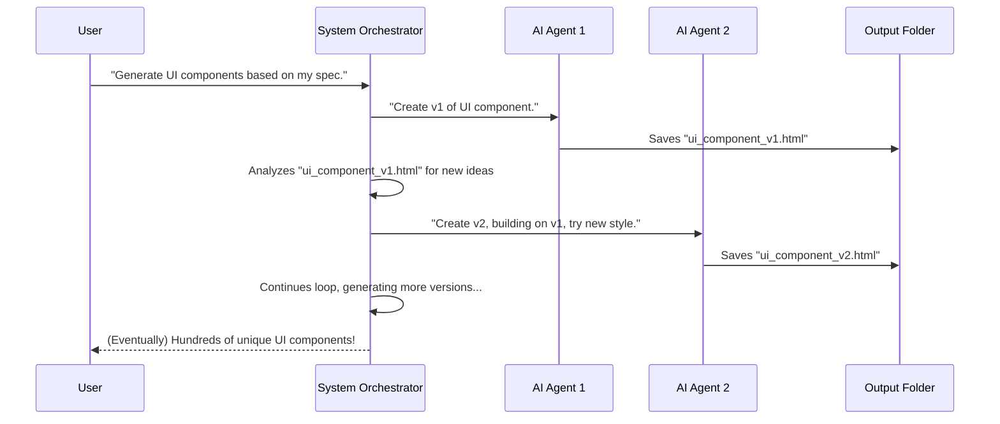

# Chapter 1: Infinite Agentic Loop

Welcome to the exciting world of the `infinite-agentic-loop` project! In this first chapter, we're going to introduce you to the core idea behind everything we do here: the **Infinite Agentic Loop**.

### What Problem Are We Solving?

Imagine you're a designer who needs to create many different versions of a user interface (UI) component, like a button, a card, or a navigation bar. You want each version to be unique, but also follow a specific theme and evolve over time, getting better or more interesting with each new idea. Doing this manually takes a lot of time and effort!

What if a smart assistant could do this for you, learning from your feedback and continuously generating new, creative designs? That's exactly what the Infinite Agentic Loop aims to do! It's like having an automated art studio that never stops creating new paintings based on a theme, learning from each previous creation to make the next one even better or more unique.

### The Core Idea: Infinite Agentic Loop

At its heart, the **Infinite Agentic Loop** is a system designed to continuously create and improve content, such as UI components, using AI agents. Think of it as a creative factory that runs forever (or until you tell it to stop!), constantly coming up with new ideas and building on old ones.

Let's break down the name:

*   **Infinite:** This means it can keep generating new things for a very long time, potentially forever, as long as it has instructions and resources. It's not a one-and-done process.
*   **Agentic:** This refers to the "agents" – these are like smart, mini-robots (software programs powered by AI) that do the actual work. Each agent can understand instructions, analyze existing work, and create new content.
*   **Loop:** This highlights the continuous nature. The system doesn't just create one thing; it creates something, then learns from it, and uses that learning to create the *next* thing, and so on, in a never-ending cycle.

### How It Works (High-Level Overview)

Let's use our UI component example. You want to generate many different UI components based on a set of rules.

Here's a simple way to think about how the Infinite Agentic Loop helps:

1.  **You give it a starting idea:** You describe what kind of UI component you want (e.g., "a modern, minimalist button with rounded corners"). This is like giving the art studio a theme.
2.  **It creates a first version:** An AI agent takes your idea and designs the first button.
3.  **It learns and evolves:** The system looks at the first button. Maybe it thinks, "What if we tried a different color scheme?" or "Let's make the corners even rounder, or add a subtle animation."
4.  **It creates more versions:** More AI agents, or the same agent with new instructions, then create new buttons based on these evolving ideas.
5.  **This repeats:** This process continues, with each new button potentially inspiring the next, leading to a fantastic variety of unique designs.



This diagram shows how you, the user, start the process. A "System Orchestrator" (which is part of the `infinite-agentic-loop` project) manages the process. It tells different AI Agents (like AI Agent 1 and AI Agent 2) to create new content. Each agent saves its work into an "Output Folder". The System Orchestrator then looks at what's already created to get ideas for the next version, keeping the loop going!

### How to Start the Loop

Now, let's see how you can actually make this happen in the project! The `infinite-agentic-loop` project uses a special tool called [Claude Code Slash Command](02_claude_code_slash_command_.md) to kick things off.

To start the loop, you type a specific "slash command" in your terminal (a text-based interface where you type commands). It's like telling your smart assistant a special keyword to begin a task.

The command looks like this:

```bash
/project:infinite <spec_file> <output_dir> <count>
```

Let's break down these parts:

*   `/project:infinite`: This is the special "slash command" that tells the system to start the Infinite Agentic Loop. It's defined in a file located at `.claude/commands/infinite.md`.
*   `<spec_file>`: This is the instruction manual for your AI agents. It's a file that tells the agents *what* to create and *how*. We'll learn all about this in [Specification Files](03_specification_files_.md).
*   `<output_dir>`: This is the folder where all the new creations (like our UI components) will be saved.
*   `<count>`: This tells the system how many versions you want. You can ask for a specific number (e.g., `5` for 5 variations) or literally type `infinite` to tell it to keep going until it can't anymore!

#### Example: Generating a Single UI Component

Let's say you have an instruction file named `specs/invent_new_ui_v3.md` (we'll look at these files in a later chapter). And you want to save the output in a folder called `src`.

To generate just one UI component based on these instructions, you would type:

```bash
/project:infinite specs/invent_new_ui_v3.md src 1
```

After you run this command, an AI agent will read your `specs/invent_new_ui_v3.md` file, create one example of a UI component, and save it in the `src` folder.

#### Example: Generating Five UI Components in Parallel

What if you want five different versions at once? The system can deploy multiple AI agents to work in parallel, meaning they all work at the same time!

```bash
/project:infinite specs/invent_new_ui_v3.md src_new 5
```

This command tells the system to generate 5 unique UI components. They will all be saved in a new folder called `src_new`. This is much faster than waiting for one to finish and then starting the next.

#### Example: Entering "Infinite Mode"

This is where the "Infinite" part of the name truly shines! If you want the system to keep generating new UI components continuously, you use `infinite` as the count:

```bash
/project:infinite specs/invent_new_ui_v3.md infinite_src_new/ infinite
```

When you run this, the system will enter "infinite mode." It will keep creating new UI components in the `infinite_src_new/` folder, wave after wave, each one potentially building on the previous ones, until it reaches its internal limits. This is how you get an ever-evolving stream of creative output!

### What's Under the Hood (Simplified)

When you type that `/project:infinite` command, a lot of smart things happen behind the scenes!

The main `infinite.md` file (located in `.claude/commands/infinite.md` within the project) acts as the brain of the operation. It's a special script that orchestrates (manages) the entire process.

Here’s a simplified step-by-step of what happens internally:

1.  **Reading Instructions (Specification Analysis):** The `infinite.md` script first reads your `<spec_file>` to understand exactly what kind of content needs to be generated. It's like the conductor of an orchestra reading the musical score to understand the piece.
    ```markdown
    **PHASE 1: SPECIFICATION ANALYSIS**
    Read and deeply understand the specification file at `spec_file`. This file defines:
    - What type of content to generate
    - The format and structure requirements
    - Any specific parameters or constraints
    - The intended evolution pattern between iterations

    Think carefully about the spec's intent and how each iteration should build upon previous work.
    ```
    This snippet from `.claude/commands/infinite.md` shows the first step is always to thoroughly understand your instructions.

2.  **Checking Existing Work (Output Directory Reconnaissance):** Next, it peeks into your `<output_dir>` to see if there are any previous versions already there. This is crucial for the "loop" part – it learns from what's already been created so it can make the next version even better or more unique.
    ```markdown
    **PHASE 2: OUTPUT DIRECTORY RECONNAISSANCE**
    Thoroughly analyze the `output_dir` to understand the current state:
    - List all existing files and their naming patterns
    - Identify the highest iteration number currently present
    - Analyze the content evolution across existing iterations
    - Understand the trajectory of previous generations
    - Determine what gaps or opportunities exist for new iterations
    ```
    This part ensures the system doesn't start from scratch every time but builds upon previous work.

3.  **Planning the Attack (Iteration Strategy):** Based on your instructions and existing work, it decides how many AI agents to deploy and what each one should focus on to create unique variations.
    ```markdown
    **PHASE 3: ITERATION STRATEGY**
    Based on the spec analysis and existing iterations:
    - Determine the starting iteration number (highest existing + 1)
    - Plan how each new iteration will be unique and evolutionary
    - Consider how to build upon previous iterations while maintaining novelty
    - If count is "infinite", prepare for continuous generation until context limits
    ```
    This is where the system strategizes how to make each new output distinct and evolutionary.

4.  **Sending Out the Workers (Parallel Agent Coordination):** Finally, it assigns specific tasks to multiple "Sub Agents" (smaller, specialized AI agents). Each Sub Agent creates one unique version of the UI component. They work in parallel to speed things up!
    ```markdown
    **PHASE 4: PARALLEL AGENT COORDINATION**
    Deploy multiple Sub Agents to generate iterations in parallel for maximum efficiency and creative diversity:

    **Sub-Agent Distribution Strategy:**
    - For count 1-5: Launch all agents simultaneously
    - For count 6-20: Launch in batches of 5 agents to manage coordination
    - For "infinite": Launch waves of 3-5 agents, monitoring context and spawning new waves
    ```
    This crucial step allows the system to generate many unique items quickly by using multiple agents at once. We'll dive deeper into how [Sub Agents](08_sub_agents_.md) work in a later chapter.

5.  **Infinite Mode Management (Wave Management):** If you chose `infinite`, the system keeps repeating steps 2-4, launching new "waves" of agents to continue generating until certain limits are met. This is detailed in [Wave Management (Infinite Mode)](10_wave_management__infinite_mode__.md).

**In short**: You give it a general idea. It learns from existing examples. It sends out smart agents to create new, unique versions. And it keeps doing this in a continuous loop to give you an "infinite" stream of evolving content.

### Conclusion

You've just been introduced to the **Infinite Agentic Loop**, the magical engine behind our project! You learned that it's a system that can continuously generate and evolve content using AI agents. We discussed the problem it solves (making many unique variations of content, like UI components), and how you can trigger it using the `/project:infinite` command with different counts, including "infinite" for endless creation! You also got a peek under the hood at the high-level steps involved.

In the next chapter, we'll dive deeper into the [Claude Code Slash Command](02_claude_code_slash_command_.md) itself, which is the specific tool that brings the Infinite Agentic Loop to life. This will help you understand exactly how these commands work.

[Next Chapter: Claude Code Slash Command](02_claude_code_slash_command_.md)

---

Generated by [AI Codebase Knowledge Builder](https://github.com/The-Pocket/Tutorial-Codebase-Knowledge)