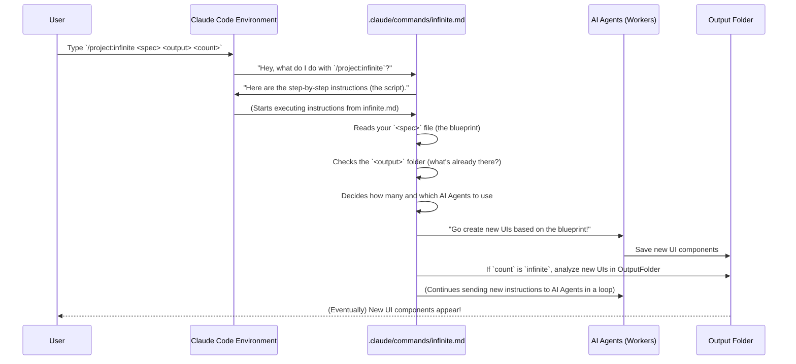

# Chapter 2: Claude Code Slash Command

Welcome back! In Chapter 1, we introduced the big idea of the [Infinite Agentic Loop](01_infinite_agentic_loop_.md) – a system that can continuously create and improve things using AI. We saw how it's like an endless creative factory. But how do you *tell* this factory to start producing? That's what this chapter is all about!

### The Magic Word: Claude Code Slash Command

Imagine you have a super-smart robot assistant, but you need a specific phrase or "magic word" to get it to do something important. In the world of `infinite-agentic-loop` and Claude Code, that "magic word" is a **Slash Command**.

A **Claude Code Slash Command** is how you talk to the `infinite-agentic-loop` project. It's a special command you type directly into the Claude Code environment. It starts with a forward slash (`/`) and tells Claude Code to run a specific task.

For our project, the special command is `/project:infinite`. It's like telling Claude, "Hey, Claude! Start that infinite project thing!"

#### Why Use a Slash Command?

Think of it like using keyboard shortcuts (like `Ctrl+C` for copy). Instead of typing out long instructions every time, you just use a short, memorable command. Slash commands make interacting with powerful AI systems much faster and easier.

### How to Use the `/project:infinite` Command

Let's go back to our example from Chapter 1: generating many different versions of a user interface (UI) component. To kick off this process using the `infinite-agentic-loop`, you'll use the `/project:infinite` command.

Here's the basic structure of the command:

```bash
/project:infinite <spec_file> <output_dir> <count>
```

Let's break down each part again, as they are crucial for interacting with the loop:

*   `/project:infinite`: This is the actual slash command. It's like pressing the "Start Engine" button for our creative factory.
*   `<spec_file>`: This is a file that tells the AI *what* to create. It's like giving your robot detailed blueprints. We'll learn more about these "blueprint" files in [Specification Files](03_specification_files_.md).
    *   Example: `specs/invent_new_ui_v3.md`
*   `<output_dir>`: This is the folder where all the new creations will be saved. It's like telling the robot where to put the finished products.
    *   Example: `src` (for a folder named "src")
*   `<count>`: This tells the system how many versions you want. You can ask for a specific number (like `1` or `5`) or literally type `infinite` to make it generate forever!
    *   Example: `1`, `5`, or `infinite`

#### Putting It All Together: Examples

Let's see the command in action with some practical examples for generating UI components.

**Example 1: Generating a Single UI Component**

You have a blueprint file called `specs/invent_new_ui_v3.md` and you want just one UI component saved in a folder named `src`.

```bash
/project:infinite specs/invent_new_ui_v3.md src 1
```

When you type this into Claude Code and press Enter, Claude Code will:
1.  Read your instructions from `specs/invent_new_ui_v3.md`.
2.  Have an AI agent create one UI component.
3.  Save that single UI component inside the `src` folder.

**Example 2: Generating Five UI Components in Parallel**

What if you need five different UI components at once? The `infinite-agentic-loop` can use multiple AI agents (like multiple workers in the factory) to do this at the same time. Let's save them in a new folder called `src_new`.

```bash
/project:infinite specs/invent_new_ui_v3.md src_new 5
```

This command will tell Claude Code to:
1.  Read the same blueprint file.
2.  Launch five AI agents, each working to create a unique UI component.
3.  Save all five unique components into the `src_new` folder. This is much faster than doing them one by one!

**Example 3: Entering "Infinite Mode"**

This is where the magic really happens! If you want the system to keep generating new UI components continuously, using the "infinite" setting for count:

```bash
/project:infinite specs/invent_new_ui_v3.md infinite_src_new/ infinite
```

When you run this command, Claude Code will:
1.  Read the blueprint.
2.  Start generating UI components, saving them into `infinite_src_new/`.
3.  It will keep generating new components, wave after wave, each one potentially building on the previous ones, until it reaches internal software limits (like running out of "thinking space" for Claude). This creates an endless stream of creative output!

You can see these examples in the project's main `README.md` file under the "Usage" section.

### How the Slash Command Works Behind the Scenes

When you type `/project:infinite` and press Enter, Claude Code doesn't just magically "know" what to do. It looks for a special file that defines what that command means.

For our project, the `/project:infinite` command is defined in a file located at `.claude/commands/infinite.md`. This `infinite.md` file is essentially a script or a set of detailed instructions that Claude follows.

Let's look at a simplified picture of what happens when you use the command:



**Key Steps in the `infinite.md` Script:**

The `infinite.md` file contains several "phases" or steps that instruct Claude Code on how to manage the `infinite-agentic-loop`. You can peek at the actual `infinite.md` file in the project's `.claude/commands/` directory if you're curious!

1.  **Arguments Parsing:** First, it grabs the `<spec_file>`, `<output_dir>`, and `<count>` values you typed. It's like the robot first listening to your specific parameters.

    ```markdown
    **ARGUMENTS PARSING:**
    Parse the following arguments from "$ARGUMENTS":
    1. `spec_file` - Path to the markdown specification file
    2. `output_dir` - Directory where iterations will be saved  
    3. `count` - Number of iterations (1-N or "infinite")
    ```
    This snippet from the `infinite.md` file shows how it understands the arguments you give it.

2.  **Specification Analysis:** Then, it tells Claude to carefully read and understand the `spec_file` (your blueprint). It figure out what kind of content to build, what format it should be in, and how it should evolve.

    ```markdown
    **PHASE 1: SPECIFICATION ANALYSIS**
    Read and deeply understand the specification file at `spec_file`. This file defines:
    - What type of content to generate
    - The format and structure requirements
    - Any specific parameters or constraints
    - The intended evolution pattern between iterations
    ```
    This is where Claude gets its main design instructions.

3.  **Output Directory Reconnaissance:** Before creating anything new, the `infinite.md` script tells Claude to look inside the `output_dir` (the place where saved items go). It checks what's already there. This is important for the "loop" because it helps the AI learn from previous creations and ensure new ones are unique.

    ```markdown
    **PHASE 2: OUTPUT DIRECTORY RECONNAISSANCE** 
    Thoroughly analyze the `output_dir` to understand the current state:
    - List all existing files and their naming patterns
    - Identify the highest iteration number currently present
    - Analyze the content evolution across existing iterations
    ```
    This step ensures that the system builds on past work and doesn't just repeat itself.

4.  **Parallel Agent Coordination:** Finally, the script instructs Claude to "deploy" AI agents (the "Sub Agents" we mentioned in Chapter 1). These sub-agents are the actual workers that generate the content. The script tells them what to do, what iteration number they are working on, and ensures they create unique content.

    ```markdown
    **PHASE 4: PARALLEL AGENT COORDINATION**
    Deploy multiple Sub Agents to generate iterations in parallel for maximum efficiency and creative diversity:

    **Sub-Agent Distribution Strategy:**
    - For count 1-5: Launch all agents simultaneously 
    - For count 6-20: Launch in batches of 5 agents to manage coordination
    - For "infinite": Launch waves of 3-5 agents, monitoring context and spawning new waves
    ```
    This shows how the `infinite.md` script manages multiple AI workers to get the job done efficiently.

By understanding that the `/project:infinite` command is simply running a detailed script (`infinite.md`) that guides Claude through these steps, you gain a clearer picture of how powerful yet accessible this system is.

### Conclusion

In this chapter, you learned that the **Claude Code Slash Command** is your primary way to interact with the `infinite-agentic-loop`. Specifically, the `/project:infinite` command, along with its arguments (`<spec_file>`, `<output_dir>`, and `<count>`), is the "magic trigger" that starts the continuous generation process. You saw examples of how to use it for single generations, small batches, and the amazing "infinite mode." You also got a peek behind the curtain to understand that this command simply executes a well-defined script (`.claude/commands/infinite.md`) that orchestrates the entire creative loop.

Next, we'll dive deeper into one of the most important parts of the command: the `spec_file`, which we call [Specification Files](03_specification_files_.md). This is where you tell the AI exactly *what* you want it to build!

[Next Chapter: Specification Files](03_specification_files_.md)

---

Generated by [AI Codebase Knowledge Builder](https://github.com/The-Pocket/Tutorial-Codebase-Knowledge)