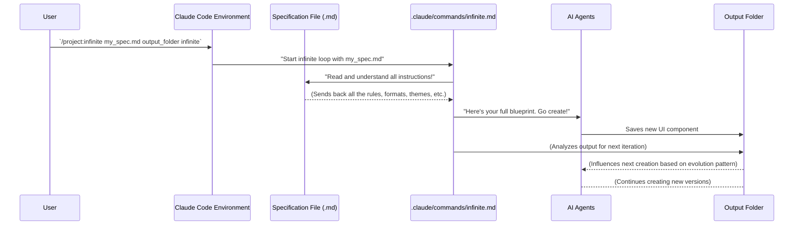

# Chapter 3: Specification Files

Welcome back, future AI conductors! In [Chapter 2: Claude Code Slash Command](02_claude_code_slash_command_.md), we learned how to use the "magic word" `/project:infinite` to start our creative AI factory. Now, it's time to give that factory its blue­prints: the **Specification Files**.

Imagine you're building a custom toy. Even if you have the best robot builders (our AI agents), they can't start until you give them detailed instructions: what kind of toy is it? What color? Does it move? How big is it?

**Specification Files** are exactly that: detailed instruction manuals written in Markdown. They tell our AI agents *exactly* what to create, how it should look, how it should behave, and even how it should improve over time. Without a good spec file, our AI factory wouldn't know what to build!

### What Problem Do Specification Files Solve?

Our `infinite-agentic-loop` project is all about creating many unique variations of something, like UI components. But "unique" can't mean "random." We need a way to guide the AI's creativity within certain boundaries.

**The problem:** How do we give complex, detailed instructions to an AI agent efficiently and clearly, especially when we want it to create not just one thing, but many evolving versions?

**The solution:** Specification Files. They act as a single source of truth for the AI, embedding all the rules, formats, and design principles in one place.

### Your First Blueprint: The UI Component Example

Let's stick with our example of creating UI components. You want the AI to create different types of UI elements, perhaps a button, a form field, or a navigation menu. But you don't just want any button; you want a *specific kind* of button that fits your design needs.

Let's imagine our goal is to create a UI component that **combines a search bar, an autocomplete dropdown, and a filter system** into one neat package, all designed with a **"Cyberpunk Future" theme**.

This is a specific, complex task. How do we tell the AI agent all these details? With a Specification File!

### Inside a Specification File: The AI's Instruction Manual

Specification files are simple Markdown files. This means they are easy to read and write. They use headings, bullet points, and code blocks, just like you might use for notes or documentation.

Here are the key sections you'll typically find in a specification file and what they tell the AI:

1.  **Core Challenge / Task Description:** What is the main goal? What problem are we trying to solve?
2.  **Output Requirements:** What should the final product look like? What format is it in? How should it be named?
3.  **Design Dimensions / Principles:** What are the creative constraints? What themes, styles, or concepts should the AI follow?
4.  **Iteration Evolution Pattern:** How should the component change over multiple versions? Should it get more complex? Simpler?
5.  **Quality Standards:** What makes a "good" output? How will the AI know if it succeeded?
6.  **Ultra-Thinking Directive:** What advanced thoughts or questions should the AI consider before starting? This really pushes the AI's creativity.

Let's look at a simplified example, drawing from `specs/invent_new_ui_v3.md`:

```markdown
# Themed Hybrid UI Component Specification

## Core Challenge
Create a **uniquely themed UI component** that combines multiple existing UI elements into one elegant solution. 

## Output Requirements

**File Naming**: `ui_hybrid_[iteration_number].html`

**Content Structure**: Themed, multi-functional HTML component
```html
<!DOCTYPE html>
<html lang="en">
<head>
    <meta charset="UTF-8">
    <meta name="viewport" content="width=device-width, initial-scale=1.0">
    <title>[Theme Name] [Hybrid Component Name]</title>
    <style>
        /* Cohesive theme implementation across all component aspects */
    </style>
</head>
<body>
    <main>
        <h1>[Hybrid Component Name] - [Theme Name] Theme</h1>
        <!-- The component goes here -->
    </main>
    <script>
        // Coordinated behavior
    </script>
</body>
</html>
```

This snippet shows the very beginning of a specification file. It clearly states the "Core Challenge" (what we're building) and the "Output Requirements" (what the final file should be named and its basic HTML structure).

### Design Dimensions: Unleashing Guided Creativity

This is where you tell the AI about the "Cyberpunk Future" theme and the idea of combining elements.

```markdown
## Design Dimensions

### **Unique Theme Development**
Each component must embody a distinctive design language.

#### **Theme Categories**
- **Organic Nature**: Plant growth, water flow...
- **Digital Minimalism**: Pure geometry...
- **Retro Computing**: Terminal aesthetics...
- **Cyberpunk Future**: Neon accents, glitch effects, holographic elements, digital noir

### **Hybrid Component Strategy**
Combine 2-4 existing UI components into one powerful, multi-functional interface.

#### **Smart Combinations**
- **Search Hub**: Search bar + autocomplete + recent items + filters + results preview
- **Input Intelligence**: Text field + validation + help system...
```

Here, we're giving the AI options for themes and combinations. The AI will then pick one and try to apply it. For our immediate goal, it would pick "Cyberpunk Future" and "Search Hub."

### Iteration Evolution Pattern: Getting Smarter Over Time

One of the coolest things about the `infinite-agentic-loop` is how it can evolve its creations. The spec file guides this evolution.

```markdown
## Iteration Evolution

### **Theme Sophistication**
- **Foundation (1-3)**: Establish clear theme identity...
- **Refinement (4-6)**: Deepen thematic details...
- **Innovation (7+)**: Push thematic boundaries...

### **Combination Complexity**
- **Simple Pairs**: Start with 2 closely related UI functions
- **Functional Triads**: Combine 3 complementary interface elements
- **Complex Systems**: Integrate 4+ functions...
```

This section tells the AI how to make each new version different and more advanced. For example, the first few versions might have simple themes and just two combined elements. Later versions might have extremely detailed themes and combine many complex UI features. This is how the "loop" part of [Infinite Agentic Loop](01_infinite_agentic_loop_.md) becomes truly powerful!

### Ultra-Thinking Directive: Pushing the AI to Think Differently

This section is like giving the AI a philosophical puzzle related to the task. It encourages deeper thinking and more innovative solutions.

```markdown
## Ultra-Thinking Directive

Before each themed hybrid creation, deeply consider:

**Theme Development:**
- What personality should this component embody?
- How can visual design reinforce the emotional goals?

**Function Combination:**
- Which UI functions naturally belong together in user workflows?
- How can combining these functions reduce user cognitive load?

**Generate components that are:**
- **Thematically Distinctive**: Strong design personality...
- **Functionally Integrated**: Multiple UI capabilities working together seamlessly
```

This is where you push the AI to truly be "agentic" – to think creatively and not just follow basic instructions. It's asking the AI to consider the deeper purpose and potential of its creations.

### How the AI Uses the Specification File

Let's quickly recap how the specification file fits into the overall process:



1.  **You Provide the `spec_file`:** When you run `/project:infinite <spec_file> <output_dir> <count>`, you tell the system *which* blueprint to use.

    ```bash
    /project:infinite specs/invent_new_ui_v3.md src 1
    ```
    In this command, `specs/invent_new_ui_v3.md` is our specification file.

2.  **The `infinite.md` Script Reads It:** The main script (`.claude/commands/infinite.md`, as discussed in [Chapter 2: Claude Code Slash Command](02_claude_code_slash_command_.md)) reads your chosen specification file. It doesn't just skim it; it "deeply understands" *all* the instructions, from the core challenge to the ultra-thinking directive.

    A key part of `infinite.md` is this step:
    ```markdown
    **PHASE 1: SPECIFICATION ANALYSIS**
    Read and deeply understand the specification file at `spec_file`. This file defines:
    - What type of content to generate
    - The format and structure requirements
    - Any specific parameters or constraints
    - The intended evolution pattern between iterations

    Think carefully about the spec's intent and how each iteration should build upon previous work.
    ```
    This shows that the first thing the system does is to fully grasp your instructions from the spec file.

3.  **Instructions for AI Agents:** Once the `infinite.md` script understands everything, it then passes these detailed instructions to the individual AI agents (sometimes called "Sub Agents"). The agents then know exactly what kind of "Cyberpunk Search Hub" to create, how complex it should be, and how it should evolve if you're in infinite mode.

    The `infinite.md` file explicitly states how it assigns tasks to Sub Agents:
    ```markdown
    **Agent Assignment Protocol:**
    Each Sub Agent receives:
    1. **Spec Context**: Complete specification file analysis
    2. **Directory Snapshot**: Current state of output_dir at launch time
    3. **Iteration Assignment**: Specific iteration number (starting_number + agent_index)
    4. **Uniqueness Directive**: Explicit instruction to avoid duplicating concepts from existing iterations
    5. **Quality Standards**: Detailed requirements from the specification
    ```
    This shows how your `spec_file` (as "Spec Context" and "Quality Standards") is directly given to the AI agents for their work.

### Conclusion

You've now unlocked the power of **Specification Files**! You understand that these Markdown files are not just simple requests, but detailed instruction manuals for your AI agents. They define the task, the output format, the creative boundaries, and even how the AI should learn and evolve over many iterations. They are crucial for guiding the AI's creativity in the `infinite-agentic-loop` project.

You now know how to tell the AI *what* to create. Next, in [Chapter 4: Output Requirements](04_output_requirements_.md), we'll zoom in on one specific, super important part of the specification file: the "Output Requirements." This section is critical because it tells the AI exactly how to deliver its creations so they are consistently formatted and useful.

[Next Chapter: Output Requirements](04_output_requirements_.md)

---

Generated by [AI Codebase Knowledge Builder](https://github.com/The-Pocket/Tutorial-Codebase-Knowledge)