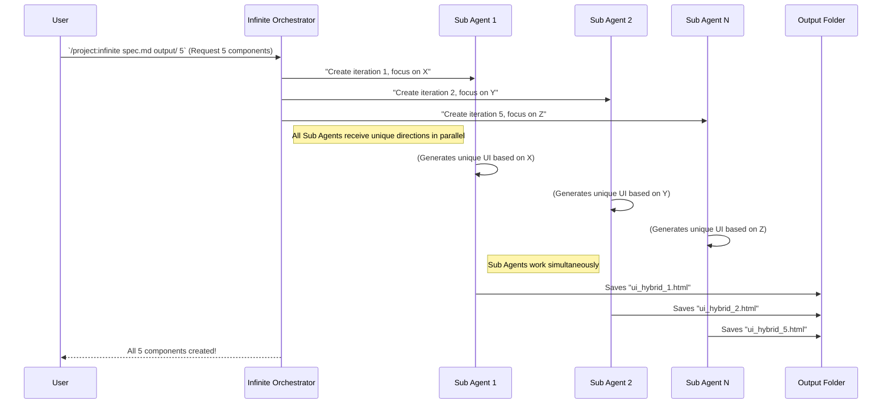

# Chapter 8: Sub Agents

Welcome back, adventurous AI builders! In [Chapter 7: Iteration Strategy & Evolution](07_iteration_strategy___evolution_.md), we learned how the `infinite-agentic-loop` plans its creative journey, ensuring each new version of a UI component (or whatever it's building) is unique and evolving. But who actually does the work? Who are the individual "artists" or "engineers" that make these creations come to life?

Meet the **Sub Agents**.

Imagine the `infinite-agentic-loop` is a big movie studio director. The director has a grand vision for how the movie (the infinite stream of UI components) should evolve over time. But the director doesn't actually paint the sets or design the costumes. They hire a team of specialists for that!

**Sub Agents** are like those specialized workers. They are individual AI workers, each given a specific, unique task by the main orchestrator (the director). They work in parallel, meaning many of them are working at the same time, each creating one piece of the puzzle. This helps cover a lot of creative ground very quickly and generates diverse ideas.

### What Problem Do Sub Agents Solve?

Our `infinite-agentic-loop` project needs to generate many different, high-quality, and evolving versions of content, often in a short amount of time.

**The problem:** If one single AI had to generate *all* the UI components one after another, it would be slow. Plus, it might get stuck in a rut, generating very similar ideas. How do we ensure speed *and* creative diversity?

**The solution:** **Sub Agents**. By deploying multiple Sub Agents, the system can:

*   **Generate in Parallel:** Many different versions can be created *simultaneously*, speeding up the process significantly.
*   **Encourage Diversity:** Each Sub Agent can be given a slightly different creative direction or focus, leading to a wider range of unique outputs. It's like having multiple artists, each with their own style, tackling the same general theme.

This allows the `infinite-agentic-loop` to explore many creative avenues at once, producing a rich collection of evolving content.

### Your AI Production Team: How It Works

Let's stick with our UI component example. You want to generate 5 different UI components, each unique. Instead of one AI creating them one by one, the `infinite-agentic-loop` will deploy 5 Sub Agents, each dedicated to creating one component.

Here's how it generally happens:

1.  **The Director's Briefing:** The main orchestrator (the `.claude/commands/infinite.md` script we discussed in [Chapter 2: Claude Code Slash Command](02_claude_code_slash_command_.md)) reads your [Specification Files](03_specification_files_.md) and figures out the overall plan, including the [Iteration Strategy & Evolution](07_iteration_strategy___evolution_.md).
2.  **Assigning Tasks:** Based on the desired `count` (like `5` or `infinite`), the orchestrator decides how many Sub Agents are needed for the current "wave." It then gives each Sub Agent a unique "briefing" or "creative direction." This direction tells the Sub Agent:
    *   **What to build:** The overall instructions from the [Specification Files](03_specification_files_.md).
    *   **What to aim for:** The [Quality Standards](05_quality_standards_.md) it needs to meet.
    *   **Its unique twist:** A specific creative angle or a particular aspect of the [Iteration Strategy & Evolution](07_iteration_strategy___evolution_.md) to focus on (e.g., "focus on making the theme really vibrant" or "try a completely new integration method").
    *   **Its filename:** The exact `[iteration_number]` so its output file is unique, as guided by [Output Requirements](04_output_requirements_.md).
3.  **Parallel Production:** Each Sub Agent then gets to work, independently creating its unique UI component. Since they're "AI agents," this means they are running their own thought processes to design and code the component based on their assigned briefing.
4.  **Delivery:** Once a Sub Agent is done, it saves its created UI component file into the designated `<output_dir>`.



This diagram shows how one command from you gets the Orchestrator to assign specific, parallel tasks to multiple Sub Agents, who then deliver their unique results.

### In the Code: How Sub Agents are Deployed

You've already seen hints of Sub Agents in the code examples from previous chapters, particularly in the `infinite.md` command. Let's look at the key parts that explicitly mention Sub Agents.

When you run a command like:

```bash
/project:infinite specs/invent_new_ui_v3.md src_new 5
```

The orchestrator, defined in `.claude/commands/infinite.md`, kicks into action. A crucial part of this script is `PHASE 4: PARALLEL AGENT COORDINATION`.

```markdown
**PHASE 4: PARALLEL AGENT COORDINATION**
Deploy multiple Sub Agents to generate iterations in parallel for maximum efficiency and creative diversity:

**Sub-Agent Distribution Strategy:**
- For count 1-5: Launch all agents simultaneously 
- For count 6-20: Launch in batches of 5 agents to manage coordination
- For "infinite": Launch waves of 3-5 agents, monitoring context and spawning new waves
```
This section directly tells the orchestrator to "Deploy multiple Sub Agents." It also outlines a strategy for how many Sub Agents to launch at once, depending on whether you asked for a small number, a batch, or `infinite` generations. This means if you ask for 5, it launches all 5 at once. If you ask for `infinite`, it will launch them in "waves" (like 3-5 at a time) to manage the AI's "thinking space" (context).

The most important part is how each Sub Agent gets its instructions:

```markdown
**Agent Assignment Protocol:**
Each Sub Agent receives:
1. **Spec Context**: Complete specification file analysis
2. **Directory Snapshot**: Current state of output_dir at launch time
3. **Iteration Assignment**: Specific iteration number (starting_number + agent_index)
4. **Uniqueness Directive**: Explicit instruction to avoid duplicating concepts from existing iterations
5. **Quality Standards**: Detailed requirements from the specification
```
This "protocol" is exactly that "briefing" we talked about. Each point here makes sure the Sub Agent has all the information it needs to do its unique part:
*   `Spec Context`: The full blueprint from the [Specification Files](03_specification_files_.md).
*   `Directory Snapshot`: Information about what's *already* in the output folder. This helps the Sub Agent avoid making something too similar, supporting the `Uniqueness Directive`.
*   `Iteration Assignment`: This gives the Sub Agent its specific number (e.g., "you are creating `ui_hybrid_3.html`").
*   `Uniqueness Directive`: A clear instruction to focus on creating something novel and not repeat previous ideas.
*   `Quality Standards`: The checklist for *excellence* from [Chapter 5: Quality Standards](05_quality_standards_.md).

Finally, the `TASK` specification within `infinite.md` shows the actual instruction given to each Sub Agent:

```markdown
TASK: Generate iteration [NUMBER] for [SPEC_FILE] in [OUTPUT_DIR]

You are Sub Agent [X] generating iteration [NUMBER]. 

CONTEXT:
- Specification: [Full spec analysis]
- Existing iterations: [Summary of current output_dir contents]
- Your iteration number: [NUMBER]
- Assigned creative direction: [Specific innovation dimension to explore]

REQUIREMENTS:
1. Read and understand the specification completely
2. Analyze existing iterations to ensure your output is unique
3. Generate content following the spec format exactly
4. Focus on [assigned innovation dimension] while maintaining spec compliance
5. Create file with exact name pattern specified
6. Ensure your iteration adds genuine value and novelty

DELIVERABLE: Single file as specified, with unique innovative content
```
This snippet is the actual job description. Each Sub Agent is told its `NUMBER`, given its `CONTEXT` (the `spec` details, what's already there, and its unique `creative direction`), and then given clear `REQUIREMENTS` for its deliverable. This `assigned innovation dimension` is key to generating diverse outputs; one agent might be told to focus on "Retro Computing" theme, while another focuses on "Organic Nature."

### Conclusion

You now have a clear understanding of **Sub Agents**! You learned that they are the individual, specialized AI workers deployed by the main orchestrator within the `infinite-agentic-loop`. By working in parallel and receiving unique creative directions, Sub Agents enable the system to rapidly generate a diverse and evolving stream of high-quality outputs. They are the hands-on "producers" in our creative AI factory.

Knowing how Sub Agents work helps you understand the efficiency and creative power of the system. Next, in [Chapter 9: Directory Reconnaissance](09_directory_reconnaissance_.md), we'll zoom out and see how the orchestrator keeps track of all the work done by these Sub Agents by carefully watching the output folder.

[Next Chapter: Directory Reconnaissance](09_directory_reconnaissance_.md)

---

Generated by [AI Codebase Knowledge Builder](https://github.com/The-Pocket/Tutorial-Codebase-Knowledge)