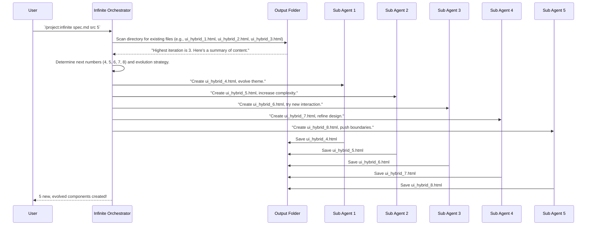

# Chapter 9: Directory Reconnaissance

Welcome back, meticulous AI builders! In [Chapter 8: Sub Agents](08_sub_agents_.md), we learned about the individual AI workers (Sub Agents) that actually create the content. They're like busy bees, each making one unique item and dropping it into the output folder. But how does the main "Orchestrator" (the brain of our system) know what the bees have already made? And how does it know what to tell the *next* batch of bees to do, so they build on the previous work?

This is where **Directory Reconnaissance** comes in!

Imagine you have a big artist's studio, and the artists are constantly creating new paintings. Before you ask them to create another painting, you, as the studio manager, would probably walk around, look at all the finished paintings, see what styles they have, which one has the highest "version number" (like "Painting_v10"), and generally get a feel for the collection. This helps you decide what kind of new painting would fit in best or logically follow the last one.

**Directory Reconnaissance** is essentially the system "scanning" the output folder where all the generated files are saved. It's like the studio manager taking inventory. It checks:
*   **What files are there?** (e.g., `ui_hybrid_1.html`, `ui_hybrid_2.html`)
*   **What's the highest iteration number?** (e.g., if `ui_hybrid_5.html` exists, then `5` is the highest)
*   **What's the history?** By looking at names and sometimes content, it can understand how the previous creations "evolved."

This careful "scan" helps the system decide how new creations should "fit in" and pick up where it left off, especially when working in "infinite mode," ensuring a continuous, evolving stream of content.

### What Problem Does Directory Reconnaissance Solve?

Our [Infinite Agentic Loop](01_infinite_agentic_loop_.md) is designed to continuously generate and evolve content. For this to work smoothly and logically, the AI needs to know the "story so far."

**The problem:** If the AI simply generates new files with generic names or without checking what already exists, it might overwrite old files, create duplicates, or fail to build upon previous work. This would break the "loop" and the "evolution" aspects of our project.

The system needs a way to understand the current state of its output.

**The solution:** **Directory Reconnaissance**. By performing a thorough scan of the output directory, the system gains crucial information:
*   **Avoid Duplication:** It knows which filenames are already taken.
*   **Continuous Numbering:** It can assign the next logical iteration number (e.g., if `ui_hybrid_5.html` is the latest, the next one should be `ui_hybrid_6.html`).
*   **Guided Evolution:** It can gather context about the existing creations (their themes, complexity, etc.) to inform the [Iteration Strategy & Evolution](07_iteration_strategy___evolution_.md) for the next batch of new files.

This ensures that the `infinite-agentic-loop` builds on its past, providing a truly progressive and intelligent generation process.

### Your AI's Eye on the Folder: How It Works

Let's say you've run the `/project:infinite` command multiple times, and your `src` folder already contains `ui_hybrid_1.html`, `ui_hybrid_2.html`, and `ui_hybrid_3.html`. Next, you decide to run:

```bash
/project:infinite specs/invent_new_ui_v3.md src 5
```

You are asking the system to generate 5 *new* UI components. But where should it start numbering? And how should it make them different from the first three? Directory Reconnaissance is the key.

Here's the step-by-step process:

1.  **Command Initiated:** You issue the `/project:infinite` command.
2.  **Orchestrator takes over:** The main orchestrator (`.claude/commands/infinite.md` script) starts its process.
3.  **Phase 2: Directory Reconnaissance:** Before it even thinks about generating anything new, the orchestrator performs its scan.
    *   It looks into the `src` folder.
    *   It finds all files matching the expected `ui_hybrid_*.html` pattern (as defined in [Output Requirements](04_output_requirements_.md)).
    *   It identifies `ui_hybrid_3.html` as the highest numbered file.
    *   It might even analyze the content of `ui_hybrid_1.html`, `ui_hybrid_2.html`, `ui_hybrid_3.html` to understand their themes, complexity, and how they evolved (this analysis helps with the [Iteration Strategy & Evolution](07_iteration_strategy___evolution_.md) and applying [Quality Standards](05_quality_standards_.md)).
4.  **Phase 3: Iteration Strategy:** Based on this reconnaissance, the orchestrator now knows:
    *   The "starting iteration number" for new files should be `3 + 1 = 4`.
    *   The system needs to generate 5 new iterations: `ui_hybrid_4.html`, `ui_hybrid_5.html`, `ui_hybrid_6.html`, `ui_hybrid_7.html`, and `ui_hybrid_8.html`.
    *   How these new iterations should evolve, building on the knowledge gathered from existing files (e.g., if existing files were "Foundation" themes, the new ones might involve "Refinement" as per the spec).
5.  **Phase 4: Parallel Agent Coordination:** The orchestrator then assigns these new tasks to [Sub Agents](08_sub_agents_.md), giving each one a specific iteration number (4, 5, 6, 7, or 8) and a directive for how to evolve based on the reconnaissance.
    *   Sub Agent 1 gets task to create `ui_hybrid_4.html`.
    *   Sub Agent 2 gets task to create `ui_hybrid_5.html`.
    *   ... and so on.
6.  **Results:** The Sub Agents create their files, and they are saved in the `src` folder, continuing the logical progression.


This diagram visualizes how the Orchestrator first checks the existing files (`OutputFolder`) to understand the current state, and then uses that information to intelligently assign tasks to new `SubAgents`.

### In the Code: The Reconnaissance Phase

The concept of Directory Reconnaissance is explicitly mentioned in the `infinite.md` command. Let's look at the key section:

When you run an `/project:infinite` command, the orchestrator defined in `.claude/commands/infinite.md` starts processing. One of its first critical phases is "PHASE 2":

```markdown
**PHASE 2: OUTPUT DIRECTORY RECONNAISSANCE** 
Thoroughly analyze the `output_dir` to understand the current state:
- List all existing files and their naming patterns
- Identify the highest iteration number currently present
- Analyze the content evolution across existing iterations
- Understand the trajectory of previous generations
- Determine what gaps or opportunities exist for new iterations
```

Let's break down this powerful little snippet:

*   **`Thoroughly analyze the output_dir`**: This is the core instruction. The AI is told to look deeply into the specified output folder.
*   **`- List all existing files and their naming patterns`**: The first practical step. It finds all files. For our UI components, it would look for `ui_hybrid_*.html`. This helps it understand what's already there and how they are named.
*   **`- Identify the highest iteration number currently present`**: After listing, it extracts the numbers from the filenames (e.g., from `ui_hybrid_1.html` it gets `1`, from `ui_hybrid_5.html` it gets `5`). Then it finds the largest number. This tells it where to start numbering the *next* creation.
*   **`- Analyze the content evolution across existing iterations`**: This is where it goes beyond just filenames. The AI might actually read parts of the existing files to understand the themes, styles, or functionalities that have already been explored. This is crucial for guiding the [Iteration Strategy & Evolution](07_iteration_strategy___evolution_.md).
*   **`- Understand the trajectory of previous generations`**: Based on the content analysis, it forms a picture of how the creations have progressed so far (e.g., "From simple buttons to complex forms," or "From basic theme to refined theme").
*   **`- Determine what gaps or opportunities exist for new iterations`**: This is the creative part! Based on the "trajectory," the AI can identify what *hasn't* been explored yet, or what could be the next logical leap in the evolution process. This ensures novelty and progression.

This "reconnaissance" phase gives the AI a complete picture of the "history" of the generated content. Without it, the "Infinite Agentic Loop" wouldn't be able to pick up where it left off, ensure uniqueness, or guide the evolution of its creations intelligently. It would just be blindly generating new files without context.

### Conclusion

You've now successfully navigated the concept of **Directory Reconnaissance**! You understand that this is the crucial step where the `infinite-agentic-loop` "scans" its output directory to understand the current state of its generated files. By identifying existing files, their highest iteration numbers, and the history of previous creations, the system can intelligently decide how new creations should fit into the overall progression, ensuring continuity, uniqueness, and a guided evolution. This empowers the system to genuinely "pick up where it left off" and produce an ever-evolving stream of content.

This "reconnaissance" phase is especially important for the system's ability to operate in "infinite mode," which we'll explore in detail in the next chapter.

[Next Chapter: Wave Management (Infinite Mode)](10_wave_management__infinite_mode__.md)

---

Generated by [AI Codebase Knowledge Builder](https://github.com/The-Pocket/Tutorial-Codebase-Knowledge)