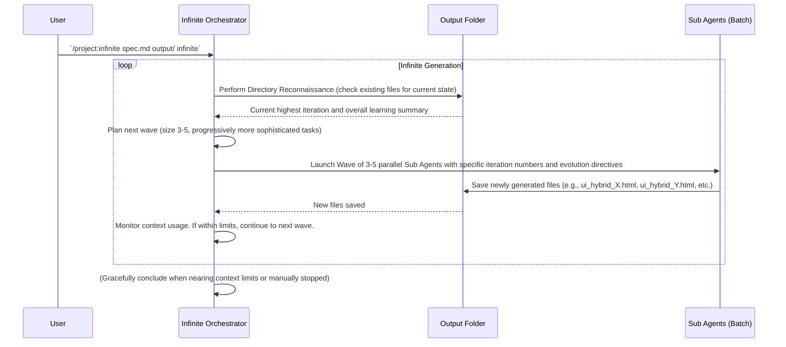

# Chapter 10: Wave Management (Infinite Mode)

Welcome back, future AI conductors! In our last chapter, [Chapter 9: Directory Reconnaissance](09_directory_reconnaissance_.md), we learned how the system "looks around" its output folder to understand what's already been created. This is super important because it helps the AI know where to pick up its work. Now, we're going to dive into how this all comes together for continuous, unending creation: **Wave Management (Infinite Mode)**.

Imagine you're managing a big construction project that never truly ends, like building a sprawling city. You can't just throw all your construction crews at it at once; it would be chaos! You'd launch them in phases, or "waves." The first wave builds the foundations, the next wave builds the walls, a third wave adds the roofs, and so on. Each wave builds on what the previous one achieved, and you keep launching new waves as long as there's more city to build.

**Wave Management** is exactly this concept applied to our `infinite-agentic-loop`. When we tell the system to generate content "infinitely," it doesn't just try to create everything at once. Instead, it organizes the creation process into "waves" of [Sub Agents](08_sub_agents_.md). Each wave is a small, manageable batch of creations. This helps the AI system to:
*   **Manage its creative "thinking space":** AI models have limits on how much information they can hold and process at once (their "context window"). Waves help prevent the AI from getting overwhelmed.
*   **Build progressively:** Each wave can learn from the outputs of the previous waves, making the next set of creations even better or more complex, following the [Iteration Strategy & Evolution](07_iteration_strategy___evolution_.md).
*   **Handle interruptions gracefully:** If the system stops (maybe your computer goes to sleep, or you manually stop it), it just finishes the current wave and can pick up neatly from the last completed wave when you restart it.

It's like launching a series of phased missions, with each wave building on the achievements of the last until you decide to stop or the AI genuinely can't think of anything new (which is pretty rare!).

### What Problem Does Wave Management Solve?

Our ultimate goal with the `infinite-agentic-loop` is to produce an endless stream of evolving content. But running an AI system non-stop has its challenges.

**The problem:** If you tell the AI to create thousands of items all at once, you might hit computational limits or exhaust the AI's "thinking space" (its memory or context window). It would be like asking a chef to cook 1,000 meals without ever clearing their counter. Plus, coordinating thousands of individual [Sub Agents](08_sub_agents_.md) simultaneously would be incredibly complex.

**The solution:** **Wave Management (Infinite Mode)**. This strategy breaks down the "infinite" task into smaller, manageable chunks. This allows the system to:
*   **Operate continuously without crashing:** By running in waves, the system periodically "clears its mind" and avoids context overload.
*   **Learn and optimize on the fly:** After each wave, the system can perform [Directory Reconnaissance](09_directory_reconnaissance_.md) and analyze the *latest* outputs to inform the next wave effectively. This means later waves can be much smarter than earlier ones.
*   **Scale efficiently:** Instead of trying to coordinate hundreds of Sub Agents at once, it coordinates a few at a time, making the process much more stable and efficient.

This structured approach makes "infinite mode" both practical and highly effective for continuous, evolving AI generation.

### Your AI's Phased Missions: How It Works in Infinite Mode

Let's imagine you want your AI to continuously generate themed UI components using the command:

```bash
/project:infinite specs/invent_new_ui_v3.md infinite_src_new/ infinite
```

Here's how Wave Management kicks in:

1.  **Initial Setup:** The main orchestrator (the `.claude/commands/infinite.md` script) first reads your [Specification Files](03_specification_files_.md) and performs [Directory Reconnaissance](09_directory_reconnaissance_.md) to see if any files already exist in `infinite_src_new/`. If not, it starts from iteration 1.
2.  **Wave 1 Launched:** The orchestrator decides to launch the first "wave" of [Sub Agents](08_sub_agents_.md). As per the `infinite.md` script's strategy, this might be 3-5 agents. Each Sub Agent gets an instruction to create a unique UI component (`ui_hybrid_1.html`, `ui_hybrid_2.html`, etc.), focusing on the initial "Foundation" level of [Iteration Strategy & Evolution](07_iteration_strategy___evolution_.md).
3.  **Wave 1 Completion:** The [Sub Agents](08_sub_agents_.md) in Wave 1 complete their tasks, saving their generated HTML files into `infinite_src_new/`.
4.  **Post-Wave Analysis:** The orchestrator then performs a new round of [Directory Reconnaissance](09_directory_reconnaissance_.md). It looks at the *newly added* files, analyzes their themes, complexity, and how well they met the [Quality Standards](05_quality_standards_.md). This analysis informs the planning for the *next* wave.
5.  **Wave 2 Launched:** Based on the analysis of Wave 1, the orchestrator launches Wave 2. This time, the instructions given to these 3-5 [Sub Agents](08_sub_agents_.md) might tell them to "Refine" the theme or increase "Functional Triads," depending on the [Iteration Strategy & Evolution](07_iteration_strategy___evolution_.md). They create `ui_hybrid_4.html`, `ui_hybrid_5.html`, etc.
6.  **Continuous Loop:** This cycle (launch wave -> complete wave -> analyze -> plan next wave) continues indefinitely. The orchestrator keeps monitoring its "context capacity" (how much more thinking space it has left) and stops gracefully if it gets too close to its limits, finishing the current wave before concluding.


This diagram visualizes the continuous loop of Wave Management. The `InfiniteOrchestrator` periodically checks the `OutputFolder`, plans the next `Wave`, and launches `SubAgents` to create more content, continually learning and adapting.

### In the Code: The Infinite Mode Orchestration Phase

The concept of Wave Management is directly implemented in the `infinite.md` command. Let's look at the key sections that govern this "infinite" behavior.

Recall the `PHASE 4: PARALLEL AGENT COORDINATION` section where the orchestrator decides how to launch [Sub Agents](08_sub_agents_.md):

```markdown
**Sub-Agent Distribution Strategy:**
- For count 1-5: Launch all agents simultaneously 
- For count 6-20: Launch in batches of 5 agents to manage coordination
- **For "infinite": Launch waves of 3-5 agents, monitoring context and spawning new waves**
```
This directly tells the orchestrator that if you passed `infinite` as the `count`, it needs to switch to a wave-based approach, launching small groups of [Sub Agents](08_sub_agents_.md) at a time. The "monitoring context" part is crucial for making sure the AI doesn't get overloaded.

The core logic for "infinite mode" is then detailed in `PHASE 5: INFINITE MODE ORCHESTRATION`:

```markdown
**PHASE 5: INFINITE MODE ORCHESTRATION**
For infinite generation mode, orchestrate continuous parallel waves:

**Wave-Based Generation:**
1. **Wave Planning**: Determine next wave size (3-5 agents) based on context capacity
2. **Agent Preparation**: Prepare fresh context snapshots for each new wave
3. **Progressive Sophistication**: Each wave should explore more advanced innovation dimensions
4. **Context Monitoring**: Track total context usage across all agents and main orchestrator
5. **Graceful Conclusion**: When approaching context limits, complete current wave and summarize
```
This section explains the steps for managing each wave. "Wave Planning" determines how many [Sub Agents](08_sub_agents_.md) to launch. "Agent Preparation" makes sure each new wave gets a clean slate and the most up-to-date information, including the current state from [Directory Reconnaissance](09_directory_reconnaissance_.md). "Progressive Sophistication" directly ties into [Iteration Strategy & Evolution](07_iteration_strategy___evolution_.md), telling the system that each new wave should try to push the boundaries a bit more.

The `Infinite Execution Cycle` provides a clearer algorithmic view:

```
WHILE context_capacity > threshold:
    1. Assess current output_dir state
    2. Plan next wave of agents (size based on remaining context)
    3. Assign increasingly sophisticated creative directions
    4. Launch parallel Sub Agent wave
    5. Monitor wave completion
    6. Update directory state snapshot
    7. Evaluate context capacity remaining
    8. If sufficient capacity: Continue to next wave
    9. If approaching limits: Complete final wave and summarize
```
This `WHILE` loop is the heart of "infinite mode." It continuously checks if there's enough "fuel" (context capacity) to run another wave. Each step within the loop directly uses concepts we've learned:
*   `1. Assess current output_dir state`: This is [Directory Reconnaissance](09_directory_reconnaissance_.md).
*   `3. Assign increasingly sophisticated creative directions`: This applies the [Iteration Strategy & Evolution](07_iteration_strategy___evolution_.md) (and draws from the [Ultra-Thinking Directive](06_ultra_thinking_directive_.md) and [Quality Standards](05_quality_standards_.md)).
*   `4. Launch parallel Sub Agent wave`: This is where the [Sub Agents](08_sub_agents_.md) are deployed.
*   `9. If approaching limits: Complete final wave and summarize`: This is the graceful exit strategy, crucial for a robust continuous system.

Finally, the `Progressive Sophistication Strategy` explicitly reinforces the evolution:

```markdown
**Progressive Sophistication Strategy:**
- **Wave 1**: Basic functional replacements with single innovation dimension
- **Wave 2**: Multi-dimensional innovations with enhanced interactions  
- **Wave 3**: Complex paradigm combinations with adaptive behaviors
- **Wave N**: Revolutionary concepts pushing the boundaries of the specification
```
This shows that later waves aren't just more of the same; they are actively working to achieve more advanced goals based on the success of previous waves and the overall [Iteration Strategy & Evolution](07_iteration_strategy___evolution_.md) defined in the [Specification Files](03_specification_files_.md).

### Conclusion

You've now mastered the concept of **Wave Management (Infinite Mode)**! You understand that this crucial strategy allows the `infinite-agentic-loop` to operate continuously, generating an endless stream of evolv-ing content by breaking down the task into manageable "waves." By launching small batches of [Sub Agents](08_sub_agents_.md), monitoring context, and learning from each completed wave, the system ensures stable, efficient, and progressively sophisticated output. This is the cornerstone of its "infinite" creative capability.

You've now completed the entire tutorial series for `infinite-agentic-loop`! You've learned how to initiate the loop, provide detailed instructions, handle outputs, ensure quality, encourage deep thinking, manage evolution, work with individual agents, keep track of progress, and finally, run the system in an "infinite", wave-managed mode.

For more AI coding tips and tricks, follow the [IndyDevDan youtube channel](https://www.youtube.com/@indydevdan). You can also learn more about the foundational [Principles of AI Coding](https://agenticengineer.com/principled-ai-coding?y=infageloop). And remember, you can use the best Agentic Coding tool: [Claude Code](https://docs.anthropic.com/en/docs/claude-code/overview).

---

Generated by [AI Codebase Knowledge Builder](https://github.com/The-Pocket/Tutorial-Codebase-Knowledge)