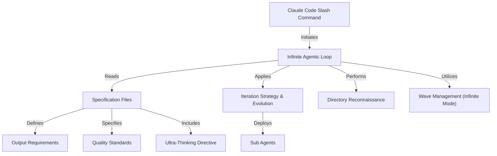

# Tutorial: infinite-agentic-loop

The **Infinite Agentic Loop** is an *experimental project* that uses AI agents within Claude Code
to continuously generate and evolve content, specifically UI components. It allows users to
orchestrate AI to refine designs and create novel outputs over many iterations, acting like a
self-improving creative studio.

**Source Repository:** [https://github.com/disler/infinite-agentic-loop.git](https://github.com/disler/infinite-agentic-loop.git)

## Chapters

1. [Infinite Agentic Loop
](01_infinite_agentic_loop_.md)
2. [Claude Code Slash Command
](02_claude_code_slash_command_.md)
3. [Specification Files
](03_specification_files_.md)
4. [Output Requirements
](04_output_requirements_.md)
5. [Quality Standards
](05_quality_standards_.md)
6. [Ultra-Thinking Directive
](06_ultra_thinking_directive_.md)
7. [Iteration Strategy & Evolution
](07_iteration_strategy___evolution_.md)
8. [Sub Agents
](08_sub_agents_.md)
9. [Directory Reconnaissance
](09_directory_reconnaissance_.md)
10. [Wave Management (Infinite Mode)
](10_wave_management__infinite_mode__.md)

---

Generated by [AI Codebase Knowledge Builder](https://github.com/The-Pocket/Tutorial-Codebase-Knowledge)