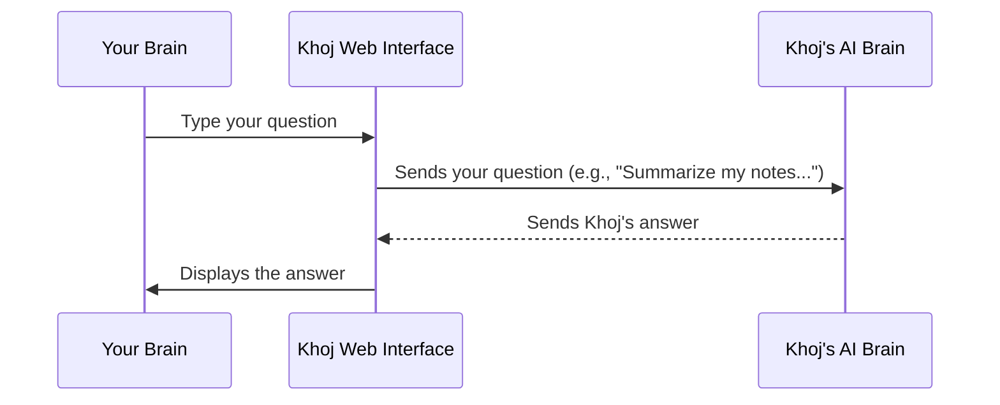

# Chapter 1: Web Interface (Frontend)

Welcome to the exciting world of Khoj! In this first chapter, we're going to explore the part of Khoj you interact with most directly: its Web Interface, also known as the Frontend. Think of it as the "dashboard" or "control panel" of your personal AI, making it super easy to access and manage your second brain.

### What Problem Does the Web Interface Solve?

Imagine Khoj as a super-smart assistant that knows everything about your notes, documents, and even things you've seen online. But how do you *talk* to this assistant? How do you ask it questions, tell it to find something, or even give it new information?

This is exactly what the Web Interface solves! It's the friendly face of Khoj, running right in your web browser. It's built to be the primary way you interact with Khoj, making advanced AI features feel as simple as chatting with a friend.

**Our Goal for this Chapter:** By the end of this chapter, you'll understand how to use Khoj's Web Interface to ask it a question and how your message travels through the system.

### What is the Web Interface?

The Web Interface is the part of Khoj that loads in your browser, like Google Chrome, Firefox, or Safari. It's what you see when you visit [Khoj Cloud](https://app.khoj.dev). It's designed to be intuitive and visually pleasing, offering several key features:

*   **Chat Interface**: This is where you can have conversations with Khoj, asking it questions or giving it commands.
*   **Search Functionality**: A dedicated area to search through all your indexed content, finding specific notes or documents quickly.
*   **Settings & Management**: Places where you can adjust how Khoj works and manage your connected "agents" (which are like specialized helpers within Khoj).

The technical bits: Khoj's Web Interface is built using `Next.js`, which is a popular framework for `React`. Don't worry too much about these names right now; just know that they are modern web technologies that help build fast, interactive, and good-looking websites. It's like using advanced LEGO bricks to build a fancy interactive house on the web!

### How to Use the Web Interface: Asking a Question

Let's walk through our central use case: asking Khoj a question.

1.  **Open Khoj**: First, open your web browser and go to [Khoj Cloud](https://app.khoj.dev) or your self-hosted Khoj server. You'll see a screen that looks like a chat application.
2.  **Type Your Question**: At the bottom of the screen, you'll find a text box. This is your main input area. Type your question there, just like you would in a messaging app. For example, you could type:
    `Summarize my notes on project X.`
3.  **Send Your Message**: Once you've typed your question, you can press the `Enter` key or click the "Send" (up arrow) button.

It's that simple! Khoj will then process your request and display its answer right back in the chat window.

You can also easily add files to your "second brain" through this interface! You can simply drag and drop documents into the chat window, or click the paperclip icon to select files from your computer.

```markdown

```

This makes it easy to quickly provide Khoj with new information it can learn from and help you with.

### Under the Hood: How Your Message Travels

So, what happens when you type a message and hit send? Let's simplify the journey of your question:



1.  **You type and send**: You, the user, type your query into the text box within your web browser.
2.  **Web Interface sends to Backend**: The Khoj Web Interface (the part in your browser) takes your message and sends it over the internet to the Khoj Backend. The Backend is where all the heavy lifting, like processing your AI queries and searching your "second brain" data, happens.
3.  **Backend processes**: The Khoj Backend receives your question, understands it, looks for relevant information (e.g., your notes), and generates an answer.
4.  **Backend sends back**: The Khoj Backend then sends this answer back to your Web Interface.
5.  **Web Interface displays**: Finally, your Web Interface receives the answer and beautifully displays it in the chat window for you to read.

### A Peek at the Code

Let's look at some very simplified code snippets to see how the Web Interface handles user input and displays information. Remember, these are just tiny parts of a much larger system, simplified to show the core idea!

First, the main page (`src/interface/web/app/page.tsx`) sets up the overall structure, including the `ChatInputArea` where you type.

```typescript
// src/interface/web/app/page.tsx
// ... (imports and other setup)

function ChatBodyData(props: ChatBodyDataProps) {
    const [message, setMessage] = useState(""); // This stores what you type
    // ... (other state and logic)

    // This is the component where you type your messages
    return (
        <ChatInputArea
            // ... (other props)
            sendMessage={(message) => setMessage(message)} // When you send, update 'message'
            sendDisabled={processingMessage}
            // ... (more props)
        />
    );
}

// ... (other parts of the Home component)
```
In this snippet, `message` is a placeholder that holds whatever you type. When you click send, the `sendMessage` function is called, which updates this `message` variable.

Now, let's look at the `ChatInputArea` component itself (`src/interface/web/app/components/chatInputArea/chatInputArea.tsx`), which contains the actual text box:

```typescript
// src/interface/web/app/components/chatInputArea/chatInputArea.tsx
// ... (imports and other setup)

export const ChatInputArea = forwardRef<HTMLTextAreaElement, ChatInputProps>((props, ref) => {
    const [message, setMessage] = useState(""); // Stores current input text
    // ... (other state and logic)

    function onSendMessage() {
        if (!message.trim()) return; // Don't send empty messages

        // Call the function provided by the parent component to send the message
        props.sendMessage(message.trim());
        setMessage(""); // Clear the input box after sending
    }

    return (
        <div className="flex-grow flex flex-col w-full gap-1.5 relative">
            <Textarea
                ref={chatInputRef}
                value={message} // Display the current message
                onChange={(e) => setMessage(e.target.value)} // Update 'message' as you type
                // ... (more attributes like placeholder, styling)
            />
            <Button
                // ... (styling and other attributes)
                onClick={onSendMessage} // Call 'onSendMessage' when button clicked
            >
                {/* Send icon */}
            </Button>
        </div>
    );
});

// ... (component export)
```
This simplified code shows the `Textarea` (the text box) where you type. As you type, the `onChange` event updates the `message` variable. When you click the `Button` (the send button), the `onSendMessage` function is called, which then uses `props.sendMessage` to pass your message up to the main part of the application.

After the message is sent, the chat page (`src/interface/web/app/chat/page.tsx`) is responsible for displaying the conversation history and any new incoming messages from Khoj.

```typescript
// src/interface/web/app/chat/page.tsx
// ... (imports and other setup)

function ChatBodyData(props: ChatBodyDataProps) {
    const [messages, setMessages] = useState<StreamMessage[]>([]); // Array of all messages

    // This component renders the full chat history
    return (
        <ChatHistory
            conversationId={conversationId}
            incomingMessages={messages} // Pass the list of messages to ChatHistory
            setIncomingMessages={setMessages} // Allow ChatHistory to update messages
            // ... (other props)
        />
    );
}

// ... (other parts of the Chat component)
```
The `ChatHistory` component then iterates through the `messages` array and displays each one, including your questions and Khoj's answers.

Finally, for search (`src/interface/web/app/search/page.tsx`), there's a dedicated input field:

```typescript
// src/interface/web/app/search/page.tsx
// ... (imports and other setup)

export default function Search() {
    const [searchQuery, setSearchQuery] = useState(""); // Stores what you type in search
    const [searchResults, setSearchResults] = useState<SearchResult[] | null>(null); // Stores results
    // ... (other state and logic)

    function handleSearchInputChange(value: string) {
        setSearchQuery(value); // Update search query as you type
        // ... (logic to trigger search after a small delay)
    }

    function search() {
        if (!searchQuery.trim()) return; // Don't search empty query
        // ... (logic to fetch search results from the backend)
        setSearchResultsLoading(true);
        fetch(`/api/search?q=${encodeURIComponent(searchQuery)}`)
            .then((response) => response.json())
            .then((data) => {
                setSearchResults(data); // Update search results
                setSearchResultsLoading(false);
            });
    }

    return (
        <div>
            <Input
                type="search"
                placeholder="Search Documents"
                value={searchQuery}
                onChange={(e) => handleSearchInputChange(e.currentTarget.value)}
                onKeyDown={(e) => {
                    if (e.key === "Enter") {
                        search(); // Search on Enter key
                    }
                }}
            />
            {/* Display searchResults here */}
            {searchResults && searchResults.length > 0 && (
                <div className="mt-4">
                    {searchResults.map((result, index) => (
                        // Render each search result as a Note component
                        <Note key={result["corpus-id"]} note={result} />
                    ))}
                </div>
            )}
        </div>
    );
}
```
Here, the `Input` component is where you type your search query. When you type, `handleSearchInputChange` updates `searchQuery`. Pressing `Enter` or clicking the "Find" button triggers the `search` function, which fetches results from the backend (`/api/search`) and updates `searchResults` to display them.

### Conclusion

You've just completed your first deep dive into Khoj! You learned that the Web Interface (Frontend) is your primary way to interact with Khoj through your web browser. It's the "dashboard" where you can chat, search, and manage your personal AI. You also got a peek at how your messages travel from your browser to Khoj's "brain" (the Backend) and back again.

Next, we'll explore how Khoj knows who you are and keeps your information secure.

[Chapter 2: KhojUser & Authentication](02_khojuser___authentication_.md)

---

Generated by [AI Codebase Knowledge Builder](https://github.com/The-Pocket/Tutorial-Codebase-Knowledge)