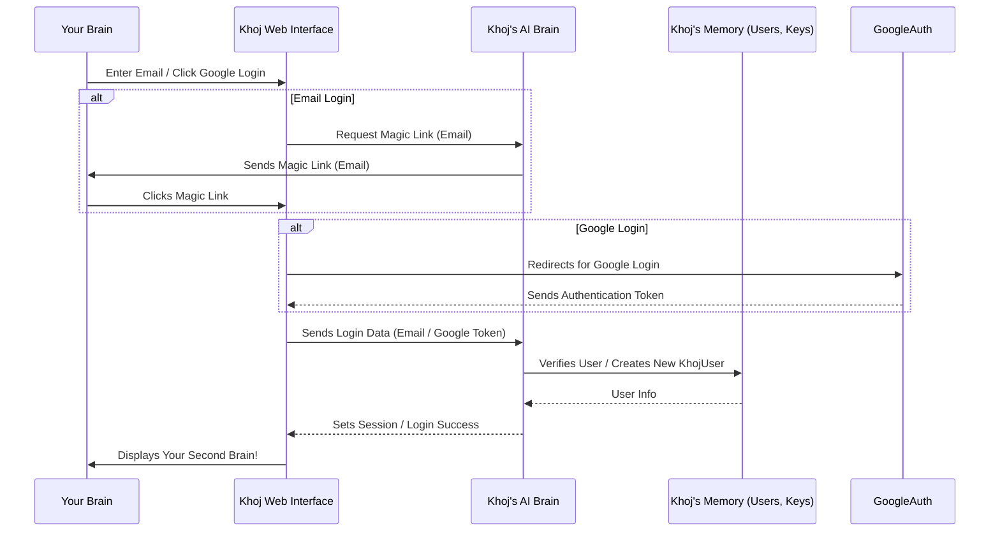

# Chapter 2: KhojUser & Authentication

In [Chapter 1: Web Interface (Frontend)](01_web_interface__frontend__.md), we learned how to interact with Khoj through your web browser, typing questions and seeing answers appear. But what if you have private notes, personal conversations, or want to make sure only *you* can access your second brain? This is where KhojUser & Authentication comes in!

### What Problem Does KhojUser & Authentication Solve?

Imagine Khoj as your super-smart personal assistant, holding all your private thoughts, documents, and conversations. You wouldn't want just anyone to walk up to your assistant and start asking questions or digging through your data, right?

KhojUser & Authentication is like the **ID card and security gate** for your personal AI brain. It ensures that:
*   Only **you** (or people you explicitly authorize) can access your private data.
*   Your settings and preferences are **saved just for you**.
*   You can securely **log in** from different devices or applications.

**Our Goal for this Chapter:** By the end of this chapter, you'll understand what a "KhojUser" is, how to log in to Khoj, and how the system keeps your access secure.

### What is a KhojUser?

A `KhojUser` is simply **you** within the Khoj system. It's your unique identity. When you create an account, Khoj creates a `KhojUser` profile for you. This profile stores basic information like your email and username, and it's linked to all your indexed content, conversations, and custom settings.

Think of it as your digital passport for your personal AI.

### How Does Authentication Work?

Authentication is the process of Khoj **verifying your identity**. It's how Khoj confirms that the person trying to access the system is actually you. Khoj offers a few friendly ways to do this:

1.  **Email (Magic Link)**: You enter your email, and Khoj sends you a special link. Clicking this link logs you in automatically, without needing a password. It's like being handed a temporary, secure key!
2.  **Google Account**: You can sign in using your existing Google account. This is super convenient as Google handles the identity verification for you.
3.  **API Keys**: For other applications (like the Khoj Desktop app or plugins for tools like Emacs or Obsidian), you can generate a special "API Key." This key is like a secret token that these applications use to prove they are authorized by *you* to access your Khoj data.

### How to Use KhojUser & Authentication: Logging In

Let's walk through the most common way to use KhojUser & Authentication: logging in.

1.  **Go to Khoj**: Open your web browser and go to [Khoj Cloud](https://app.khoj.dev) (or your self-hosted Khoj server).
2.  **Choose Your Login Method**: You'll see options to sign in, often including "Continue with Google" or an email input for a "magic link."
    *   **Using Google**: Click "Continue with Google," select your Google account, and follow the prompts. You'll be redirected back to Khoj.
    *   **Using Email**: Enter your email address and click "Send Magic Link." Check your email inbox for a link from Khoj. Click that link, and you'll be logged in!

```markdown

```

Once logged in, you can access all your private data and conversations.

#### Managing API Keys for Other Khoj Clients

If you want to connect other Khoj clients (like the desktop application), you'll need an API key:

1.  **Log In**: First, log into the Khoj Web Interface as described above.
2.  **Go to Settings**: Look for a "Settings" or "Profile" area (often a gear icon or your profile picture).
3.  **Generate API Key**: Within settings, there will be an option to manage API keys. You can typically give your key a name (e.g., "My Desktop") and generate it. Copy this key – you'll usually only see it once!

```markdown
```json
{
  "token": "kk-your-secret-api-key-here",
  "name": "My Desktop"
}
```
This is an example of what an API key might look like when generated. You would then copy `kk-your-secret-api-key-here` into your other Khoj applications.

### Under the Hood: How Authentication Works

Let's peek behind the curtain to see what happens when you log in or generate an API key.

#### The Login Flow (Simplified)

When you try to log in via the web interface:



This diagram shows that your web browser talks to the Khoj Backend, which then talks to Khoj's Database to verify who you are.

#### A Peek at the Code

Khoj uses a few key components to handle users and authentication.

First, let's see how the web interface `src/interface/web/app/common/auth.ts` checks if you're logged in:

```typescript
// src/interface/web/app/common/auth.ts
// ... imports
export interface UserProfile {
    email: string;
    username: string;
    photo: string;
    // ... other user details
}

const fetcher = (url: string) =>
    window
        .fetch(url)
        .then((res) => res.json())
        .catch((err) => console.warn(err));

export function useAuthenticatedData() {
    const { data, error, isLoading } = useSWR<UserProfile>("/api/v1/user", fetcher, {
        revalidateOnFocus: false,
    });

    if (data?.detail === "Forbidden") {
        return { data: null, error: "Forbidden", isLoading: false };
    }

    return { data, error, isLoading };
}
```
This `useAuthenticatedData` function is a "hook" that web pages use to see if there's a logged-in user. It makes a request to `/api/v1/user` on the Khoj Backend. If it gets user data back, it means you're authenticated!

Now, on the Backend side, in `src/khoj/routers/auth.py`, you'll find the logic for logging in. Here's a simplified look at the magic link login:

```python
# src/khoj/routers/auth.py
# ... imports and setup

@auth_router.post("/magic")
async def login_magic_link(request: Request, form: MagicLinkForm):
    # This checks if the email is valid and finds or creates a user
    user, is_new = await aget_or_create_user_by_email(form.email, check_deliverability=False)

    if not user:
        raise HTTPException(status_code=404, detail="Invalid email address.")

    # A unique code is generated for the magic link
    unique_id = user.email_verification_code
    # And then an email is sent with this code
    await send_magic_link_email(user.email, unique_id, request.base_url)

    return Response(status_code=200)

@auth_router.get("/magic")
async def sign_in_with_magic_link(request: Request, code: str, email: str):
    # When you click the magic link, this endpoint is called
    user, code_is_expired = await aget_user_validated_by_email_verification_code(code, email)

    if user and not code_is_expired:
        # If the code is valid and not expired, the user's session is created
        request.session["user"] = {"email": user.email}
        return RedirectResponse(url="/") # Redirect to the main page
    return Response(status_code=401) # Login failed
```
The first snippet handles sending the magic link email, and the second snippet verifies the code from the magic link and logs you in by setting your "session" (which is like a temporary ID card for your browser).

For API keys, the `generate_token` function is used:

```python
# src/khoj/routers/auth.py
# ...
@auth_router.post("/token")
@requires(["authenticated"], redirect="login_page")
async def generate_token(request: Request, token_name: Optional[str] = None):
    "Generate API token for given user"
    token = await acreate_khoj_token(user=request.user.object, name=token_name)
    return {
        "token": token.token,
        "name": token.name,
    }
```
This code, when you're already logged in (`@requires(["authenticated"])`), generates a new `KhojApiUser` (your API key) in the database and returns it.

At the heart of the backend's authentication is `UserAuthenticationBackend` in `src/khoj/configure.py`. This is where Khoj decides if an incoming request (from your browser or a client app) is authenticated.

```python
# src/khoj/configure.py
# ... imports

class UserAuthenticationBackend(AuthenticationBackend):
    async def authenticate(self, request: HTTPConnection):
        # 1. Check if user is logged in via browser session
        current_user = request.session.get("user")
        if current_user and current_user.get("email"):
            # ... fetches user from database ...
            return AuthCredentials(["authenticated"]), AuthenticatedKhojUser(user)

        # 2. Check for API key (Bearer token from Desktop/Emacs/Obsidian)
        if len(request.headers.get("Authorization", "").split("Bearer ")) == 2:
            bearer_token = request.headers["Authorization"].split("Bearer ")[1]
            # ... fetches user linked to this token from database ...
            return AuthCredentials(["authenticated"]), AuthenticatedKhojUser(user_with_token.user)

        # 3. Check for Whatsapp client (uses client_id and phone_number)
        client_id = request.query_params.get("client_id")
        if client_id:
            # ... complex logic to authenticate by phone number and client application ...
            return AuthCredentials(["authenticated"]), AuthenticatedKhojUser(user, client_application)

        # If none of the above, user is unauthenticated
        return AuthCredentials(), UnauthenticatedUser()
```
This `authenticate` method is called for almost every incoming request. It checks multiple places to see if you're logged in: your browser's "session" (for web logins), the "Authorization" header for API keys, or specific query parameters for other clients. If it finds a valid credential, it tells Khoj that you are an authenticated user.

Behind these backend functions, there are models (like blueprints for data) defined in `src/khoj/database/models/__init__.py`.

```python
# src/khoj/database/models/__init__.py
# ... imports

class KhojUser(AbstractUser):
    uuid = models.UUIDField(default=uuid.uuid4, editable=False)
    phone_number = PhoneNumberField(null=True, default=None, blank=True)
    verified_email = models.BooleanField(default=False)
    email_verification_code = models.CharField(max_length=200, null=True, default=None, blank=True)
    # ... more fields
```
The `KhojUser` model stores your core information. It's a standard Django user model with some extra Khoj-specific fields like `uuid` (a unique ID) and `email_verification_code`.

```python
# src/khoj/database/models/__init__.py
# ...

class KhojApiUser(models.Model):
    """User issued API tokens to authenticate Khoj clients"""
    user = models.ForeignKey(KhojUser, on_delete=models.CASCADE)
    token = models.CharField(max_length=50, unique=True)
    name = models.CharField(max_length=50)
    accessed_at = models.DateTimeField(null=True, default=None)
```
The `KhojApiUser` model stores the API keys you generate, linking them back to your `KhojUser` profile.

Finally, adapter functions in `src/khoj/database/adapters/__init__.py` help interact with these models easily:

```python
# src/khoj/database/adapters/__init__.py
# ... imports

async def aget_or_create_user_by_email(input_email: str, check_deliverability=False) -> tuple[KhojUser, bool]:
    # Normalizes email and either finds an existing user or creates a new one.
    user, is_new = await KhojUser.objects.filter(email=email).aupdate_or_create(
        defaults={"username": email, "email": email}
    )
    # Sets up a magic link code and its expiry
    user.email_verification_code = f"{secrets.randbelow(int(1e6)):06}"
    user.email_verification_code_expiry = datetime.now(tz=timezone.utc) + timedelta(minutes=5)
    await user.asave()
    return user, is_new

async def acreate_khoj_token(user: KhojUser, name=None):
    "Create Khoj API key for user"
    token = f"kk-{secrets.token_urlsafe(32)}" # Generates a random, secure token
    name = name or f"{generate_random_name().title()}"
    return await KhojApiUser.objects.acreate(token=token, user=user, name=name)
```
These adapter functions are like helpful librarians that know how to efficiently find, create, and update information about users and their tokens in Khoj's database.

### Conclusion

You've now learned about the `KhojUser` and how authentication keeps your personal AI brain secure. You understand that Khoj uses various methods like email magic links, Google accounts, and API keys to verify your identity. This foundation of identity and security is crucial before we dive into how Khoj stores your actual data.

Next, we'll explore the concept of "Entry," which is how Khoj stores and indexes all your content, making it searchable and useful.

[Chapter 3: Entry (Indexed Content)](03_entry__indexed_content__.md)

---

Generated by [AI Codebase Knowledge Builder](https://github.com/The-Pocket/Tutorial-Codebase-Knowledge)