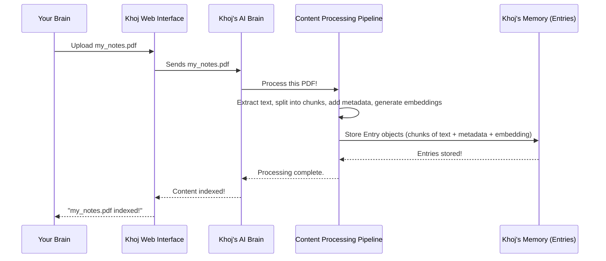

# Chapter 3: Entry (Indexed Content)

In [Chapter 2: KhojUser & Authentication](02_khojuser___authentication_.md), you learned how Khoj knows *who* you are and keeps your personal second brain secure. Now that we know you're you, the next big question is: *what* exactly does Khoj store from your vast collection of documents and notes? How does it actually "understand" and "remember" the content you feed it?

### What Problem Does "Entry" Solve?

Imagine you have a huge digital library: PDFs, Markdown notes, web pages, even conversations. You want Khoj to be able to answer questions like, "Summarize my notes on quantum physics" or "Find that paragraph about project X from my meeting notes."

If Khoj just stored entire files as one giant blob, it would be like trying to find a specific sentence in a massive book without an index. It would be slow and inefficient.

This is where the concept of an `Entry` comes in! An `Entry` is the **fundamental unit of information** that Khoj stores and searches. Think of it as Khoj's way of **breaking down your large documents into smaller, meaningful, and searchable chunks**. It's like taking a big book and turning it into a collection of well-indexed flashcards, each representing a key idea or paragraph.

**Our Goal for this Chapter:** By the end of this chapter, you'll understand what an `Entry` is, what pieces of information it holds, and how Khoj uses it to process your content for later searching.

### What is an Entry?

An `Entry` is essentially a **smart chunk of text** extracted from your documents. When you upload a PDF, a Markdown file, or even have a conversation, Khoj doesn't just save the whole thing. Instead, it processes the content and turns it into many smaller `Entry` objects.

Each `Entry` is designed to be self-contained and rich with information, allowing Khoj to precisely understand and retrieve it later. Here are the key characteristics of an `Entry`:

*   **Text/Data (Raw & Compiled)**: This is the actual piece of content. For example, a single paragraph from your PDF or a section from your Markdown file. Khoj often keeps two versions:
    *   `raw`: The original text (sometimes with formatting).
    *   `compiled`: A cleaned-up, optimized version of the text, ready for the AI to process.
*   **Unique ID**: Every `Entry` gets its own special ID, like a barcode, so Khoj can always find and refer to it uniquely.
*   **Metadata**: This is "data about data." For an `Entry`, metadata includes things like:
    *   The original `file_name` it came from.
    *   The `file_type` (e.g., PDF, Markdown, Plaintext).
    *   The `file_source` (e.g., "computer," "notion," "github").
    *   A `heading` if it came from a section with one.
    *   A `hashed_value` to quickly check if the content has changed.
*   **Embedding**: This is arguably the most powerful part! An embedding is a **numerical representation of the `Entry`'s meaning**. Think of it as a special code that captures the "topic" or "idea" of that chunk of text. Khoj uses these numerical embeddings to perform incredibly smart searches (which we'll explore in [Chapter 5: Search & Embeddings](05_search___embeddings_.md)).

### How to Use Entries (Indirectly)

You don't directly "create" or "manage" `Entry` objects yourself. Instead, you interact with them indirectly by **uploading documents or connecting content sources**. Khoj then does the heavy lifting of breaking down your content into `Entry` objects behind the scenes.

Let's revisit our central use case: asking Khoj a question about your content.

1.  **Upload a File**: You might drag and drop a PDF file named `my_notes.pdf` into the Khoj chat interface (as learned in [Chapter 1: Web Interface (Frontend)](01_web_interface__frontend__.md)).
    ```markdown
    
    ```
2.  **Khoj Processes**: Khoj's internal systems take this `my_notes.pdf` and begin to:
    *   Extract all the text.
    *   Break that text into many smaller `Entry` chunks.
    *   For each chunk, it generates an embedding, assigns a unique ID, and records metadata like `file_name: my_notes.pdf` and `file_type: pdf`.
    *   All these `Entry` objects are then stored in Khoj's database.
3.  **Ask a Question**: Later, you ask Khoj: "Summarize my notes on quantum physics."
4.  **Khoj Searches Entries**: Khoj doesn't re-read the entire PDF. Instead, it quickly searches through all the `Entry` objects it created. Using the embeddings, it finds the *most relevant* `Entry` chunks that are about "quantum physics" and uses them to answer your question.

This process of breaking down content into `Entry` objects is what makes Khoj fast, efficient, and intelligent.

### Under the Hood: The Journey of an Entry

Let's trace what happens when you upload a file and it becomes a collection of `Entry` objects.

#### Step-by-Step Walkthrough

1.  **You Upload a File**: You drag `my_notes.pdf` onto the Khoj Web Interface.
2.  **Web Interface Sends to Backend**: The Web Interface sends the file data to Khoj's Backend.
3.  **Backend Initiates Processing**: The Backend receives the file and hands it over to the "Content Processing Pipeline" (more on this in [Chapter 4: Content Processing Pipeline](04_content_processing_pipeline_.md)).
4.  **Content Processing**: This pipeline:
    *   **Extracts Text**: Converts the `my_notes.pdf` into plain text.
    *   **Splits into Chunks**: Divides the plain text into smaller, manageable chunks. Each chunk is destined to become an `Entry`.
    *   **Generates Embeddings & Metadata**: For each chunk, it calculates its numerical `embedding` and gathers all the necessary `metadata` (like `file_name`, `file_type`, etc.). It also assigns a `unique ID` and `hashed_value`.
5.  **Storing Entries**: These fully formed `Entry` objects are then stored in Khoj's database, ready for quick retrieval.
6.  **Confirmation**: Khoj confirms the successful indexing back to the Web Interface.

Here's a simplified sequence diagram:



#### A Peek at the Code

Let's look at how `Entry` is defined and used in the code.

First, the `Entry` model itself, found in `src/khoj/database/models/__init__.py`. This defines the blueprint for what an `Entry` looks like in Khoj's database:

```python
# src/khoj/database/models/__init__.py
# ... (imports and other models)

class Entry(DbBaseModel): # DbBaseModel provides created_at/updated_at
    class EntryType(models.TextChoices):
        IMAGE = "image"
        PDF = "pdf"
        MARKDOWN = "markdown"
        # ... other types

    class EntrySource(models.TextChoices):
        COMPUTER = "computer"
        NOTION = "notion"
        # ... other sources

    user = models.ForeignKey(KhojUser, on_delete=models.CASCADE, default=None, null=True, blank=True)
    embeddings = VectorField(dimensions=None) # This stores the numerical embedding!
    raw = models.TextField() # Original chunk of text
    compiled = models.TextField() # Cleaned/optimized chunk of text
    heading = models.CharField(max_length=1000, default=None, null=True, blank=True)
    file_source = models.CharField(max_length=30, choices=EntrySource.choices, default=EntrySource.COMPUTER)
    file_type = models.CharField(max_length=30, choices=EntryType.choices, default=EntryType.PLAINTEXT)
    file_path = models.CharField(max_length=400, default=None, null=True, blank=True)
    file_name = models.CharField(max_length=400, default=None, null=True, blank=True)
    url = models.URLField(max_length=400, default=None, null=True, blank=True)
    hashed_value = models.CharField(max_length=100) # Used to check if content changed
    corpus_id = models.UUIDField(default=uuid.uuid4, editable=False) # Unique ID for this entry
    # ... (other fields like search_model, file_object)

    def save(self, *args, **kwargs):
        # ... (validation for user/agent association)
```
This simplified snippet shows the `Entry` class, which uses Django's `models.Model` to define database fields. Notice `embeddings` (for the numerical representation), `raw` and `compiled` for the text, and various metadata fields like `file_source`, `file_type`, `file_name`, and `corpus_id` (the unique ID).

When a file is uploaded, the `indexer` function in `src/khoj/routers/api_content.py` is called. It receives the uploaded files and eventually calls `configure_content` (which leads to the Content Processing Pipeline described above):

```python
# src/khoj/routers/api_content.py
# ... (imports and other functions)

async def indexer(
    request: Request,
    files: list[UploadFile],
    t: Optional[Union[state.SearchType, str]] = state.SearchType.All,
    regenerate: bool = False,
    client: Optional[str] = None,
    # ... (other parameters)
):
    user = request.user.object
    # ... (prepare files for indexing)
    indexer_input = IndexerInput(
        org=index_files["org"],
        markdown=index_files["markdown"],
        pdf=index_files["pdf"], # Our my_notes.pdf would be here!
        # ... (other file types)
    )
    # ... (configuration setup)

    success = await loop.run_in_executor(
        None,
        configure_content, # This function orchestrates the content processing!
        user,
        indexer_input.model_dump(),
        regenerate,
        t,
    )
    # ... (handle success/failure, update telemetry)
```
The `indexer` function acts as the entry point for file uploads. It collects the uploaded files (like our `my_notes.pdf`) and passes them to `configure_content`, which then orchestrates the entire process of turning them into `Entry` objects.

Inside the Content Processing Pipeline, components like `TextToEntries` (found in `src/khoj/processor/content/text_to_entries.py`) are responsible for splitting the raw text into smaller entries and generating their embeddings:

```python
# src/khoj/processor/content/text_to_entries.py
# ... (imports and other methods)

class TextToEntries(ABC):
    # ... (initialization)

    @staticmethod
    def split_entries_by_max_tokens(
        entries: List[Entry], max_tokens: int = 256, max_word_length: int = 500, raw_is_compiled: bool = False
    ) -> List[Entry]:
        "Split entries if compiled entry length exceeds the max tokens supported by the ML model."
        chunked_entries: List[Entry] = []
        for entry in entries:
            # Uses RecursiveCharacterTextSplitter to intelligently break text
            text_splitter = RecursiveCharacterTextSplitter(
                chunk_size=max_tokens,
                separators=["\n\n", "\n", "!", "?", ".", " ", "\t", ""],
                # ... (more splitting logic)
            )
            chunked_entry_chunks = text_splitter.split_text(entry.compiled)
            corpus_id = uuid.uuid4() # A unique ID for related chunks from the same source

            for chunk_index, compiled_entry_chunk in enumerate(chunked_entry_chunks):
                # ... (prepend heading, clean text)
                chunked_entries.append(
                    Entry(
                        compiled=compiled_entry_chunk,
                        raw=entry.raw,
                        heading=entry.heading,
                        file=entry.file,
                        corpus_id=corpus_id, # Link chunks from same original content
                    )
                )
        return chunked_entries

    def update_embeddings(
        self,
        user: KhojUser,
        current_entries: List[Entry],
        file_type: str,
        file_source: str,
        key="compiled",
        # ... (other parameters)
    ):
        # ... (hashing and identifying new entries)
        embeddings = []
        model = get_default_search_model()
        # This is where the magic happens: convert text to numerical embeddings!
        embeddings += self.embeddings_model[model.name].embed_documents(data_to_embed)

        # ... (create DbEntry objects and save to database)
```
The `split_entries_by_max_tokens` method takes raw text and cleverly breaks it down into smaller, manageable `Entry` chunks, ensuring they're not too long for the AI model. The `update_embeddings` method then takes these prepared text chunks and converts them into their numerical `embeddings` using the `embeddings_model`, before saving them into the database.

Finally, helper functions in `src/khoj/database/adapters/__init__.py` like `EntryAdapters.search_with_embeddings` are used when you ask Khoj a question. They efficiently query the database for the most relevant `Entry` objects based on your search (leveraging those embeddings!):

```python
# src/khoj/database/adapters/__init__.py
# ... (imports and other adapters)

class EntryAdapters:
    # ... (other static methods)

    @staticmethod
    def search_with_embeddings(
        raw_query: str,
        embeddings: Tensor, # Your query's embedding!
        user: KhojUser,
        max_results: int = 10,
        file_type_filter: str = None,
        max_distance: float = math.inf,
        agent: Agent = None,
    ):
        # ... (filter by user/agent, text filters)
        relevant_entries = Entry.objects.filter(owner_filter).annotate(
            distance=CosineDistance("embeddings", embeddings) # Calculates similarity using embeddings
        )
        relevant_entries = relevant_entries.filter(distance__lte=max_distance) # Filters out less relevant results
        # ... (more filtering and sorting)
        return relevant_entries[:max_results]

    @staticmethod
    @arequire_valid_user
    async def adelete_entry_by_file(user: KhojUser, file_path: str):
        # This is how Khoj deletes all entries associated with a specific file
        return await Entry.objects.filter(user=user, file_path=file_path).adelete()

    @staticmethod
    @require_valid_user
    def get_unique_file_types(user: KhojUser):
        # Helps retrieve what types of files you've indexed (e.g., pdf, markdown)
        return Entry.objects.filter(user=user).values_list("file_type", flat=True).distinct()

    # ... (other methods for managing entries)
```
The `search_with_embeddings` function is called during search. It takes your query's embedding and compares it to the `embeddings` of all stored `Entry` objects to find the ones that are semantically (meaningfully) closest. `adelete_entry_by_file` and `get_unique_file_types` are examples of how Khoj manages these `Entry` objects in its database.

### Conclusion

You've just uncovered the core building blocks of your Khoj second brain: `Entry` objects. You learned that these are intelligent chunks of your content, complete with raw and compiled text, unique IDs, rich metadata, and powerful numerical `embeddings`. Understanding Entries is key to appreciating how Khoj processes, stores, and intelligently retrieves information from your documents, making your personal AI truly smart and searchable.

Next, we'll dive deeper into the "Content Processing Pipeline" to see the full journey a document takes from being uploaded to becoming a rich collection of `Entry` objects.

[Chapter 4: Content Processing Pipeline](04_content_processing_pipeline_.md)

---

Generated by [AI Codebase Knowledge Builder](https://github.com/The-Pocket/Tutorial-Codebase-Knowledge)