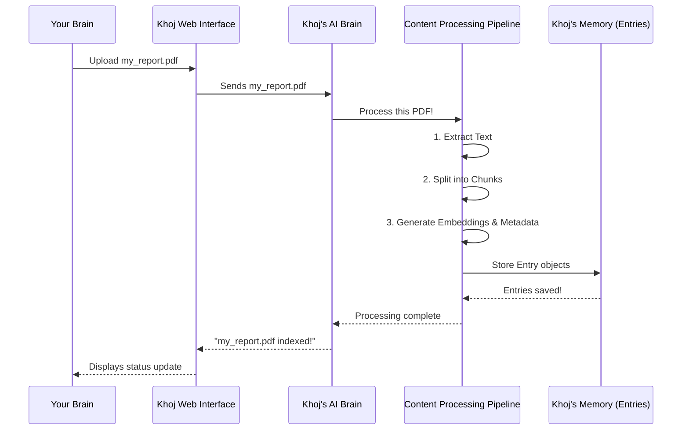

# Chapter 4: Content Processing Pipeline

In [Chapter 3: Entry (Indexed Content)](03_entry__indexed_content__.md), we learned that Khoj breaks down your large documents into smaller, intelligent chunks called `Entry` objects. These `Entry` objects, with their text, metadata, and special `embeddings`, are what make your content searchable. But how does Khoj *do* all this? How does a raw PDF or Markdown file magically transform into these smart `Entry` objects?

### What Problem Does the Content Processing Pipeline Solve?

Imagine you have a messy stack of physical documents on your desk: a long PDF research paper, some handwritten notes, and a printout of a webpage. You want to be able to quickly find specific information within them, perhaps asking, "What were the key findings in the quantum physics paper?"

If you just stuffed them all into a box, finding anything later would be a nightmare! You'd have to read through everything each time.

This is exactly the problem the **Content Processing Pipeline** solves for your digital documents! It's like a highly efficient **digital librarian** who takes your raw, unorganized files (like PDFs, Markdown notes, or Org-mode files), carefully processes them, and then neatly organizes and categorizes every important piece of information so it can be easily found later.

**Our Goal for this Chapter:** By the end of this chapter, you'll understand the steps Khoj takes behind the scenes to transform your raw files into searchable `Entry` objects, making your "second brain" truly intelligent.

### What is the Content Processing Pipeline?

The Content Processing Pipeline is a series of automated steps Khoj follows whenever you feed it a new document. Its main job is to take raw content and turn it into those valuable `Entry` objects we discussed.

It primarily performs three core operations:

1.  **Extract Text**: First, Khoj needs to read the actual words from your file. If it's a PDF, it needs to get the text out of the PDF format. If it's a Markdown file, it reads the Markdown text. This is like the librarian *reading* your document.
2.  **Split into Chunks**: Large documents are like long books. It's hard to find a specific sentence in a giant book. So, Khoj intelligently breaks down the extracted text into smaller, more manageable pieces – these are the *chunks* that will become individual `Entry` objects. This is like the librarian breaking a big book into smaller, topic-focused sections or flashcards.
3.  **Prepare for Indexing**: For each small chunk, Khoj does the final preparation. It generates that special numerical `embedding` (the "meaning code") and attaches all the useful `metadata` (like the original filename, file type, etc.). This makes each `Entry` ready to be stored and quickly searched. This is like the librarian carefully labeling each flashcard with its topic and where it came from, and adding a secret code that captures its main idea.

### How to Use the Content Processing Pipeline (Indirectly)

You don't directly "start" or "control" the Content Processing Pipeline. It works automatically in the background! Your interaction is simple:

1.  **Upload Your Files**: As we learned in [Chapter 1: Web Interface (Frontend)](01_web_interface__frontend__.md), you simply drag and drop your files (PDFs, Markdown, etc.) into the Khoj Web Interface.
    ```markdown
    
    ```
2.  **Khoj Handles the Rest**: Once you upload, Khoj's Content Processing Pipeline springs into action, performing the extract, split, and prepare steps automatically. You'll get a notification when your content is successfully indexed!

This "set it and forget it" approach makes Khoj incredibly easy to use.

### Under the Hood: The Journey of a Document

Let's trace the path of a document, say a `my_report.pdf`, through the Content Processing Pipeline.

#### Step-by-Step Walkthrough

1.  **You Upload `my_report.pdf`**: You drag and drop `my_report.pdf` into the Khoj chat window.
2.  **Web Interface Sends File**: The Khoj Web Interface sends your PDF file to the Khoj Backend.
3.  **Backend Receives & Delegates**: The Khoj Backend receives the file and tells the Content Processing Pipeline, "Hey, process this PDF!"
4.  **Content Pipeline Processes**: This is where the magic happens:
    *   **Extraction**: The pipeline uses specialized tools to open the PDF and extract all its text content.
    *   **Chunking**: It then takes this extracted text and intelligently breaks it down into smaller, meaningful chunks. For example, a 20-page PDF might become 50-100 smaller chunks. Each chunk is now ready to become an `Entry`.
    *   **Preparation**: For each chunk, Khoj calculates its unique `embedding` (numerical representation of its meaning) and attaches all relevant `metadata` (like the original filename `my_report.pdf`, file type `pdf`, etc.).
5.  **Storing `Entry` Objects**: These fully formed `Entry` objects are then saved into Khoj's database, ready to be searched.
6.  **Confirmation**: Khoj sends a message back to your Web Interface, confirming that `my_report.pdf` has been successfully indexed.

Here's a simplified sequence diagram of this process:



#### A Peek at the Code

Let's look at some simplified code snippets to see how this pipeline is built.

When you upload a file, the `indexer` function in `src/khoj/routers/api_content.py` is called. This is the entry point for your files:

```python
# src/khoj/routers/api_content.py
# ... imports and setup

async def indexer(
    request: Request,
    files: list[UploadFile], # This is your uploaded file, like my_report.pdf!
    # ... other parameters
):
    user = request.user.object
    index_files: Dict[str, Dict[str, str]] = {
        "pdf": {}, # Your PDF will go here
        # ... other file types
    }
    for file in files: # Loop through uploaded files
        file_data = get_file_content(file) # Get content and type
        if file_data.file_type in index_files:
            # Store content for its type (e.g., pdf's content in index_files["pdf"])
            index_files[file_data.file_type][file_data.name] = file_data.content
        # ... (error handling for unsupported files)

    indexer_input = IndexerInput(pdf=index_files["pdf"]) # Prepare input for processing
    
    # This function orchestrates the actual content processing
    success = await loop.run_in_executor(
        None, configure_content, user, indexer_input.model_dump(), # Pass input to pipeline
        regenerate, t,
    )
    # ... (handle success/failure)
```
This `indexer` function first takes your uploaded `files`, determines their type, and then prepares them to be sent to `configure_content`. `configure_content` is the conductor of our Content Processing Pipeline.

Next, within `configure_content` (which is a helper function that orchestrates the entire process, defined in `src/khoj/routers/helpers.py`), different "processors" are called based on the file type. For a PDF, `PdfToEntries` (from `src/khoj/processor/content/pdf/pdf_to_entries.py`) is used:

```python
# src/khoj/processor/content/pdf/pdf_to_entries.py
# ... imports

class PdfToEntries(TextToEntries):
    def __init__(self):
        super().__init__()

    def process(self, files: dict[str, bytes], user: KhojUser, regenerate: bool = False) -> Tuple[int, int]:
        # Step 1: Extract text from PDF files
        file_to_text_map, current_entries = PdfToEntries.extract_pdf_entries(files)

        # Step 2: Split extracted entries into smaller chunks
        current_entries = self.split_entries_by_max_tokens(current_entries, max_tokens=256)

        # Step 3: Generate embeddings and save Entry objects to database
        num_new_embeddings, num_deleted_embeddings = self.update_embeddings(
            user,
            current_entries,
            DbEntry.EntryType.PDF,
            DbEntry.EntrySource.COMPUTER,
            "compiled",
            # ... other parameters
        )
        return num_new_embeddings, num_deleted_embeddings

    @staticmethod
    def extract_text(pdf_file_content: bytes):
        """Extract text from a single PDF file (raw bytes)."""
        # Uses an external library (PyMuPDFLoader) to read the PDF and get text
        loader = PyMuPDFLoader(tmpf.name) # Simplified: this happens in a temp file
        pdf_entries_per_file = loader.load()
        # Clean text by removing null bytes and invalid characters
        pdf_entry_by_pages = [PdfToEntries.clean_text(page.page_content) for page in pdf_entries_per_file]
        return pdf_entry_by_pages
```
The `process` method within `PdfToEntries` clearly shows our three pipeline steps: `extract_pdf_entries` (for extraction), `split_entries_by_max_tokens` (for chunking), and `update_embeddings` (for preparing/indexing). The `extract_text` static method is the core of the extraction step for PDFs. Similar classes exist for Markdown (`MarkdownToEntries`) and Org-mode files (`OrgToEntries`).

The crucial `split_entries_by_max_tokens` and `update_embeddings` methods are defined in `src/khoj/processor/content/text_to_entries.py`, as they are common to most text-based files.

First, the splitting:

```python
# src/khoj/processor/content/text_to_entries.py
# ... imports

class TextToEntries(ABC):
    # ... (other methods)

    @staticmethod
    def split_entries_by_max_tokens(
        entries: List[Entry], max_tokens: int = 256, max_word_length: int = 500, raw_is_compiled: bool = False
    ) -> List[Entry]:
        "Split entries if compiled entry length exceeds the max tokens supported by the ML model."
        chunked_entries: List[Entry] = []
        for entry in entries:
            if is_none_or_empty(entry.compiled): continue

            # This intelligently breaks text into smaller chunks
            text_splitter = RecursiveCharacterTextSplitter(
                chunk_size=max_tokens,
                separators=["\n\n", "\n", "!", "?", ".", " ", "\t", ""], # Defines how to split
                # ... (more splitting logic)
            )
            chunked_entry_chunks = text_splitter.split_text(entry.compiled)
            corpus_id = uuid.uuid4() # Unique ID for this set of related chunks

            for chunk_index, compiled_entry_chunk in enumerate(chunked_entry_chunks):
                # Create a new Entry object for each chunk
                chunked_entries.append(
                    Entry(
                        compiled=compiled_entry_chunk,
                        raw=entry.raw,
                        heading=entry.heading,
                        file=entry.file,
                        corpus_id=corpus_id, # Link back to the original content
                    )
                )
        return chunked_entries
```
This `split_entries_by_max_tokens` method takes the long text extracted from your document and, using a `RecursiveCharacterTextSplitter`, cleverly breaks it down into smaller, defined `Entry` chunks. It prioritizes splitting by paragraphs, then sentences, then words, to keep chunks as meaningful as possible.

Finally, the `update_embeddings` method generates the numerical `embeddings` and saves the `Entry` objects:

```python
# src/khoj/processor/content/text_to_entries.py
# ... imports

class TextToEntries(ABC):
    # ... (other methods)

    def update_embeddings(
        self,
        user: KhojUser,
        current_entries: List[Entry], # These are the chunks we just created!
        file_type: str,
        file_source: str,
        key="compiled",
        # ... other parameters
    ):
        embeddings = []
        model = get_default_search_model() # Get the AI model for generating embeddings

        # This is where the magic happens: convert text to numerical embeddings!
        data_to_embed = [getattr(entry, key) for entry in current_entries]
        embeddings += self.embeddings_model[model.name].embed_documents(data_to_embed)

        added_entries: list[DbEntry] = []
        # Loop through each chunk and its generated embedding
        for entry_hash, new_embedding in zip(hashes_to_process, embeddings):
            entry = hash_to_current_entries[entry_hash] # Get the original Entry chunk
            # Create a database Entry object and save it
            added_entries.append(
                DbEntry(
                    user=user,
                    embeddings=new_embedding, # Store the numerical embedding!
                    raw=entry.raw,
                    compiled=entry.compiled,
                    file_path=entry.file,
                    file_source=file_source,
                    file_type=file_type,
                    hashed_value=entry_hash,
                    corpus_id=entry.corpus_id,
                    # ... other fields
                )
            )
        # Efficiently save all new Entry objects to the database
        DbEntry.objects.bulk_create(added_entries)
        # ... (handling for existing entries, deletions, etc.)
```
The `update_embeddings` function is the final step where the processed text chunks are transformed into their numerical `embeddings` using Khoj's embedding model. These `DbEntry` objects (the database representation of `Entry` objects) are then efficiently saved to Khoj's database, making them ready for search.

### Conclusion

You've now seen the full journey a document takes within Khoj! The Content Processing Pipeline is Khoj's unsung hero, quietly working behind the scenes to extract, split, and prepare your raw files into structured `Entry` objects. This meticulous process ensures that every piece of information in your "second brain" is ready for intelligent retrieval and interaction.

Next, we'll explore how Khoj actually *uses* these `Entry` objects and their powerful `embeddings` to find the exact information you need, incredibly fast!

[Chapter 5: Search & Embeddings](05_search___embeddings_.md)

---

Generated by [AI Codebase Knowledge Builder](https://github.com/The-Pocket/Tutorial-Codebase-Knowledge)