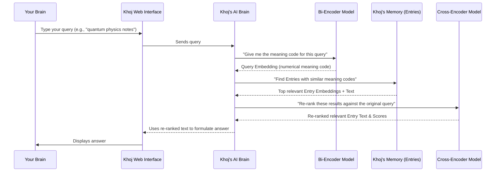

# Chapter 5: Search & Embeddings

In [Chapter 4: Content Processing Pipeline](04_content_processing_pipeline_.md), we explored how Khoj meticulously breaks down your documents into intelligent chunks called `Entry` objects, preparing them for your personal "second brain." Now, the big question is: how does Khoj actually *find* the right information from all those `Entry` objects when you ask a question? This is where the magic of Search & Embeddings comes in!

### What Problem Do Search & Embeddings Solve?

Imagine you've just uploaded a massive collection of your research papers, meeting notes, and web articles into Khoj. Later, you want to ask a question like: "What were the main arguments for using renewable energy in the report I read last week?"

If Khoj just searched for the exact words "renewable energy" or "report," it might miss important paragraphs that use synonyms like "green power" or "document." You want Khoj to understand the *meaning* of your question and find relevant information, even if the exact words aren't present.

This is the problem that **Search & Embeddings** solve! It's like having a highly intelligent "meaning-matcher" for your personal library. Instead of just looking for keywords, Khoj understands the *idea* behind your query and finds documents that are about the same *idea*.

**Our Goal for this Chapter:** By the end of this chapter, you'll understand how Khoj uses "embeddings" to perform super-smart searches, finding information based on meaning rather than just words, and how it refines those results for accuracy.

### What are Embeddings?

At the heart of Khoj's smart search are **embeddings**. Don't let the technical term scare you!

Think of an embedding as a **numerical fingerprint** or a **"meaning code"** for a piece of text.
*   Every `Entry` (those chunks of your documents) gets its own unique numerical fingerprint.
*   Your search query (your question to Khoj) also gets its own numerical fingerprint.

These "fingerprints" are long lists of numbers that capture the *meaning* of the text. Texts with similar meanings will have "fingerprints" that are numerically very close to each other.

Khoj uses a special type of AI model called a **"bi-encoder"** to create these embeddings. It's really good at understanding text and converting it into these numerical meaning codes.

### What is Semantic Search?

Once everything (your documents and your queries) has these numerical "meaning codes" (embeddings), Khoj can do **semantic search**.

Semantic search means searching based on **meaning**, not just keywords.
*   When you ask Khoj a question, it converts your question into its numerical meaning code.
*   Then, it rapidly compares your question's meaning code to the meaning codes of all your stored `Entry` objects.
*   It finds the `Entry` objects whose meaning codes are numerically closest to your question's meaning code. This means they are about the same *topic* or *idea*.

This is why Khoj can find "green power" when you search for "renewable energy" – because their meaning codes are very similar!

### What is a Cross-Encoder?

After Khoj's "bi-encoder" finds the initial set of relevant `Entry` objects using semantic search, it needs a **"second opinion"** to make sure the results are truly the best. This is where the **"cross-encoder"** comes in.

The cross-encoder is another type of AI model that is slower but more precise. It takes your original query and the top few `Entry` objects found by the bi-encoder, and then it re-reads them *together*. It gives a more refined score on how relevant each `Entry` is to your specific query.

*   **Bi-encoder**: Fast, finds many *potential* matches based on general meaning.
*   **Cross-encoder**: Slower, but **re-ranks** the top matches to ensure they are *precisely* relevant to your query.

It's like the bi-encoder quickly picks out 10 books that *might* be what you're looking for, and then the cross-encoder carefully skims those 10 books to tell you which 3 are *exactly* what you need.

### How to Use Search & Embeddings (Indirectly)

You don't directly interact with "embeddings" or "encoders" in Khoj. These are all part of the intelligent system working behind the scenes. You simply **use the Khoj search or chat interface** as you learned in [Chapter 1: Web Interface (Frontend)](01_web_interface__frontend__.md).

**Example:**
1.  **Upload Documents**: You've uploaded various files containing information about quantum physics, perhaps a PDF, some Markdown notes, etc. (This process generated `Entry` objects with their embeddings, as discussed in [Chapter 3: Entry (Indexed Content)](03_entry__indexed_content__.md) and [Chapter 4: Content Processing Pipeline](04_content_processing_pipeline_.md)).
2.  **Ask a Question**: In the Khoj chat interface, you type:
    `Tell me about the principles of quantum entanglement.`
3.  **Khoj Searches**: Khoj's Search & Embeddings system automatically:
    *   Converts your question into a numerical embedding (meaning code).
    *   Compares it to all `Entry` embeddings.
    *   Uses the cross-encoder to refine the top results.
    *   Pulls out the most relevant `Entry` chunks.
    *   Uses these chunks to formulate an answer for you.

You just type your question, and Khoj's smart search does the rest!

### Under the Hood: How Search & Embeddings Work

Let's trace the journey of your question through Khoj's search system.

#### Step-by-Step Walkthrough

1.  **You Ask a Question**: You type "Summarize my notes on quantum physics" into the Khoj Web Interface.
2.  **Khoj Backend Receives Query**: Your question travels to the Khoj Backend.
3.  **Query to Embedding (Bi-Encoder)**: The Khoj Backend sends your question to the **Bi-Encoder Model**. This model converts your question into a numerical embedding (its "meaning code").
4.  **Semantic Search (Database)**: Khoj then takes this query embedding and searches its database. It looks for `Entry` objects (your document chunks) that have embeddings (meaning codes) that are numerically very similar to your query's embedding. It quickly finds a set of top potential matches.
5.  **Result Refinement (Cross-Encoder)**: The Khoj Backend then takes your original question and the top few `Entry` objects found in step 4. It sends them to the **Cross-Encoder Model**. The Cross-Encoder meticulously re-reads both your query and these potential `Entry` matches together to give a more accurate relevance score for each.
6.  **Formulate Answer**: Based on these highly re-ranked and relevant `Entry` objects, Khoj formulates its answer.
7.  **Display Answer**: The answer is sent back to your Web Interface and displayed in the chat.

Here's a simplified sequence diagram:



#### A Peek at the Code

Let's look at some key parts of the Khoj code that make this happen.

First, remember the `Entry` model from `src/khoj/database/models/__init__.py`? It has a special field to store those numerical embeddings:

```python
# src/khoj/database/models/__init__.py
# ...

class Entry(DbBaseModel):
    # ... other fields
    embeddings = VectorField(dimensions=None) # This stores the numerical embedding!
    raw = models.TextField() # Original chunk of text
    compiled = models.TextField() # Cleaned/optimized chunk of text
    # ...
```
The `embeddings = VectorField(dimensions=None)` line is crucial. It tells the database that this field will hold a list of numbers, which is our numerical meaning code for the text.

When you initiate a search, the `search` endpoint in `src/khoj/routers/api.py` calls `execute_search`. Inside `execute_search`, your query is first converted into an embedding:

```python
# src/khoj/routers/api.py
# ...

async def execute_search(
    user: KhojUser,
    q: str, # This is your query, e.g., "quantum physics notes"
    # ... other parameters
):
    # ... (prepare query by removing filters)

    encoded_asymmetric_query = None
    if t != SearchType.Image:
        # Get the default search model (which includes the bi-encoder)
        search_model = await sync_to_async(get_default_search_model)()
        # Convert your query into its numerical embedding!
        encoded_asymmetric_query = state.embeddings_model[search_model.name].embed_query(defiltered_query)

    # ... (submit search to text_search.query)
```
The `state.embeddings_model[search_model.name].embed_query(defiltered_query)` line is where the **bi-encoder** does its job, turning your text query into numbers.

Next, `text_search.query` (from `src/khoj/search_type/text_search.py`) uses this query embedding to find relevant `Entry` objects:

```python
# src/khoj/search_type/text_search.py
# ...

async def query(
    raw_query: str,
    user: KhojUser,
    type: SearchType = SearchType.All,
    question_embedding: Union[torch.Tensor, None] = None, # Your query's numerical embedding!
    # ... other parameters
) -> Tuple[List[dict], List[Entry]]:
    # ...

    # Find relevant entries by comparing embeddings
    hits = EntryAdapters.search_with_embeddings(
        raw_query=raw_query,
        embeddings=question_embedding, # Compare this to Entry embeddings!
        max_results=top_k,
        file_type_filter=file_type,
        max_distance=max_distance,
        user=user,
        agent=agent,
    ).all()
    hits = await sync_to_async(list)(hits)
    return hits
```
This function calls `EntryAdapters.search_with_embeddings` to perform the actual database lookup. Let's see how that works in `src/khoj/database/adapters/__init__.py`:

```python
# src/khoj/database/adapters/__init__.py
# ...

class EntryAdapters:
    @staticmethod
    def search_with_embeddings(
        raw_query: str,
        embeddings: Tensor, # Your query's embedding
        user: KhojUser,
        max_results: int = 10,
        # ... other parameters
    ):
        # ... (filter entries by user/agent)
        relevant_entries = Entry.objects.filter(owner_filter).annotate(
            distance=CosineDistance("embeddings", embeddings) # Calculates similarity using embeddings!
        )
        relevant_entries = relevant_entries.filter(distance__lte=max_distance) # Filters out less relevant results
        # ... (more filtering and sorting)
        return relevant_entries[:max_results]
```
The key line here is `distance=CosineDistance("embeddings", embeddings)`. `CosineDistance` is a mathematical way to measure how "close" two numerical vectors (our embeddings) are. A smaller distance means they are more similar in meaning. This is how Khoj quickly finds the most semantically relevant `Entry` objects.

After the initial search, the results are passed to `rerank_and_sort_results` in `src/khoj/search_type/text_search.py` to be refined by the **cross-encoder**:

```python
# src/khoj/search_type/text_search.py
# ...

def rerank_and_sort_results(hits, query, rank_results, search_model_name):
    # Rerank results if explicitly requested or if cross-encoder inference is enabled
    rank_results = (rank_results or state.cross_encoder_model[search_model_name].inference_server_enabled()) and len(
        list(hits)
    ) > 1

    if rank_results:
        # This calls the cross-encoder to re-score the hits
        hits = cross_encoder_score(query, hits, search_model_name)

    # Sort results, prioritizing cross-encoder score if used
    hits = sort_results(rank_results=rank_results, hits=hits)

    return hits

def cross_encoder_score(query: str, hits: List[SearchResponse], search_model_name: str) -> List[SearchResponse]:
    """Score all retrieved entries using the cross-encoder"""
    # ... (error handling)
    
    # This is where the Cross-Encoder model does its prediction
    cross_scores = state.cross_encoder_model[search_model_name].predict(query, hits)

    # Convert cross-encoder scores to distances for ranking
    for idx in range(len(cross_scores)):
        hits[idx]["cross_score"] = 1 - cross_scores[idx] # Store new score for sorting

    return hits
```
The `cross_encoder_score` function calls `state.cross_encoder_model[search_model_name].predict`, which is the core of the cross-encoder's re-ranking. This function takes your query and the raw text of the search results and produces a new, more accurate relevance score.

Finally, the `EmbeddingsModel` (bi-encoder) and `CrossEncoderModel` classes themselves are defined in `src/khoj/processor/embeddings.py`:

```python
# src/khoj/processor/embeddings.py
# ...

class EmbeddingsModel: # This is our Bi-Encoder
    def __init__(self, model_name: str = "thenlper/gte-small", **kwargs):
        # Loads the bi-encoder model (e.g., "thenlper/gte-small")
        self.embeddings_model = SentenceTransformer(self.model_name, **self.model_kwargs)

    def embed_query(self, query):
        # Converts a single query string into its numerical embedding
        return self.embeddings_model.encode([query], **self.query_encode_kwargs)[0]

    def embed_documents(self, docs):
        # Converts a list of document chunks into their numerical embeddings
        return self.embeddings_model.encode(docs, **self.docs_encode_kwargs).tolist()

class CrossEncoderModel: # This is our Cross-Encoder
    def __init__(self, model_name: str = "mixedbread-ai/mxbai-rerank-xsmall-v1", **kwargs):
        # Loads the cross-encoder model (e.g., "mixedbread-ai/mxbai-rerank-xsmall-v1")
        self.cross_encoder_model = CrossEncoder(model_name=self.model_name, **self.model_kwargs)

    def predict(self, query, hits: List[SearchResponse], key: str = "compiled"):
        # Takes the query and search results, and predicts new relevance scores
        cross_inp = [[query, hit.additional[key]] for hit in hits]
        cross_scores = self.cross_encoder_model.predict(cross_inp)
        return cross_scores
```
These classes load the actual AI models (bi-encoder and cross-encoder) and provide methods to `embed_query` (turn queries into numbers), `embed_documents` (turn document chunks into numbers), and `predict` (re-rank search results).

### Conclusion

You've now seen how Khoj's "second brain" truly understands your information! By converting both your queries and your `Entry` documents into numerical "embeddings" (meaning codes) using a **bi-encoder**, Khoj can perform powerful **semantic search** based on meaning. A **cross-encoder** then acts as a quality control, refining the initial search results for even greater accuracy. This entire system works behind the scenes, allowing you to simply ask questions and get highly relevant answers.

Next, we'll explore how Khoj uses these retrieved `Entry` objects and integrates with large language models (LLMs) to generate human-like chat responses and summaries.

[Chapter 6: ChatModel & AI Model API (LLM Integration)](06_chatmodel___ai_model_api__llm_integration__.md)

---

Generated by [AI Codebase Knowledge Builder](https://github.com/The-Pocket/Tutorial-Codebase-Knowledge)