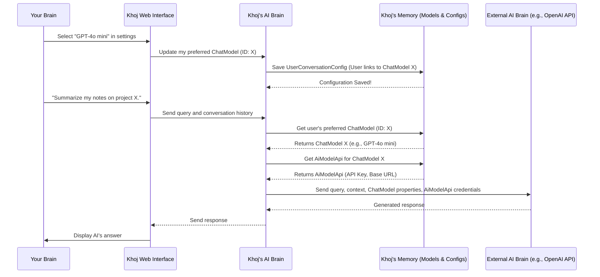

# Chapter 6: ChatModel & AI Model API (LLM Integration)

In [Chapter 5: Search & Embeddings](05_search___embeddings_.md), we unlocked the secret to how Khoj intelligently finds relevant pieces of your information using "embeddings." But finding information is only half the battle! Once Khoj has found those relevant `Entry` objects, how does it actually *talk* to you? How does it generate human-like summaries, answer your questions, or have a natural conversation?

This is where the magic of **ChatModel & AI Model API (LLM Integration)** comes into play! It's the part of Khoj that connects to the "brains" that generate natural language responses.

### What Problem Do ChatModel & AI Model API Solve?

Imagine Khoj as your personal smart assistant, but you want it to be able to "think" using different advanced AI brains. Maybe you want it to use a super-powerful, cloud-based AI like GPT for complex tasks, or a smaller, faster AI running directly on your computer for quick chats. Each of these AI brains (known as Large Language Models, or LLMs) works a little differently and needs different ways to connect.

The **ChatModel** and **AI Model API** concepts solve this problem. They are like a **universal remote control for various smart speakers**, allowing Khoj to switch between different AI brains (LLMs) for different tasks.

**Our Goal for this Chapter:** By the end of this chapter, you'll understand what `ChatModel` and `AiModelApi` are, why Khoj uses them, and how you can indirectly choose which AI brain Khoj uses for your conversations.

### What is a Large Language Model (LLM)?

First, let's understand the core concept: a **Large Language Model (LLM)**.
An LLM is a powerful type of Artificial Intelligence that is trained on massive amounts of text data. It can understand, generate, and respond to human language in a very natural way. When you ask Khoj a question and it gives you a human-like answer, an LLM is doing the heavy lifting behind that response.

Think of an LLM as the **"AI brain"** itself – it's the core engine that understands your prompt and generates text. Popular examples include OpenAI's GPT models, Google's Gemini/PaLM models, Anthropic's Claude, or local models like Llama.

### What is `ChatModel`?

A `ChatModel` in Khoj is a specific **configuration or blueprint for an LLM**. It defines *which* LLM Khoj should use and how it should behave.

Imagine you have a specific smart speaker brand, like "OpenAI's GPT" or "Llama's Llama." The `ChatModel` defines:
*   **Name**: What the model is called (e.g., `gpt-4o-mini`, `bartowski/Meta-Llama-3.1-8B-Instruct-GGUF`).
*   **Type**: Whether it's an OpenAI model, an Anthropic model, a Google model, or an "offline" model (running on your computer).
*   **Capabilities**: Does it understand images (`vision_enabled`)? How long can its conversations be (`max_prompt_size`)?
*   **Description/Strengths**: What is this model good at? (e.g., "Good for creative writing," "Fast for local tasks").

So, a `ChatModel` is essentially Khoj's internal record of *which* specific AI brain to use and its properties.

### What is `AiModelApi`?

The `AiModelApi` is where Khoj stores the **credentials** needed to connect to *external* LLM providers.

Continuing our smart speaker analogy, if the `ChatModel` is the specific smart speaker (like "Google Home"), then the `AiModelApi` is like the **power cable and Wi-Fi login details** that let it actually *work* and connect to the internet to get its intelligence. It typically holds sensitive information such as:
*   `api_key`: A secret code needed to access the LLM service.
*   `api_base_url`: The internet address where Khoj sends its requests to the LLM service.

### Why two separate concepts (`ChatModel` and `AiModelApi`)?

This separation is clever and flexible!
*   You might have several `ChatModel`s that all use the same external provider (e.g., `gpt-3.5-turbo` and `gpt-4` are both OpenAI models, and they can both use the *same* OpenAI `api_key` stored in a single `AiModelApi` entry).
*   This makes it easy to manage your credentials in one place, even if you add many different models from the same provider.
*   It also allows for "offline" `ChatModel`s (like Llama models running on your computer) that don't need an `AiModelApi` because they don't connect to an external service.

### How to Use ChatModel & AI Model API (Indirectly)

You don't directly "code" with `ChatModel` or `AiModelApi` in your daily use of Khoj. Instead, you interact with them through Khoj's **settings**.

**Central Use Case: Changing Khoj's AI Brain for Conversations**

Let's say you want Khoj to use a more powerful (and potentially slower/costlier) GPT-4 model instead of the default smaller model.

1.  **Open Khoj Settings**: In the Khoj Web Interface (as seen in [Chapter 1: Web Interface (Frontend)](01_web_interface__frontend__.md)), navigate to the "Settings" or "Models" section.
2.  **Select a Chat Model**: You'll see a list of available `ChatModel`s (e.g., "Khoj (Offline)", "GPT-4o mini", "Claude 3 Sonnet").
3.  **Choose Your Preferred Model**: Click on the `ChatModel` you wish to use. For example, selecting "GPT-4o mini."
4.  **Khoj Updates Internally**: Behind the scenes, Khoj updates your preferences, remembering that you want to use "GPT-4o mini" for future conversations. If this model requires an API key, Khoj will use the associated `AiModelApi` entry to connect.

This simple action changes the "AI brain" that Khoj uses for generating your chat responses, summaries, and more.

### Under the Hood: Switching Khoj's AI Brain

Let's trace what happens when you select a new `ChatModel` in Khoj's settings and how that model is then used in a conversation.

#### Step-by-Step Walkthrough

1.  **You Select a `ChatModel`**: In Khoj's settings, you click on "GPT-4o mini".
2.  **Web Interface Sends Request**: The Khoj Web Interface sends a message to the Khoj Backend saying, "The user wants to use `ChatModel` ID 'X' from now on."
3.  **Backend Updates User Preference**: The Khoj Backend receives this request and updates a special record (your `UserConversationConfig`) in its [Database](03_entry__indexed_content__.md) to remember your chosen `ChatModel`.
4.  **Conversation Starts**: Later, when you type a new message in the chat and hit send.
5.  **Backend Retrieves `ChatModel`**: As part of processing your new message, the Khoj Backend checks your `UserConversationConfig` to see which `ChatModel` you selected.
6.  **Retrieve `AiModelApi` (if needed)**: If your chosen `ChatModel` is an external LLM (like GPT-4o mini), Khoj also looks up the corresponding `AiModelApi` entry to get the necessary `api_key` and `api_base_url`.
7.  **Generate Response**: Khoj then uses this `ChatModel` (and `AiModelApi` credentials) to send your query and relevant [Entry](03_entry__indexed_content__.md) contexts to the actual LLM service (e.g., OpenAI's servers or your local Llama instance). The LLM generates a response.
8.  **Display Answer**: The LLM's response is sent back to Khoj, and then to your Web Interface, where you see it.

Here's a simplified sequence diagram:



#### A Peek at the Code

Let's look at the actual code structures that define and manage these models.

First, the `ChatModel` and `AiModelApi` blueprints are defined in `src/khoj/database/models/__init__.py`:

```python
# src/khoj/database/models/__init__.py
# ... (imports and other models)

class AiModelApi(DbBaseModel):
    name = models.CharField(max_length=200)
    api_key = models.CharField(max_length=4000) # Your secret API key
    api_base_url = models.URLField(max_length=200, default=None, blank=True, null=True)

    def __str__(self):
        return self.name

class PriceTier(models.TextChoices):
    FREE = "free"
    STANDARD = "standard"

class ChatModel(DbBaseModel):
    class ModelType(models.TextChoices):
        OPENAI = "openai"
        OFFLINE = "offline" # Like Llama models running on your computer
        ANTHROPIC = "anthropic"
        GOOGLE = "google"

    name = models.CharField(max_length=200, default="bartowski/Meta-Llama-3.1-8B-Instruct-GGUF")
    model_type = models.CharField(max_length=200, choices=ModelType.choices, default=ModelType.OFFLINE)
    price_tier = models.CharField(max_length=20, choices=PriceTier.choices, default=PriceTier.FREE)
    vision_enabled = models.BooleanField(default=False) # Can it see images?
    # Links to the API credentials if it's an external model
    ai_model_api = models.ForeignKey(AiModelApi, on_delete=models.CASCADE, default=None, null=True, blank=True)
    description = models.TextField(default=None, null=True, blank=True)
    strengths = models.TextField(default=None, null=True, blank=True)

    def __str__(self):
        return self.name
```
Here, `AiModelApi` holds the actual connection details. `ChatModel` defines the LLM itself, its type (OpenAI, Offline, etc.), capabilities like `vision_enabled`, and crucially, a link (`ForeignKey`) to an `AiModelApi` if it needs external credentials.

When you change your preferred model in the settings, the `update_chat_model` API endpoint in `src/khoj/routers/api_model.py` is called:

```python
# src/khoj/routers/api_model.py
# ... (imports and setup)

@api_model.post("/chat", status_code=200)
@requires(["authenticated"])
async def update_chat_model(
    request: Request,
    id: str, # The ID of the ChatModel you selected
    client: Optional[str] = None,
):
    user = request.user.object
    # Check if the user is allowed to switch to this model (e.g., premium models)
    subscribed = has_required_scope(request, ["premium"])
    chat_model = await ChatModel.objects.filter(id=int(id)).afirst()
    if chat_model is None:
        return Response(status_code=404, content=json.dumps({"status": "error", "message": "Chat model not found"}))
    if not subscribed and chat_model.price_tier != PriceTier.FREE:
        raise Response(status_code=403,
            content=json.dumps({"status": "error", "message": "Subscribe to switch to this chat model"}),
        )

    # This calls the adapter to save the user's preference
    new_config = await ConversationAdapters.aset_user_conversation_processor(user, int(id))

    if new_config is None:
        return {"status": "error", "message": "Model not found"}

    return {"status": "ok"}
```
This function receives the `id` of the `ChatModel` you want to use. It performs validation (like checking if you're subscribed for paid models) and then calls `ConversationAdapters.aset_user_conversation_processor` to save your choice.

The `aset_user_conversation_processor` and `aget_chat_model` functions in `src/khoj/database/adapters/__init__.py` manage saving and retrieving your `ChatModel` preference:

```python
# src/khoj/database/adapters/__init__.py
# ... (imports and other adapters)

class ConversationAdapters:
    # ... (other methods)

    @staticmethod
    @arequire_valid_user
    async def aset_user_conversation_processor(user: KhojUser, conversation_processor_config_id: int):
        # Find the ChatModel based on the ID you selected
        config = await ChatModel.objects.filter(id=conversation_processor_config_id).afirst()
        if not config:
            return None
        # Save this ChatModel as your preferred setting
        new_config, _ = await UserConversationConfig.objects.aupdate_or_create(user=user, defaults={"setting": config})
        return new_config

    @staticmethod
    async def aget_chat_model(user: KhojUser):
        # When a conversation starts, get the user's preferred ChatModel
        subscribed = await ais_user_subscribed(user)
        config = (
            await UserConversationConfig.objects.filter(user=user)
            .prefetch_related("setting", "setting__ai_model_api") # Load associated AiModelApi
            .afirst()
        )
        if subscribed:
            if config:
                return config.setting # Return the user's chosen model
            # Fallback for subscribed users
            return await ConversationAdapters.aget_advanced_chat_model(user)
        else:
            if config and config.setting.price_tier == PriceTier.FREE:
                return config.setting # For free users, only return free models
            # Fallback for free users
            return await ConversationAdapters.aget_default_chat_model(user)
```
`aset_user_conversation_processor` updates the `UserConversationConfig` to link your `KhojUser` to the chosen `ChatModel`. `aget_chat_model` is later used to retrieve this `ChatModel` when a conversation needs to be processed. Notice how it `prefetch_related("setting__ai_model_api")` to also grab the API credentials if an external model is chosen.

Finally, when it's time to actually generate a response, Khoj's internal `OpenAIProcessor` (for OpenAI models, located in `src/khoj/processor/conversation/openai/gpt.py`) or `OfflineProcessor` (for local models, in `src/khoj/processor/conversation/offline/chat_model.py`) use these details:

```python
# src/khoj/processor/conversation/openai/gpt.py
# ... (imports)

async def converse_openai(
    references,
    user_query,
    # ... other parameters
    model: str = "gpt-4o-mini",
    api_key: Optional[str] = None, # This comes from AiModelApi!
    api_base_url: Optional[str] = None, # This comes from AiModelApi!
    temperature: float = 0.4,
    # ... more parameters
) -> AsyncGenerator[ResponseWithThought, None]:
    # ... (message preparation, context handling)

    # Call OpenAI's API using the provided API key and base URL
    async for chunk in chat_completion_with_backoff(
        messages=messages,
        model_name=model,
        temperature=temperature,
        openai_api_key=api_key, # Used here!
        api_base_url=api_base_url, # Used here!
        # ... other model parameters
    ):
        yield chunk
```
This simplified snippet shows how the `model` name, `api_key`, and `api_base_url` (retrieved via `ChatModel` and `AiModelApi`) are passed directly to the function that communicates with the OpenAI service, allowing it to generate the conversation response. A similar process occurs for offline models using `llama-cpp`.

### Conclusion

You've just learned how Khoj manages its "AI brains"! The `ChatModel` defines the specific Large Language Model (LLM) and its properties, while the `AiModelApi` securely stores the necessary credentials to connect to external LLM providers. This powerful abstraction allows Khoj to be flexible, letting you choose which AI intelligence powers your conversations, all managed seamlessly behind the scenes.

Next, we'll bring all these pieces together and dive into the exciting world of "Conversation" within Khoj, seeing how your queries, retrieved entries, and the chosen LLMs combine to create meaningful interactions.

[Chapter 7: Conversation](07_conversation_.md)

---

Generated by [AI Codebase Knowledge Builder](https://github.com/The-Pocket/Tutorial-Codebase-Knowledge)