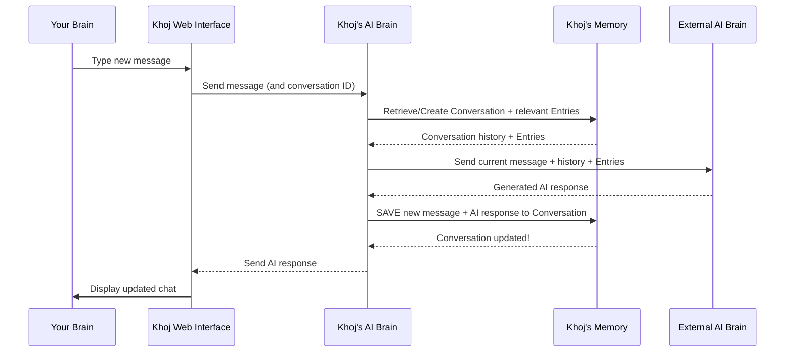

# Chapter 7: Conversation

In [Chapter 6: ChatModel & AI Model API (LLM Integration)](06_chatmodel___ai_model_api__llm_integration__.md), we learned how Khoj intelligently connects to different powerful AI brains (LLMs) to generate human-like responses. But what if you want to remember what you discussed last week? How does Khoj keep track of all your questions and its answers over time, so it can provide relevant follow-ups or context in new interactions?

This is where the concept of a `Conversation` comes in!

### What Problem Does "Conversation" Solve?

Imagine you're chatting with a friend. You don't repeat everything you've said before because you both remember the context of your discussion. You can ask follow-up questions like, "What about that idea we discussed yesterday?" and your friend understands what you're referring to.

For an AI assistant like Khoj, this "memory" is crucial! If Khoj just answered one question at a time and then forgot everything, it would be frustrating. You'd have to provide all the context every single time, making complex tasks or continuous research impossible.

The `Conversation` concept solves this by acting as a **digital notebook** or **chat log** that keeps a persistent record of all your interactions with Khoj. It ensures that Khoj remembers past messages, allowing for a continuous, meaningful dialogue.

**Our Goal for this Chapter:** By the end of this chapter, you'll understand what a `Conversation` is, why it's so important for Khoj's memory, and how Khoj automatically uses and manages it behind the scenes to maintain a continuous dialogue.

### What is a Conversation?

A `Conversation` in Khoj is simply the **persistent record of your dialogue** with the AI assistant. Think of it as a dedicated chat history that automatically stores everything you and Khoj say to each other.

Each `Conversation` object contains:

*   **Unique ID**: Every conversation gets its own special ID, like a unique name tag, so Khoj can always refer to it specifically.
*   **Messages**: This is the core! It stores every question you ask (`by: you`) and every response Khoj gives (`by: khoj`), preserving the full chat history.
*   **Context and Details**: Beyond just the text, it also records:
    *   **Context**: What relevant [Entry](03_entry__indexed_content__.md) chunks were found (via [Search & Embeddings](05_search___embeddings_.md)).
    *   **Tool Outputs**: What tools Khoj used (e.g., searching online, running code) and their results (we'll cover these more in [Chapter 9: Conversation Commands & Tools](09_conversation_commands___tools_.md)).
    *   **Metadata**: Things like the time of each message, whether images were involved, etc.
*   **Associated Agent**: Each conversation can be linked to a specific "Agent" (an AI persona or specialized helper), which we'll explore in [Chapter 8: Agent](08_agent_.md). This helps Khoj adopt a specific persona or set of capabilities for that particular chat.
*   **Title/Slug**: A human-readable title (or a "slug" for internal identification) to help you easily identify and organize your conversations later.
*   **File Filters**: A list of specific files that are actively being used as context for that conversation, allowing you to narrow down Khoj's "focus."

By storing all this information, Khoj can always "look back" at your previous interactions, making its responses much more relevant and helpful.

### How to Use Conversations (Indirectly)

You don't directly "create" or "manage" `Conversation` objects yourself. Instead, Khoj handles them automatically as you interact with its chat interface (as seen in [Chapter 1: Web Interface (Frontend)](01_web_interface__frontend__.md)).

**Central Use Case: Having a Continuous Dialogue with Khoj**

1.  **Start a New Conversation**: When you first open Khoj or click the "New Chat" button, Khoj automatically starts a new `Conversation` for you.
2.  **Type Your First Question**: "What were the main findings in my notes on the Big Bang theory?"
3.  **Khoj Responds**: Khoj finds relevant [Entry](03_entry__indexed_content__.md) objects and gives you a summary.
4.  **Ask a Follow-Up Question**: "And how does that relate to dark matter?"
    *   **This is where `Conversation` shines!** Khoj doesn't need you to repeat "my notes on the Big Bang theory." Because it remembers the *entire conversation history* in the `Conversation` object, it knows the "that" refers to the previous topic and can continue the dialogue seamlessly.
5.  **View Past Conversations**: You can easily browse through your past `Conversation`s in the Khoj sidebar. Clicking on a past conversation instantly loads its full history, allowing you to pick up exactly where you left off.

```markdown

```
*The image above shows the sidebar in Khoj where you can see a list of your conversations. Each entry in this list represents a `Conversation` object.*

### Under the Hood: How Conversations Are Managed

Let's peek behind the scenes to see what happens when you interact with Khoj and how your `Conversation` is created and updated.

#### Step-by-Step Walkthrough

1.  **You Start a Chat**: You type your first message, "Summarize my notes on project X."
2.  **Web Interface Sends Message**: The [Web Interface (Frontend)](01_web_interface__frontend__.md) sends your message to the [Khoj Backend](01_web_interface__frontend__.md).
3.  **Backend Manages Conversation**: The Khoj Backend first checks if you're continuing an existing `Conversation` (e.g., if you're on a specific `conversationId` page) or if a new one needs to be created.
4.  **Retrieve Context & Process Query**:
    *   Khoj retrieves the relevant `Entry` objects from its [Database](03_entry__indexed_content__.md) (using [Search & Embeddings](05_search___embeddings_.md)).
    *   It also takes the full `Conversation` history (all previous messages) and bundles it up with your new query and the retrieved context.
    *   This bundled information is sent to the chosen [ChatModel](06_chatmodel___ai_model_api__llm_integration__.md) (the LLM).
5.  **LLM Generates Response**: The LLM processes all the information and generates a human-like response.
6.  **Backend Saves Conversation**: **Crucially, before sending the response back**, the Khoj Backend updates the active `Conversation` object in its [Database](03_entry__indexed_content__.md). It adds *both* your new message *and* the AI's response (along with any context, tool outputs, etc.) to the `conversation_log`. This is how the "memory" is preserved.
7.  **Backend Sends Response**: The generated response is sent back to the Web Interface.
8.  **Web Interface Displays**: Your Web Interface displays Khoj's answer, and you see the updated chat history, ready for your next question.

Here's a simplified sequence diagram:



#### A Peek at the Code

Let's look at how the `Conversation` is defined and used in Khoj's code.

First, the `Conversation` model itself, defined in `src/khoj/database/models/__init__.py`. This is the blueprint for how a `Conversation` object is stored in Khoj's database:

```python
# src/khoj/database/models/__init__.py
# ... (imports and other models)

class ChatMessage(PydanticBaseModel):
    message: str
    context: List[Any] = [] # Stores relevant document chunks (Entries)
    onlineContext: Dict[str, Any] = {} # Stores online search results
    # ... more fields for images, code context, etc.
    by: str # "you" or "khoj"
    turnId: Optional[str] = None # Unique ID for each message turn

class Conversation(DbBaseModel):
    user = models.ForeignKey(KhojUser, on_delete=models.CASCADE)
    conversation_log = models.JSONField(default=dict) # The core chat history!
    client = models.ForeignKey(ClientApplication, on_delete=models.CASCADE, default=None, null=True, blank=True)

    slug = models.CharField(max_length=200, default=None, null=True, blank=True) # Internal identifier
    title = models.CharField(max_length=500, default=None, null=True, blank=True) # User-set title
    agent = models.ForeignKey(Agent, on_delete=models.SET_NULL, default=None, null=True, blank=True) # Linked Agent
    file_filters = models.JSONField(default=list) # Files used for context
    id = models.UUIDField(default=uuid.uuid4, editable=False, unique=True, primary_key=True, db_index=True)

    @property
    def messages(self) -> List[ChatMessage]:
        # Helper to get type-hinted chat messages
        validated_messages = []
        for msg in self.conversation_log.get("chat", []):
            try:
                validated_messages.append(ChatMessage.model_validate(msg))
            except ValidationError as e:
                logger.warning(f"Skipping invalid message: {e}")
        return validated_messages
```
This shows the `Conversation` model, holding a `user` link, a `conversation_log` (where all the `ChatMessage` objects are stored), `title` and `slug`, `agent` link, and `file_filters`. The `ChatMessage` Pydantic model shows the rich detail stored for each turn.

When you send a message, the main chat API endpoint in `src/khoj/routers/api_chat.py` is called. At the end of its processing, it calls `save_to_conversation_log` to record the interaction:

```python
# src/khoj/routers/api_chat.py
# ... (imports and other functions)

@api_chat.post("")
@requires(["authenticated"])
async def chat(
    request: Request,
    common: CommonQueryParams,
    body: ChatRequestBody,
    # ... (rate limiters and other parameters)
):
    # ... (extract query, conversation ID, other data from body)

    # After LLM generates a response (llm_response, chat_metadata are prepared):
    # This function saves the user query and AI response to the conversation log
    asyncio.create_task(
        save_to_conversation_log(
            q,
            llm_response,
            user,
            meta_log, # This is the conversation_log from the DB
            user_message_time,
            # ... (all the context, references, images, etc.)
            conversation_id=conversation_id, # The ID of the current conversation
        )
    )

    # ... (stream or return response to frontend)
```
This simplified view of the `chat` function shows how it orchestrates the process, ultimately delegating the saving of the conversation to `save_to_conversation_log`. It passes the current `conversation_log` (as `meta_log`) and the `conversation_id`.

The `save_to_conversation_log` function itself (located in `src/khoj/processor/conversation/utils.py`) prepares the message data and then calls `ConversationAdapters.save_conversation`:

```python
# src/khoj/processor/conversation/utils.py
# ... (imports)

async def save_to_conversation_log(
    q: str, # The user's query
    chat_response: str, # The AI's response
    user: KhojUser,
    meta_log: Dict, # The conversation_log (chat history) from the DB
    user_message_time: str = None,
    # ... (many other parameters for context, images, tools)
    conversation_id: str = None,
    # ... (tracer, etc.)
):
    # Prepare metadata for the user's message and Khoj's response
    user_message_metadata = {"created": user_message_time, "images": query_images, "turnId": turn_id}
    khoj_message_metadata = {
        "context": compiled_references,
        "intent": {"inferred-queries": inferred_queries, "type": intent_type},
        "onlineContext": online_results,
        "turnId": turn_id,
        "images": generated_images,
        # ... (other contextual data)
    }

    # Add the new user message and Khoj response to the conversation log
    updated_conversation = message_to_log(
        user_message=q,
        chat_response=chat_response,
        user_message_metadata=user_message_metadata,
        khoj_message_metadata=khoj_message_metadata,
        conversation_log=meta_log.get("chat", []), # Append to existing chat history
    )

    # This is the call that saves the updated conversation to the database!
    await ConversationAdapters.save_conversation(
        user,
        {"chat": updated_conversation},
        client_application=client_application,
        conversation_id=conversation_id,
        user_message=q,
    )
```
This function aggregates all the rich information (user query, AI response, relevant contexts, tool outputs, images) and uses `message_to_log` to format it into `ChatMessage` objects, then calls `ConversationAdapters.save_conversation` to persist it.

The `ConversationAdapters` (in `src/khoj/database/adapters/__init__.py`) is responsible for interacting directly with the `Conversation` database model:

```python
# src/khoj/database/adapters/__init__.py
# ... (imports)

class ConversationAdapters:
    # ... (other methods)

    @staticmethod
    @arequire_valid_user
    async def save_conversation(
        user: KhojUser,
        conversation_log: dict, # The full updated chat history
        client_application: ClientApplication = None,
        conversation_id: str = None,
        user_message: str = None,
    ):
        # Find the conversation by ID, or the most recent one for the user
        if conversation_id:
            conversation = await Conversation.objects.filter(
                user=user, client=client_application, id=conversation_id
            ).afirst()
        else:
            conversation = (
                await Conversation.objects.filter(user=user, client=client_application).order_by("-updated_at").afirst()
            )

        if conversation:
            # If conversation exists, update its log and last updated time
            conversation.conversation_log = conversation_log
            conversation.slug = user_message.strip()[:200] if user_message else None # Update slug/title
            conversation.updated_at = datetime.now(tz=timezone.utc)
            await conversation.asave() # Save changes to database
        else:
            # If no conversation found, create a new one
            await Conversation.objects.acreate(
                user=user, conversation_log=conversation_log, client=client_application, slug=user_message.strip()[:200]
            )

    @staticmethod
    @require_valid_user
    def get_conversation_sessions(user: KhojUser, client_application: ClientApplication = None):
        # This function fetches all conversations for display in the sidebar
        return (
            Conversation.objects.filter(user=user, client=client_application)
            .prefetch_related("agent") # Also grab associated agent details
            .order_by("-updated_at") # Sort by most recent first
        )
```
The `save_conversation` method handles both updating an existing `Conversation` record or creating a new one if it's the first message. The `get_conversation_sessions` method is how Khoj retrieves the list of your past conversations to show in the UI, enabling you to navigate them.

Finally, on the frontend, the `AllConversations` component in `src/interface/web/app/components/allConversations/allConversations.tsx` is responsible for fetching and displaying your list of conversations:

```typescript
// src/interface/web/app/components/allConversations/allConversations.tsx
// ... (imports)

interface ChatHistory {
    conversation_id: string;
    slug: string; // The title/identifier of the conversation
    agent_name: string;
    // ... other metadata
}

// Fetcher function (uses the API endpoint)
const fetchChatHistory = async (url: string) => {
    const response = await fetch(url, { method: "GET" });
    return response.json();
};

export const useChatSessionsFetchRequest = (url: string) => {
    // This hook fetches conversation sessions from the backend
    const { data, isLoading, error } = useSWR<ChatHistory[]>(url, fetchChatHistory);
    return { data, isLoading, error };
};

export default function AllConversations(props: SidePanelProps) {
    // ... (state management)

    // Call the hook to get chat sessions (list of conversations)
    const { data: chatSessions, isLoading } = useChatSessionsFetchRequest(
        authenticatedData ? `/api/chat/sessions` : "", // Calls /api/chat/sessions
    );

    useEffect(() => {
        if (chatSessions) {
            // Process and organize the fetched chat sessions for display
            // ... (grouping by time, etc.)
            setData(chatSessions);
        }
    }, [chatSessions]);

    // ... (render the list of ChatSession components)
}
```
This frontend code uses a `useSWR` hook to call the `/api/chat/sessions` endpoint (which is powered by `ConversationAdapters.get_conversation_sessions` on the backend). It then processes the `chatSessions` data to display your list of conversations, making them easily accessible.

### Conclusion

You've now learned about the backbone of Khoj's memory: the `Conversation`! It's the persistent record of your interactions, storing not just messages but also all the rich context, tool outputs, and linked information. This enables Khoj to maintain a continuous, intelligent dialogue with you, remembering past discussions and building upon them. Understanding `Conversation` is key to appreciating how Khoj provides a truly personalized and contextual AI experience.

Next, we'll dive into the concept of an "Agent," which allows you to interact with different AI personas or specialized helpers within Khoj, each potentially having their own unique `Conversation` settings and capabilities.

[Chapter 8: Agent](08_agent_.md)

---

Generated by [AI Codebase Knowledge Builder](https://github.com/The-Pocket/Tutorial-Codebase-Knowledge)