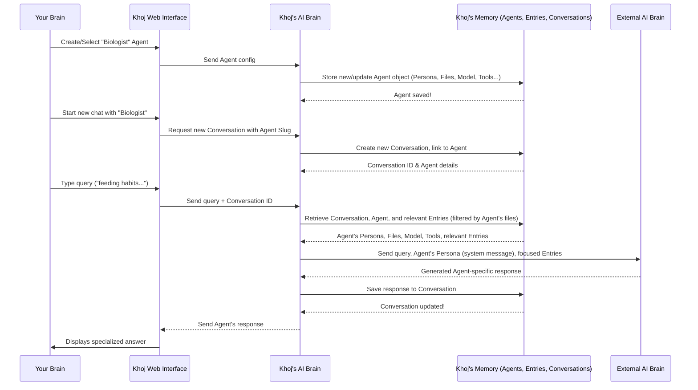

# Chapter 8: Agent

In [Chapter 7: Conversation](07_conversation.md), we discovered how Khoj remembers your entire chat history, allowing for continuous and contextual dialogue. This "memory" is fantastic for general questions and ongoing discussions. But what if you need a specialized assistant? Someone who excels in a very specific field, has a particular way of talking, or only focuses on certain documents?

### What Problem Does "Agent" Solve?

Imagine you have a single, very smart general assistant (which is what Khoj is by default). This assistant is great for everything, but sometimes you wish you had a dedicated expert for a particular task. For example:

*   A **"Biologist"** who can answer questions only from your research papers on marine life.
*   A **"Code Expert"** who can help you debug Python scripts and search your code repositories.
*   A **"Personal Chef"** who suggests recipes and food facts from your recipe notes.

If your general assistant tried to be all these things at once, its responses might become muddled, or it might get confused about which set of notes to focus on.

This is exactly what the **Agent** concept solves! An `Agent` in Khoj is like hiring a **specialized AI employee** for your personal office. Each Agent has a unique job description, a distinct personality, and a specific set of skills (tools) and knowledge (documents).

**Our Goal for this Chapter:** By the end of this chapter, you'll understand what an `Agent` is, how to create one, and how it transforms Khoj into a collection of specialized AI assistants.

### What is an Agent?

An `Agent` is a customizable AI persona within Khoj. It allows you to mold Khoj into a specialized helper tailored to your specific needs. Each `Agent` can have:

*   **Name & Personality (`persona`)**: You give it a name (e.g., "Biologist") and a detailed `persona` (like a system prompt) that defines its expertise, tone, and overall approach. This dictates how it "thinks" and responds.
*   **Appearance (Icon & Color)**: Each Agent can have a unique icon and color, making it easy to identify visually in your conversations.
*   **Dedicated Knowledge Base (`files`)**: You can link an Agent to a specific set of your indexed [Entry](03_entry__indexed_content__.md) objects (files). This means it will primarily use *those* documents when answering questions, making its knowledge highly focused.
*   **Specific AI Brain (`chat_model`)**: You can assign a particular [ChatModel](06_chatmodel___ai_model_api__llm_integration__.md) (LLM) to an Agent. So, your "Code Expert" might use a model better suited for code, while your "Creative Writer" might use a different one.
*   **Allowed Tools (`input_tools`)**: Agents can be restricted to use only certain "tools" (like web search or code execution, which we'll explore in [Chapter 9: Conversation Commands & Tools](09_conversation_commands___tools_.md)). This ensures it only performs actions relevant to its role.
*   **Allowed Output Modes (`output_modes`)**: Similarly, Agents can be limited to specific output formats (e.g., generating images or diagrams).
*   **Privacy Level (`privacy_level`)**: Agents can be `public` (visible to all users on a server), `protected` (sharable via link), or `private` (only visible to you).

It's like giving your AI assistant a specialized uniform, a training manual for a specific job, and a restricted set of tools.

### How to Use Agents: Creating a Specialized Assistant

Let's walk through how you would create a new "Biologist" Agent and use it to chat about your marine biology notes.

**Central Use Case: Creating a "Biologist" Agent and Chatting with it.**

1.  **Upload Relevant Files**: First, make sure your marine biology research papers and notes are already indexed in Khoj (as discussed in [Chapter 3: Entry (Indexed Content)](03_entry__indexed_content__.md)).
    ```markdown
    
    ```
2.  **Navigate to the Agents Page**: In the Khoj Web Interface, click on "Agents" in the sidebar. This will show you a list of existing Agents.
    ```markdown
    
    ```
3.  **Create a New Agent**: Click the "Add Agent" or "Create" button. You'll see a form to configure your new Agent.
    *   **Name**: Type "Biologist".
    *   **Personality**: Enter a detailed prompt, e.g., "You are an excellent marine biologist. Your goal is to provide accurate and detailed answers about marine ecosystems, species, and oceanography, strictly adhering to the context of the provided documents. If the answer is not in the documents, state that you cannot answer from the provided information."
    *   **Knowledge Base (`files`)**: Select your marine biology PDF files or notes from the list of indexed documents.
    *   **Chat Model**: Choose a suitable [ChatModel](06_chatmodel___ai_model_api__llm_integration__.md) (e.g., `gpt-4o-mini`).
    *   **Icon & Color**: Pick a marine-themed icon and a blue/green color.
    *   **Privacy Level**: Set it to "private" if it's just for you.
4.  **Save Your Agent**: Click "Save" or "Create". Your new "Biologist" Agent is now available!
5.  **Start a Chat with Your New Agent**:
    *   From the Agents page, click the "Start Chatting" button on your "Biologist" Agent card.
    *   This will open a new [Conversation](07_conversation.md) linked specifically to your "Biologist" Agent.
6.  **Ask a Question**: In the chat, type: "What are the common feeding habits of deep-sea hydrothermal vent organisms?"
    *   Because you're chatting with the "Biologist" Agent, Khoj will *only* search your marine biology notes and use the "Biologist" persona to formulate the answer. It won't get distracted by your notes on quantum physics or your shopping lists!

### Under the Hood: How Agents Influence Khoj's Behavior

When you create or select an Agent, a lot happens behind the scenes to customize Khoj's responses.

#### Step-by-Step Walkthrough

1.  **You Configure and Save an Agent**: You fill out the Agent creation form (name, persona, files, model, etc.) on the Web Interface.
2.  **Web Interface Sends Agent Data**: Your browser sends this configuration data to the Khoj Backend.
3.  **Backend Stores Agent**: The Khoj Backend saves a new `Agent` object in its [Database](03_entry__indexed_content__.md), linking it to your [KhojUser](02_khojuser___authentication_.md). It also updates the `FileObject` and `Entry` objects if you assigned specific files to the Agent.
4.  **You Start a `Conversation` with the Agent**: When you click "Start Chatting" for your "Biologist" Agent, Khoj creates a new [Conversation](07_conversation.md) and explicitly links it to that specific `Agent` object.
5.  **Query Processing with Agent Context**: When you type a message in this Agent-specific conversation:
    *   The Khoj Backend identifies the current `Conversation` and, crucially, the `Agent` linked to it.
    *   It fetches the `Agent`'s `persona`, `chat_model`, `input_tools`, `output_modes`, and `files` list.
    *   **Search & Embeddings**: When performing [Search & Embeddings](05_search___embeddings_.md) to find relevant [Entry](03_entry__indexed_content__.md) objects, Khoj filters the search results to primarily (or exclusively) include entries from the `files` linked to this Agent.
    *   **LLM Prompting**: The Agent's `persona` is added as a "system message" or instructions to the [ChatModel](06_chatmodel___ai_model_api__llm_integration__.md) (LLM) before your query is sent. This ensures the LLM adopts the Agent's defined personality.
    *   **Tool/Output Restriction**: The `input_tools` and `output_modes` tell Khoj which special capabilities the Agent is allowed to use or display.
6.  **LLM Generates Response**: The LLM, now acting as your specialized Agent, generates a response based on the focused context and its defined persona.
7.  **Response Display**: The answer is sent back to your Web Interface and displayed.

Here's a simplified sequence diagram:



#### A Peek at the Code

Let's look at the actual code that defines and manages Agents.

First, the `Agent` model itself, defined in `src/khoj/database/models/__init__.py`. This is the blueprint for how an `Agent` object is stored in Khoj's database:

```python
# src/khoj/database/models/__init__.py
# ... (imports and other models)

class Agent(DbBaseModel):
    # ... (StyleColorTypes, StyleIconTypes, PrivacyLevel, InputToolOptions, OutputModeOptions definitions)

    creator = models.ForeignKey(KhojUser, on_delete=models.CASCADE, default=None, null=True, blank=True)
    name = models.CharField(max_length=200)
    personality = models.TextField(default=None, null=True, blank=True) # The "persona"
    input_tools = ArrayField(models.CharField(max_length=200, choices=InputToolOptions.choices), default=list)
    output_modes = ArrayField(models.CharField(max_length=200, choices=OutputModeOptions.choices), default=list)
    managed_by_admin = models.BooleanField(default=False)
    chat_model = models.ForeignKey(ChatModel, on_delete=models.CASCADE) # Link to AI brain
    slug = models.CharField(max_length=200, unique=True) # Unique identifier
    style_color = models.CharField(max_length=200, choices=StyleColorTypes.choices, default=StyleColorTypes.ORANGE)
    style_icon = models.CharField(max_length=200, choices=StyleIconTypes.choices, default=StyleIconTypes.LIGHTBULB)
    privacy_level = models.CharField(max_length=30, choices=PrivacyLevel.choices, default=PrivacyLevel.PRIVATE)
    is_hidden = models.BooleanField(default=False)

    def save(self, *args, **kwargs):
        # ... (logic for auto-generating slug and setting managed_by_admin)
        super().save(*args, **kwargs)

    def __str__(self):
        return self.name
```
This simplified `Agent` model shows how the `persona`, `chat_model` (linked to `ChatModel` via `ForeignKey`), `input_tools`, `output_modes`, `privacy_level`, and visual styles are all defined. The `slug` is a unique, URL-friendly identifier for the agent.

The `AgentAdapters.aupdate_agent` function (in `src/khoj/database/adapters/__init__.py`) handles creating and updating Agents, including associating them with `FileObject` (the underlying file representation of your knowledge base):

```python
# src/khoj/database/adapters/__init__.py
# ...

class AgentAdapters:
    # ... (other methods)

    @arequire_valid_user
    async def aupdate_agent(
        user: KhojUser,
        name: str,
        personality: str,
        privacy_level: str,
        icon: str,
        color: str,
        chat_model: Optional[str],
        files: List[str], # List of filenames for the knowledge base
        input_tools: List[str],
        output_modes: List[str],
        slug: Optional[str] = None,
        is_hidden: Optional[bool] = False,
    ):
        # Find the ChatModel object based on its name
        chat_model_option = await ChatModel.objects.filter(name=chat_model).afirst()

        # Update or create the Agent in the database
        agent, created = await Agent.objects.filter(slug=slug, creator=user).aupdate_or_create(
            defaults={
                "name": name, "creator": user, "personality": personality, "privacy_level": privacy_level,
                "style_icon": icon, "style_color": color, "chat_model": chat_model_option,
                "input_tools": input_tools, "output_modes": output_modes, "is_hidden": is_hidden,
            }
        )

        # Delete old files and entries linked to this agent
        await FileObject.objects.filter(agent=agent).adelete()
        await Entry.objects.filter(agent=agent).adelete()

        # Link new files and duplicate their entries for the agent's knowledge base
        for file in files:
            reference_file = await FileObject.objects.filter(file_name=file, user=agent.creator).afirst()
            if reference_file:
                await FileObject.objects.acreate(file_name=file, agent=agent, raw_text=reference_file.raw_text)

                # Duplicate all entries associated with the file, linking them to the agent
                entries: List[Entry] = []
                async for entry in Entry.objects.filter(file_path=file, user=agent.creator).aiterator():
                    entries.append(
                        Entry(
                            agent=agent, # Crucial: Link this entry to the new agent!
                            embeddings=entry.embeddings, raw=entry.raw, compiled=entry.compiled,
                            file_path=entry.file_path, file_name=entry.file_name,
                            # ... (other fields copied from original entry)
                        )
                    )
                await Entry.objects.abulk_create(entries) # Efficiently save all new entries

        return agent
```
This function is powerful! When you provide a list of `files`, it duplicates the `FileObject` and all its associated `Entry` objects, linking them specifically to your new `Agent`. This creates a separate, dedicated knowledge base for that Agent without affecting your main personal knowledge base.

On the frontend, the `AgentCard` component (`src/interface/web/app/components/agentCard/agentCard.tsx`) is responsible for displaying Agent information and handling interactions like starting a chat:

```typescript
// src/interface/web/app/components/agentCard/agentCard.tsx
// ... (imports)

export interface AgentData {
    slug: string; // The unique identifier
    name: string;
    persona: string;
    color: string;
    icon: string;
    privacy_level: string;
    files?: string[]; // Files linked to this agent
    chat_model: string;
    input_tools: string[];
    output_modes: string[];
    // ... other fields
}

async function openChat(slug: string, userData: UserProfile | null) {
    // This sends a request to the backend to create a new conversation linked to this agent
    const response = await fetch(`/api/chat/sessions?agent_slug=${encodeURIComponent(slug)}`, {
        method: "POST",
    });
    const data = await response.json();
    if (response.status == 200) {
        // Redirect to the new conversation page
        window.location.href = `/chat?conversationId=${data.conversation_id}`;
    } else {
        // ... (error handling)
    }
}

export function AgentCard(props: AgentCardProps) {
    // ... (component setup, form for editing)

    return (
        <Card>
            {/* ... (Card Header, Title, Popover for options) */}
            <Button
                onClick={() => openChat(props.data.slug, userData)} // Calls openChat with the agent's slug
            >
                <PaperPlaneTilt />
                Start Chatting
            </Button>
            {/* ... (Card Content, Footer displaying badges) */}
        </Card>
    );
}
```
The `AgentData` interface mirrors the backend `Agent` model. The `openChat` function is called when you click "Start Chatting." It makes an API call to `/api/chat/sessions` (with the `agent_slug`) to create a new [Conversation](07_conversation.md) linked to that Agent, and then redirects you to that new conversation.

On the backend, when `openChat` calls `/api/chat/sessions`, the `acreate_conversation_session` adapter (`src/khoj/database/adapters/__init__.py`) is used:

```python
# src/khoj/database/adapters/__init__.py
# ...

class ConversationAdapters:
    # ... (other methods)

    @staticmethod
    @arequire_valid_user
    async def acreate_conversation_session(
        user: KhojUser, client_application: ClientApplication = None, agent_slug: str = None, title: str = None
    ):
        if agent_slug:
            # If an agent_slug is provided, find that agent
            agent = await AgentAdapters.aget_readonly_agent_by_slug(agent_slug, user)
            if agent is None:
                raise HTTPException(status_code=400, detail="No such agent currently exists.")
            # Create a new Conversation, explicitly linking it to the found agent
            return await Conversation.objects.acreate(user=user, client=client_application, agent=agent, title=title)
        # If no agent_slug, use the default agent
        agent = await AgentAdapters.aget_default_agent()
        return await Conversation.objects.acreate(user=user, client=client_application, agent=agent, title=title)
```
This method checks if an `agent_slug` is provided. If so, it fetches the corresponding `Agent` object and then creates a new `Conversation` instance with `agent=agent`. This permanently links the conversation to your chosen Agent.

Finally, when Khoj performs a search during a conversation, the `search_with_embeddings` function (from `src/khoj/database/adapters/__init__.py`, which we saw in [Chapter 5: Search & Embeddings](05_search___embeddings_.md)) takes the `agent` into account:

```python
# src/khoj/database/adapters/__init__.py
# ...

class EntryAdapters:
    # ...

    @staticmethod
    def search_with_embeddings(
        raw_query: str,
        embeddings: Tensor,
        user: KhojUser,
        max_results: int = 10,
        file_type_filter: str = None,
        max_distance: float = math.inf,
        agent: Agent = None, # The Agent linked to the current conversation
    ):
        owner_filter = Q()
        if user != None:
            owner_filter = Q(user=user)
        if agent != None:
            owner_filter |= Q(agent=agent) # Add filter for entries owned by the agent

        # ... (further filtering and sorting)

        relevant_entries = EntryAdapters.apply_filters(user, raw_query, file_type_filter, agent)
        relevant_entries = relevant_entries.filter(owner_filter).annotate(
            distance=CosineDistance("embeddings", embeddings)
        )
        # ... (rest of the search logic)
        return relevant_entries[:max_results]
```
The `owner_filter` ensures that when an `agent` is present, the search primarily targets `Entry` objects specifically associated with that `agent`. This is how your "Biologist" Agent only consults your marine biology notes.

### Conclusion

You've just unlocked a powerful capability in Khoj: the `Agent`! You learned that an Agent is a customizable AI persona with its own name, personality, dedicated knowledge base, preferred AI brain, and specific tools. By creating and using Agents, you can transform Khoj into a team of specialized assistants, each perfectly suited for different aspects of your digital life. This allows for highly focused and contextual interactions, making your personal AI even more powerful.

Next, we'll dive deeper into those "tools" and "output modes" that Agents can use, exploring the various "Conversation Commands & Tools" that extend Khoj's capabilities beyond just answering questions.

[Chapter 9: Conversation Commands & Tools](09_conversation_commands___tools_.md)

---

Generated by [AI Codebase Knowledge Builder](https://github.com/The-Pocket/Tutorial-Codebase-Knowledge)