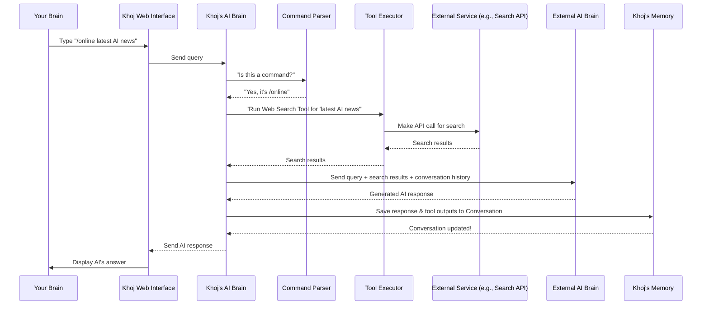

# Chapter 9: Conversation Commands & Tools

In [Chapter 8: Agent](08_agent.md), we learned how you can create specialized AI assistants (Agents) within Khoj, each with its own knowledge and personality. This allows Khoj to be a focused expert. But how do you tell Khoj to do something beyond just answering questions from its knowledge base? What if you want it to search the internet, run code, or summarize a specific document?

### What Problem Do Conversation Commands & Tools Solve?

Imagine Khoj is your super-smart assistant. You can ask it general questions, and it will respond intelligently using its vast knowledge and your indexed notes. However, sometimes you need it to perform a very specific action that requires an external capability. For example:

*   You want to know the **latest news on AI breakthroughs**, which requires searching the live internet.
*   You need to **summarize a long PDF document** you just uploaded.
*   You want to **run a small Python script** to calculate something or analyze data.

If Khoj could only chat, it wouldn't be able to fulfill these specific requests. This is where **Conversation Commands** and **Tools** come in!

**Conversation Commands** are like special "spell words" or direct instructions you give to Khoj. They start with a `/` (forward slash) and tell Khoj *exactly* what kind of action you want it to perform.

**Tools** are the actual "gadgets" or "superpowers" in Khoj's toolbox. Each command activates a specific tool, allowing Khoj to connect to external services or run specialized code to get the job done. It’s like having a specialized vocabulary to tell your AI assistant to pick up a specific tool from its workbench and use it!

**Our Goal for this Chapter:** By the end of this chapter, you'll understand what Conversation Commands and Tools are, how to use them to direct Khoj's behavior, and how Khoj uses them to perform specialized tasks.

### What are Conversation Commands?

Conversation Commands are special keywords you type directly into the Khoj chat interface. They are designed to give Khoj explicit instructions about how to process your query or what external capability to use.

Here are some common Conversation Commands in Khoj:

*   `/online`: Tell Khoj to search the internet.
*   `/notes`: Tell Khoj to *only* use your personal notes for context.
*   `/general`: Tell Khoj to *only* use its general knowledge, ignoring your notes.
*   `/summarize`: Ask Khoj to summarize content, often from a selected file.
*   `/code`: Ask Khoj to generate and run Python code.
*   `/image`: Ask Khoj to generate an image based on your description.
*   `/diagram`: Ask Khoj to generate a visual diagram.
*   `/research`: Tell Khoj to perform a deeper, multi-step research process.

You can see a full list of commands and their descriptions directly in Khoj's chat interface by typing `/help`.

### What are Tools?

Tools are the underlying functionalities that Khoj uses to execute Conversation Commands (and sometimes decides to use on its own even without a direct command!). They are integrations with external services or internal Python code that allow Khoj to go beyond simple text generation.

Think of each tool as a specific skill or capability:

*   **Web Search Tool**: Connects to search engines (like Google, Serper, Firecrawl) to find information on the live internet. Used by the `/online` command.
*   **Webpage Reading Tool**: Can read and extract information from specific URLs. Used by `/webpage`.
*   **Code Execution Tool**: Runs Python code in a safe environment (a "sandbox") to perform calculations, data analysis, or interact with local files. Used by `/code`.
*   **Image Generation Tool**: Connects to AI image generation services (like DALL-E) to create pictures from text descriptions. Used by `/image`.
*   **Diagram Generation Tool**: Generates diagrams (like flowcharts) using tools like Excalidraw or Mermaid.js. Used by `/diagram`.
*   **Summarization Tool**: Focuses the AI on generating a concise summary of a document. Used by `/summarize`.
*   **Operator Tool**: Allows Khoj to control a web browser to perform complex tasks (we'll dive into this powerful tool in [Chapter 10: Operator Agent](10_operator_agent.md)).

Khoj uses these tools to extend its capabilities, making it a much more versatile assistant.

### How to Use Conversation Commands & Tools: Getting the Latest News

Let's walk through our central use case: asking Khoj to search the internet for the latest news on AI breakthroughs.

1.  **Open Khoj Chat**: Go to the Khoj Web Interface, as you learned in [Chapter 1: Web Interface (Frontend)](01_web_interface__frontend__.md).
2.  **Type Your Command and Query**: In the chat input box, type:
    ```
    /online latest news on AI breakthroughs
    ```
3.  **Send Your Message**: Press `Enter` or click the send button.

That's it! Khoj will recognize the `/online` command, activate its Web Search Tool, search the internet, and then use the results to formulate a coherent response.

**Another Example: Summarizing a Document**

Let's say you have a PDF file titled `project_notes.pdf` that you've already indexed in Khoj (as discussed in [Chapter 3: Entry (Indexed Content)](03_entry__indexed_content__.md)).

1.  **Select the File**: In the Khoj Web Interface sidebar, go to "Files" and select `project_notes.pdf` by clicking its checkbox. This "attaches" the file to your current conversation as a filter.
    ```markdown
    
    ```
2.  **Type Your Summarize Command**: In the chat input box, type:
    ```
    /summarize
    ```
3.  **Send Your Message**: Press `Enter`.

Khoj will then use the Summarization Tool to read through your `project_notes.pdf` (because you've filtered it for the conversation) and provide a concise summary.

### Under the Hood: How Commands & Tools Work

When you type a command, a precise sequence of events unfolds within Khoj to ensure the right tool is activated and its results are used.

#### Step-by-Step Walkthrough

1.  **You Type a Command**: You type `/online latest news on AI breakthroughs` into the Khoj Web Interface.
2.  **Web Interface Sends Query**: Your query travels to the [Khoj Backend](01_web_interface__frontend__.md).
3.  **Command Parsing**: The Khoj Backend first looks at your query to see if it starts with a known `Conversation Command` (like `/online`).
4.  **Tool Activation**: If a command is found (or if the AI decides a tool is needed based on your regular query), Khoj activates the corresponding "Tool." For `/online`, this means preparing the Web Search Tool.
5.  **Tool Execution**: The activated Tool performs its specific action. For the Web Search Tool, this means making API calls to external search engines (like Serper.dev or Google).
6.  **Tool Results Return**: The Tool gathers its results (e.g., search snippets, webpage content) and sends them back to the Khoj Backend.
7.  **LLM Integration**: The Khoj Backend then takes these fresh tool results, combines them with your original query, and the ongoing [Conversation](07_conversation.md) history. This comprehensive package is sent to the chosen [ChatModel & AI Model API (LLM Integration)](06_chatmodel___ai_model_api__llm_integration__.md) (the LLM).
8.  **LLM Generates Response**: The LLM uses all this context to formulate a human-like answer that incorporates the tool's findings.
9.  **Backend Saves & Displays**: The AI's response (along with details about which tool was used and its output) is saved to your [Conversation](07_conversation.md) log in the [Database](03_entry__indexed_content__.md). Finally, it's sent back to your Web Interface for you to see.

Here's a simplified sequence diagram:



#### A Peek at the Code

Let's look at how Khoj handles these commands and dispatches to tools.

First, the `ConversationCommand` is an `Enum` (a set of named constants) that defines all the available commands. This is found in `src/khoj/utils/helpers.py`:

```python
# src/khoj/utils/helpers.py
# ...

class ConversationCommand(str, Enum):
    Default = "default"
    General = "general"
    Notes = "notes"
    Help = "help"
    Online = "online" # Here's our /online command!
    Webpage = "webpage"
    Code = "code"
    Image = "image"
    Text = "text"
    Summarize = "summarize" # And /summarize!
    Diagram = "diagram"
    Research = "research"
    Operator = "operator"
    # ... more commands
```
This `Enum` makes it easy for Khoj to consistently refer to and identify different commands.

When your query arrives at the backend, `get_conversation_command` in `src/khoj/routers/helpers.py` checks which command (if any) you used:

```python
# src/khoj/routers/helpers.py
# ...

def get_conversation_command(query: str) -> ConversationCommand:
    if query.startswith("/notes"):
        return ConversationCommand.Notes
    elif query.startswith("/help"):
        return ConversationCommand.Help
    elif query.startswith("/general"):
        return ConversationCommand.General
    elif query.startswith("/online"): # This checks for /online
        return ConversationCommand.Online
    elif query.startswith("/image"):
        return ConversationCommand.Image
    elif query.startswith("/summarize"): # This checks for /summarize
        return ConversationCommand.Summarize
    # ... (more command checks)
    else:
        return ConversationCommand.Default
```
This function is part of the "Command Parser" step. It simply looks at the beginning of your query string and returns the corresponding `ConversationCommand` enum value.

Sometimes, Khoj's LLM will decide to use a tool even if you didn't explicitly type a command. This happens in the `aget_data_sources_and_output_format` function in `src/khoj/routers/helpers.py`, where the LLM is asked to `PickTools` (a Pydantic model for structured output) based on your query:

```python
# src/khoj/routers/helpers.py
# ...

async def aget_data_sources_and_output_format(
    query: str,
    conversation_history: dict,
    # ... other parameters
) -> Dict[str, Any]:
    # ... (prepare prompts with available tool descriptions)

    class PickTools(BaseModel):
        source: List[str] = Field(..., min_items=1) # The tool to use (e.g., "online")
        output: str # The desired output format (e.g., "text", "image")

    with timer("Chat actor: Infer information sources to refer", logger):
        response = await send_message_to_model_wrapper(
            relevant_tools_prompt, # Prompt telling LLM to pick tools
            response_type="json_object",
            response_schema=PickTools, # Tells LLM to respond in this structure
            # ... other parameters
        )
    # ... (parse and validate response to get chosen_sources and chosen_output)
    return {"sources": data_sources, "output": output_mode}
```
This snippet shows how Khoj uses an LLM (via `send_message_to_model_wrapper`) to intelligently decide which `source` (tool) and `output` format to use for a given query, even without a direct command. The LLM is provided with descriptions of each tool, which are defined in `tool_descriptions_for_llm` in `src/khoj/utils/helpers.py`:

```python
# src/khoj/utils/helpers.py
# ...

tool_descriptions_for_llm = {
    ConversationCommand.Default: "To use a mix of your internal knowledge and the user's personal knowledge...",
    ConversationCommand.General: "To use when you can answer the question without any outside information...",
    ConversationCommand.Notes: "To search the user's personal knowledge base...",
    ConversationCommand.Online: "To search for the latest, up-to-date information from the internet. Note: **Questions about Khoj should always use this data source**",
    ConversationCommand.Webpage: "To use if the user has directly provided the webpage urls...",
    ConversationCommand.Code: "To run Python code to parse information, run complex calculations...",
    ConversationCommand.Operator: "To use when you need to operate and take actions using a GUI web browser.",
    # ... more descriptions
}
```
This dictionary provides the LLM with clear descriptions of each tool, helping it make informed decisions.

Once a command is identified (either by the user or inferred by the LLM), the `execute_information_collection` function (located in `src/khoj/routers/research.py`) orchestrates the actual tool execution. While this function is specifically for "research" mode, it illustrates the general pattern of how different tools are called based on the `ConversationCommand`:

```python
# src/khoj/routers/research.py
# ...

async def execute_information_collection(
    user: KhojUser,
    query: str,
    conversation_id: str,
    # ... other parameters
):
    # ... (logic to pick the next tool to use, often using apick_next_tool which leverages LLM)

    # this_iteration.tool will contain the ConversationCommand (e.g., ConversationCommand.Online)
    if this_iteration.tool == ConversationCommand.Notes:
        # Calls the notes search logic
        async for result in extract_references_and_questions(...):
            yield result

    elif this_iteration.tool == ConversationCommand.Online: # Here's our /online command!
        # Calls the online search tool
        async for result in search_online(
            this_iteration.query, # The query for the search engine
            construct_tool_chat_history(previous_iterations, ConversationCommand.Online),
            location,
            user,
            send_status_func,
            # ... other parameters
        ):
            if isinstance(result, dict) and ChatEvent.STATUS in result:
                yield result[ChatEvent.STATUS]
            # ... (process online results)

    elif this_iteration.tool == ConversationCommand.Code: # Here's our /code command!
        # Calls the code execution tool
        async for result in run_code(
            this_iteration.query, # The query for the code tool
            construct_tool_chat_history(previous_iterations, ConversationCommand.Code),
            "",
            location,
            user,
            send_status_func,
            # ... other parameters
        ):
            if isinstance(result, dict) and ChatEvent.STATUS in result:
                yield result[ChatEvent.STATUS]
            # ... (process code results)
    # ... (other tool execution logic)
```
This snippet shows how the code uses `if/elif` statements to branch to different tool-specific functions (`search_online`, `run_code`, etc.) based on the determined `this_iteration.tool`.

Now, let's look at the beginning of an actual "tool" function, `search_online` (from `src/khoj/processor/tools/online_search.py`), which is called when the `/online` command is used:

```python
# src/khoj/processor/tools/online_search.py
# ...

async def search_online(
    query: str,
    conversation_history: dict,
    location: LocationData,
    user: KhojUser,
    send_status_func: Optional[Callable] = None,
    # ... other parameters
):
    if not is_internet_connected():
        logger.warning("Cannot search online as not connected to internet")
        yield {}
        return

    # Breakdown the query into subqueries (the actual search terms)
    new_subqueries = await generate_online_subqueries(
        query, conversation_history, location, user, # ...
    )

    # Call different search engine APIs (Serper, Google, Firecrawl, Jina, Searxng)
    search_engines = []
    if SERPER_DEV_API_KEY:
        search_engines.append(("Serper", search_with_serper))
    # ... (add other search engines based on API keys)

    for search_engine, search_func in search_engines:
        logger.info(f"🌐 Searching the Internet with {search_engine} for {subqueries}")
        search_tasks = [search_func(subquery, location) for subquery in subqueries]
        search_results = await asyncio.gather(*search_tasks)
        # ... (process results and yield them)
```
This `search_online` function demonstrates how Khoj's Web Search Tool generates sub-queries, then dispatches them to different underlying search engine integrations (like `search_with_serper`). It then yields the search results to be incorporated into the LLM's final response.

Similarly, the `run_code` function (from `src/khoj/processor/tools/run_code.py`) is called for the `/code` command:

```python
# src/khoj/processor/tools/run_code.py
# ...

async def run_code(
    query: str,
    conversation_history: dict,
    context: str,
    location_data: LocationData,
    user: KhojUser,
    send_status_func: Optional[Callable] = None,
    # ... other parameters
):
    # Generate Code using the LLM
    generated_code = await generate_python_code(
        query, conversation_history, context, location_data, user, # ...
    )

    # Execute Code in a sandboxed environment
    result = await execute_sandboxed_python(generated_code.code, generated_code.input_files)

    # Return the results
    yield {query: {"code": result.pop("code"), "results": result}}
```
This `run_code` function first uses the LLM to `generate_python_code` based on your query, then executes that code in a safe sandbox (`execute_sandboxed_python`), and finally returns the code's output.

### Conclusion

You've now seen how Conversation Commands and Tools empower Khoj to go beyond simple conversation. By using specific `/` commands, you can direct Khoj to search the internet, summarize documents, run code, generate images, and more. Each command activates a specialized "tool" in Khoj's powerful arsenal, making your personal AI assistant incredibly versatile and capable of tackling a wide range of tasks.

Next, we'll combine the power of Agents and these tools with the concept of the "Operator Agent," allowing Khoj to perform complex, multi-step actions autonomously in a web browser.

[Chapter 10: Operator Agent](10_operator_agent.md)

---

Generated by [AI Codebase Knowledge Builder](https://github.com/The-Pocket/Tutorial-Codebase-Knowledge)